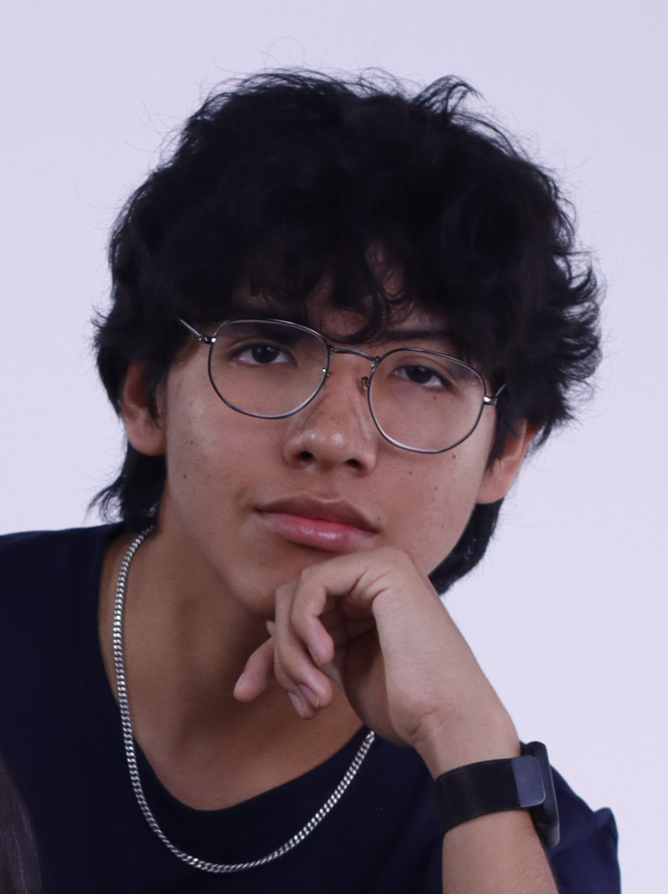
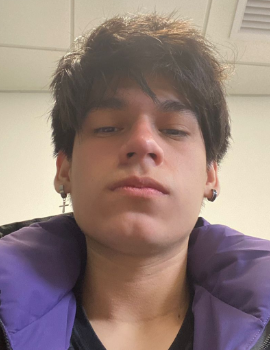
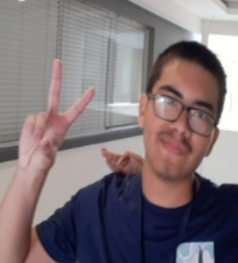
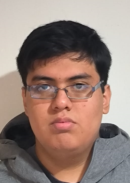

# Capítulo 1: Introducción
## 1.1. Startup Profile
### 1.1.1. Descripción de la startup
En un contexto donde la automatización en la industria minera avanza rápidamente, la convivencia entre vehículos autónomos de alto tonelaje y vehículos livianos operados por personas representa un riesgo crítico para la seguridad laboral. Vertex surge como una startup tecnológica enfocada en prevenir colisiones en entornos mineros mediante la implementación de una Malla de Seguridad Digital, diseñada para detectar incursiones peligrosas en rutas de transporte autónomo y generar alertas en tiempo real.

Nuestra solución integra tecnologías IoT, sensores inteligentes y sistemas de comunicación de baja latencia para monitorear continuamente el entorno operativo. A través de esta arquitectura, Vertex permite identificar cuando un vehículo menor invade una zona restringida o cuando existe riesgo de cruce con maquinaria autónoma, enviando alertas inmediatas tanto a los conductores como a los centros de control. Esto no solo protege la integridad de los trabajadores, sino que también contribuye a la continuidad operativa de las empresas mineras.

Nuestra propuesta está dirigida principalmente a empresas mineras de tajo abierto que operan flotas autónomas, así como a conductores de vehículos livianos que interactúan con estas rutas. Para las empresas, Vertex representa una solución que reduce accidentes, evita pérdidas económicas por paralizaciones y fortalece el cumplimiento de estándares de seguridad. Para los conductores, brinda una herramienta intuitiva que mejora su percepción del entorno sin generar distracciones.

**Misión**:  
Brindar soluciones tecnológicas basadas en IoT que permitan prevenir accidentes en entornos mineros mediante monitoreo en tiempo real y sistemas de alerta temprana, protegiendo la vida de los trabajadores y optimizando la seguridad operativa.

**Visión**:  
Convertirnos en la solución líder en seguridad inteligente para operaciones mineras autónomas a nivel global, impulsando la transformación digital del sector hacia entornos más seguros, eficientes y confiables.

**Valores**:  
Promovemos la seguridad como prioridad, la innovación tecnológica como motor de cambio y la eficiencia operativa como resultado. Nos comprometemos con la confiabilidad de nuestros sistemas, la prevención de riesgos y la protección de la vida humana en entornos industriales de alta exigencia.

### 1.1.2. Perfiles de integrantes del equipo

|  Nombres y Apellidos |    Codigo   | Descripción | Foto | 
|----------------------|-------------|-------------|------|
| Gabriel Fernando Gordon Salas  | U20221E229  | Me considero una persona responsable, me gusta ayudar a mis compañeros en los trabajos y sé organizarme bien al momento de realizar mis cosas. Con esto mi objetivo es poder dar lo mejor en un ambiente de cooperación entre todos para que el proyecto dé una muy buena presentación |    |
| Marcia Victoria Melgarejo Gomez |  U20231C505  | Actualmente estoy cursando el séptimo ciclo de la carrera de Ingeniería de Software en la UPC. Opté por esta carrera debido a mi interés en el mundo de la tecnología y todo lo que este campo puede ofrecer a la sociedad.   Me caracterizo por ser una persona curiosa, persistente y colaborativa.   Tengo conocimientos en C++, HTML, CSS, JS, Pyhton | |
| Rodrigo Alaya Cabrera |  U202219481  | Soy una persona responsable, comprometida con mis objetivos y con gran disposición para aprender continuamente. Me adapto con facilidad al trabajo en equipo, aportando ideas y soluciones. Valoro mucho la eficiencia, la ética profesional y la mejora constante. Me esfuerzo por entregar siempre resultados de calidad, gestionando mis tareas con orden y enfoque. |    |
| Renato Sebastian Rubber Zegarra Lopez  | U202311558  | Mi nombre es Renato Zegarra, tengo 20 años y actualmente estoy cursando la carrera de Ingeniería de Software en la Universidad Peruana de Ciencias Aplicadas. Fuera de mis estudios, disfruto explorar mis intereses en música, videojuegos y tecnología, siempre buscando nuevas formas de integrar estas pasiones en mi vida cotidiana. Me comprometo a colaborar de manera activa y responsable en la elaboración de este documento y en la concreción de la idea propuesta, aportando mis habilidades en análisis, creatividad y adaptabilidad. Estoy convencido de que con esfuerzo y trabajo en equipo, podemos alcanzar resultados innovadores y de alta calidad. |   |
| Jorge Enrique Guevara Tejada  | U202316057  | Soy Jorge Enrique Guevara Tejada, actualmente cursando el séptimo ciclo. Me caracterizo por tener un alto sentido de responsabilidad y un fuerte compromiso con el trabajo en equipo. Procuro afrontar los desafíos académicos con dedicación, invirtiendo tiempo adicional en fortalecer aquellas áreas en las que puedo mejorar. Mi objetivo no se limita a obtener un buen desempeño académico, sino también a aportar de manera significativa al logro de los objetivos del equipo, asegurando que cada proyecto refleje el esfuerzo y la dedicación conjunta. |   |
|   |   |  |   |
| Russell Stephen Romero Qwistgaard | U202211043 | Estudio la carrera de ingeniería de software, actualmente en el 9 ciclo de esta. Me apasiona crear programas en entornos distintos para poder ampliar mi conocimiento en las muchas áreas que dependen de mi formación. He aprendido a programar en lenguajes como HTML, C++, Java, SQL y en frameworks como React, .Net, Angular CLI, Vue.js y Node.js |   |
|   |   |  |   |

