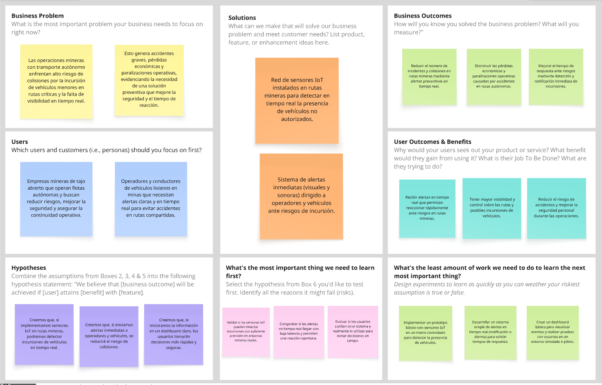

### 1.2.2. Lean UX Process

#### 1.2.2.1. Lean UX Problem Statement

El estado actual de las operaciones mineras automatizadas se ha enfocado principalmente en mejorar la productividad y eficiencia del transporte mediante el uso de camiones autónomos de alto tonelaje. Sin embargo, las rutas mineras continúan siendo compartidas con camionetas de supervisión, mantenimiento y vehículos de generando riesgos constantes de invasión de rutas y posibles colisiones que comprometen la seguridad de las operaciones.

Los productos y servicios existentes no logran abordar la detección temprana de incursiones de vehículos menores dentro de rutas autónomas críticas ni proporcionar información en tiempo real que permita a los operadores actuar de forma preventiva antes de que ocurra un incidente, manteniendo una brecha importante en la seguridad de este tipo de operaciones.

Nuestro producto buscará cubrir esta necesidad mediante una estrategia basada en el monitoreo inteligente de rutas autónomas, proporcionando información oportuna para identificar situaciones de riesgo, apoyar la toma de decisiones preventivas y fortalecer la seguridad operacional en entornos mineros automatizados.

Nuestro enfoque inicial estará dirigido a empresas mineras de gran escala que utilicen sistemas de transporte autónomo o semiautónomo en sus operaciones de extracción y acarreo.

Sabremos que la solución es exitosa cuando observemos una disminución en las incursiones no detectadas dentro de rutas autónomas, una reducción en los tiempos de respuesta ante situaciones de riesgo y una mejora en la capacidad de los operadores para prevenir incidentes durante las operaciones.

#### 1.2.2.2. Lean UX Assumptions

##### Business Assumptions

1. Creemos que nuestros usuarios tienen la necesidad de prevenir colisiones en rutas de transporte autónomo y mejorar la seguridad operacional en tiempo real.

2. Creemos que estas necesidades pueden satisfacerse mediante una solución IoT con sensores distribuidos, monitoreo continuo y alertas inmediatas de incursión.

3. Creemos que nuestros clientes iniciales serán empresas mineras de tajo abierto en Perú que operan flotas autónomas o semiautónomas.

4. Creemos que el principal valor que buscan nuestros clientes es reducir el riesgo de accidentes críticos y minimizar las pérdidas operativas y económicas.

5. Creemos que nuestros clientes también obtendrán visibilidad en tiempo real del estado de las rutas, información para el análisis de seguridad y una mejor toma de decisiones. 

6. Creemos que conseguiremos la mayoría de nuestros clientes mediante alianzas estratégicas con empresas mineras, pruebas piloto (PoC) y recomendaciones dentro del sector.

7. Creemos que obtendremos ingresos a través de la implementación de la solución, la venta del hardware IoT, suscripciones al sistema y servicios de mantenimiento y soporte.

8. Creemos que nuestra competencia estará conformada por sistemas tradicionales de monitoreo, soluciones de geolocalización GPS y plataformas de seguridad industrial que no están enfocadas en rutas autónomas.

9. Creemos que nuestra principal ventaja competitiva será la detección temprana en tiempo real mediante IoT, la integración Edge + Cloud y la especialización en seguridad para rutas autónomas.

10. Creemos que el mayor riesgo del producto será mantener una detección precisa y confiable en las condiciones reales de una operación minera.

11. Creemos que este riesgo podrá mitigarse mediante pruebas piloto, calibración continua de sensores y validaciones en escenarios reales.

12. Creemos que otro riesgo importante será la resistencia de algunas empresas mineras a adoptar nuevas tecnologías debido a los costos de implementación y la integración con sus sistemas actuales.

##### Business Outcomes Assumptions

1. Creemos que los supervisores responderán con mayor rapidez ante una incursión detectada en una ruta autónoma.

2. Creemos que disminuirá la cantidad de situaciones de riesgo ocasionadas por el ingreso de vehículos menores a rutas restringidas.

3. Creemos que aumentará la detección temprana de eventos peligrosos antes de que ocurra una colisión.

4. Creemos que las empresas mineras utilizarán la información generada por la plataforma para fortalecer sus procesos de seguridad operacional.

5. Creemos que la adopción de la solución contribuirá a reducir incidentes y mejorar los indicadores de seguridad de la operación.

##### User Assumptions

1. Creemos que los usuarios principales serán supervisores de operaciones, ingenieros de seguridad y operadores de centros de monitoreo responsables de vigilar rutas utilizadas por vehículos autónomos en operaciones mineras.

2. Creemos que estos usuarios necesitan detectar oportunamente situaciones de riesgo en rutas autónomas para tomar decisiones preventivas antes de que ocurra una colisión.

3. Creemos que los usuarios trabajan en un entorno de alta presión, donde el tiempo de reacción es limitado y la información debe ser clara, confiable y disponible en tiempo real.

4. Creemos que uno de los principales obstáculos que enfrentan es la falta de visibilidad inmediata sobre incursiones de vehículos menores en zonas restringidas o rutas críticas.

5. Creemos que estos usuarios buscan reducir la incertidumbre durante la supervisión de rutas, evitando depender únicamente de reportes manuales, comunicación radial o monitoreo tradicional.

6. Creemos que los usuarios valorarán una solución que les permita actuar con mayor rapidez, confianza y coordinación frente a eventos críticos de seguridad operacional.

7. Creemos que los usuarios necesitan evidencia histórica de los eventos detectados para analizar incidentes, justificar decisiones y mejorar los protocolos de seguridad.

##### User Outcomes and Benefits Assumptions

1. Creemos que los usuarios desean sentirse seguros al supervisar las rutas autónomas.

2. Creemos que los usuarios desean identificar rápidamente cualquier situación de riesgo sin necesidad de revisar múltiples sistemas.

3. Creemos que los usuarios desean actuar con mayor confianza gracias a alertas oportunas y confiables.

4. Creemos que los usuarios desean reducir el tiempo necesario para responder ante una posible colisión.

5. Creemos que los usuarios percibirán que la plataforma facilita su trabajo y mejora la toma de decisiones durante la operación minera.

##### Feature Assumptions

+ Creemos que los usuarios necesitan visualizar en tiempo real la ubicación de las incursiones detectadas en las rutas mineras.

+ Creemos que los usuarios necesitan recibir alertas inmediatas cuando un vehículo menor ingrese a una ruta autónoma.

+ Creemos que los usuarios necesitan identificar el nivel de riesgo de cada evento según la proximidad y velocidad del vehículo detectado.

+ Creemos que los usuarios necesitan consultar el historial de eventos para analizar incidentes y fortalecer las estrategias de seguridad.

+ Creemos que el sistema debe activar alertas visuales y sonoras en puntos estratégicos o vehículos autónomos para advertir situaciones de peligro.

+ Creemos que el sistema debe operar de manera continua y automática, minimizando la intervención manual del usuario.

#### 1.2.2.3. Lean UX Hypothesis

Creemos que lograremos reducir los incidentes de riesgo en rutas autónomas, si los supervisores de operaciones y operadores del centro de monitoreo logran identificar oportunamente incursiones de vehículos menores y actuar antes de que ocurra una colisión, mediante la implementación de una red de sensores IoT para la detección en tiempo real de invasiones de ruta.

Creemos que mejoraremos el tiempo de respuesta ante eventos críticos, si los operadores del centro de monitoreo logran recibir alertas oportunas y confiables durante las operaciones, mediante el procesamiento en Edge Computing y la comunicación en tiempo real entre sensores, el centro de control y los vehículos autónomos.

Creemos que aumentaremos la confiabilidad del sistema de monitoreo, si los supervisores de seguridad logran contar con información precisa para evaluar situaciones de riesgo, mediante el monitoreo continuo de la ubicación de los vehículos menores en las rutas autónomas.

Creemos que mejoraremos la toma de decisiones durante la operación minera, si los operadores del centro de monitoreo logran interpretar rápidamente los eventos críticos, mediante un dashboard centralizado que muestre alertas, eventos e incidencias en tiempo real.

Creemos que reduciremos la sobrecarga de información durante la supervisión de rutas, si los operadores logran priorizar su atención sobre los eventos de mayor riesgo, mediante la clasificación automática de alertas según niveles de riesgo basados en distancia, velocidad y trayectoria.

Creemos que incrementaremos la capacidad de respuesta ante situaciones de emergencia, si los operadores y los vehículos autónomos logran recibir advertencias inmediatas sobre riesgos de colisión, mediante la activación automática de alertas visuales y sonoras cuando se detecten incursiones peligrosas.

#### 1.2.2.4. Lean UX Canvas

