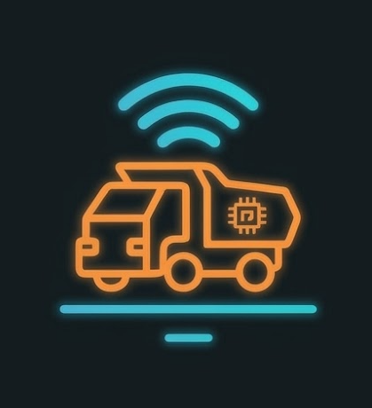
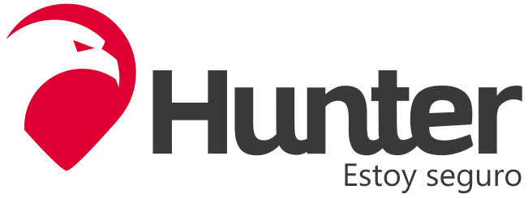

<h2>2.1 Competidores</h2>

A partir de un estudio de mercado al cuál nos enfocamos, hemos podido identificar a ciertos competidores. Estos tratan a la problemática desde diferentes puntos de vista, los 3 competidores son:

- Torsa: Es el competidor de alta tecnología y precisión. Su fuerte es el uso de LIDAR,una tecnología que usa pulsos láser para medir distancias con precisión milimétrica, y sensores 3d para evitar colisiones con precisión de centímetros. Es la opción para minas que buscan automatización total.

- Hunter: Es el líder en control de acceso y monitoreo. Se especializa en asegurar que solo personal autorizado opere las máquinas junto al rastreo de flotas en tiempo real, incluso en zonas remotas o sin conexión 

- SS-Seguridad en Mina: Es el proveedor de soluciones robustar y adaptables. Su enfoque es la instalación de alertas audibles y visuales en flotas de distintas marcas siendo muy eficaces en enotornos difíciles con mucho polvo u oscuridad

<h3>2.1.1. Análisis competitivo</h3>

<table>
    <tr>
        <th colspan="6">
            Competitive Analysis Landscape
        </th>
    </tr>
    <tr>
        <td>¿Por qué llevar a cabo este análisis?</td>
        <td colspan="5">
             Un análisis a nuestros competiores nos ayuda a tener una vista más amplía acerca de lo que debemos fortalecer en nuestra aplicación para un mayor alcance a los usuarios, de forma que esta se vuelve más atractiva a su vista.
            <colgroup >
                <col span = "1">
            </colgroup>
        </td>
    </tr>
    <tr>
        <td colspan="2">Nombre de la StartUp</td>
        <td>
            MineGuard
            
        </td>
        <td>
            SS-Trading
            
        </td>
        <td>
            Hunter
            
        </td>
        <td>
            Torsa
            
        </td>
    </tr>
    

        <tr>
            <td rowspan="2" STYLE="transform: rotate(-90deg)" aling="center">Perfil</td>
            <td>Overview</td>
            <td>Solución integral de seguridad inteligente especializada en minería de socavón y maquinaria de acarreo</td>
            <td>Línea de seguridad de MG Trading Perú. Ofrece soluciones modulares de alerta de proximidad</td>
            <td>Empresa peruana líder en monitoreo y control de activos. Fuerte enfoque en seguiridad patrimonial</td>
            <td>Líder global en alta precisión para minería. Especialistas en sistemas de anticolisión inteligentes</td>
        </tr>
        <tr>
            <td>Ventaja Competitiva ¿Qué valor ofrece a los clientes?</td>
            <td>Algoritmo de IA optimizado para entornos de baja visibilidad y sistemas de proximidad que no dependen de GPS, diseñados específicamente para las maniobras de relleno y transporte</td>
            <td>Flexibilidad para flotas mixtas y alta resistencia en condiciones extremas de polvo</td>
            <td>Robustez en el control de acceso de personal y amplia infraestructura de soporte a nivel nacional</td>
            <td>Precisión centimétrica mediante Lidar 3d e intervención activa</td>
        </tr>
    

    

        <tr>
            <td rowspan="2" STYLE="transform: rotate(-90deg)" aling="center">Perfil de Marketing</td>
            <td>Mercado objetivo</td>
            <td>Unidades mineras subterráneas en Perú y empresas contratistas de movimiento de tierras</td>
            <td>Pequeña y mediana minería, empresas de servicios de maquinaria</td>
            <td>Minas medianas, también grandes que requieren control estricto de operadores y flotas de transporte</td>
            <td>Grandes corporaciones mineras con presupuestos altos que buscan automatización</td>
        </tr>
        <tr>
            <td>Estrategias de marketing</td>
            <td>Pruebas piloto directas en operaciones críticas, enfoque en la reducción de costos por paralización de faena tras accidentes y marketing </td>
            <td>Venta consultiva técnica y demostraciones en campo para contratistas</td>
            <td>Venta directa a flotas logísticas y marketing basado en la trayectoria de marca en Perú</td>
            <td>Alianza con fabricantes de maquinaria original y presencia en ferias tecnológicas globales</td>
        </tr>
    

    

        <tr>
            <td rowspan="3" STYLE="transform: rotate(-90deg)" aling="center">Perfil del Producto</td>
            <td>Productos & Servicios</td>
            <td>dispositivo de detección inteligente para maquinaria pesada, plataforma de analítica de riesgos en tiempo real y alertas de proximidad para trabajadores a pie</td>
            <td>Sistemas CAS, Lidar 3d, monitoreo e fatiga con IA</td>
            <td>Monitoreo GPS, bloqueo de motor remoto, identificación biométrica de conductores</td>
            <td>Geocercas dinámicas, sensores proximiad ultrasónicos y cámaras de asistencia</td>
        </tr>
        <tr>
            <td>Precios & Costos</td>
            <td>Servicio de paga</td>
            <td>Servicio de paga</td>
            <td>Servicio de paga</td>
            <td>Servicio de paga</td>
        </tr>
        <tr>
            <td>Canales de distribución (Web y/o Móvil)</td>
            <td>Venta directa, Sitio Web, Ferias</td>
            <td>Venta directa, Sitio Web, Ferias</td>
            <td>Red de sucursales a nivel nacional en Perú y plataforma web de gestión</td>
            <td>Canal directo de MG trading y distribuidores de repuestos de maquinaria pesada</td>
        </tr>
    

    

        <tr>
            <td rowspan="4" STYLE="transform: rotate(-90deg)" aling="center">Análisis SWOT</td>
            <td>Fortalezas</td>
            <td>Tecnología adaptable a maquinaria antigua y nueva</td>
            <td>Simplicidad de usó alta compatibilidad cualquier marca de maquinaria</td>
            <td>Gran base de datos de usuarios en Perú y servicio técnico disponible en todo el país</td>
            <td>Tecnología de punta y cumplimiento de normativas internacionales de frenado autónomo</td>
        </tr>
        <tr>
            <td>Debilidades</td>
            <td>Recursos financieros limitados en comparación con gigantes globales</td>
            <td>Menor nivel de sofisticación en el análisis predictivo de datos de accidentes</td>
            <td>Su tecnología es más reactiva que preventiva comparada con sensores láser</td>
            <td>Costo prohibido para minería de menor escala; requiere alta conectividad</td>
        </tr>
        <tr>
            <td>Oportunidades</td>
            <td>Posibilidad de recibir inversión por innovación tecnológica</td>
            <td>Incremento de la formalización en la pequeña minería que busca soluciones económicas</td>
            <td>Expansión hacia soluciones de analítica de datos predictiva sobre fatiga</td>
            <td>Tendencia mundial hacia la mina autónoma y digitalización total</td>
        </tr>
        <tr>
            <td>Amenazas</td>
            <td>Fluctuaciones en el precio de los metales que afecten presupuestos de seguridad</td>
            <td>Grandes fabricantes (CAT/Komatsu) que ya integran seguridad de fábrica</td>
            <td>Desplazamiento por competidores que ofrecen sensores especializados más modernos</td>
            <td>Nuevos competidores con IA a menor costo; cambios en estándares globales</td>
        </tr>
    

</table>
