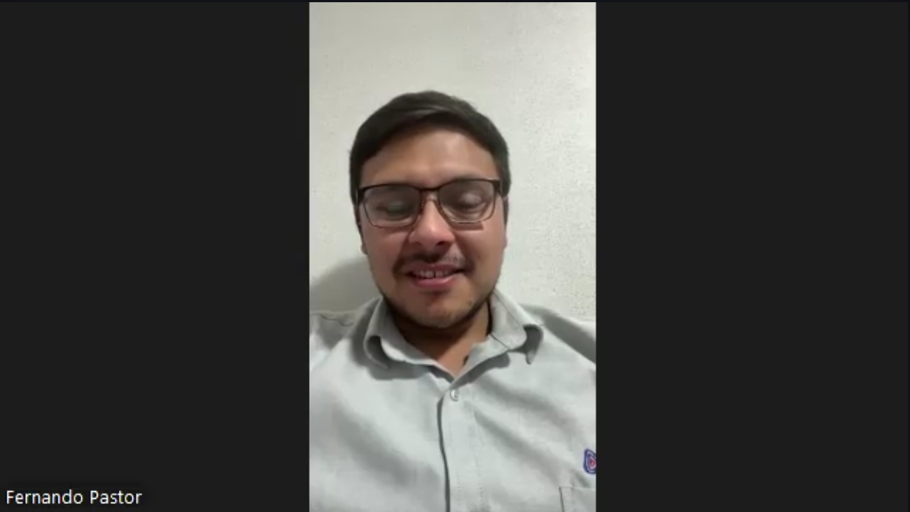
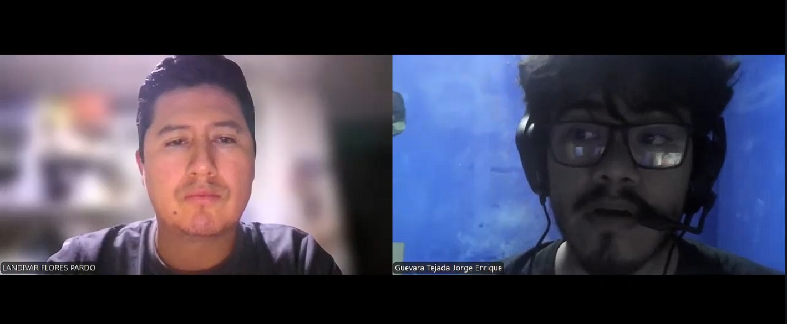
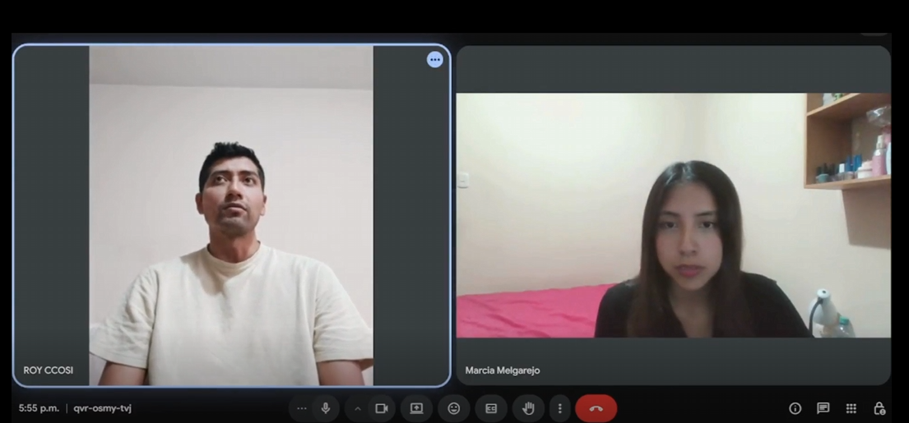
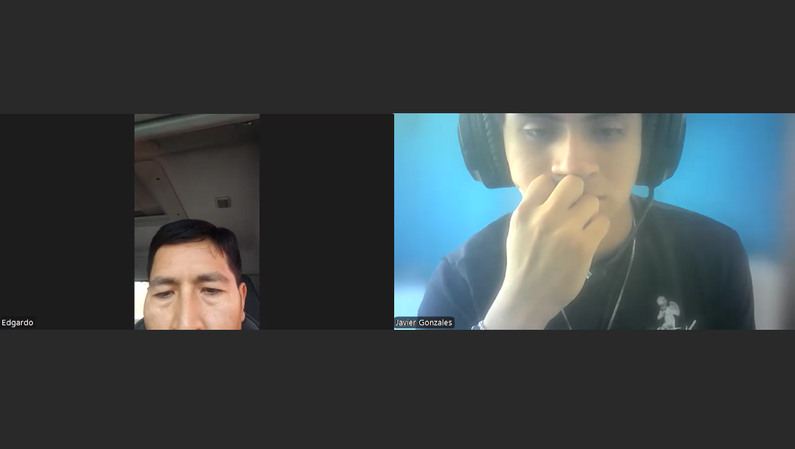
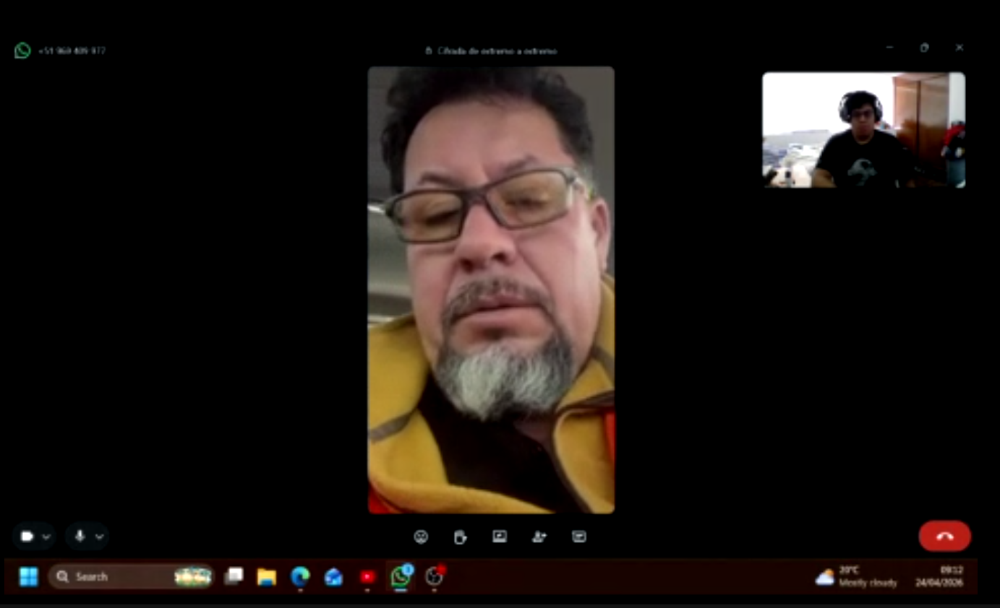
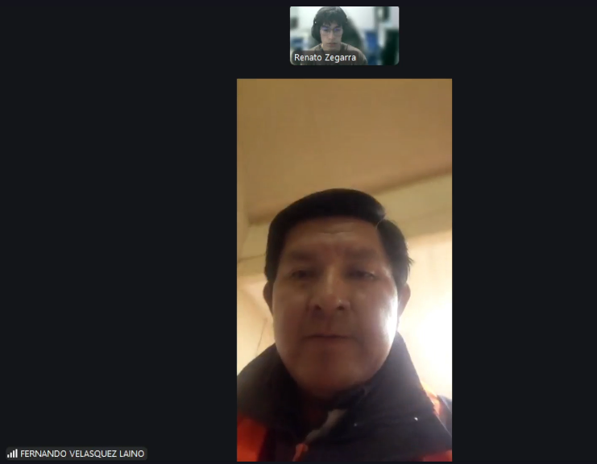
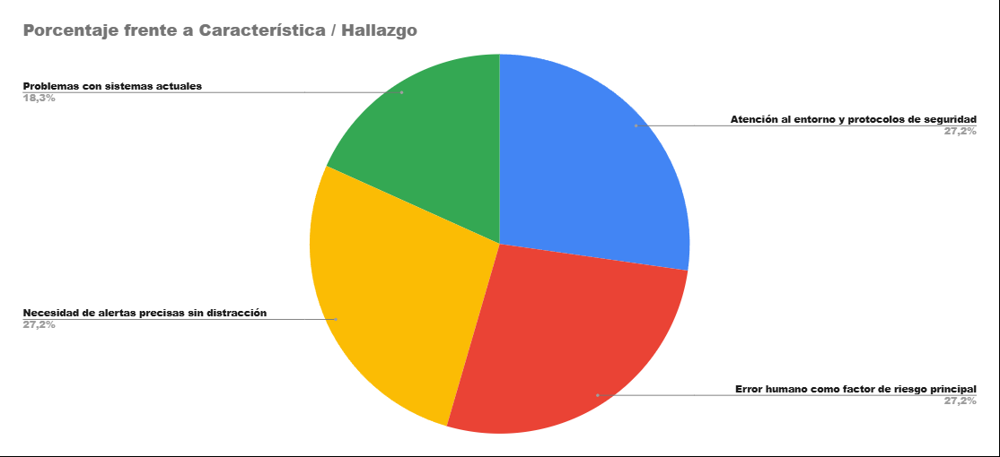

# 2.2. Entrevistas

## 2.2.1. Diseño de entrevistas

**Segmento 1: Supervisión Corporativa en Minería de Tajo Abierto**

- ¿Cómo gestionan actualmente la seguridad en zonas donde interactúan vehículos pesados y vehículos livianos?
- ¿Qué tipo de incidentes o riesgos ocurren con mayor frecuencia en sus operaciones?
- ¿Qué herramientas o tecnologías utilizan hoy para prevenir colisiones o accidentes?
- ¿Qué limitaciones encuentran en los sistemas de seguridad que usan actualmente?
- ¿Cómo se monitorea en tiempo real la ubicación de vehículos dentro de la operación?
- ¿Qué tan rápido pueden reaccionar ante una situación de riesgo o posible colisión?
- ¿Qué impacto tienen los accidentes en sus operaciones (costos, paralizaciones, reputación)?
- ¿Han evaluado soluciones tecnológicas para prevenir colisiones? ¿Qué les gustó o no les convenció?
- ¿Qué características consideran indispensables en un sistema de prevención de colisiones?
- ¿Qué tan dispuestos estarían a implementar una solución que alerte en tiempo real sobre riesgos entre vehículos?
  
**Segmento 2: Conductores de Vehículos Livianos**
  
- ¿Qué tan frecuente sientes que estás expuesto a situaciones de riesgo dentro de la mina?
- ¿En qué momentos sientes mayor peligro al conducir dentro de la operación?
- ¿Qué herramientas o señales utilizas actualmente para evitar accidentes?
- ¿Alguna vez has estado cerca de un accidente? ¿Qué ocurrió?
- ¿Qué tan fácil o difícil es mantener la atención mientras conduces en la mina?
- ¿Qué tipo de alerta te ayudaría más a evitar riesgos (visual, auditiva u otra)?
- ¿Te gustaria usar un sistema que te envíe alertas en tiempo real mientras conduces? ¿Por qué?
- ¿Qué características debería tener una herramienta para que realmente la uses sin distracciones?
- ¿Qué cambiarías del sistema actual de seguridad dentro de la mina?
  
## 2.2.2. Registro de entrevistas

Para cada segmento se registraron 3 entrevistas. A continuación se muestra la recolección de datos obtenida tras realizar cada entrevista presencial y virtual.  
Se puede ver el video consolidado con todas las entrevistas realizadas en el siguiente enlace: [Ver video en Microsoft Stream](https://upcedupe-my.sharepoint.com/:v:/g/personal/u202311558_upc_edu_pe/IQA3yj36FQ3cQZibPgEXO8pUAe0SWU15GACTjV4ieAImlMA?e=3xOIya&nav=eyJyZWZlcnJhbEluZm8iOnsicmVmZXJyYWxBcHAiOiJTdHJlYW1XZWJBcHAiLCJyZWZlcnJhbFZpZXciOiJTaGFyZURpYWxvZy1MaW5rIiwicmVmZXJyYWxBcHBQbGF0Zm9ybSI6IldlYiIsInJlZmVycmFsTW9kZSI6InZpZXcifX0%3D).

**Segmento #1: Supervisión Corporativa en Minería de Tajo Abierto**

| Nº Entrevista | Datos del entrevistado | Resumen de la entrevista | Evidencia de entrevista |
|---------------|------------------------|--------------------------|-------------------------|
| 1 | - **Nombre:** Felipe Pastor   - **Rol:** Supervisor de Despacho   - **Momento que inicia:** [00:10]   - **Duración:** [07:41] | Felipe destaca que la gestión de seguridad actual es predominantemente manual y dependiente de la radio, la cual suele saturarse. El problema crítico es la latencia del GPS; en su centro de control ve una ubicación con un retraso de 15 metros respecto a la realidad, lo que impide una reacción inmediata. Los "casi accidentes" son frecuentes cuando vehículos livianos entran en puntos ciegos de volquetes. Considera indispensable un sistema IoT instantáneo que alerte directamente al conductor en cabina sin intermediarios, y un tablero de control que permita mapear zonas de riesgo y conductas de los conductores para capacitación. |  |
| 2 | - **Nombre:** Landivar Flores   - **Edad:** 34 años   - **Departamento:** Áncash   - **Momento que inicia:** [07:51]   - **Duración:** [19:28] | Landivar explica que si bien usan tecnologías como LiDAR y sistemas ADAS para fatiga, persisten limitaciones graves por el clima (neblina) y la conectividad. Menciona que un accidente tiene un impacto en cascada: paraliza la operación (pérdidas millonarias), afecta la reputación y pone en riesgo las licencias legales. Para él, la solución más confiable debe ser un sistema de advertencia integrado que no dependa solo de cámaras, sino de monitoreo de alta precisión que asista al factor humano, el cual sigue siendo el eslabón más débil en la cadena de seguridad actual. |  |
| 3 | - **Nombre:** Roy Ccosi   - **Rol:** Supervisor Mina   - **Momento que inicia:** [19:00]   - **Duración:** [11:09] | Roy señala que el mayor riesgo es el choque por poca visibilidad en puntos ciegos. Actualmente se basan en radios troncalizados y planos de riesgos semanales, pero estas herramientas no advierten con la antelación suficiente para realizar maniobras preventivas. Aunque usan GPS, los sistemas no están integrados, lo que fragmenta la visibilidad de la operación. Está totalmente dispuesto a implementar soluciones IoT que ayuden a los operadores a tomar acciones correctivas en tiempo real frente a una colisión inminente, buscando minimizar el impacto económico y de reputación. |  |

#### Resumen de entrevistas segmento #1
Los supervisores Felipe, Landivar y Roy coinciden en que los sistemas actuales (radio y GPS convencional) han llegado a su límite debido a la alta latencia y la falta de integración. La principal preocupación es el riesgo de colisión en puntos ciegos y la lentitud de respuesta ante "casi accidentes". Felipe y Roy enfatizan la necesidad de alertas automáticas en cabina que no dependan del despacho manual, mientras que Landivar resalta las pérdidas millonarias que genera una paralización. Todos validan la propuesta de MineGuard como una solución necesaria, siempre que garantice precisión en tiempo real y soporte para la toma de decisiones basada en datos históricos de incidentes.

**Segmento #2: Conductores de Vehículos Livianos**

| Nº Entrevista | Datos del entrevistado | Resumen de la entrevista | Evidencia de entrevista |
|---------------|------------------------|--------------------------|-------------------------|
| 1 | - **Nombre:** Edgardo Chávez   - **Edad:** 56 años   - **Departamento:** Áncash   - **Momento que inicia:** [51:19]   - **Duración:** 12 min 43 seg | Edgardo, con 20 años de experiencia, describe la conducción en mina como una actividad de riesgo inminente donde se requiere un permiso especial de "franja roja". Utiliza sistemas como CAS y SAF, pero resalta que la comunicación por radio es vital para solicitar pases de adelantamiento. Aunque se siente seguro, reconoce que factores climáticos como la neblina restringen la operación. Valora cualquier nueva tecnología IoT que se sume para cuidar al colaborador, siempre que el trabajador también sea responsable con su descanso, ya que ningún dispositivo reemplaza la fatiga física extrema si no se comunica a tiempo. |  |
| 2 | - **Nombre:** Jorge Astolingón   - **Rol:** Operador de Maquinaria   - **Momento que inicia:** [38:37]   - **Duración:** 12 min 33 seg | Jorge enfatiza que los peligros están identificados, pero el riesgo reside en el comportamiento y la actitud de las personas (error humano). Ha presenciado accidentes graves por factores climáticos (rayos) y falta de IPERC. Menciona que el sistema de despacho envía mensajes visuales con pitidos, pero a veces el conductor se distrae. Sugiere que el sistema de seguridad debería evolucionar hacia señalética inteligente (paneles solares LED) y que la comunicación visual debe ser más activa. Cree que si un sistema IoT ayuda a reforzar la conciencia del trabajador ante el peligro, sería una mejora significativa al sistema actual. |  |
| 3 | - **Nombre:** Fernando Velásquez   - **Edad:** 55 años   - **Departamento:** Áncash   - **Momento que inicia:** [1:04:10]   - **Duración:** [12:42] | Fernando cuenta con 25 años de experiencia y recalca que el cansancio es el principal enemigo. Su mayor crítica a la tecnología actual es la falta de precisión; menciona que las alarmas actuales son "demasiado sensibles" y se activan en situaciones que no representan un riesgo real, lo que termina generando desensibilización en el conductor. Espera una herramienta que sea más exacta en la detección de alertas. Para él, una solución IoT ideal debe filtrar las falsas alarmas y enviar alertas críticas que realmente requieran una maniobra de emergencia, mejorando la interfaz de interacción con el conductor. |  |

#### Resumen de entrevistas segmento #2
Los conductores y operadores Edgardo, Jorge y Fernando aportan una visión operativa donde el factor humano y la precisión técnica son cruciales. Edgardo y Jorge valoran los sistemas actuales (CAS/SAF) pero admiten que la seguridad depende finalmente de la comunicación radial y la conciencia del operador. Fernando introduce un punto de dolor vital para el diseño de MineGuard: la necesidad de evitar falsas alarmas que distraen al conductor. Los tres coinciden en que están dispuestos a adoptar nuevas herramientas IoT si estas son más precisas, menos intrusivas en situaciones no críticas y si realmente facilitan la detección de riesgos en condiciones de visibilidad nula (neblina o noche), integrándose de forma natural a su rutina diaria.

## 2.2.3. Análisis de entrevistas

En esta sección se presentan los hallazgos clave obtenidos a partir de las entrevistas realizadas a los dos segmentos objetivo. El análisis identifica las características objetivas y subjetivas con mayor recurrencia, expresadas en porcentajes. Estos datos cualitativos y cuantitativos han sido la base fundamental para la posterior construcción de nuestros arquetipos.

Los porcentajes fueron calculados sobre la base de 3 entrevistas realizadas por segmento.

#### SEGMENTO 1: Supervisión Corporativa en Minería de Tajo Abierto
Este segmento está representado por supervisores de despacho y operaciones (Felipe, Landivar y Roy). Su labor se centra en la visión estratégica, el control y la coordinación, buscando evitar a toda costa la paralización de la operación por incidentes.

**Principales características comunes y hallazgos:**

- **27.2%** indica que el **monitoreo de rutas de transporte interno** es su tarea de mayor frecuencia e importancia, pero lidian con herramientas fragmentadas.
- **27.2%** manifiesta que existe una fuerte **dependencia de la observación humana** y reportes tardíos vía radio, lo que genera una **reacción tardía** ante situaciones de peligro.
- **18.3%** (2 de 3) identifica las incursiones en zonas de riesgo (específicamente puntos ciegos de volquetes) como el incidente más crítico a detectar.
- **27.2%** confirma que los sistemas actuales (como el GPS) presentan latencia, lo que impide una visibilidad en tiempo real para coordinar acciones preventivas eficaces.

**Gráfico de resultados:**

**Análisis del gráfico y su impacto en el diseño:**
Como se observa en los datos, existe una contradicción operativa evidente: este segmento tiene la responsabilidad de coordinar acciones ante incidentes (tarea de alta importancia), pero carecen de sistemas de alerta temprana automatizados. La latencia de los sistemas actuales obliga a los supervisores a depender de la radio para advertir a los conductores, lo que confirma que el proceso actual es altamente reactivo. Estos hallazgos justifican directamente los puntos de dolor mapeados y la necesidad de una plataforma de control y visualización en tiempo real.

#### SEGMENTO 2: Operadores y Conductores de Vehículos Livianos
Este grupo está conformado por conductores y operadores de maquinaria con amplia experiencia (Edgardo, Jorge y Fernando). Su entorno de trabajo requiere una ejecución precisa, manteniendo la atención constante para evitar accidentes en rutas compartidas.

**Principales características comunes y hallazgos:**

- **27.2%** considera que **mantener atención al entorno durante el desplazamiento** y **cumplir protocolos de seguridad** (como el IPERC o permisos de "franja roja") son tareas de altísima prioridad y frecuencia.
- **27.2%** señala que el factor de riesgo principal es el error humano (fatiga, distracción o exceso de confianza).
- **18.3%** (2 de 3) menciona que los sistemas de prevención actuales pueden generar problemas: ya sea porque las alarmas son "demasiado sensibles" (generando distracción por falsos positivos) o porque la señalética visual pasa desapercibida.
- **27.2%** afirma que reaccionar ante situaciones de peligro es su responsabilidad vital, para lo cual necesitan información precisa sin desviar la mirada de la ruta.

**Gráfico de resultados:**

**Análisis del gráfico y su impacto en el diseño:**
El gráfico revela que las tareas de los conductores son puramente operativas y de ejecución inmediata. A diferencia de los supervisores, los conductores no pueden darse el lujo de analizar un mapa; requieren **respuestas inmediatas sin distracción**. El hallazgo de que las alarmas actuales pueden ser demasiado sensibles valida nuestra hipótesis: los conductores necesitan dispositivos IoT (como MineGuard) que brinden alertas altamente precisas y directas en cabina, eliminando la dependencia de la comunicación por radio de los supervisores y minimizando las distracciones en situaciones donde cada segundo cuenta.
