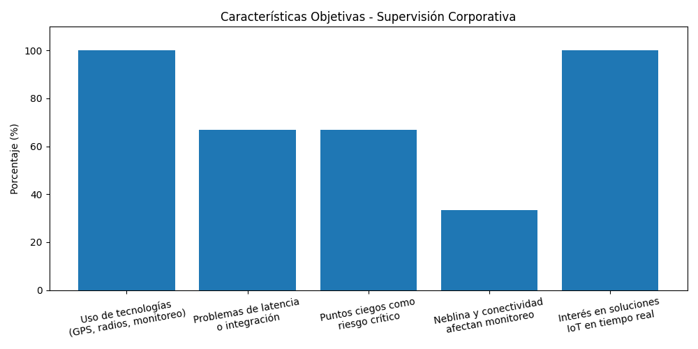
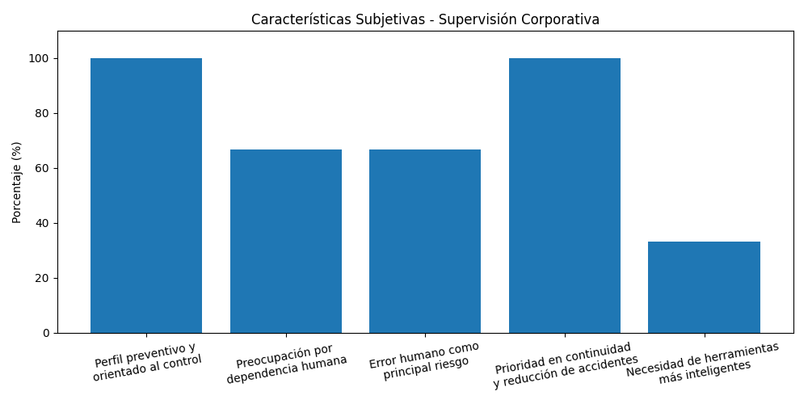
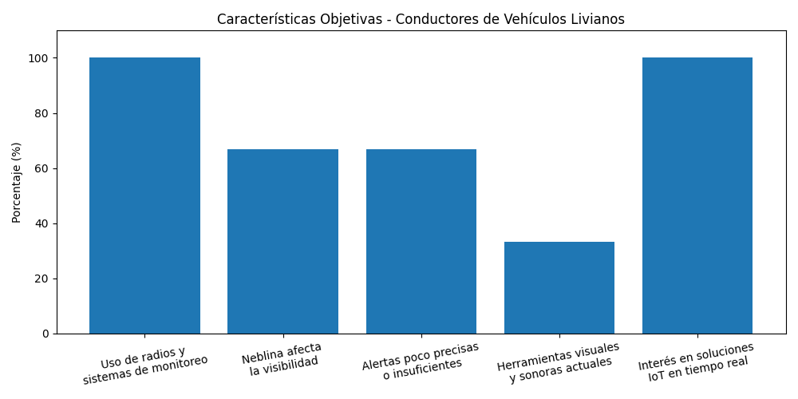
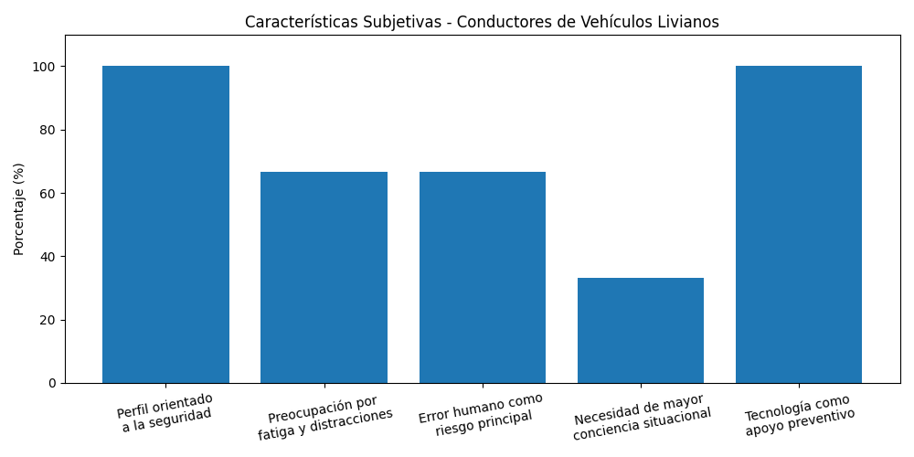

# 2.2. Entrevistas

## 2.2.1. Diseño de entrevistas

**Segmento 1: Supervisión Corporativa en Minería de Tajo Abierto**

- ¿Cómo gestionan actualmente la seguridad en zonas donde interactúan vehículos pesados y vehículos livianos?
- ¿Qué tipo de incidentes o riesgos ocurren con mayor frecuencia en sus operaciones?
- ¿Qué herramientas o tecnologías utilizan hoy para prevenir colisiones o accidentes?
- ¿Qué limitaciones encuentran en los sistemas de seguridad que usan actualmente?
- ¿Cómo se monitorea en tiempo real la ubicación de vehículos dentro de la operación?
- ¿Qué tan rápido pueden reaccionar ante una situación de riesgo o posible colisión?
- ¿Qué impacto tienen los accidentes en sus operaciones (costos, paralizaciones, reputación)?
- ¿Han evaluado soluciones tecnológicas para prevenir colisiones? ¿Qué les gustó o no les convenció?
- ¿Qué características consideran indispensables en un sistema de prevención de colisiones?
- ¿Qué tan dispuestos estarían a implementar una solución que alerte en tiempo real sobre riesgos entre vehículos?
  
**Segmento 2: Conductores de Vehículos Livianos**
  
- ¿Qué tan frecuente sientes que estás expuesto a situaciones de riesgo dentro de la mina?
- ¿En qué momentos sientes mayor peligro al conducir dentro de la operación?
- ¿Qué herramientas o señales utilizas actualmente para evitar accidentes?
- ¿Alguna vez has estado cerca de un accidente? ¿Qué ocurrió?
- ¿Qué tan fácil o difícil es mantener la atención mientras conduces en la mina?
- ¿Qué tipo de alerta te ayudaría más a evitar riesgos (visual, auditiva u otra)?
- ¿Te gustaria usar un sistema que te envíe alertas en tiempo real mientras conduces? ¿Por qué?
- ¿Qué características debería tener una herramienta para que realmente la uses sin distracciones?
- ¿Qué cambiarías del sistema actual de seguridad dentro de la mina?
  
## 2.2.2. Registro de entrevistas

Para cada segmento se registraron 3 entrevistas. A continuación se muestra la recolección de datos obtenida tras realizar cada entrevista presencial y virtual.  
Se puede ver el video consolidado con todas las entrevistas realizadas en el siguiente enlace: [Ver video en Microsoft Stream](https://upcedupe-my.sharepoint.com/:v:/g/personal/u202311558_upc_edu_pe/IQA3yj36FQ3cQZibPgEXO8pUAe0SWU15GACTjV4ieAImlMA?e=3xOIya&nav=eyJyZWZlcnJhbEluZm8iOnsicmVmZXJyYWxBcHAiOiJTdHJlYW1XZWJBcHAiLCJyZWZlcnJhbFZpZXciOiJTaGFyZURpYWxvZy1MaW5rIiwicmVmZXJyYWxBcHBQbGF0Zm9ybSI6IldlYiIsInJlZmVycmFsTW9kZSI6InZpZXcifX0%3D).

**Segmento #1: Supervisión Corporativa en Minería de Tajo Abierto**

<table>
  <thead>
    <tr>
      <th width="5%">Nº Entrevista</th>
      <th width="20%">Datos del entrevistado</th>
      <th width="45%">Resumen de la entrevista</th>
      <th width="30%">Evidencia de entrevista</th>
    </tr>
  </thead>
  <tbody>
    <tr>
      <td>1</td>
      <td>
        <strong>Nombre:</strong> Felipe Pastor  
        <strong>Rol:</strong> Supervisor de Despacho  
        <strong>Momento que inicia:</strong> [00:10]  
        <strong>Duración:</strong> [07:41]
      </td>
      <td>
        Felipe es un supervisor de operaciones mineras en tajo abierto con más de 10 años de experiencia en seguridad y continuidad operativa. Tiene un perfil racional, analítico y orientado a la prevención de riesgos, priorizando decisiones rápidas basadas en información en tiempo real. Actualmente supervisa rutas internas y el tránsito de camiones autónomos desde el centro de control utilizando computadoras Windows, pantallas de monitoreo, sistemas GPS y radios de comunicación, además de dispositivos móviles Android durante recorridos en campo. Señala que gran parte de la gestión de seguridad sigue siendo manual y dependiente de radios que suelen saturarse en situaciones críticas. Durante la entrevista, Felipe destacó que el principal problema es la latencia del GPS, ya que las ubicaciones mostradas presentan retrasos de aproximadamente 15 metros respecto a la realidad, dificultando reaccionar ante posibles colisiones. Mencionó que los “casi accidentes” son frecuentes cuando vehículos menores ingresan a puntos ciegos de los volquetes autónomos. Por ello, considera indispensable una solución IoT que emita alertas instantáneas directamente en cabina y que además permita visualizar zonas de riesgo, registrar eventos críticos y analizar conductas de conducción para mejorar la capacitación. Sus principales motivaciones son reducir accidentes, optimizar la continuidad operativa y tener mayor visibilidad de lo que ocurre en campo.
      </td>
      <td align="center">
        
      </td>
    </tr>
    <tr>
      <td>2</td>
      <td>
        <strong>Nombre:</strong> Landivar Flores  
        <strong>Edad:</strong> 34 años  
        <strong>Departamento:</strong> Áncash  
        <strong>Momento que inicia:</strong> [07:51]  
        <strong>Duración:</strong> [19:28]
      </td>
      <td>
        Landívar es un profesional del área de supervisión minera con experiencia en operaciones de tajo abierto y una personalidad racional, preventiva y orientada al control de riesgos, ya que analiza los accidentes no solo como eventos operativos, sino como problemas con impacto humano, económico, reputacional y legal. Durante la entrevista explicó que actualmente utilizan tecnologías como sistemas LiDAR, ADAS para detección de fatiga y plataformas de monitoreo desde computadoras y centros de control conectados mediante redes internas; sin embargo, considera que todavía existen limitaciones críticas relacionadas con la neblina, las condiciones climáticas extremas y la inestabilidad de la conectividad en mina. Señaló que un accidente puede paralizar operaciones y generar pérdidas millonarias, afectando además la reputación corporativa y las licencias legales de la operación. Desde su perspectiva, el factor humano continúa siendo el eslabón más vulnerable en la cadena de seguridad, por lo que considera indispensable implementar una solución IoT integrada, de alta precisión y con alertas en tiempo real que no dependa únicamente de cámaras, sino que apoye activamente la toma de decisiones y reduzca errores operativos.
      </td>
      <td align="center">
        
      </td>
    </tr>
    <tr>
      <td>3</td>
      <td>
        <strong>Nombre:</strong> Roy Ccosi  
        <strong>Rol:</strong> Supervisor Mina  
        <strong>Momento que inicia:</strong> [19:00]  
        <strong>Duración:</strong> [11:09]
      </td>
      <td>
        Roy es un supervisor de seguridad minera con experiencia en operaciones de tajo abierto y una personalidad práctica, preventiva y orientada a la toma rápida de decisiones frente a situaciones críticas. Durante la entrevista señaló que el mayor riesgo operativo son los choques ocasionados por la poca visibilidad en puntos ciegos, especialmente durante el tránsito de vehículos livianos cerca de volquetes de gran tamaño. Actualmente utilizan radios troncalizados, sistemas GPS y planos de riesgos semanales accesibles desde computadoras y plataformas de monitoreo; sin embargo, considera que estas herramientas no brindan alertas con la anticipación suficiente para ejecutar maniobras preventivas en tiempo real. Además, menciona que los sistemas existentes no están completamente integrados, lo que fragmenta la visibilidad de toda la operación y dificulta una respuesta coordinada. Roy se mostró totalmente dispuesto a implementar soluciones IoT que permitan alertar directamente a los operadores frente a colisiones inminentes, con el objetivo de reducir accidentes, minimizar pérdidas económicas y proteger la reputación de la empresa minera.
      </td>
      <td align="center">
        
      </td>
    </tr>
  </tbody>
</table>

**Segmento #2: Conductores de Vehículos Livianos**

<table>
  <thead>
    <tr>
      <th width="5%">Nº Entrevista</th>
      <th width="20%">Datos del entrevistado</th>
      <th width="45%">Resumen de la entrevista</th>
      <th width="30%">Evidencia de entrevista</th>
    </tr>
  </thead>
  <tbody>
    <tr>
      <td>1</td>
      <td>
        <strong>Nombre:</strong> Edgardo Chávez  
        <strong>Edad:</strong> 56 años  
        <strong>Departamento:</strong> Áncash  
        <strong>Momento que inicia:</strong> [51:19]  
        <strong>Duración:</strong> 12 min 43 seg
      </td>
      <td>
        Edgardo es un conductor de vehículos livianos con más de 20 años de experiencia en operaciones mineras y una personalidad práctica, cautelosa y orientada al cumplimiento de protocolos de seguridad. Durante la entrevista explicó que conducir dentro de la mina representa una actividad de riesgo constante, especialmente en zonas de tránsito compartido con volquetes y camiones autónomos, donde incluso se requiere autorización especial de “franja roja” para circular. Actualmente utiliza tecnologías como sistemas CAS y SAF, además de radios de comunicación para coordinar pases de adelantamiento y mantener contacto con supervisión. También mencionó que factores climáticos como la neblina limitan significativamente la visibilidad y aumentan el peligro durante los recorridos. Aunque se siente seguro gracias a su experiencia y al cumplimiento de procedimientos, considera valioso implementar nuevas soluciones IoT que ayuden a alertar peligros en tiempo real y proteger al conductor. Sin embargo, recalca que ninguna tecnología puede reemplazar la responsabilidad humana, especialmente en temas de fatiga y descanso, ya que el cansancio extremo sigue siendo uno de los principales riesgos en la operación minera.
      </td>
      <td align="center">
        
      </td>
    </tr>
    <tr>
      <td>2</td>
      <td>
        <strong>Nombre:</strong> Jorge Astolingón  
        <strong>Rol:</strong> Operador de Maquinaria  
        <strong>Momento que inicia:</strong> [38:37]  
        <strong>Duración:</strong> 12 min 33 seg
      </td>
      <td>
        Jorge es un conductor con experiencia en operaciones mineras y una personalidad observadora, preventiva y enfocada en la seguridad del trabajador. Durante la entrevista señaló que, aunque los peligros dentro de la mina están claramente identificados mediante protocolos y señalización, el principal riesgo sigue siendo el comportamiento humano y las distracciones durante la conducción. Comentó que ha presenciado accidentes graves ocasionados tanto por condiciones climáticas extremas, como tormentas eléctricas, como por la falta de aplicación adecuada del IPERC. Actualmente utiliza sistemas de despacho que emiten mensajes visuales y alertas sonoras mediante pitidos, además de radios y plataformas de monitoreo; sin embargo, considera que estos mecanismos no siempre logran captar la atención del conductor a tiempo. Por ello, propone evolucionar hacia soluciones de señalética inteligente, como paneles LED solares y alertas visuales más activas e inmediatas. Desde su perspectiva, una solución IoT que ayude a reforzar la conciencia situacional del trabajador y reduzca errores humanos representaría una mejora importante para la seguridad en operaciones mineras.
      </td>
      <td align="center">
        
      </td>
    </tr>
    <tr>
      <td>3</td>
      <td>
        <strong>Nombre:</strong> Fernando Velásquez  
        <strong>Edad:</strong> 55 años  
        <strong>Departamento:</strong> Áncash  
        <strong>Momento que inicia:</strong> [1:04:10]  
        <strong>Duración:</strong> [12:42]
      </td>
      <td>
        Fernando es un conductor de vehículos livianos con 25 años de experiencia en operaciones mineras y una personalidad práctica, crítica y orientada a la seguridad operacional. Durante la entrevista señaló que el cansancio y la fatiga representan el principal enemigo durante la conducción en mina, especialmente en jornadas largas y rutas de alto riesgo compartidas con camiones de gran tamaño. Actualmente utiliza sistemas de alerta y monitoreo integrados en cabina, además de radios de comunicación y herramientas de supervisión; sin embargo, considera que la tecnología actual presenta problemas importantes de precisión. Comentó que muchas alarmas son “demasiado sensibles” y se activan en situaciones que no representan un peligro real, provocando que los conductores se acostumbren a las alertas y pierdan capacidad de reacción ante eventos verdaderamente críticos. Por ello, espera una solución IoT más exacta e inteligente, capaz de filtrar falsas alarmas y emitir únicamente alertas críticas que requieran maniobras de emergencia, mejorando así la interacción del conductor con el sistema y reduciendo riesgos operacionales.
      </td>
      <td align="center">
        
      </td>
    </tr>

  </tbody>
</table>

## 2.2.3. Análisis de entrevistas

En esta sección se presentan los hallazgos clave obtenidos a partir de las entrevistas realizadas a los dos segmentos objetivo. El análisis identifica las características objetivas y subjetivas con mayor recurrencia, expresadas en porcentajes. Estos datos cualitativos y cuantitativos han sido la base fundamental para la posterior construcción de nuestros arquetipos.

Los porcentajes fueron calculados sobre la base de 3 entrevistas realizadas por segmento.

#### SEGMENTO 1: Supervisión Corporativa en Minería de Tajo Abierto
Este segmento está conformado por supervisores y responsables de operaciones mineras que trabajan principalmente desde centros de control monitoreando rutas internas, tránsito de vehículos y situaciones de riesgo. A partir de las entrevistas realizadas, se identificaron características objetivas relacionadas al uso constante de tecnologías de monitoreo, así como características subjetivas vinculadas a la prevención de riesgos, presión operativa y necesidad de reacción inmediata frente a incidentes.

Características objetivas identificadas:

+ 100% utiliza herramientas tecnológicas como GPS, radios de comunicación, plataformas de monitoreo y sistemas de asistencia operacional para supervisar la operación minera.
+ 66.7% indicó que los sistemas actuales presentan problemas de latencia, precisión o integración de información.
+ 66.7% señaló que los puntos ciegos entre vehículos livianos y volquetes representan el riesgo más crítico dentro de la operación.
+ 33.3% mencionó que factores externos como la neblina y la conectividad limitada afectan directamente la seguridad y capacidad de monitoreo.
+ 100% manifestó interés en implementar soluciones IoT con alertas en tiempo real y monitoreo centralizado.

    

Características subjetivas identificadas:

+ 100% mostró una personalidad orientada a la prevención y control de riesgos operacionales.
+ 66.7% expresó preocupación por la dependencia excesiva de la observación humana y comunicación por radio para reaccionar ante incidentes.
+ 66.7% considera que el error humano continúa siendo el principal punto vulnerable en la cadena de seguridad minera.
+ 100% prioriza la continuidad operativa y la reducción de accidentes como objetivos principales de su labor.
+ 33.3% resaltó la necesidad de herramientas visuales más activas e inteligentes que ayuden a mejorar la toma de decisiones en situaciones críticas.

    

Los hallazgos obtenidos permitieron identificar patrones comunes relacionados con la necesidad de monitoreo en tiempo real, integración de información y reducción de riesgos operacionales dentro de la mina. Asimismo, se evidenciaron características subjetivas vinculadas a la prevención, presión operativa y toma de decisiones rápidas. Estos datos servirán como base para elaborar el proceso de Needfinding y construir un arquetipo alineado a las necesidades reales de los supervisores mineros.

 

#### SEGMENTO 2: Operadores y Conductores de Vehículos Livianos
Este segmento está conformado por conductores de vehículos livianos que operan diariamente dentro de minas de tajo abierto, compartiendo rutas con volquetes y maquinaria pesada. A partir de las entrevistas realizadas, se identificaron características objetivas relacionadas al uso constante de sistemas de seguridad y comunicación, así como características subjetivas vinculadas a la percepción de riesgo, fatiga laboral y necesidad de alertas más precisas durante la conducción.

Características objetivas identificadas:

+ 100% utiliza radios de comunicación y sistemas de asistencia o monitoreo durante la conducción dentro de la mina.
+ 66.7% indicó que las condiciones climáticas, especialmente la neblina, afectan significativamente la visibilidad y aumentan el riesgo de accidentes.
+ 66.7% mencionó que los sistemas actuales generan alertas poco precisas o insuficientes para reaccionar adecuadamente ante situaciones críticas.
+ 33.3% señaló que actualmente existen herramientas visuales y sonoras de advertencia, pero estas no siempre logran captar la atención del conductor.
+ 100% manifestó interés en implementar soluciones IoT capaces de emitir alertas más precisas y oportunas en tiempo real.

    

Características subjetivas identificadas:

+ 100% mostró una personalidad orientada a la seguridad y cumplimiento de protocolos dentro de la operación minera.
+ 66.7% expresó preocupación por el cansancio, la fatiga y las distracciones como factores críticos durante la conducción.
+ 66.7% considera que el error humano continúa siendo uno de los principales riesgos dentro de la operación.
+ 33.3% resaltó la importancia de reforzar la conciencia situacional del trabajador mediante herramientas visuales más activas e inteligentes.
+ 100% considera que la tecnología debe actuar como apoyo preventivo para el conductor y no únicamente como un sistema reactivo ante accidentes.

    

Las entrevistas realizadas permitieron identificar necesidades comunes relacionadas con la seguridad durante la conducción, precisión de alertas y apoyo tecnológico frente a riesgos operacionales y fatiga laboral. Además, se reconocieron patrones de comportamiento y percepción del peligro que influyen directamente en la interacción del conductor con los sistemas actuales. Estos hallazgos serán utilizados como insumo principal para el desarrollo del Needfinding y la construcción del arquetipo del conductor de vehículos livianos.

 

