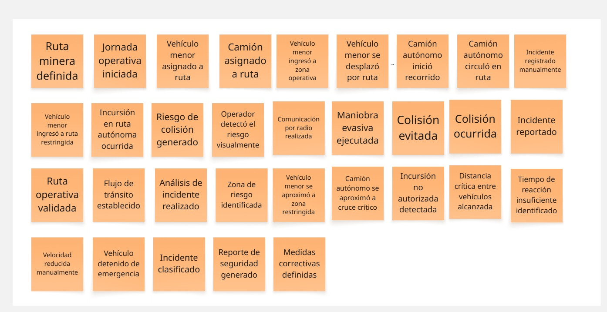

## 2.4. Big Picture EventStorming

En esta sección se presenta el resultado del Big Picture Event Storming realizado por el equipo, con el objetivo de comprender de manera integral el dominio del negocio asociado a la seguridad en rutas de transporte autónomo en operaciones mineras.

A través de una sesión colaborativa, se identificaron y organizaron los eventos clave que ocurren durante el flujo operativo, desde el inicio de la jornada hasta la gestión de incidentes. Este ejercicio permitió visualizar el proceso actual (As-Is), evidenciando las interacciones entre actores, las actividades críticas y los puntos donde se generan riesgos.

Como resultado, se logró identificar problemas relevantes como la detección tardía de incursiones, la dependencia del factor humano y la ausencia de sistemas de alerta en tiempo real. Asimismo, se reconocieron oportunidades de mejora orientadas a el monitoreo inteligente, que sustentan la propuesta de solución basada en IoT.

    

Link Miro: 'https://miro.com/welcomeonboard/bFAwdEpXM0t5aFBVb0twazcxY29PZms4R2ZlZG5qZTk3OERCcnoxS0ljQS9aU25Sd3ZZaXhRN0Rid1YyU2Q5bDlyNUp4RUpSNDZHbXpiazludG1hOFNsR09IVWN3Y3p3bGg4T1lwbG5ZcGN5WlZVU0U4NEUzNFRSV3M1RWowbzB3VHhHVHd5UWtSM1BidUtUYmxycDRnPT0hdjE=?share_link_id=400051645273'

 

+ Events:

    

 

+ Fase 1 Preparación: 

    

 

+ Fase 2 Operación: 

    

 

+ Fase 3 Momento Crítico: 

    

 

+ Fase 4 Reacción: 

    

 

+ Fase 5 Post Incidente: 

    

 

