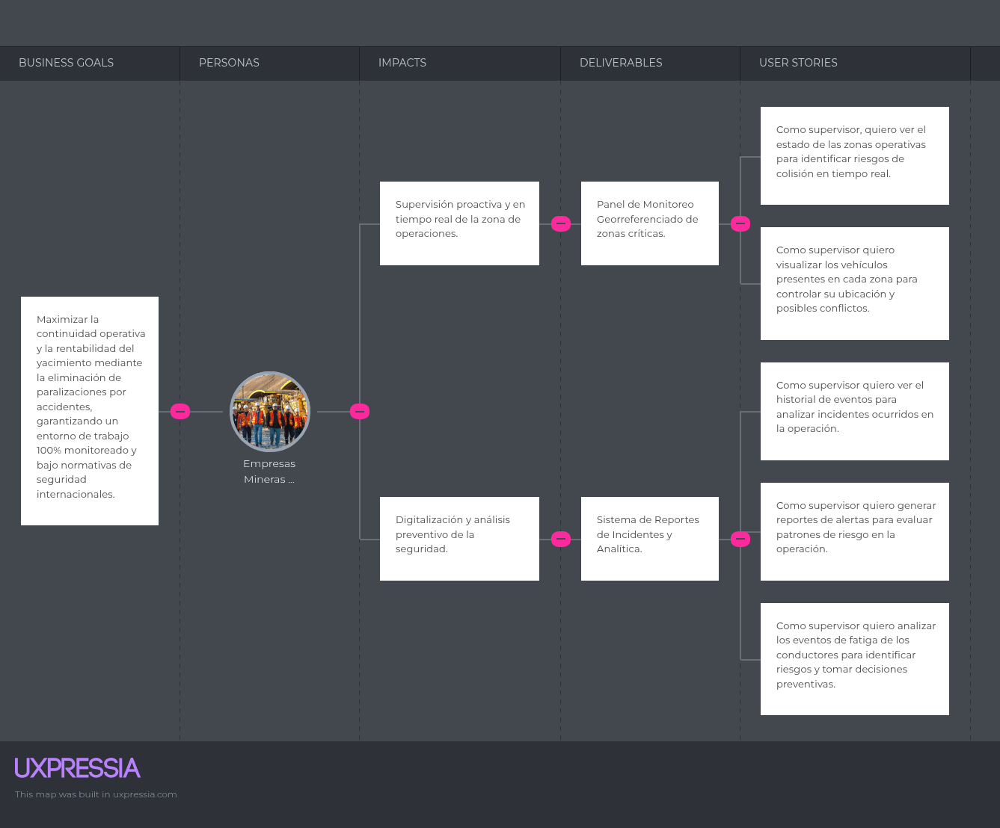
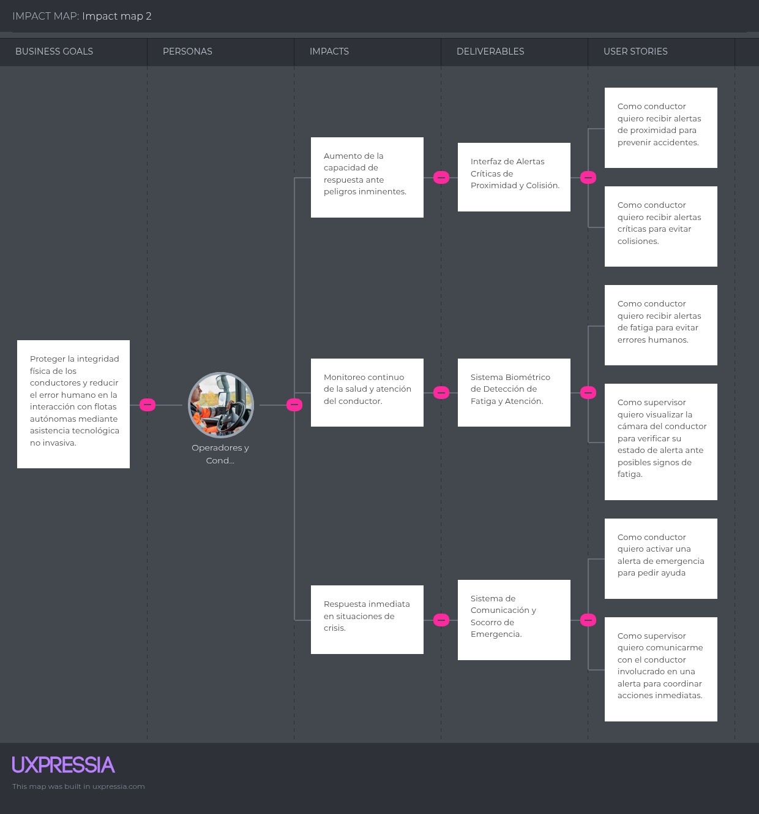

### 3.3. Impact Mapping
Esta sección presenta el Impact Mapping para alinear los objetivos estratégicos de seguridad con las funcionalidades clave del sistema.
A través de este mapa, se visualiza cómo cada requerimiento técnico genera un impacto directo en la reducción de riesgos para los dos segmentos críticos del proyecto.

**Segmento Objetivo 1: Supervisión Corporativa en Minería de Tajo Abierto**

    

**Segmento Objetivo 2: Operadores y Conductores de Vehículos Livianos**

    

