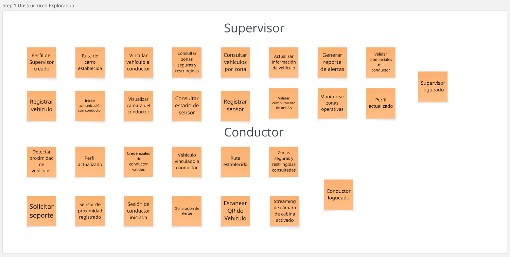
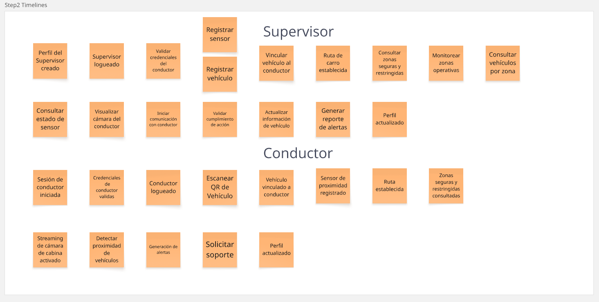
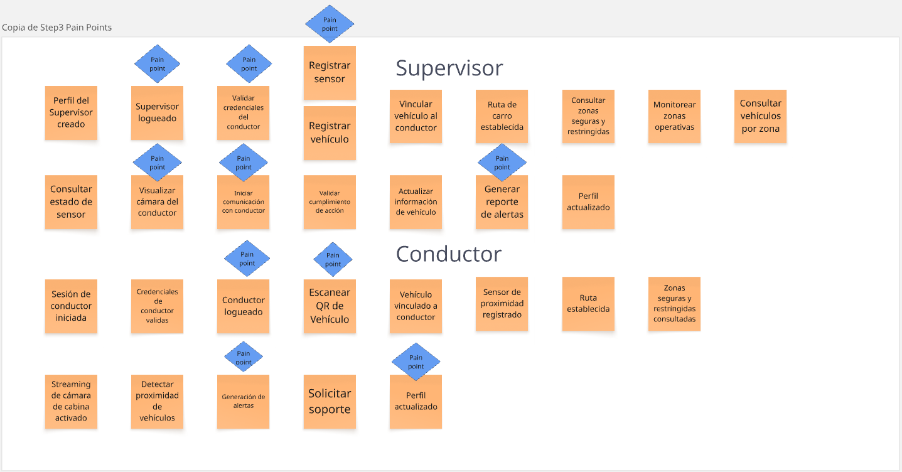
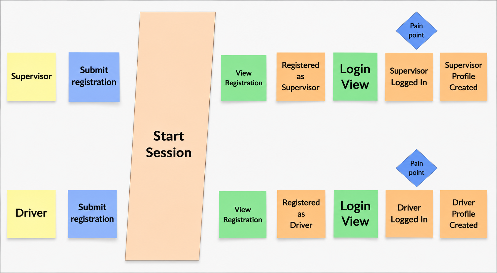
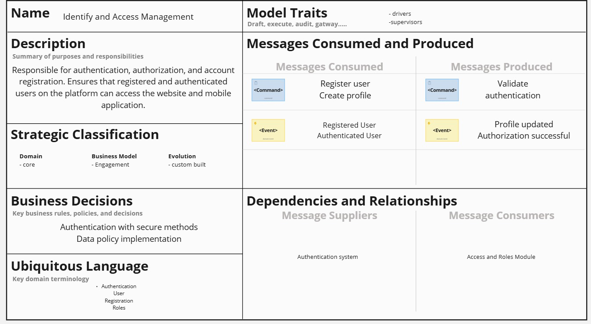

<h2>4.1. Strategic-Level Domain-Driven Desing</h2>
<h3>4.1.1. Design-Level EventStorming</h3>

Event Storming es una técnica que se realiza en equipo para poder comprender y explorar todos los posibles eventos que posee un sistema. Los integrantes del equipo realizan lluvia de ideas para mapear las acciones que un usuario posiblemente realice durante el uso de la aplicación. También, con esta técnica podemos definir en grupo los procesos el diseño y las reglas de negocio e la plataforma a desarrollar. 

A continuación se mostrará los 9 pasos del Event Storming realizados en el Miro:

**Paso 1: Unstructured Exploration**

En este paso se realiza una lluvia de ideas relacionado a los eventos que posiblemente posea el sistema.

**Paso 2: Timelines**

En esta fase, los eventos identificados se ordenan de manera secuenial y se agrupan entre los tipos de usuario.

**Paso 3: Paint Points**

Durante este paso, se identifican los puntos donde se presente tráfico o también llamado cuellos de botella para poseer un plan para poder mejorar y actualizar aquellos puntos y así ofrecer una mejor experiencia a nuestros usuarios.

**Paso 4: Pivotal Points**

En este paso, identificamos los eventos comerciales importantes que nos indica que hay un cambio de contexto o sección en la aplicación.

**Paso 5: Commands**

Los comandos son representaciones de la consecuencia que generó un evento o varios eventos.

**Paso 6: Policies**

En este escenario, se muestra que un evento puede provocar la ejecución de un comando manejado por una política.

**Paso 7: Read Models**

En este escenario, los read models sirven para generar una interfaz de lectura de un evento para que el usuario pueda decidir si ejecutar un comando o no.

**Paso 8: External Systems**

En esta fase, se identifican los sistemas externos que usará la plataforma móvil para su ejecución eficaz.

**Paso 9: Aggregates**

En este paso, con los eventos y comandos realizados, entonces ya se puede comenzar a juntar conceptos relacionados en un grupo, o mejor dicho en un bounded context.

<h3>4.1.1.1. Candidate Context Discovery</h3>

Nuestro equipo adoptó un enfoque se se centra en buscar partes del sistema que deben estar agrupados, desde un punto funcional del usuario y de infraestructura.

Se identificaron 7 Bounded Context:

- Identify and Access Management (IAM): 

En este escenario, se crea, auténtica, autoriza y gestiona los usuarios que están registrados en el sistema. Se introduce el manejo de permisos y roles, también el control de acceso a diferentes tipos de usuarios.

<h3>4.1.1.2. Domain Message Flows Modeling</h3>

<h3>4.1.1.3. Bounded Context Canvases</h3>

En esta sección se demuestra el proceso que ejecutó el equipo para agrupar los bounded context que posee nuesdtro sdisdtema. El desarrollo de aquellos se realizó minuciosamente para comprobar de qué son los bounded context que reflejan el dominio del negocio. De esta manera, se logró formar 7 bounded context, enfocándonos en que cada uno de ellos resuelva la necesidad del usuario.

- Bounded Context Canvases Identity and Access Management (IAM)

