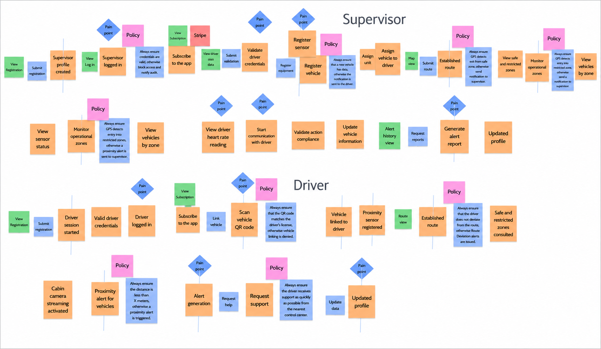
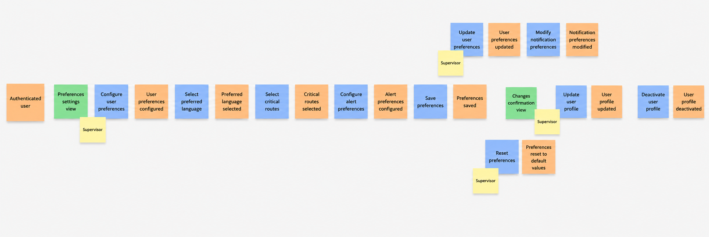
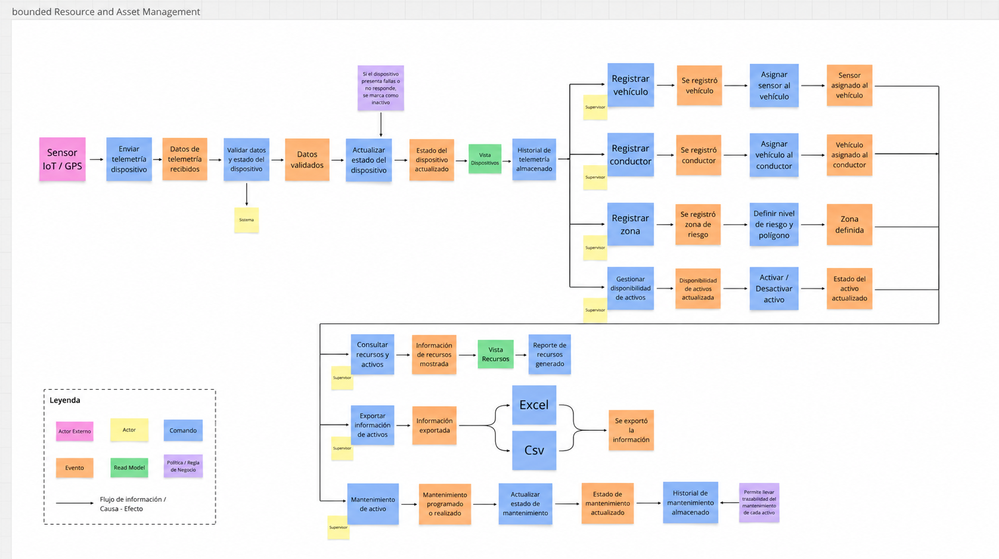
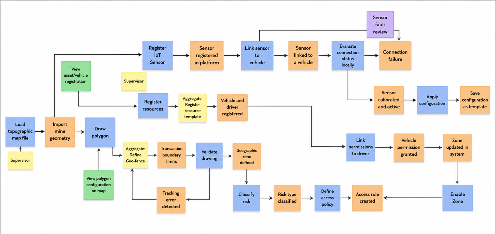
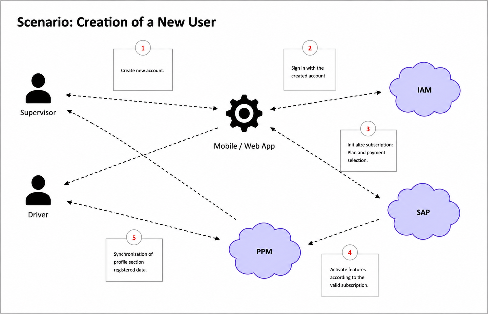
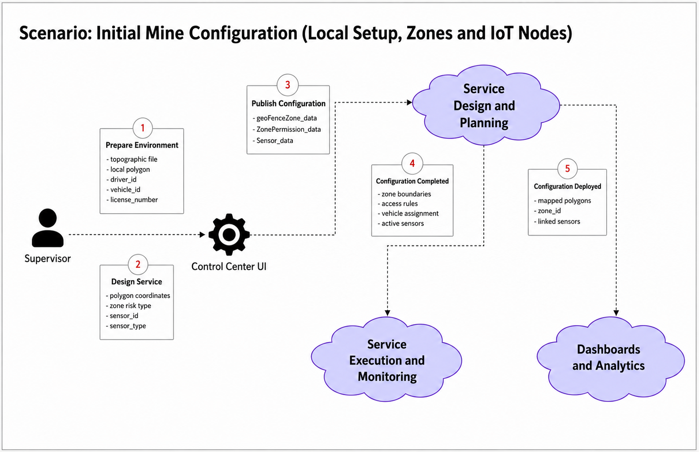
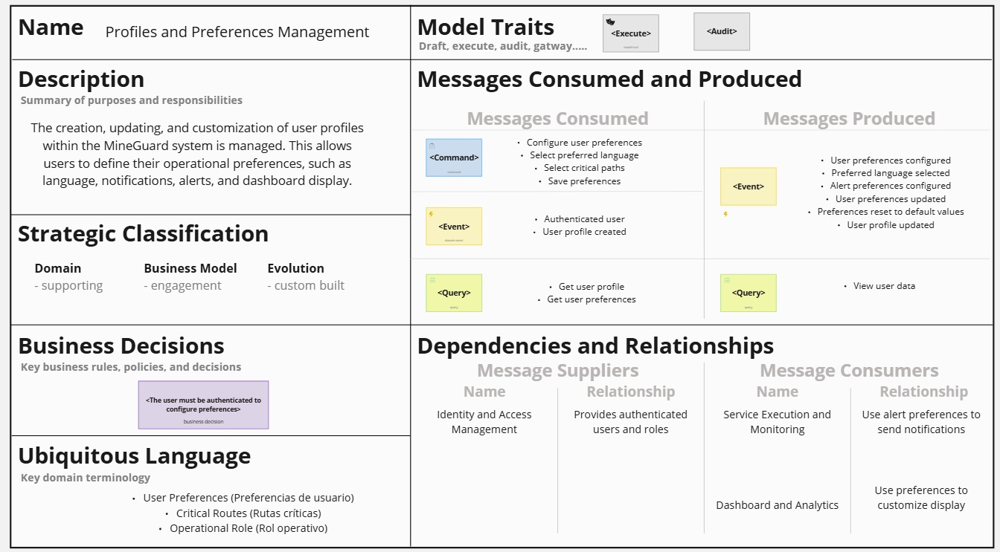
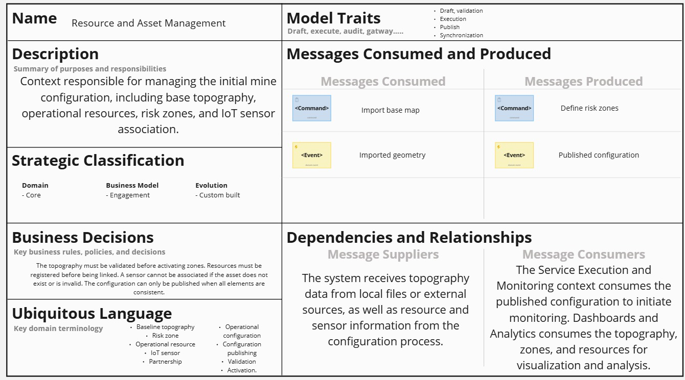
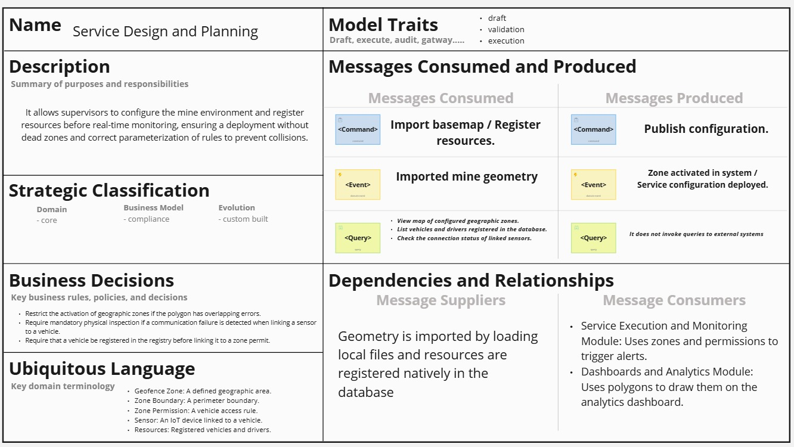
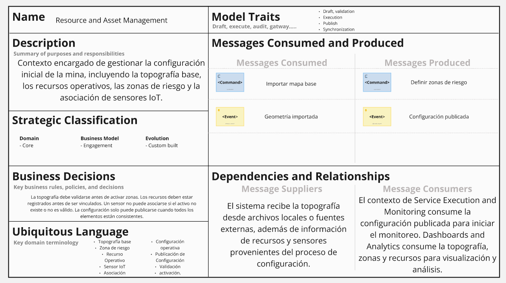

<h2>4.1. Strategic-Level Domain-Driven Desing</h2>
<h3>4.1.1. Design-Level EventStorming</h3>

Event Storming es una técnica que se realiza en equipo para poder comprender y explorar todos los posibles eventos que posee un sistema. Los integrantes del equipo realizan lluvia de ideas para mapear las acciones que un usuario posiblemente realice durante el uso de la aplicación. También, con esta técnica podemos definir en grupo los procesos el diseño y las reglas de negocio e la plataforma a desarrollar. 

A continuación se mostrará los 9 pasos del Event Storming realizados en el Miro:

**Paso 1: Unstructured Exploration**

En este paso se realiza una lluvia de ideas relacionado a los eventos que posiblemente posea el sistema. Aquí mapeamos la amplitud de la lógica de negocio, desde el registro de sensores hasta la detección de ritmo cardiaco y alertas de proximidad.

**Paso 2: Timelines**

En esta fase, los eventos identificados se ordenan de manera secuenial y se agrupan entre los tipos de usuario. Esta estructura permite visualizar el flujo de trabajo de extremo a extremo y entender la interdependencia entre ambos roles.

**Paso 3: Paint Points**

Durante este paso, se identifican los puntos donde se presente tráfico o también llamado cuellos de botella para poseer un plan para poder mejorar y actualizar aquellos puntos y así ofrecer una mejor experiencia a nuestros usuarios. 

Se detectaron fricciones críticas en la validación de credenciales, la comunicación inmediata ante alertas de pulso y la sincronización del registro de vehículos. Estos puntos son prioridades para la implementación de mecanismos de resiliencia y alta disponibilidad.

**Paso 4: Pivotal Points**

En este paso, identificamos los eventos comerciales importantes que nos indica que hay un cambio de contexto o sección en la aplicación. Eventos como "Conductor Logueado" o "Ruta Establecida" actúan como disparadores que activan diferentes subdominios del sistema, permitiendo una separación clara entre la gestión administrativa y la telemetría en tiempo real.

**Paso 5: Commands**

Los comandos son representaciones de la consecuencia que generó un evento o varios eventos. El comando Vincular unidad es la acción del Supervisor que resulta en el evento Vehículo vinculado al conductor. Esto define la interfaz de interacción (API/UI) que el sistema debe soportar para procesar las solicitudes de los usuarios.

**Paso 6: Policies**

En este escenario, se muestra que un evento puede provocar la ejecución de un comando manejado por una política. Por ejemplo, ante un evento de "Exceso de velocidad detectado", la política dispara automáticamente un comando de "Notificar a Supervisor" y "Generar alerta sonora", garantizando una respuesta autónoma sin intervención humana constante. 

**Paso 7: Read Models**

En este escenario, los read models sirven para generar una interfaz de lectura de un evento para que el usuario pueda decidir si ejecutar un comando o no. Estos modelos representan proyecciones de datos que alimentan los dashboards del supervisor y la vista del conductor, facilitando una interacción informada y eficiente con el sistema.

**Paso 8: External Systems**

En esta fase, se identifican los sistemas externos que usará la plataforma móvil para su ejecución eficaz. Se definieron fronteras con servicios de Pasarela de Pagos (Stripe) para suscripciones, servicios de Geolocalización (GPS/Maps) para el rastreo de rutas.

**Paso 9: Aggregates**

Con los eventos y comandos realizados, entonces ya se puede comenzar a juntar conceptos relacionados en un grupo, o mejor dicho en un bounded context. 

<h3>4.1.1.1. Candidate Context Discovery</h3>

Nuestro equipo adoptó un enfoque se se centra en buscar partes del sistema que deben estar agrupados, desde un punto funcional del usuario y de infraestructura.

Se identificaron 7 Bounded Context:

- Identify and Access Management (IAM): 

Este bounded context se encarga de gestionar el ciclo de vida de la identidad de los usuarios dentro de la plataforma MineGuard. Es responsable del registro, autenticación, autorización y administración de supervisores y conductores, garantizando un acceso seguro al sistema mediante el control de credenciales, roles y permisos. Además, establece las políticas de acceso para cada tipo de usuario, asegurando que únicamente puedan utilizar las funcionalidades correspondientes a sus responsabilidades dentro de la operación minera.

  

- Service Execution and Monitoring: 

Este bounded context se encarga de ejecutar y supervisar las operaciones en tiempo real de la plataforma MineGuard. Es responsable de procesar la telemetría proveniente de los sensores IoT, evaluar continuamente riesgos como proximidad, colisiones y fatiga del conductor, y gestionar el ciclo de vida de las alertas generadas. Además, coordina las acciones de respuesta, determinando si una alerta debe resolverse automáticamente, escalarse al supervisor o derivar en la creación de un incidente, garantizando una atención oportuna y el registro de las métricas operativas del sistema.

- Profile and Preference Management: 

Este bounded context se encarga de gestionar los perfiles de usuario y las preferencias de configuración dentro de la plataforma MineGuard. Es responsable de administrar la información del perfil, las preferencias de idioma, las configuraciones de alertas y notificaciones, así como las opciones de personalización que permiten adaptar la experiencia de uso a las necesidades de cada supervisor o conductor. Además, garantiza la actualización, restauración y mantenimiento de dichas preferencias durante todo el ciclo de vida del usuario.

- Resource and Asset Management:

Este bounded context fue identificado durante la sesión de Candidate Context Discovery a partir de los eventos relacionados con el registro, asignación y control de los recursos físicos que participan en la operación minera. Su aparición responde a la necesidad de separar la gestión de activos operativos, como vehículos livianos, camiones autónomos, sensores IoT, dispositivos de cabina y zonas de riesgo, del monitoreo en tiempo real realizado por Service Execution and Monitoring.

Resource and Asset Management permite mantener un modelo claro y consistente de los recursos disponibles antes y durante la operación. Este contexto se encarga de registrar activos, validar su estado operativo, asociar sensores a vehículos, administrar disponibilidad de unidades y asegurar que solo los recursos habilitados participen en las rutas configuradas. De esta manera, aporta trazabilidad al dominio y garantiza que los eventos de telemetría y alerta puedan relacionarse correctamente con los activos físicos involucrados.

- Dashboards and Analytics: 

Este bounded context se encarga de recopilar, consolidar y visualizar la información operativa generada por la plataforma MineGuard. Es responsable de procesar los datos provenientes de la operación en tiempo real para generar dashboards, indicadores y análisis históricos que permitan monitorear el estado del sistema, identificar patrones de riesgo, consultar el historial de eventos y alertas, evaluar el desempeño de los conductores y apoyar la toma de decisiones mediante reportes y métricas exportables.

- Subscriptions and Payment Management:

Este bounded context se encarga de administrar el ciclo de vida de las suscripciones y los pagos de la plataforma MineGuard. Es responsable de gestionar los planes de suscripción, procesar los pagos mediante pasarelas externas, controlar el estado de cada suscripción y administrar los métodos de pago de los usuarios. Además, coordina las renovaciones automáticas, el manejo de pagos fallidos y reintentos, la generación de facturas y el envío de notificaciones relacionadas con el proceso de facturación, garantizando la continuidad del servicio y la correcta gestión financiera de la plataforma.

- Service Design and Planing:

Este bounded context se encarga de planificar y configurar la infraestructura operativa de la plataforma MineGuard antes del inicio de las operaciones. Es responsable de administrar la información geográfica de la mina mediante la importación de la topografía, el trazado y validación de zonas de riesgo, así como del registro de vehículos, conductores y sensores IoT. Además, gestiona la vinculación de los recursos operativos, la definición de políticas de acceso y la activación de la configuración del servicio, garantizando un despliegue seguro, consistente y preparado para el monitoreo en tiempo real.

<h3>4.1.1.2. Domain Message Flows Modeling</h3>

**Escenario: Detección y Gestión de Alerta Crítica**
- Los Sensores IoT transmiten los datos de telemetría (coordenadas, velocidad) en tiempo real hacia el contexto de Service Execution and Monitoring.
- Al detectar un riesgo, el sistema dispara automáticamente una alarma sonora y visual hacia el Dispositivo de Cabina.
- El dispositivo emite la advertencia física para alertar del peligro al Conductor.
- En paralelo, el sistema envía la notificación al Web Dashboard para visibilidad del centro de control.
- El Supervisor interactúa con el dashboard para atender la alerta, lo que envía el comando de actualización de estado de vuelta al sistema.
- Finalmente, el contexto publica el evento de alerta resuelta hacia Dashboards and Analytics para el registro de tiempos de respuesta y métricas de rendimiento.

**Escenario: Estado en tiempo real de conductores**
- El supervisor solicita el estado de los conductores desde el Dashboard UI.
- El contexto de Dashboards and Analytics recibe la consulta y obtiene datos del contexto Service Execution and Monitoring.
- Este último envía eventos como DriverStatusUpdated y FatigueDetected.
- El contexto de Analytics procesa la información y genera LiveDriverData.
- Finalmente, el Dashboard muestra los datos en tiempo real al supervisor.

**Escenario: Visualización de alertas críticas**
- El supervisor solicita el estado de los conductores desde el Dashboard UI.
- El contexto de Dashboards and Analytics recibe la consulta y obtiene datos del contexto Service Execution and Monitoring.
- Este último envía eventos como DriverStatusUpdated y FatigueDetected.
- El contexto de Analytics procesa la información y genera LiveDriverData.
- Finalmente, el Dashboard muestra los datos en tiempo real al supervisor.

**Escenario: Creación de Usuario**

Cuando se crea una nueva cuenta, ya sea de modo conductor o de supervisor, luego de que inicie sesión, se le presentarán los planes de subscripción que tiene la aplicación para distintas funciones, luego de escoger dicho plan se informará a la gestión perfil sobre la creación y sincronización de los datos ingresados previamente en el registro de cuenta.

**Escenario: Configuración Inicial de la Mina**
- El Supervisor utiliza el Centro de Control UI para cargar el mapa topográfico local y registrar los vehículos y conductores iniciales.

- En la misma interfaz, el Supervisor traza las zonas de riesgo y vincula los sensores IoT a la flota operativa.

- El Centro de Control UI agrupa los datos y envía el comando "Publicar Configuración" hacia el contexto de Service Design and Planning.

- El sistema valida la información localmente y publica el evento "Configuración Desplegada" hacia Service Execution and Monitoring para activar el monitoreo.

- En paralelo, el mismo evento se envía hacia Dashboards and Analytics para renderizar los polígonos y recursos en el panel de visualización.

<h3>4.1.1.3. Bounded Context Canvases</h3>

En esta sección se demuestra el proceso que ejecutó el equipo para agrupar los bounded context que posee nuesdtro sdisdtema. El desarrollo de aquellos se realizó minuciosamente para comprobar de qué son los bounded context que reflejan el dominio del negocio. De esta manera, se logró formar 7 bounded context, enfocándonos en que cada uno de ellos resuelva la necesidad del usuario.

- Bounded Context Canvases Identity and Access Management (IAM)

    El siguiente Bounded Context Canvas describe el contexto de Gestión de Identidad y Acceso (Identity and Access Management - IAM) de la plataforma MineGuard. Este contexto es responsable de gestionar el registro de usuarios, la autenticación, la autorización y la administración de perfiles, garantizando que únicamente los usuarios registrados y autenticados puedan acceder de forma segura a la aplicación web y móvil. Asimismo, define los comandos, eventos, reglas de negocio e interacciones con otros Bounded Contexts, estableciendo los límites de seguridad necesarios para proteger los recursos del sistema y la información de los usuarios.

- Bounded Context Canvas Service Execution and Monitoring

    El siguiente Bounded Context Canvas describe el contexto de Ejecución y Monitoreo de Servicios (Service Execution and Monitoring) de la plataforma MineGuard. Este contexto es responsable de recibir y procesar la telemetría proveniente de los sensores IoT, detectar alertas en tiempo real y coordinar las acciones correspondientes, como la activación de alarmas sonoras, notificaciones visuales y protocolos de emergencia. Asimismo, define los comandos, eventos, consultas, reglas de negocio e interacciones con otros Bounded Contexts, permitiendo el monitoreo continuo y la respuesta oportuna ante incidentes detectados durante la operación.

- Bounded Context Canvas Profile and Preferences Management

    El siguiente Bounded Context Canvas describe el contexto de Gestión de Perfiles y Preferencias (Profiles and Preferences Management) de la plataforma MineGuard. Este contexto es responsable de la creación, actualización y personalización de los perfiles de usuario, permitiendo configurar preferencias como el idioma, las rutas críticas, las notificaciones, las alertas y la visualización del panel de control. Asimismo, define los comandos, eventos, consultas, reglas de negocio e interacciones con otros Bounded Contexts, garantizando que las preferencias del usuario sean utilizadas para personalizar su experiencia dentro de la plataforma.

- Bounded Context Canvas Resource and Asset Management

    El siguiente Bounded Context Canvas describe el contexto de Gestión de Recursos y Activos (Resource and Asset Management) de la plataforma MineGuard. Este contexto es responsable de administrar la configuración inicial de la mina, incluyendo la importación de la topografía base, la gestión de los recursos operativos, la definición de zonas de riesgo y la asociación de sensores IoT con los activos correspondientes. Asimismo, define los comandos, eventos, reglas de negocio e interacciones con otros Bounded Contexts, asegurando que la información de configuración sea validada y publicada antes de ser utilizada por los módulos de monitoreo y análisis.

- Bounded Context Canvases Dashboards and Analytics

    El siguiente Bounded Context Canvas describe el contexto de Paneles y Analítica (Dashboards and Analytics) de la plataforma MineGuard. Este contexto es responsable de consolidar y visualizar en tiempo real la información proveniente de los sensores, las alertas y los sistemas de monitoreo, permitiendo a los supervisores analizar el estado de las operaciones, identificar patrones de riesgo y generar reportes para apoyar la toma de decisiones. Asimismo, define los comandos, eventos, reglas de negocio e interacciones con otros Bounded Contexts, facilitando el análisis y la visualización de la información operativa.

- Subscriptions and Payment Management

    El siguiente Bounded Context Canvas describe el contexto de Gestión de Suscripciones y Pagos (Subscriptions and Payment Management) de la plataforma MineGuard. Este contexto es responsable de administrar los planes de suscripción de los usuarios, procesar los pagos, gestionar las renovaciones y garantizar una facturación precisa. Asimismo, define los comandos, eventos, reglas de negocio e interacciones con otros Bounded Contexts, asegurando la continuidad del servicio, la trazabilidad de las transacciones y la integración con los módulos financieros, de notificaciones y analítica.

- Service Design and Planing

    El siguiente Bounded Context Canvas describe el contexto de Diseño y Planificación del Servicio (Service Design and Planning) de la plataforma MineGuard. Este contexto es responsable de configurar el entorno de la mina antes de iniciar el monitoreo en tiempo real, permitiendo importar la topografía, registrar los recursos operativos, definir las zonas geográficas y establecer las reglas de configuración necesarias para el funcionamiento del sistema. Asimismo, define los comandos, eventos, reglas de negocio e interacciones con otros Bounded Contexts, garantizando que la configuración sea validada y publicada antes de ser utilizada por los módulos de monitoreo y analítica.

- Resource and Managment 

