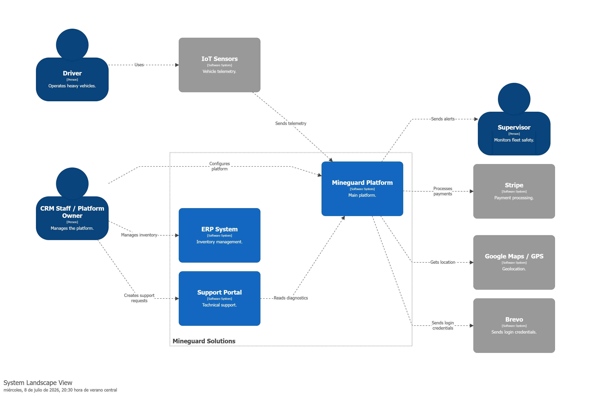
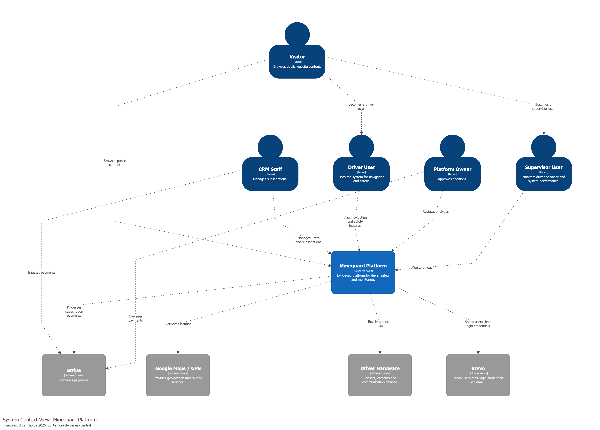
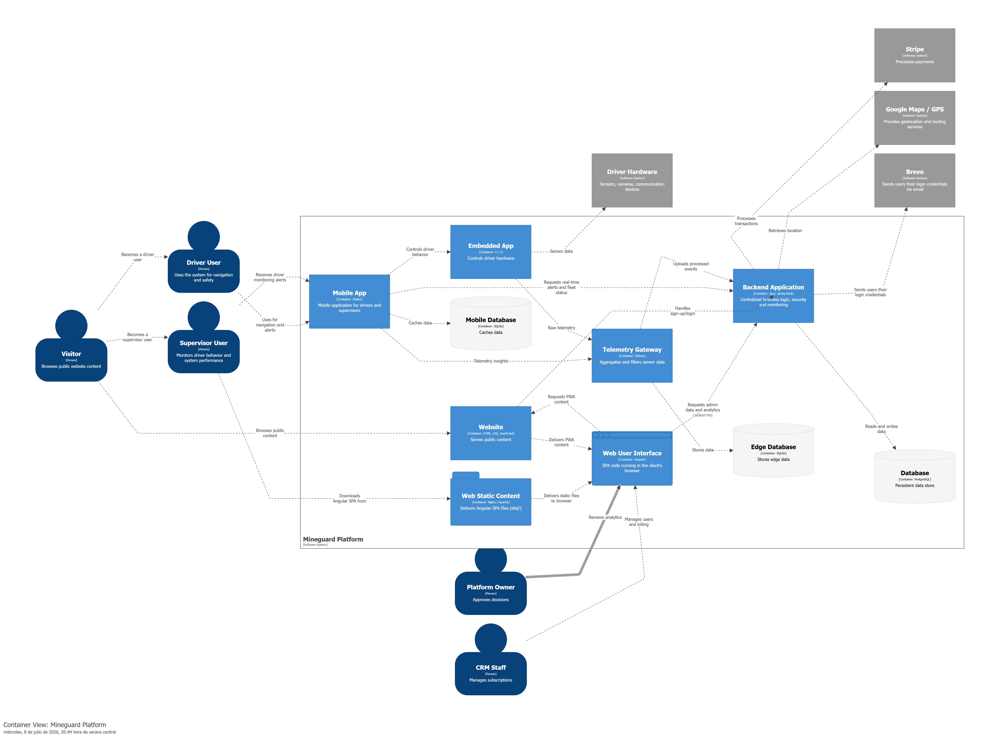
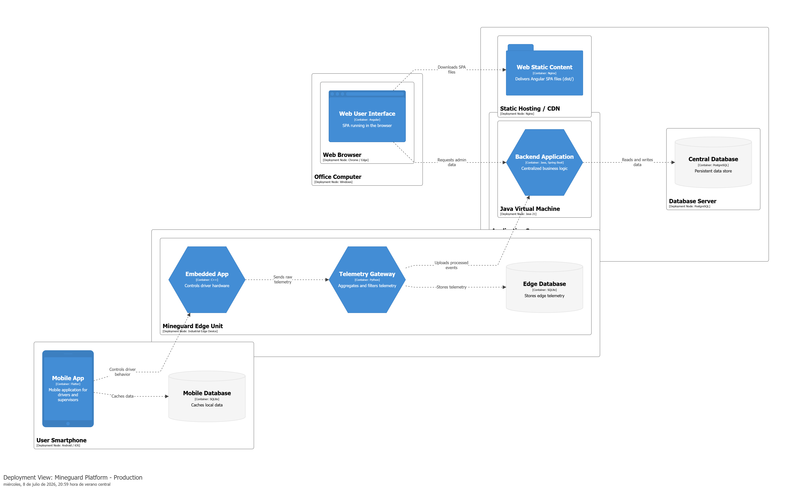

<h2>4.1.3. Software Architecture</h2>
<h3>4.1.3.1. Software Architecture LandScape Diagrams</h3>

Este diagrama representa el ecosistema global de MineGuard y cómo interactúa con actores humanos y sistemas externos preexistentes.

Se define el ecosistema de seguridad industrial donde la Mineguard Platform actúa como el núcleo. Se identifican interdependencias críticas con sistemas de terceros como Stripe y Google Maps. 

El diagrama evidencia la integración de Sistemas de Información Empresarial (ERP) y Portales de Soporte, estableciendo una frontera clara entre las operaciones administrativas y la telemetría operativa en tiempo real proveniente de los Sensores IoT instalados en la flota.

<h3>4.1.3.2. Software Architecture Context Level Diagrams</h3>

Este diagrama se centra exclusivamente en las interacciones directas con la plataforma MineGuard, definiendo el alcance del sistema y sus fronteras.

Se observa un diseño orientado a servicios donde la plataforma consume datos de flujo descendente del Driver Hardware y delega procesos de soporte a entidades externas. Esto permite validar el cumplimiento del propósito del sistema: la mitigación de riesgos laborales mediante el monitoreo constante.

<h3>4.1.3.3. Software Architecture Container Level Diagrams</h3>

Aquí se desglosa la plataforma en sus aplicaciones principales, exponiendo las decisiones tecnológicas y los protocolos de comunicación.

La arquitectura se descompone en contenedores especializados. Se destaca una aplicación móvil desarrollada en Flutter para alta portabilidad, un Backend en Java/Spring Boot bajo un patrón de Monolito Modular, y una Web App en Angular para la gestión administrativa.

<h3>4.1.3.4. Software Architecture Deployment Diagrams</h3>

Este diagrama describe la topología de infraestructura física y virtual donde reside la solución en un entorno productivo.

Se detalla una distribución geográfica de nodos. En el borde, la unidad Mineguard Edge Unit instalada en el vehículo gestiona el procesamiento local de sensores. En la nube, se observa el despliegue del Backend Application Server y el Database Server, optimizados para alta disponibilidad.

