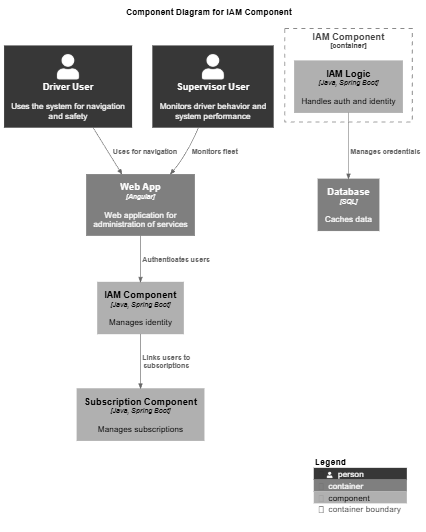
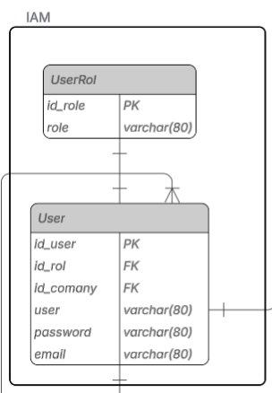
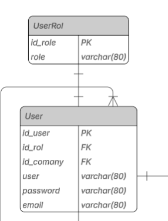

<h2>4.2. Tactical-Level Domain-Driven Design</h2>

<h3>4.2.1. Bounded Context: Identity and Access Management</h3>
Se encarga de gestionar la identidad y el acceso de los usuarios dentro del sistema. Esto incluye la autenticación, autorización, gestión de roles y permisos, y la administración de usuarios. El objetivo principal de este Bounded Context es garantizar que solo los usuarios autorizados puedan acceder a los recursos y funcionalidades del sistema, protegiendo así la seguridad de los datos.

<h3>4.2.1.1. Domain layer</h3>

Contiene la lógica de negocio y las entidades principales relacionadas a la identidad.

**Aggregate 1: Role**

|Nombre|Categoría|Descripción|
|-|-|-|
|Role|Entity|Define un tipo de usuario con un conjunto específico de permisos.|

Attributes

|Nombre|Tipo de dato|Visibidad|Descripción|
|-|-|-|-|
|id|UUID|Private|Identificador único del usuario|
|role|String|Private|Nombre único del rol asignado|

Methods

|Nombre|Tipo de retorno|Visibidad|Descripción|
|-|-|-|-|
|addPermission(permission:Permission)|Void|Public|Añade un permiso al rol|
|removePermission(permission:Permission)|Void|Public|Elimina un permiso al rol|
|canAssign(user: User)|Boolean|Public|Añade un permiso al rol|

**Aggregate 2: JwtToken**

|Nombre|Categoría|Descripción|
|-|-|-|
|JwtToken|Entity|Representa un token JWT emitido como parte de una sesión|

Attributes

|Nombre|Tipo de dato|Visibidad|Descripción|
|-|-|-|-|
|id|UUID|Private|Identificador único del usuario|

Methods

|Nombre|Tipo de retorno|Visibidad|Descripción|
|-|-|-|-|
|isExpired()|Boolean|Public|Verifica si el token ha expirado|

**Aggregate 3: User**

|Nombre|Categoría|Descripción|
|-|-|-|
|id| UUID  | Private  |Identificador único del usuario.
|firstName| String| Private  | Nombre registrado del usuario
|lastName| String| Private  | Apellido registrado del usuario
|email| String| Private  |Objeto de valor encapsulando la dirección de correo electónico y su validación.
|password| String| Private  |Contraseña hasheada del usuario

Attributes

|Nombre|Tipo de dato|Visibidad|Descripción|
|-|-|-|-|
|id|UUID|Private|Identificador único del usuario|

Methods

|Nombre|Tipo de retorno|Visibidad|Descripción|
|-|-|-|-|
|getProfile()|User|Public| Obtiene el perfil del Usuario |
|getId()|UUID|Public|Obtiene el identificador con el cuál está registrado el usuario|

<h3>4.2.1.2. Infrastructure layer</h3>

Esta capa es resonsable de la recepción y formato de peticiones(API REST), validación básica del formato y los datos de entrada, manejo de errores a nivel de api.

**Controller: AuthController**

|Nombre|Categoría|Descripción|
|-|-|-|
|AuthController|Controller|Controlador de endpoints relacionados con la autenticación de usuarios y la gestión del ciclo de vida de las sesiones (sing-in,sign-up)

**Attributes**

|Nombre|Tipo de dato|Visibilidad|Descripción|
|-|-|-|-|
|authService|AuthService|Private|Servicio de la capa de Aplicación

**Endpoints**

|Ruta|Método|Descripción|
|-|-|-|
|/api/iam/authentication/sign-in|POST|Registra un nuevo usuario en el sistema|
|/api/iam/authentication/sign-up|POST|Autentica un usuario con email y contraseña|

<h3>4.2.1.3. Application layer</h3>

En la capa de Application Layer se ubican los servicios que contienen la lógica de negocio relacionada con usuarios y roles.

**AuthService**

|Nombre|Categoría|Descripción|
|-|-|-|
|AuthService|Servicce|Servicio de aplicación responsable de la gestión de sesiones y tokens|

**Commands y Queries**

- SignInCommand
- SignUpCommand

<h3>4.2.1.4. Integration layer</h3>

En la capa de Infrastructure Layer, se encuentran los repositorios que permiten la persistencia de las entidades de usuarios y roles en la
base de datos.

>**BCryptPasswordEncoderImpl**

|Nombre|Categría|Implementa|Descripción|
|-|-|-|-|
|BCryptPasswordEncoderImpl|Security Service Implementation|UserRepository| Maneja el mapeo entre la entidad de dominio User|

**Funcionalidad Clave**

-String encode(CharSequence rawPassword): Genera el hash de una contraseña plana

>**JwtProviderImpl**

|Nombre|Categría|Implementa|Descripción|
|-|-|-|-|
|JwtProviderImpl|Repository Implementation|Password Encoder|Verificar contraseñas de forma segura|

**Funcionalidad Clave**

String generateAccessToke(...): Crea y firma un JWT para autenticación

<h3>4.2.1.5. Bounded Context Software Architecture Component Level Diagram</h3>

<h3>4.2.1.6. Bounded Context Software Architecture Code Level Diagram</h3>

<h3>4.2.1.6.1 Bounded Context Domain Layer Class Diagram</h3>

<h3>4.2.1.6.2 Bounded Context Database Design Diagram</h3>

Este diagrama de base de datos representa el bounded context IAM (Identity and Access Management), encargado de la autenticación y autorización de los usuarios dentro del sistema. Las tablas principales son User y Role, vinculadas mediante una relación muchos a uno, donde cada usuario posee un único rol asignado, pero un rol puede estar asociado a múltiples usuarios. Este diseño permite administrar de manera flexible los permisos y accesos, garantizando seguridad y control centralizado en la gestión de identidades.

