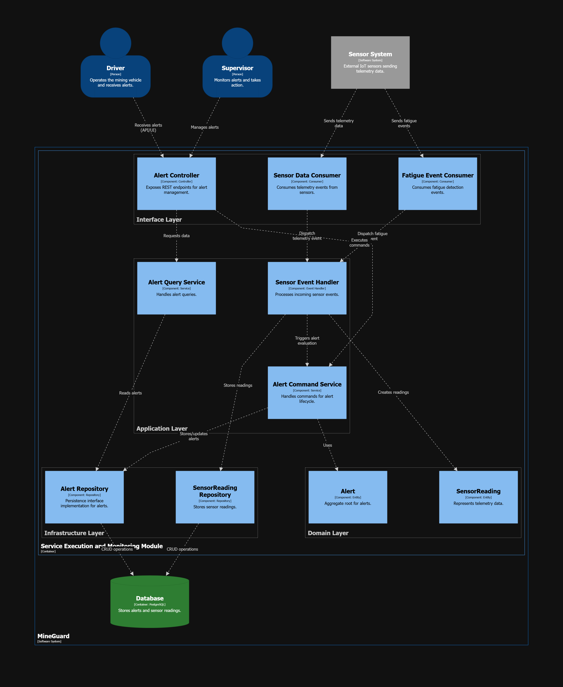
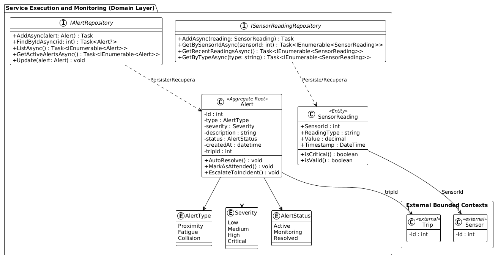
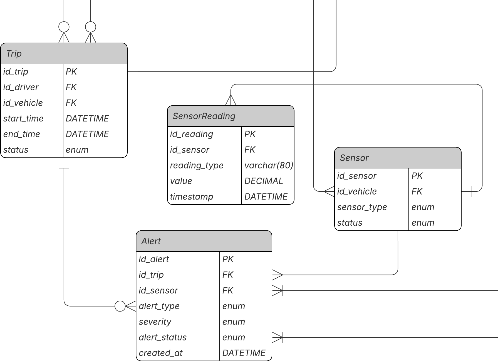

## 4.2.3. Bounded Context: Service Execution and Monitoring

Este bounded context se encarga de monitorear la ejecución de operaciones en tiempo real. Centraliza la ingesta de telemetría proveniente de los sensores IoT, la evaluación de reglas de seguridad (proximidad, colisión, fatiga) y la gestión del ciclo de vida de las alertas críticas generadas para los conductores y supervisores.

### 4.2.3.1. Domain Layer

En esta capa se definen las entidades y reglas de negocio encargadas de reaccionar en tiempo real a los eventos del campo.

**Alert**  

| Nombre | Categoría | Descripción |
| :--- | :--- | :--- |
| Alert | Aggregate Root | Representa una alerta generada a partir del análisis de datos de sensores. Gestiona su ciclo de vida (activa, monitoreo, resuelta). |

- Atributos

| Nombre | Tipo de dato | Visibilidad | Descripción |
| :--- | :--- | :--- | :--- |
| Id | int | private | Identificador único de la alerta. |
| type | enum | private | Tipo de alerta (proximidad, fatiga, colisión). |
| severity | enum | private | Nivel de gravedad (ej. Low, Medium, High, Critical). |
| description | string | private | Detalle de la alerta. |
| alert_status | enum | private | Estado (activa, monitoreo, resuelta). |
| createdAt | datetime | private | Fecha de creación. |
| tripId | int | private | ID del viaje u operación activa (Referencia externa). |

- Métodos

| Nombre | Tipo de dato | Visibilidad | Descripción |
| :--- | :--- | :--- | :--- |
| AutoResolve() | void | Public | Cambia el estado a 'AutoResolved' si el riesgo desaparece (ej. vehículos se separan). |
| MarkAsAttended() | void | Public | Cambia el estado a 'Attended' cuando el supervisor gestiona la alerta. |
| EscalateToIncident() | void | Public | Cambia el estado y notifica al contexto externo para crear un incidente formal. |

**SensorReading**    

| Nombre | Categoría | Descripción |
| :--- | :--- | :--- |
| SensorReading | Entity | Representa una lectura de sensor en tiempo real. |

- Atributos

| Nombre | Tipo de dato | Visibilidad | Descripción |
| :--- | :--- | :--- | :--- |
| SensorId | int | Public | ID del hardware que emite la lectura. |
| ReadingType | string | Public | Tipo de lectura |
| Value | enum | decimal | Valor de la lectura |
| Timestamp | DateTime | Public | Momento exacto de la lectura. |

- Métodos

| Nombre | Tipo de dato | Visibilidad | Descripción |
| :--- | :--- | :--- | :--- |
| isCritical() | boolean | Public | Determina si la lectura supera umbral crítico |
| isValid() | boolean | Public | Valida que la lectura tenga valores correctos |

### 4.2.3.2. Interface Layer

Esta capa se encarga de exponer la lógica del sistema de monitoreo y gestión de alertas hacia el exterior mediante API REST Controllers y Consumers de eventos.

Sus responsabilidades incluyen:

- Recepción y procesamiento de datos provenientes de sensores.
- Validación básica de datos de entrada.
- Exposición de endpoints para la gestión y consulta de alertas.
- Manejo de respuestas y errores a nivel de API.

**Controller: AlertController**

| Nombre          | Categoría  | Descripción                                                              |
| --------------- | ---------- | ------------------------------------------------------------------------ |
| AlertController | Controller | Controlador encargado de gestionar operaciones relacionadas con alertas. |

Attributes

| Nombre             | Tipo de dato       | Visibilidad | Descripción                                 |
| ------------------ | ------------------ | ----------- | ------------------------------------------- |
| _alertService      | IAlertService      | Private     | Maneja la lógica de negocio de alertas.     |
| _alertQueryService | IAlertQueryService | Private     | Maneja consultas de alertas.                |

Endpoints

| Ruta                                   | Método | Descripción                                                       |
| -------------------------------------- | ------ | ----------------------------------------------------------------- |
| /api/v1/monitoring/alert              | GET    | Obtiene todas las alertas registradas.                            |
| /api/v1/monitoring/alert/active       | GET    | Obtiene las alertas activas.                                      |
| /api/v1/monitoring/alert/{id}         | GET    | Obtiene una alerta por su ID.                                     |
| /api/v1/monitoring/alert              | POST   | Crea una nueva alerta.                                            |
| /api/v1/monitoring/alert/{id}/resolve | PUT    | Marca una alerta como resuelta automáticamente.                   |
| /api/v1/monitoring/alert/{id}/attend  | PUT    | Marca una alerta como atendida por el supervisor.                 |

**Consumer: SensorDataConsumer**

| Nombre             | Categoría | Descripción                                                              |
| ------------------ | --------- | ------------------------------------------------------------------------ |
| SensorDataConsumer | Consumer  | Consume eventos de sensores en tiempo real desde un sistema de mensajería. |

Responsabilidades

- Recibir eventos de telemetría de sensores.
- Transformar datos en objetos SensorReading.

**Consumer: FatigueEventConsumer**

| Nombre               | Categoría | Descripción                                                              |
| -------------------- | --------- | ------------------------------------------------------------------------ |
| FatigueEventConsumer | Consumer  | Consume eventos de detección de fatiga del conductor.                   |

Responsabilidades

- Recibir eventos de fatiga.
- Enviar datos al flujo de clasificación de alertas.
- Integrar la fatiga como evento de riesgo.

### 4.2.3.3. Application Layer

En la Application Layer se ubican los servicios que actúan como Command Handlers, Query Handlers y Event Handlers, encargados de coordinar el flujo de procesos de negocio relacionados con el monitoreo en tiempo real y la gestión de alertas. Estos servicios orquestan la lógica utilizando los repositorios definidos en la capa de dominio.

| Nombre               | Categoría                 | Descripción                                                                         |
| -------------------- | ------------------------- | ----------------------------------------------------------------------------------- |
| IAlertCommandService | Command Handler Interface | Expone métodos para manejar comandos que evalúan reglas, crean y actualizan alertas.|

**Commands manejados**
- `EvaluateTelemetryCommand` (Procesa la lectura del sensor y genera una alerta si se rompe una regla).
- `AutoResolveAlertCommand` (Actualiza el estado de la alerta a resuelta si el riesgo desaparece).
- `AttendAlertCommand` (Registra la acción del supervisor al atender la alerta).
- `EscalateAlertCommand` (Cambia el estado de la alerta para iniciar la creación de un incidente).

| Nombre             | Categoría               | Descripción                                                                                |
| ------------------ | ----------------------- | ------------------------------------------------------------------------------------------ |
| IAlertQueryService | Query Handler Interface | Expone métodos para manejar queries que consultan el estado e historial de las alertas.    |

**Queries manejados**
- `GetAllAlertsQuery`
- `GetActiveAlertsQuery`
- `GetAlertByIdQuery`

| Nombre               | Categoría               | Descripción                                                                                 |
| -------------------- | ----------------------- | ------------------------------------------------------------------------------------------- |
| ISensorEventHandler  | Event Handler Interface | Expone métodos para procesar los eventos asíncronos que llegan desde la capa de Interfaces. |

**Events manejados**
- `SensorDataReceivedEvent` (Dispara la evaluación de proximidad o colisión).
- `FatigueDetectedEvent` (Dispara la evaluación y generación de alerta por fatiga).

### 4.2.3.4. Infrastructure Layer

En la Infrastructure Layer se encuentran las implementaciones concretas de los repositorios definidos en la capa de dominio, así como los componentes que permiten la integración con sistemas externos como bases de datos. Esta capa es responsable de la persistencia de datos y de la comunicación con fuentes externas de eventos (sensores IoT).

| Nombre                     | Categoría                 | Implementa                 | Descripción                                                                 |
| -------------------------- | ------------------------- | -------------------------- | --------------------------------------------------------------------------- |
| AlertRepositoryImpl        | Repository Implementation | IAlertRepository           | Gestiona la persistencia de las entidades Alert en la base de datos.       |

Funcionalidad clave

- Task AddAsync(Alert alert) → Registra una nueva alerta.
- Task<Alert?> FindByIdAsync(int id) → Busca una alerta por ID.
- Task<IEnumerable<Alert>> ListAsync() → Obtiene todas las alertas.
- Task<IEnumerable<Alert>> GetActiveAlertsAsync() → Obtiene alertas activas.
- void Update(Alert alert) → Actualiza el estado de una alerta.

| Nombre                          | Categoría                 | Implementa                      | Descripción                                                                 |
| ------------------------------- | ------------------------- | ------------------------------- | --------------------------------------------------------------------------- |
| SensorReadingRepositoryImpl     | Repository Implementation | ISensorReadingRepository        | Gestiona la persistencia de lecturas de sensores para análisis histórico.  |

Funcionalidad clave

- Task AddAsync(SensorReading reading) → Registra una lectura de sensor.
- Task<IEnumerable<SensorReading>> GetBySensorIdAsync(int sensorId) → Obtiene lecturas por sensor.
- Task<IEnumerable<SensorReading>> GetRecentReadingsAsync() → Obtiene lecturas recientes.
- Task<IEnumerable<SensorReading>> GetByTypeAsync(string type) → Filtra lecturas por tipo.

| Nombre                 | Categoría            | Implementa | Descripción                                                                 |
| ---------------------- | -------------------- | ---------- | --------------------------------------------------------------------------- |
| DatabaseContext        | Persistence Context  | -          | Contexto de base de datos que gestiona la conexión y mapeo ORM de entidades. |

Responsabilidades

- Configurar entidades (Alert, SensorReading).
- Gestionar conexión a la base de datos.
- Aplicar migraciones y configuración ORM.

### 4.2.3.5. Bounded Context Software Architecture Component Level Diagrams.

### 4.2.3.6. Bounded Context Software Architecture Code Level Diagrams.

#### 4.2.3.6.1. Bounded Context Domain Layer Class Diagrams.
El siguiente diagrama UML representa las entidades del dominio, sus atributos, métodos, enumeraciones y relaciones. El agregado principal es Alert, que encapsula el comportamiento del sistema de alertas, mientras que SensorReading actúa como entidad de soporte para la evaluación de condiciones.

#### 4.2.3.6.2. Bounded Context Database Design Diagram.

