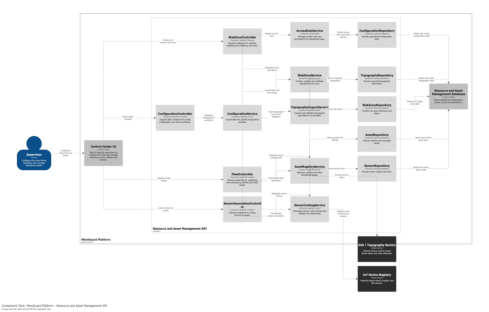
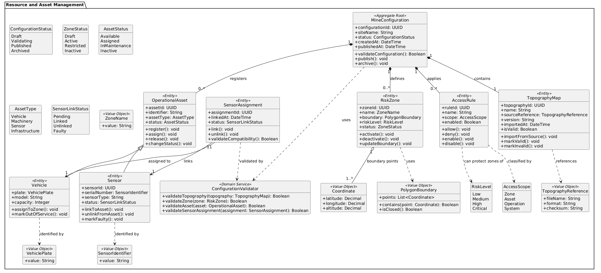
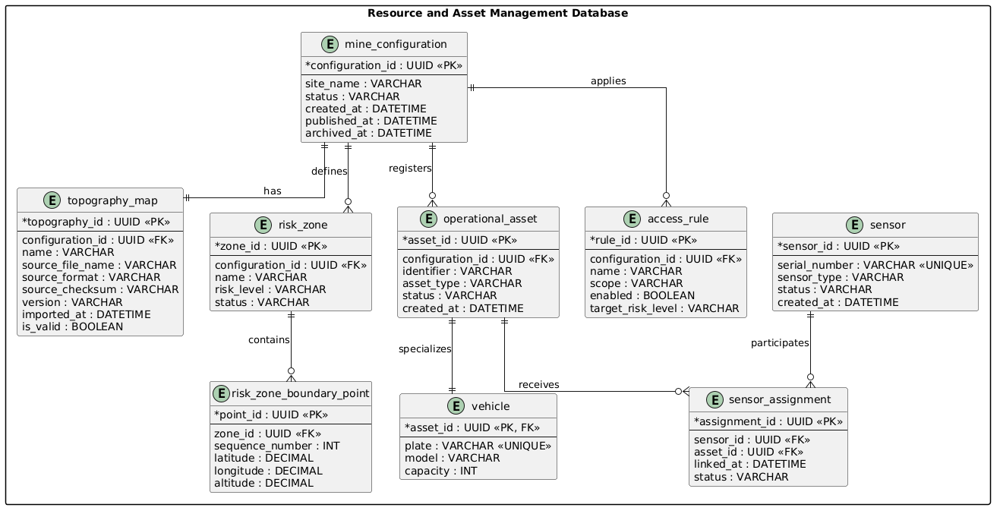

## 4.2.6. Bounded Context: Resource and Asset Management

En este bounded context se gestionan los recursos y activos operativos de MineGuard, permitiendo administrar la información de la topografía, las zonas de riesgo, la flota de vehículos y los sensores IoT asociados a la operación. Su finalidad es mantener una configuración confiable y consistente antes y durante el despliegue operativo, de modo que el contexto de ejecución pueda consumir datos válidos para el monitoreo en tiempo real.

### 4.2.6.1. Domain Layer

El Domain Layer del bounded context Resource and Asset Management modela el núcleo del negocio relacionado con la administración de recursos físicos y lógicos del sistema. Este contexto permite registrar activos, validar su consistencia, asociarlos entre sí y mantener la información necesaria para que otros bounded contexts, especialmente Service Execution and Monitoring, operen con una base confiable.

Se implementa un aggregate principal: **OperationalAssetRegistry**. Este agregado centraliza la administración de topografía, zonas de riesgo, vehículos y sensores, garantizando que las asignaciones y configuraciones se mantengan coherentes dentro del dominio.

También se definen entidades como **TopographyMap**, **RiskZone**, **VehicleAsset**, **SensorAsset** y **AssetAssignment**, las cuales representan los recursos gestionados por el sistema. Además, se utilizan value objects como **AssetType**, **AssetStatus**, **ZoneType**, **GeoCoordinate** y **ConnectionStatus**, que permiten clasificar los activos y validar sus estados operativos.

Las reglas de negocio y validaciones se manejan mediante servicios de dominio como **AssetValidationService**, **ConfigurationConsistencyService** y **ResourcePublishingService**, que aseguran que la configuración registrada sea consistente antes de ser publicada hacia los demás contextos.

**Aggregate: OperationalAssetRegistry**

Descripción:
Agregado raíz que gestiona la información consolidada de recursos y activos operativos de la mina, permitiendo agrupar mapas, zonas de riesgo, vehículos, sensores y sus asignaciones.

| Entity | Atributo | Tipo | Descripción |
| ------ | -------- | ---- | ----------- |
| OperationalAssetRegistry | registryId | Long | Identificador único del registro de activos |
| OperationalAssetRegistry | ownerId | Long | Identificador del supervisor o usuario responsable |
| OperationalAssetRegistry | createdAt | Date | Fecha de creación del registro |
| OperationalAssetRegistry | topographyMap | TopographyMap | Mapa topográfico asociado |
| OperationalAssetRegistry | riskZones | List<RiskZone> | Lista de zonas de riesgo registradas |
| OperationalAssetRegistry | vehicles | List<VehicleAsset> | Lista de vehículos administrados |
| OperationalAssetRegistry | sensors | List<SensorAsset> | Lista de sensores IoT administrados |

**Entity: TopographyMap**

Descripción:
Entidad que representa la configuración topográfica importada al sistema, incluyendo versiones, estado de validación y metadatos de la mina.

| Atributo | Tipo | Descripción |
| -------- | ---- | ----------- |
| mapId | Long | Identificador único del mapa |
| fileName | String | Nombre del archivo importado |
| version | String | Versión del mapa registrado |
| source | String | Origen de la topografía |
| importedAt | Date | Fecha de importación |
| status | AssetStatus | Estado del mapa |

**Entity: RiskZone**

Descripción:
Entidad que representa una zona de riesgo definida sobre la topografía, utilizada para advertir áreas críticas o restringidas.

| Atributo | Tipo | Descripción |
| -------- | ---- | ----------- |
| zoneId | Long | Identificador único de la zona |
| name | String | Nombre descriptivo de la zona |
| geometry | String | Geometría o polígono de la zona |
| zoneType | ZoneType | Tipo de zona de riesgo |
| severity | String | Nivel de severidad asociado |
| isActive | Boolean | Indica si la zona está activa |

**Entity: VehicleAsset**

Descripción:
Entidad que representa un vehículo operativo registrado en la flota de la mina.

| Atributo | Tipo | Descripción |
| -------- | ---- | ----------- |
| vehicleId | Long | Identificador único del vehículo |
| plateNumber | String | Placa o identificador operativo |
| vehicleType | AssetType | Tipo de vehículo |
| brand | String | Marca del vehículo |
| model | String | Modelo del vehículo |
| status | AssetStatus | Estado operativo |

**Entity: SensorAsset**

Descripción:
Entidad que representa un sensor IoT registrado y vinculado a la operación minera.

| Atributo | Tipo | Descripción |
| -------- | ---- | ----------- |
| sensorId | Long | Identificador único del sensor |
| serialNumber | String | Número de serie del dispositivo |
| sensorType | AssetType | Tipo de sensor |
| location | GeoCoordinate | Ubicación asignada |
| connectivityStatus | ConnectionStatus | Estado de conectividad |
| status | AssetStatus | Estado operativo |

**Entity: AssetAssignment**

Descripción:
Entidad que representa la asociación entre un activo y su destino operativo, por ejemplo la vinculación de un sensor a un vehículo o la asignación de una zona a una ruta.

| Atributo | Tipo | Descripción |
| -------- | ---- | ----------- |
| assignmentId | Long | Identificador de la asignación |
| assetId | Long | Identificador del activo |
| targetType | String | Tipo de destino de la asignación |
| targetId | Long | Identificador del destino |
| assignedAt | Date | Fecha de asignación |

**ValueObject: AssetType**

Descripción:
Objeto de valor que representa la clasificación funcional del activo.

| Atributo | Tipo | Descripción |
| -------- | ---- | ----------- |
| name | String | Nombre del tipo de activo |
| description | String | Descripción del tipo de activo |

Valores:
VEHICLE, SENSOR, MAP, ZONE, RESOURCE

**ValueObject: AssetStatus**

Descripción:
Objeto de valor que representa el estado operativo del activo.

| Atributo | Tipo | Descripción |
| -------- | ---- | ----------- |
| statusName | String | Nombre del estado |
| priority | int | Prioridad o relevancia del estado |

Valores:
PENDING, VALIDATED, ACTIVE, INACTIVE, RETIRED

**ValueObject: ZoneType**

Descripción:
Objeto de valor que representa el tipo de zona definida en la operación.

| Atributo | Tipo | Descripción |
| -------- | ---- | ----------- |
| typeName | String | Nombre del tipo de zona |
| description | String | Descripción de la zona |

Valores:
RISK, RESTRICTED, CONTROLLED, ROUTE_BUFFER

**ValueObject: GeoCoordinate**

Descripción:
Objeto de valor que representa una ubicación geográfica dentro de la mina.

| Atributo | Tipo | Descripción |
| -------- | ---- | ----------- |
| latitude | Decimal | Latitud |
| longitude | Decimal | Longitud |
| altitude | Decimal | Altitud |

Valores:
Coordenadas válidas dentro del polígono de operación.

**ValueObject: ConnectionStatus**

Descripción:
Objeto de valor que representa el estado de conectividad de un sensor IoT.

| Atributo | Tipo | Descripción |
| -------- | ---- | ----------- |
| status | String | Estado de conectividad |
| lastSeenAt | Date | Última vez que se reportó actividad |

Valores:
ONLINE, OFFLINE, DEGRADED, UNKNOWN

**Domain Services**

| Nombre | Responsabilidad | Reglas Aplicadas y Métodos |
| ------ | -------------- | -------------------------- |
| AssetValidationService | Validar la integridad de los activos registrados. | Verifica que placas, seriales, coordenadas y estados cumplan con las reglas del dominio. |
| ConfigurationConsistencyService | Garantizar que la configuración sea coherente. | Valida relaciones entre mapas, zonas, vehículos y sensores antes de publicar. |
| ResourcePublishingService | Publicar la configuración operativa a otros contextos. | Emite eventos o comandos hacia Service Execution and Monitoring cuando la configuración es aprobada. |

### 4.2.6.2. Interface Layer

La Interface Layer del bounded context Resource and Asset Management actúa como punto de entrada entre el usuario supervisor y la lógica del sistema. Su función principal es recibir solicitudes desde la aplicación web, validar los datos básicos y enviarlos a los servicios correspondientes.

Esta capa permite registrar mapas topográficos, crear zonas de riesgo, administrar vehículos y sensores, y publicar la configuración operativa para su consumo por otros bounded contexts. Además, responde en formato JSON y utiliza códigos HTTP adecuados según el resultado de cada solicitud.

**ResourceAssetController**

| Nombre | Método | Ruta | Descripción |
| ------ | ------ | ---- | ----------- |
| uploadTopographyMap | POST | /api/v1/resources/topography/maps | Importa un nuevo mapa topográfico al sistema. |
| getTopographyMapById | GET | /api/v1/resources/topography/maps/{mapId} | Obtiene un mapa topográfico por su identificador. |
| createRiskZone | POST | /api/v1/resources/zones | Registra una nueva zona de riesgo. |
| updateRiskZone | PUT | /api/v1/resources/zones/{zoneId} | Actualiza la información de una zona de riesgo. |
| getRiskZonesByMapId | GET | /api/v1/resources/topography/maps/{mapId}/zones | Lista las zonas asociadas a un mapa. |
| registerVehicleAsset | POST | /api/v1/resources/vehicles | Registra un vehículo dentro de la flota operativa. |
| updateVehicleAsset | PUT | /api/v1/resources/vehicles/{vehicleId} | Actualiza la información de un vehículo registrado. |
| registerSensorAsset | POST | /api/v1/resources/sensors | Registra un sensor IoT en el sistema. |
| updateSensorAsset | PUT | /api/v1/resources/sensors/{sensorId} | Actualiza la información de un sensor registrado. |
| assignSensorToVehicle | POST | /api/v1/resources/assignments/sensors/vehicle | Asocia un sensor a un vehículo operativo. |
| publishOperationalConfiguration | POST | /api/v1/resources/configuration/publish | Publica la configuración operativa validada hacia otros contextos. |
| getOperationalRegistry | GET | /api/v1/resources/registry/{registryId} | Obtiene el registro consolidado de activos y recursos. |

### 4.2.6.3. Application Layer.

La Application Layer del bounded context Resource and Asset Management gestiona los flujos de negocio relacionados con el registro de activos, la validación de configuraciones y la publicación de recursos operativos. Esta capa orquesta las solicitudes recibidas desde el controller y las transforma en comandos o procesos ejecutados por los servicios correspondientes.

**Command Handlers**

| Capability | Command Handler | Descripción |
| ---------- | --------------- | ----------- |
| Importar topografía | ImportTopographyMapCommandHandler | Gestiona la importación y normalización de mapas topográficos. |
| Registrar vehículo | RegisterVehicleAssetCommandHandler | Ejecuta el registro de nuevos vehículos en la flota. |
| Registrar sensor | RegisterSensorAssetCommandHandler | Ejecuta el registro de sensores IoT en el sistema. |
| Definir zona de riesgo | CreateRiskZoneCommandHandler | Gestiona la creación de zonas de riesgo sobre la topografía. |
| Actualizar zona de riesgo | UpdateRiskZoneCommandHandler | Coordina la modificación de zonas existentes. |
| Asignar sensor a vehículo | AssignSensorToVehicleCommandHandler | Vincula un sensor con un vehículo operativo. |
| Publicar configuración operativa | PublishOperationalConfigurationCommandHandler | Valida la consistencia del registro y publica la configuración hacia otros contextos. |
| Actualizar estado de activo | UpdateAssetStatusCommandHandler | Cambia el estado operativo de un recurso o activo. |

**Event Handlers**

| Capability | Event Handler | Descripción |
| ---------- | ------------- | ----------- |
| Topografía importada | TopographyImportedEventHandler | Reacciona cuando un mapa ha sido cargado correctamente. |
| Zona de riesgo creada | RiskZoneCreatedEventHandler | Actualiza el estado interno cuando se registra una nueva zona. |
| Sensor asignado | SensorAssignedToVehicleEventHandler | Sincroniza la asignación entre sensor y vehículo. |
| Configuración publicada | OperationalConfigurationPublishedEventHandler | Notifica a otros contextos que la configuración ha sido validada y publicada. |

### 4.2.6.4. Infrastructure Layer

La Infrastructure Layer del bounded context Resource and Asset Management se encarga de implementar las dependencias técnicas necesarias para el funcionamiento del sistema. Principalmente gestiona el acceso a la base de datos mediante repositorios y la comunicación con otros bounded contexts como Service Execution and Monitoring.

Esta capa permite almacenar mapas, zonas, activos, asignaciones y estados de configuración. Además, facilita la integración con otros módulos para mantener sincronizada la información entre la planificación y la ejecución operativa.

**TopographyMapRepository**

| Método | Descripción |
| ------ | ----------- |
| save | Guarda un mapa topográfico. |
| findById | Busca un mapa por su identificador. |
| findLatestVersion | Obtiene la última versión registrada. |
| findBySource | Busca mapas por su fuente de origen. |

**RiskZoneRepository**

| Método | Descripción |
| ------ | ----------- |
| save | Guarda una zona de riesgo. |
| findById | Busca una zona por su identificador. |
| findAllByMapId | Obtiene todas las zonas asociadas a un mapa. |
| findActiveZones | Recupera las zonas activas. |

**VehicleAssetRepository**

| Método | Descripción |
| ------ | ----------- |
| save | Guarda un vehículo registrado. |
| findById | Busca un vehículo por su identificador. |
| findByPlateNumber | Busca un vehículo por su placa. |
| findAllActive | Recupera los vehículos activos. |

**SensorAssetRepository**

| Método | Descripción |
| ------ | ----------- |
| save | Guarda un sensor IoT registrado. |
| findById | Busca un sensor por su identificador. |
| findBySerialNumber | Busca un sensor por su número de serie. |
| findAllByStatus | Recupera los sensores por estado. |

**OperationalAssetRegistryRepository**

| Método | Descripción |
| ------ | ----------- |
| save | Guarda el registro consolidado de activos. |
| findById | Busca un registro por su identificador. |
| findByOwnerId | Obtiene el registro asociado a un responsable. |
| findLatestRegistry | Recupera el registro operativo más reciente. |

**ConfigurationEventPublisher**

| Método | Descripción |
| ------ | ----------- |
| publishTopographyImported | Publica eventos cuando se importa un mapa. |
| publishRiskZoneCreated | Publica eventos cuando se crea una zona de riesgo. |
| publishSensorAssigned | Publica eventos cuando se asigna un sensor a un vehículo. |
| publishConfigurationPublished | Publica eventos cuando la configuración operativa es validada. |

### 4.2.6.5. Bounded Context Software Architecture Component Level Diagrams.

El diagrama de componentes muestra cómo el bounded context Resource and Asset Management se organiza internamente en torno a un ResourceAssetController, servicios de aplicación y repositorios.

El ResourceAssetController recibe solicitudes HTTP desde la aplicación de administración operativa. Luego invoca servicios como AssetValidationService, ConfigurationConsistencyService y ResourcePublishingService, los cuales se encargan de validar activos, asegurar consistencia y publicar la configuración.

Cada servicio utiliza su respectivo repositorio para acceder a la persistencia de datos. Los repositorios se comunican con la base de datos MySQL, donde se almacenan mapas topográficos, zonas de riesgo, vehículos, sensores y asignaciones.

Además, este bounded context se relaciona con Service Execution and Monitoring, del cual comparte estructuras para mantener sincronizada la información de flota, sensores y zonas operativas.

### 4.2.6.6. Bounded Context Software Architecture Code Level Diagrams

#### 4.2.6.6.1. Bounded Context Domain Layer Class Diagrams

El diagrama de clases del bounded context Resource and Asset Management representa la estructura principal del dominio. Se identifica el agregado OperationalAssetRegistry, el cual agrupa mapas, zonas, vehículos, sensores y asignaciones para mantener una configuración operativa consistente.

La entidad TopographyMap representa el mapa importado desde las fuentes de planificación. La entidad RiskZone modela las zonas críticas o restringidas definidas sobre dicho mapa. VehicleAsset y SensorAsset representan los activos físicos registrados en la operación, mientras que AssetAssignment modela la vinculación entre sensores, vehículos y otros recursos.

También se incluyen value objects como AssetType, AssetStatus, ZoneType, GeoCoordinate y ConnectionStatus, que permiten clasificar activos, ubicar elementos geográficos y validar conectividad.

Las relaciones principales del diagrama muestran que OperationalAssetRegistry contiene múltiples mapas, zonas, vehículos, sensores y asignaciones. Además, SensorAsset depende de ConnectionStatus y GeoCoordinate, mientras que RiskZone depende de ZoneType y de la geometría definida sobre la topografía.

#### 4.2.6.6.2. Bounded Context Database Design Diagram

El modelo entidad-relación correspondiente al bounded context Resource and Asset Management se relaciona con tablas como OperationalAssetRegistry, TopographyMaps, RiskZones, Vehicles, Sensors y AssetAssignments.

La tabla OperationalAssetRegistry almacena el registro consolidado de recursos y activos operativos. Contiene atributos como registry_id, owner_id, created_at y status, además de relacionarse con los mapas, vehículos y sensores administrados.

La tabla TopographyMaps almacena versiones del mapa topográfico importado. Incluye atributos como map_id, file_name, version, source, imported_at y status, permitiendo mantener un historial de configuración de la mina.

La tabla RiskZones registra las áreas restringidas o de riesgo definidas sobre la topografía. Incluye atributos como zone_id, map_id, name, zone_type, severity, geometry y is_active.

Las tablas Vehicles y Sensors almacenan la información de la flota operativa y de los dispositivos IoT, incluyendo su estado, identificadores y metadatos relevantes para la ejecución operativa. Finalmente, AssetAssignments vincula sensores y vehículos con otros recursos del dominio.

En conjunto, este submodelo permite mantener una base de datos coherente para la preparación operativa, la validación de configuración y la sincronización con el contexto de ejecución.

