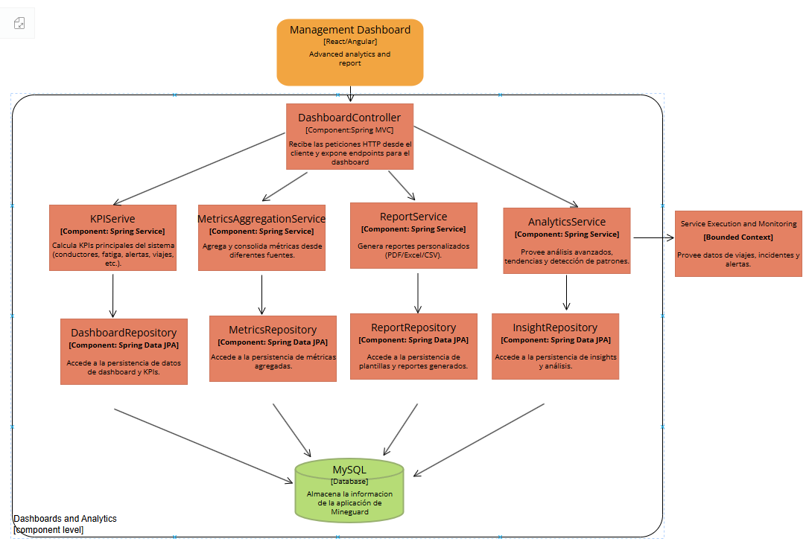
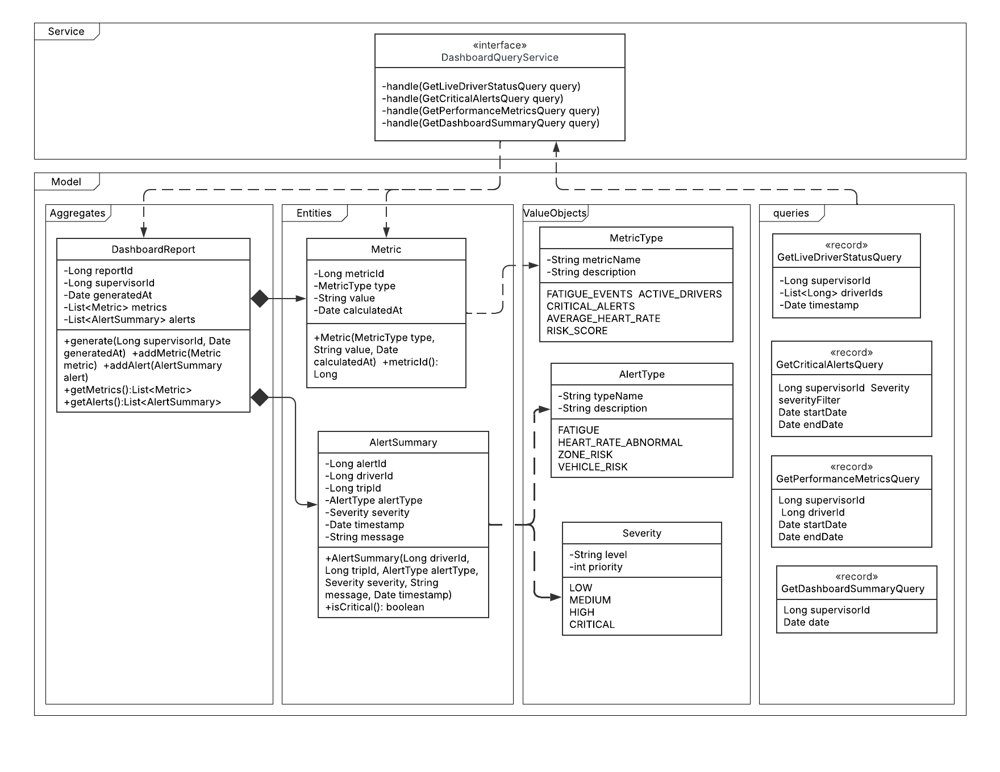
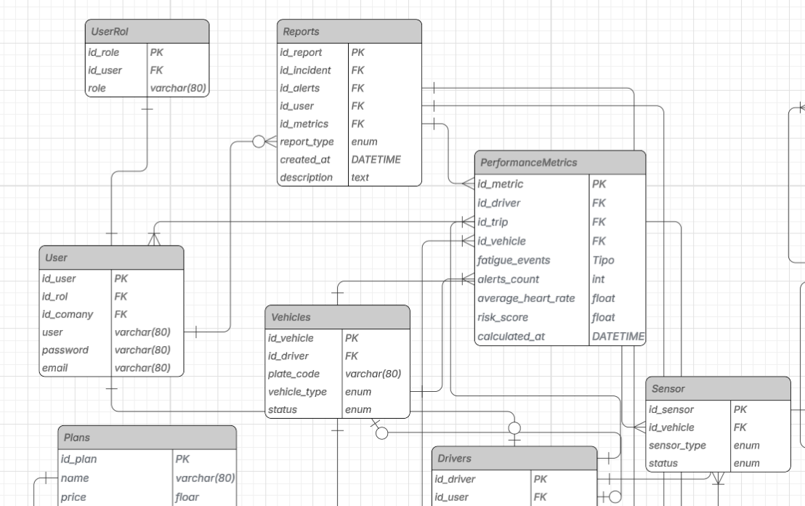

## 4.2.7. Bounded Context: Dashboard and Analytics
### 4.2.7.1. Domain Layer.

El Domain Layer en el bounded context Dashboard and Analytics modela el núcleo del negocio relacionado con la visualización de métricas, KPIs, reportes y alertas del sistema MineGuard. Este contexto permite que los supervisores consulten el estado en tiempo real de los conductores, revisen alertas críticas, analicen métricas de desempeño y generen reportes para la toma de decisiones.

Se implementa un aggregate principal: DashboardReport. Este agregado agrupa la información generada para el dashboard, incluyendo métricas, alertas y reportes relacionados con el desempeño de conductores, vehículos y viajes.

También se definen entidades como Metric y AlertSummary, las cuales representan los datos analíticos del sistema. Además, se utilizan value objects como MetricType, AlertType y Severity, que permiten clasificar las métricas, tipos de alerta y niveles de severidad.

Las reglas de negocio y consultas se manejan mediante el servicio DashboardQueryService, que procesa consultas como GetLiveDriverStatusQuery, GetCriticalAlertsQuery, GetPerformanceMetricsQuery y GetDashboardSummaryQuery.

**Aggregate: DashboardReport**

Descripción:
Agregado raíz que gestiona la información consolidada del dashboard, permitiendo agrupar métricas, alertas y reportes para que el supervisor pueda visualizar el estado operativo del sistema.

| Entity          | Atributo     | Tipo               | Descripción                                            |
| --------------- | ------------ | ------------------ | ------------------------------------------------------ |
| DashboardReport | reportId     | Long               | Identificador único del reporte                        |
| DashboardReport | supervisorId | Long               | Identificador del supervisor que consulta el dashboard |
| DashboardReport | generatedAt  | Date               | Fecha de generación del reporte                        |
| DashboardReport | metrics      | List<Metric>       | Lista de métricas asociadas al reporte                 |
| DashboardReport | alerts       | List<AlertSummary> | Lista de alertas resumidas asociadas al reporte        |

**Entity: Metric**

Descripción:
Entidad que representa una métrica calculada por el sistema, como eventos de fatiga, conductores activos, alertas críticas, frecuencia cardíaca promedio o nivel de riesgo.

| Atributo     | Tipo       | Descripción                           |
| ------------ | ---------- | ------------------------------------- |
| metricId     | Long       | Identificador único de la métrica     |
| type         | MetricType | Tipo de métrica registrada            |
| value        | String     | Valor calculado de la métrica         |
| calculatedAt | Date       | Fecha en la que se calculó la métrica |

Entity: AlertSummary

Descripción:
Entidad que representa el resumen de una alerta detectada durante la operación, asociada a un conductor y viaje específico.

| Atributo  | Tipo      | Descripción                             |
| --------- | --------- | --------------------------------------- |
| alertId   | Long      | Identificador único de la alerta        |
| driverId  | Long      | Identificador del conductor relacionado |
| tripId    | Long      | Identificador del viaje relacionado     |
| alertType | AlertType | Tipo de alerta detectada                |
| severity  | Severity  | Nivel de severidad de la alerta         |
| timestamp | Date      | Fecha y hora en que ocurrió la alerta   |
| message   | String    | Mensaje descriptivo de la alerta        |

**ValueObject: MetricType**

Descripción:
Objeto de valor que representa los tipos de métricas que pueden ser calculadas por el dashboard.
| Atributo    | Tipo   | Descripción               |
| ----------- | ------ | ------------------------- |
| metricName  | String | Nombre de la métrica      |
| description | String | Descripción de la métrica |

Valores:
FATIGUE_EVENTS, ACTIVE_DRIVERS, CRITICAL_ALERTS, AVERAGE_HEART_RATE, RISK_SCORE

**ValueObject: AlertType**

Descripción:
Objeto de valor que representa los tipos de alertas que pueden ser analizadas por el sistema.

| Atributo    | Tipo   | Descripción                    |
| ----------- | ------ | ------------------------------ |
| typeName    | String | Nombre del tipo de alerta      |
| description | String | Descripción del tipo de alerta |

Valores:
FATIGUE, HEART_RATE_ABNORMAL, ZONE_RISK, VEHICLE_RISK

ValueObject: Severity

Descripción:
Objeto de valor que representa el nivel de gravedad de una alerta.

| Atributo | Tipo   | Descripción                 |
| -------- | ------ | --------------------------- |
| level    | String | Nivel de severidad          |
| priority | int    | Prioridad asociada al nivel |

Valores:
LOW, MEDIUM, HIGH, CRITICAL

**Domain Services**

| Nombre                    | Responsabilidad                                    | Reglas Aplicadas y Métodos                                                                                                             |
| ------------------------- | -------------------------------------------------- | -------------------------------------------------------------------------------------------------------------------------------------- |
| DashboardQueryService     | Gestionar las consultas del dashboard y analytics. | Permite consultar estado en vivo, alertas críticas, métricas de desempeño y resumen del dashboard sin modificar el estado del dominio. |
| KPIService                | Calcular los KPIs principales del sistema.         | Calcula indicadores como eventos de fatiga, conductores activos, alertas críticas, ritmo cardíaco promedio y nivel de riesgo.          |
| AnalyticsService          | Analizar tendencias y patrones del sistema.        | Procesa información histórica para detectar comportamientos, riesgos y patrones operativos.                                            |
| MetricsAggregationService | Consolidar métricas desde distintas fuentes.       | Agrupa datos provenientes de viajes, alertas, conductores, sensores y vehículos.                                                       |
| ReportService             | Generar reportes personalizados.                   | Genera reportes en formatos como PDF, Excel o CSV.                                                                                     |

### 4.2.7.2. Interface Layer.

La Interface Layer del bounded context Dashboard and Analytics actúa como punto de entrada entre el usuario supervisor y la lógica del sistema. Su función principal es recibir solicitudes HTTP desde el Management Dashboard, validar los datos básicos y enviarlos a los servicios correspondientes.

Esta capa permite consultar métricas, KPIs, alertas, reportes e información en tiempo real. Además, responde en formato JSON y utiliza códigos HTTP adecuados según el resultado de cada solicitud.

**DashboardController**

| Nombre                | Método | Ruta                                  | Descripción                                                       |
| --------------------- | ------ | ------------------------------------- | ----------------------------------------------------------------- |
| getDashboardSummary   | GET    | /api/v1/dashboard/summary             | Obtiene un resumen general del dashboard.                         |
| getLiveDriverStatus   | GET    | /api/v1/dashboard/drivers/live-status | Obtiene el estado en tiempo real de los conductores.              |
| getCriticalAlerts     | GET    | /api/v1/dashboard/alerts/critical     | Obtiene las alertas críticas registradas.                         |
| getPerformanceMetrics | GET    | /api/v1/dashboard/metrics/performance | Obtiene métricas de desempeño de conductores, viajes y vehículos. |
| generateReport        | POST   | /api/v1/dashboard/reports             | Genera un reporte personalizado.                                  |
| getReportById         | GET    | /api/v1/dashboard/reports/{reportId}  | Obtiene un reporte específico por su ID.                          |

### 4.2.7.3. Application Layer.

La Application Layer del bounded context Dashboard and Analytics gestiona los flujos de negocio relacionados con la consulta de métricas, generación de reportes, cálculo de KPIs y análisis de datos. Esta capa orquesta las solicitudes recibidas desde el controller y las transforma en consultas o acciones procesadas por los servicios correspondientes.

**Query Handlers**

| Capability                      | Query Handler                                            | Descripción                                                                                            |
| ------------------------------- | -------------------------------------------------------- | ------------------------------------------------------------------------------------------------------ |
| Consultar estado en vivo        | DashboardQueryService.handle(GetLiveDriverStatusQuery)   | Obtiene el estado actual de los conductores, incluyendo estado, frecuencia cardíaca, fatiga y alertas. |
| Consultar alertas críticas      | DashboardQueryService.handle(GetCriticalAlertsQuery)     | Obtiene las alertas críticas filtradas por supervisor, severidad y rango de fechas.                    |
| Consultar métricas de desempeño | DashboardQueryService.handle(GetPerformanceMetricsQuery) | Obtiene métricas relacionadas con desempeño, riesgo, fatiga y viajes.                                  |
| Consultar resumen del dashboard | DashboardQueryService.handle(GetDashboardSummaryQuery)   | Genera una vista resumida del estado general del sistema.                                              |
                    |

**Application Services**

| Service                   | Descripción                                                                                          |
| ------------------------- | ---------------------------------------------------------------------------------------------------- |
| KPIService                | Calcula KPIs principales como eventos de fatiga, conductores activos, alertas críticas y risk score. |
| MetricsAggregationService | Consolida métricas provenientes de diferentes bounded contexts.                                      |
| ReportService             | Genera reportes personalizados en PDF, Excel o CSV.                                                  |
| AnalyticsService          | Analiza datos históricos y actuales para detectar tendencias y patrones.                             |

**Event Handlers**

| Capability                      | Event Handler                     | Descripción                                                                                              |
| ------------------------------- | --------------------------------- | -------------------------------------------------------------------------------------------------------- |
| Estado de conductor actualizado | DriverStatusUpdatedEventHandler   | Procesa eventos de actualización del estado del conductor enviados por Service Execution and Monitoring. |
| Fatiga detectada                | FatigueDetectedEventHandler       | Procesa eventos de fatiga detectada y actualiza las métricas del dashboard.                              |
| Alerta crítica registrada       | CriticalAlertDetectedEventHandler | Actualiza los indicadores de alertas críticas del sistema.                                               |
| Métrica calculada               | MetricCalculatedEventHandler      | Registra nuevas métricas calculadas para su visualización posterior.                                     |
| Reporte generado                | ReportGeneratedEventHandler       | Registra la generación de reportes y permite su consulta desde el dashboard.                             |

### 4.2.7.4. Infrastructure Layer.

La Infrastructure Layer del bounded context Dashboard and Analytics se encarga de implementar las dependencias técnicas necesarias para el funcionamiento del sistema. Principalmente gestiona el acceso a la base de datos mediante Spring Data JPA y la comunicación con otros bounded contexts como Service Execution and Monitoring.

Esta capa permite almacenar métricas, reportes, KPIs e insights generados por el sistema. Además, facilita la integración con otros módulos para obtener datos de conductores, viajes, incidentes, alertas, vehículos y sensores.

**DashboardRepository**

| Método             | Descripción                                                  |
| ------------------ | ------------------------------------------------------------ |
| save               | Guarda información consolidada del dashboard.                |
| findById           | Busca un registro del dashboard por su identificador.        |
| findBySupervisorId | Recupera información del dashboard asociada a un supervisor. |
| findLatestSummary  | Obtiene el resumen más reciente del dashboard.               |

**MetricsRepository**

| Método          | Descripción                                           |
| --------------- | ----------------------------------------------------- |
| save            | Guarda una métrica calculada.                         |
| findById        | Busca una métrica por su identificador.               |
| findAll         | Recupera todas las métricas registradas.              |
| findByDriverId  | Obtiene métricas asociadas a un conductor específico. |
| findByDateRange | Recupera métricas dentro de un rango de fechas.       |

**ReportRepository**

| Método             | Descripción                                    |
| ------------------ | ---------------------------------------------- |
| save               | Guarda un reporte generado.                    |
| findById           | Busca un reporte por su identificador.         |
| findAll            | Recupera todos los reportes generados.         |
| findBySupervisorId | Recupera reportes generados por un supervisor. |

**InsightRepository**

| Método          | Descripción                                           |
| --------------- | ----------------------------------------------------- |
| save            | Guarda insights o análisis generados.                 |
| findById        | Busca un insight por su identificador.                |
| findAll         | Recupera todos los insights almacenados.              |
| findByRiskLevel | Recupera insights asociados a cierto nivel de riesgo. |

### 4.2.7.5. Bounded Context Software Architecture Component Level Diagrams.

El diagrama de componentes muestra cómo el bounded context Dashboard and Analytics se organiza internamente en torno a un DashboardController, servicios de aplicación y repositorios.

El DashboardController recibe solicitudes HTTP desde el Management Dashboard desarrollado en React/Angular. Luego invoca servicios como KPIService, MetricsAggregationService, ReportService y AnalyticsService, los cuales se encargan de calcular KPIs, consolidar métricas, generar reportes y analizar tendencias.

Cada servicio utiliza su respectivo repositorio para acceder a la persistencia de datos. Los repositorios se comunican con la base de datos MySQL, donde se almacenan métricas, reportes, alertas, insights e información utilizada por el dashboard.

Además, este bounded context se relaciona con Service Execution and Monitoring, del cual obtiene datos de viajes, incidentes y alertas para procesarlos y mostrarlos al supervisor.

### 4.2.7.6. Bounded Context Software Architecture Code Level Diagrams.
#### 4.2.7.6.1. Bounded Context Domain Layer Class Diagrams.

El diagrama de clases del bounded context Dashboard and Analytics representa la estructura principal del dominio. Se identifica el agregado DashboardReport, el cual agrupa métricas y alertas resumidas para generar información útil para el supervisor.

La entidad Metric representa una métrica calculada del sistema, como eventos de fatiga, conductores activos, alertas críticas, ritmo cardíaco promedio o nivel de riesgo. Esta entidad se relaciona con el value object MetricType, que clasifica el tipo de métrica.

La entidad AlertSummary representa una alerta resumida asociada a un conductor y viaje específico. Esta entidad utiliza los value objects AlertType y Severity, que permiten clasificar el tipo de alerta y su nivel de gravedad.

También se incluyen queries como GetLiveDriverStatusQuery, GetCriticalAlertsQuery, GetPerformanceMetricsQuery y GetDashboardSummaryQuery, las cuales permiten consultar información del dashboard sin modificar el estado del dominio.

Las relaciones principales del diagrama muestran que DashboardReport contiene múltiples métricas y múltiples alertas. Además, Metric depende de MetricType, mientras que AlertSummary depende de AlertType y Severity.

#### 4.2.7.6.2. Bounded Context Database Design Diagram.

El modelo entidad-relación correspondiente al bounded context Dashboard and Analytics se relaciona con tablas como Reports y PerformanceMetrics.

La tabla Reports almacena los reportes generados por el sistema. Contiene atributos como id_report, id_incident, id_alerts, id_user, id_metrics, report_type, created_at y description. Esta entidad permite registrar los reportes generados para supervisores y usuarios del sistema.

La tabla PerformanceMetrics almacena métricas de desempeño relacionadas con conductores, viajes y vehículos. Incluye atributos como id_metric, id_driver, id_trip, id_vehicle, fatigue_events, alerts_count, average_heart_rate, risk_score y calculated_at. Esta tabla permite centralizar los indicadores utilizados por el dashboard para mostrar el estado operativo de MineGuard.

Además, estas tablas se relacionan con entidades externas como Drivers, Vehicles, Sensor, User y otras tablas del sistema, ya que el dashboard necesita información de conductores, vehículos, sensores, viajes, alertas e incidentes para generar métricas y reportes.

En conjunto, este submodelo permite almacenar y consultar información analítica relevante para que los supervisores puedan tomar decisiones basadas en datos sobre fatiga, alertas, riesgo operativo y desempeño de los conductores.

