## 5.3. Landing Page UI Design 

Durnate la elaboración de la landing page se utilizaron los principios de diseño, utlizando diferentes secciones que muestran la información de manera clara.

### 5.3.1. Landing Page Wireframe 

A continuación se muestra la primera captura de wireframe que enseña la distribución de los elementos, como un navbar que redirige a las secciones correspondientes, en la parte baja se muestra un pequeño título y a su derecha un video.

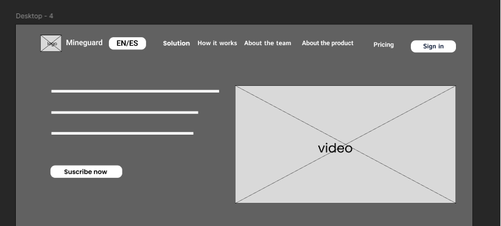

Luego vemos una vista de solution, acá se la problematica y como vertex planea combatirla a travez d su plataforma, además se muestra la misión y visión de la empresa.

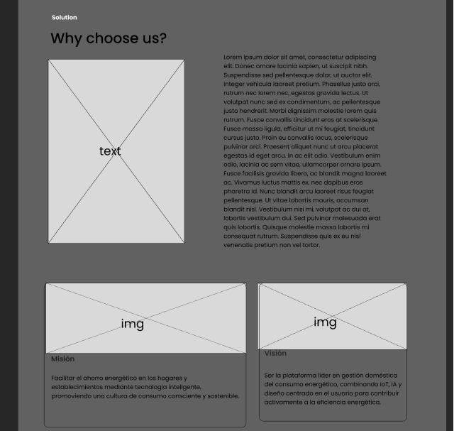

En la tercera vista, how it works, se muestran los segmentos objetivos a los cuales la empresa quiere llegar.

Luego tenemos la vista about the team y about the product, aquí se muestra tanto el equipo detrás de Vertex como la funcionalidad de la app en un pequeño video.

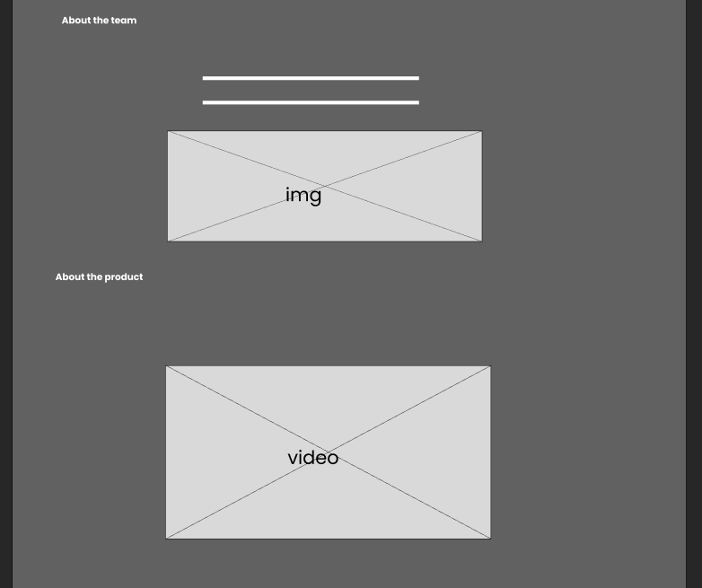

Lo siguiente a esta vista es faq, las diferentes preguntas frecuentes que usuario es capaz de manifestar.

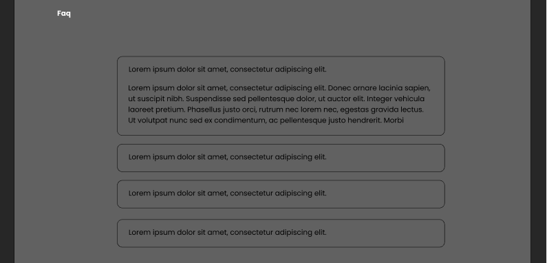

Por último, se muestra la vista d subscripción, aquí se invoca al usuario con un call to action a suscribirse a la app. También se puede apreciar el diseño del footer.

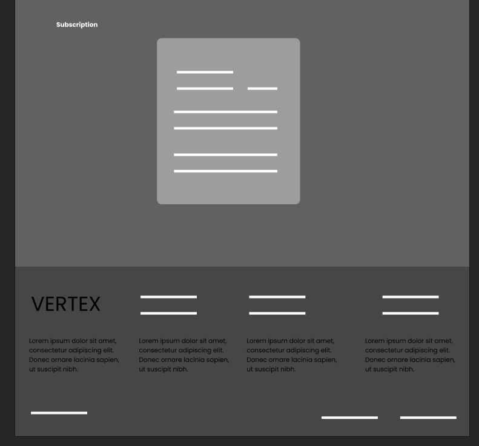

### 5.3.2. Landing Page Mock-up 

Para la versión mockup de la landing page se agregó las imagenes correspondientes. Además, el logo representativo y se completaron los campos de información.

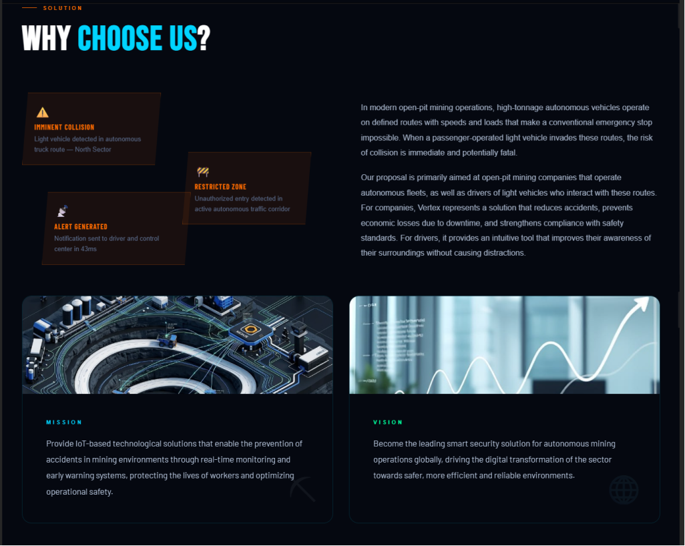
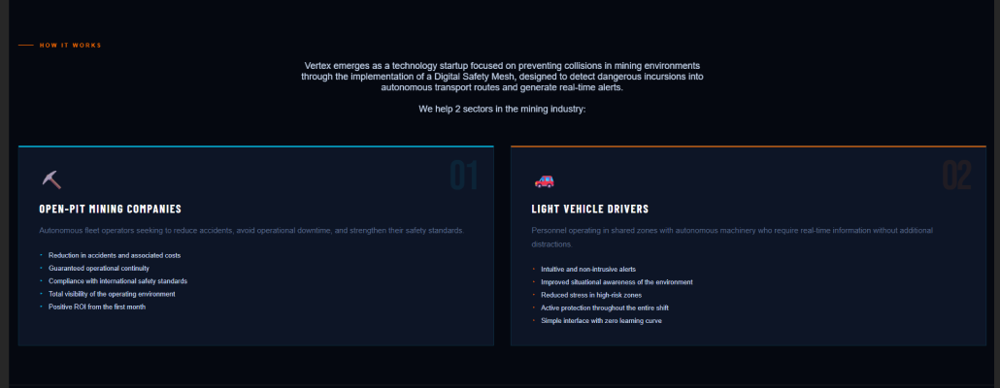
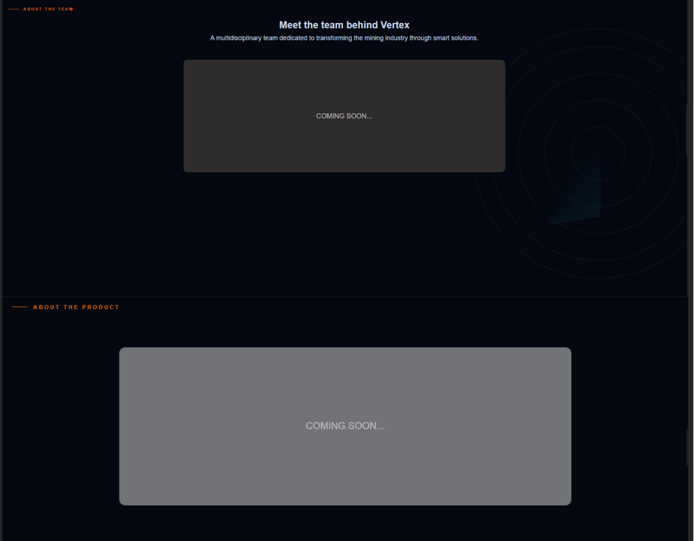
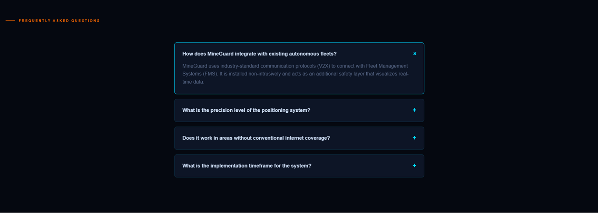
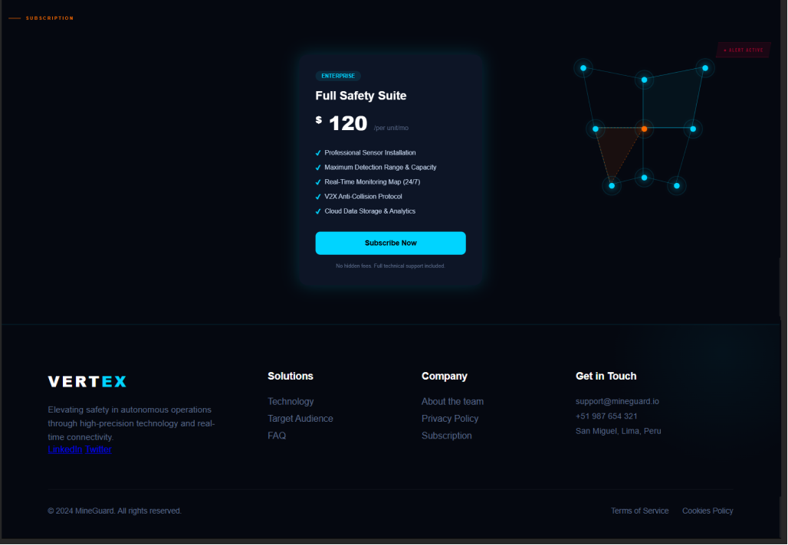

De la misma manera, se muestra su versión para mobile.

 

 
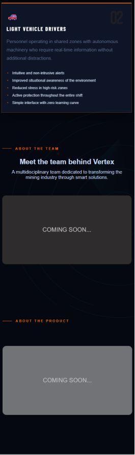
 
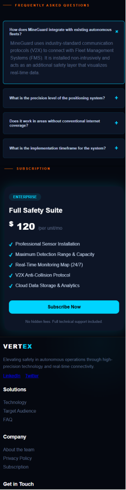
 
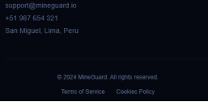

