## 5.4. Applications UX/UI Design 
### 5.4.1. Applications Wireframes
### 5.4.1. Applications Wireframes

La propuesta de wireframes fue desarrollada aplicando los principios de diseño inclusivo, accesibilidad, jerarquía visual y usabilidad. Se busca asegurar una navegación clara y coherente, tanto para turistas como para agencias, adaptando la estructura y contenido de la interfaz según el tipo de usuario para optimizar su experiencia.  

#### VISTA SUPERVISOR

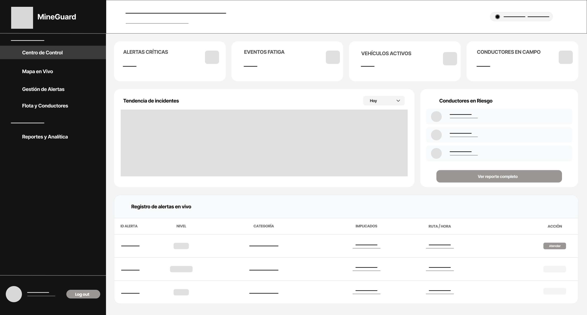
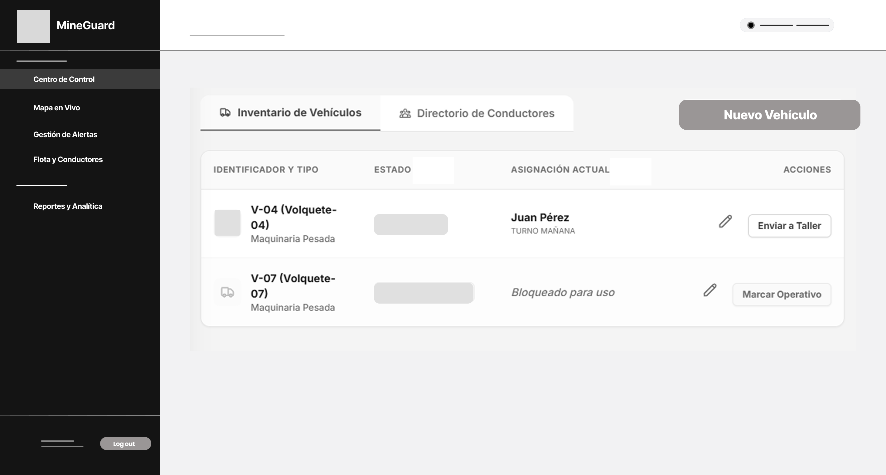
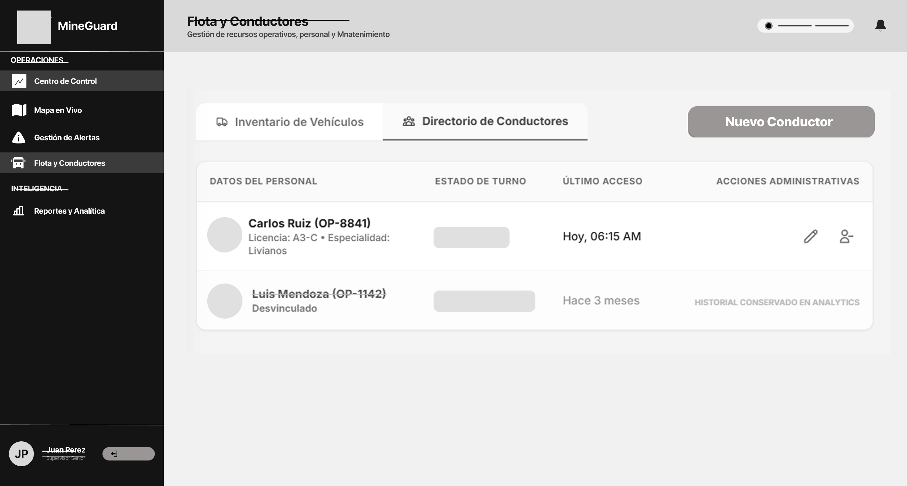
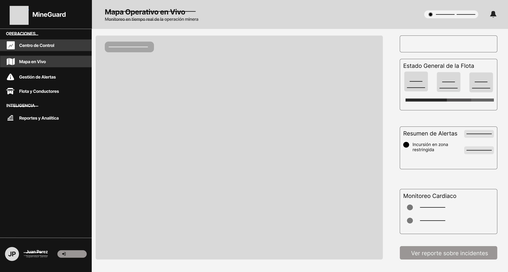
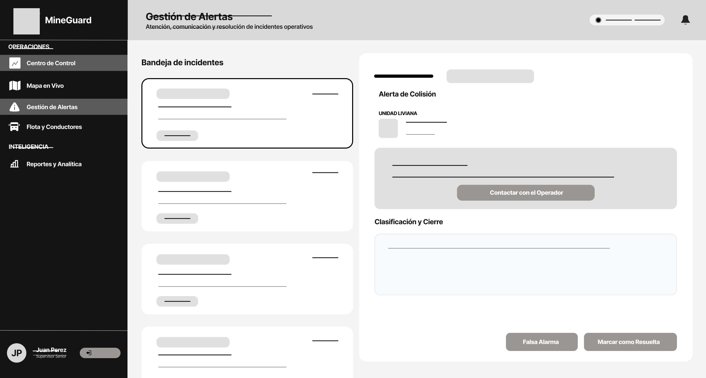
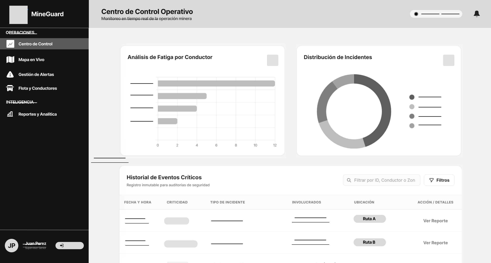

#### VISTA ADMINISTRADOR

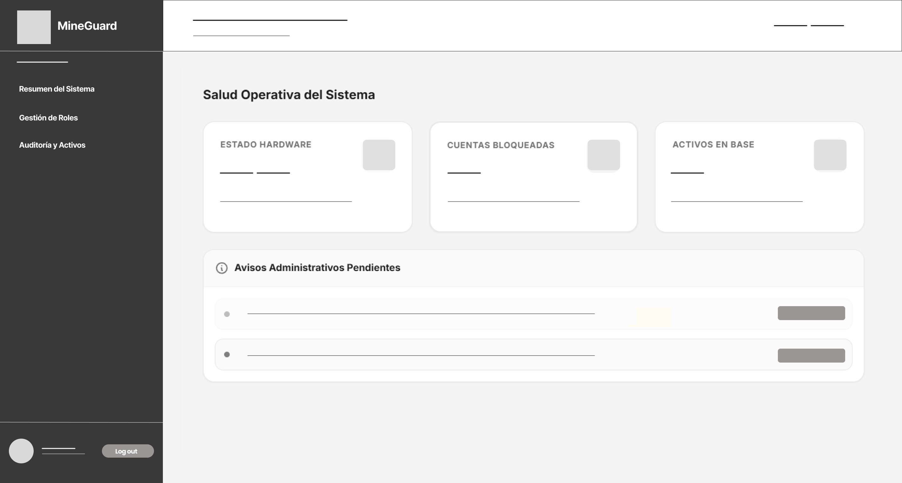
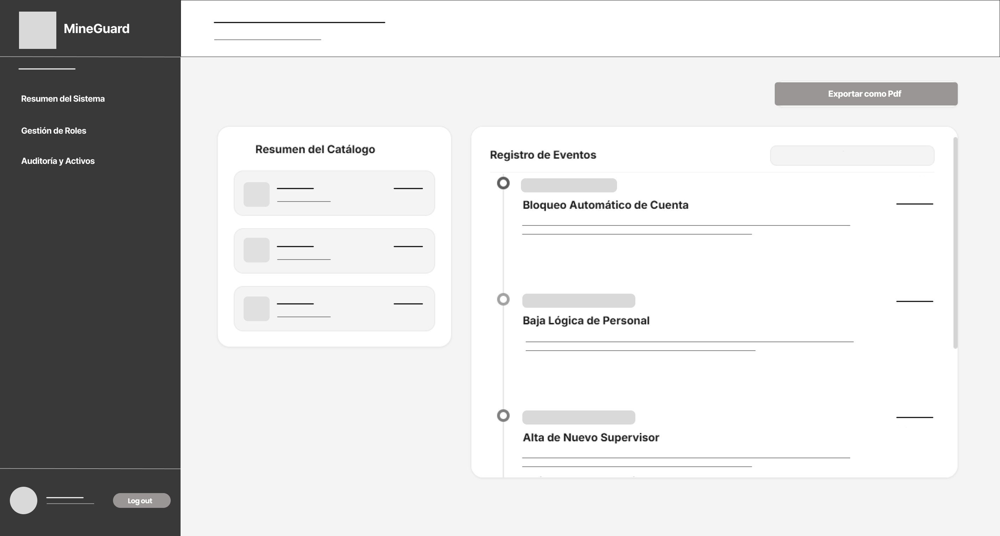
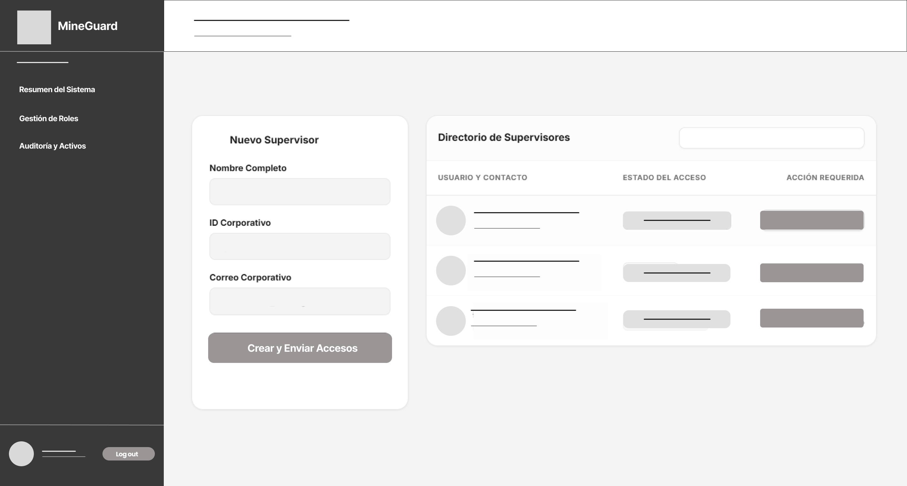

### 5.4.2. Applications Wireflow Diagrams

### 5.4.3. Applications Mock-ups

A continuación se presentan los mock-ups de alta fidelidad, desarrollados a partir de los wireframes previamente establecidos. En esta etapa se ha integrado la identidad visual del proyecto, aplicando la paleta de colores, tipografías y componentes gráficos definitivos. El objetivo es proporcionar una representación visual realista y detallada de la interfaz final, garantizando una experiencia de usuario (UX) intuitiva y un diseño de interfaz (UI) atractivo y funcional para los diferentes roles del sistema.

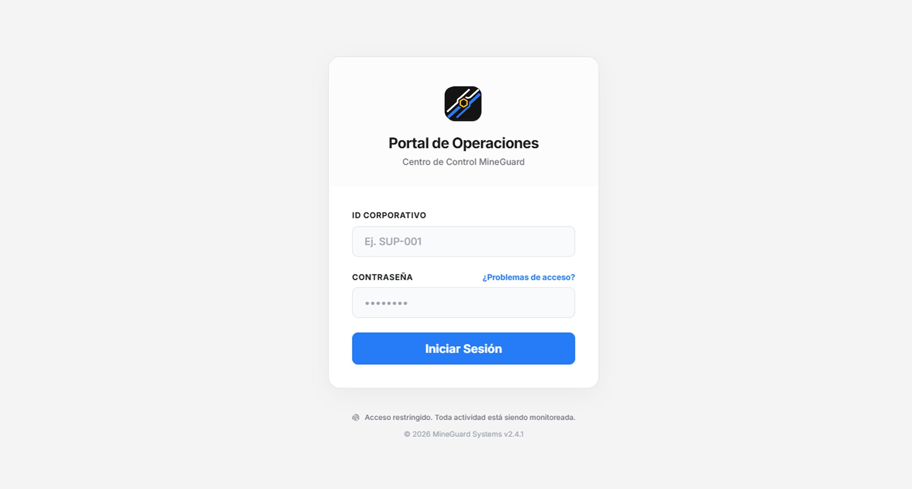

#### VISTA SUPERVISOR

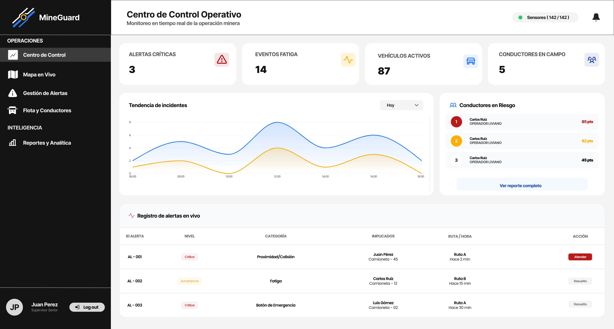
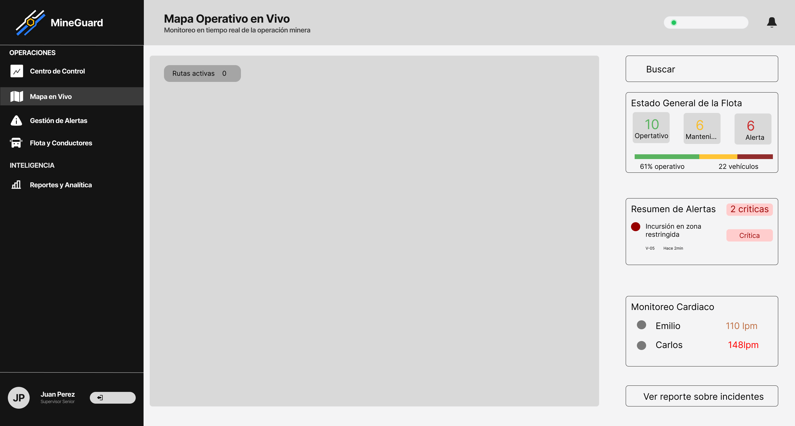
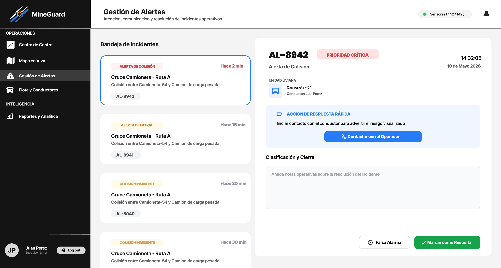
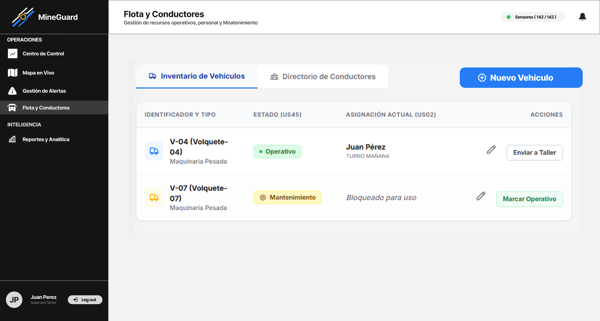
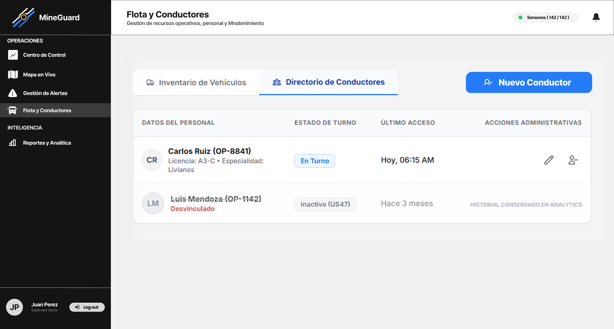
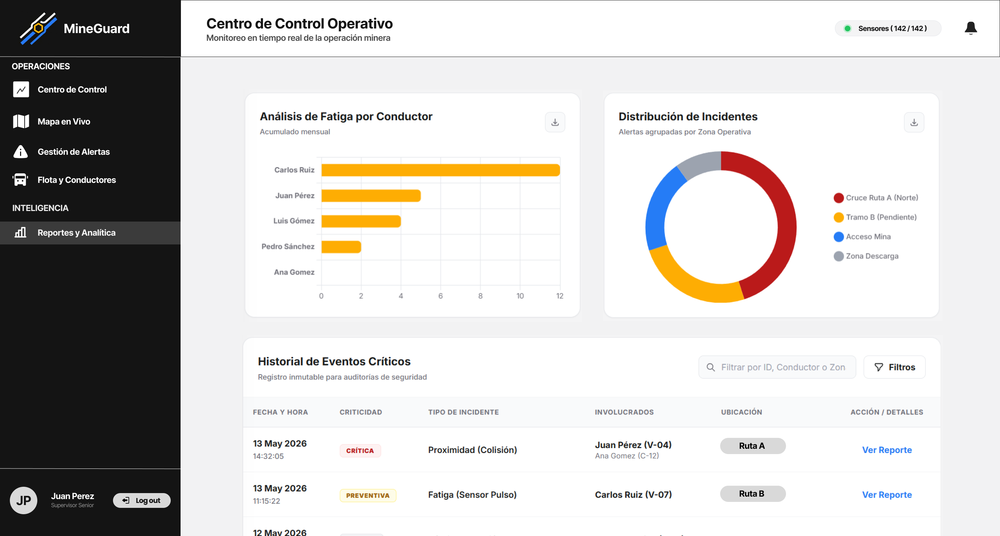

#### VISTA ADMINISTRADOR

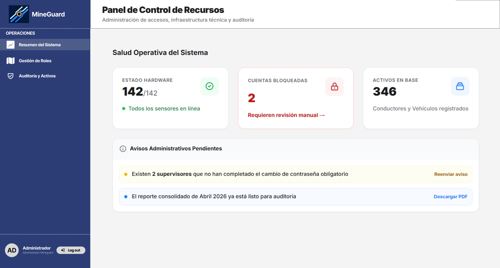
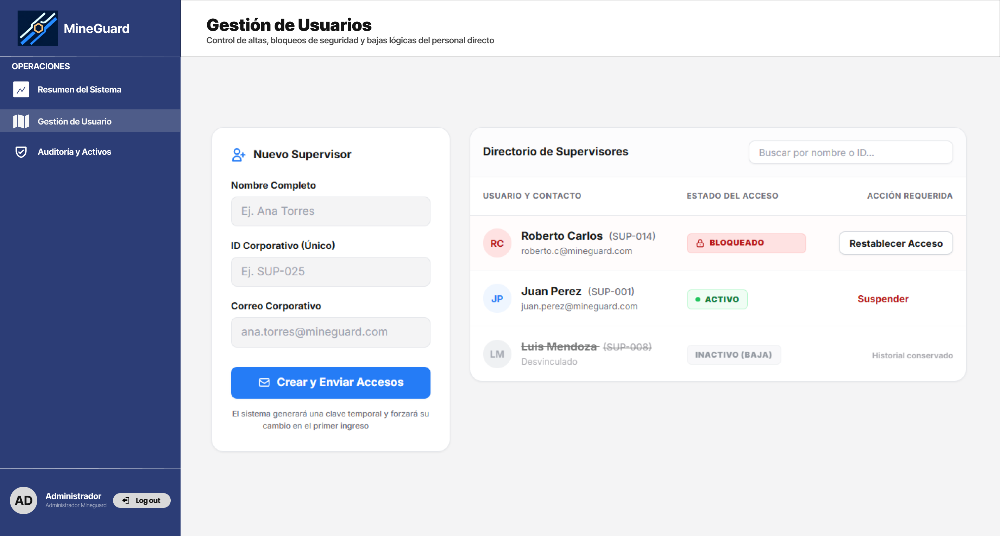
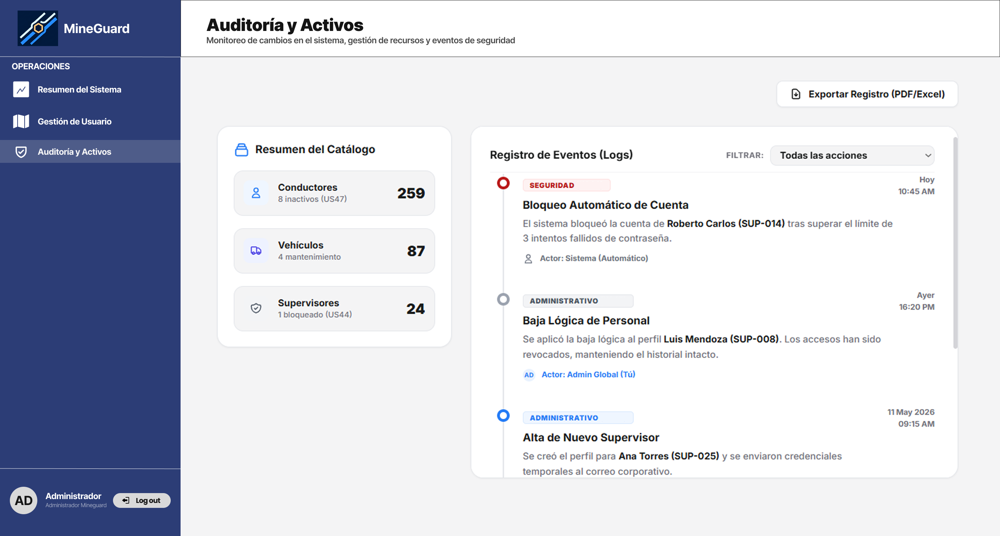

### 5.4.4. Applications User Flow Diagrams
