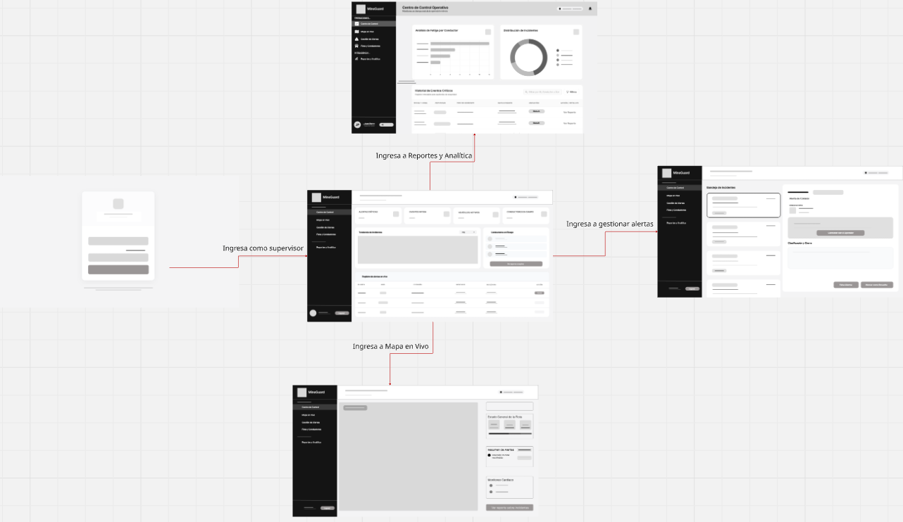
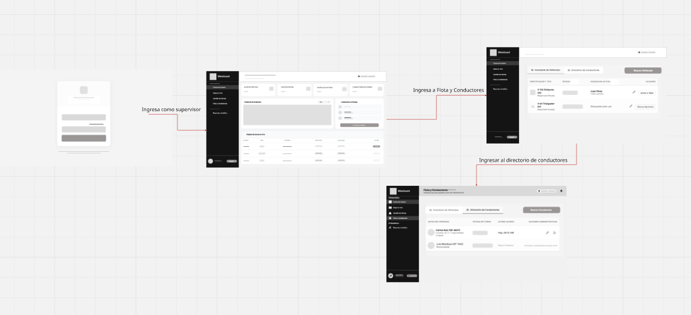
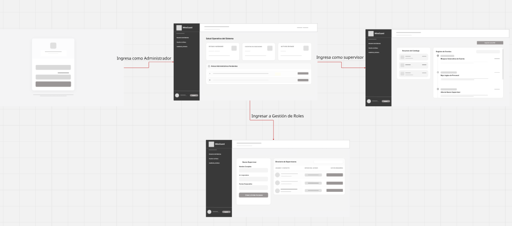
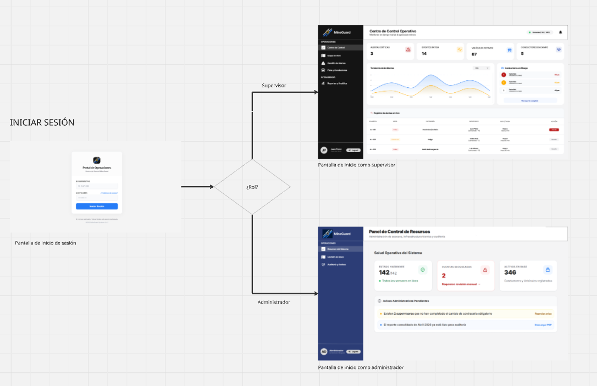
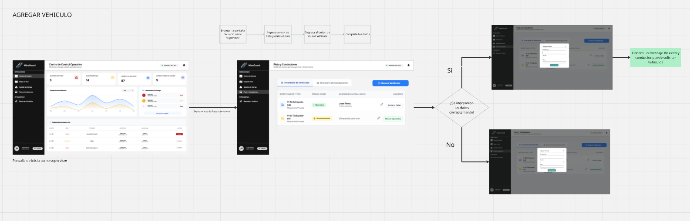
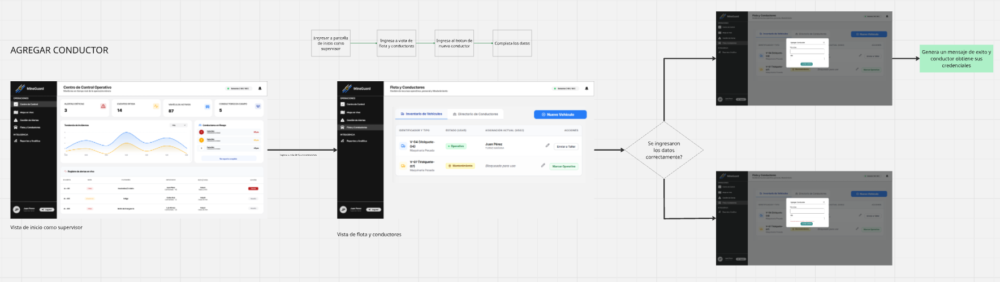
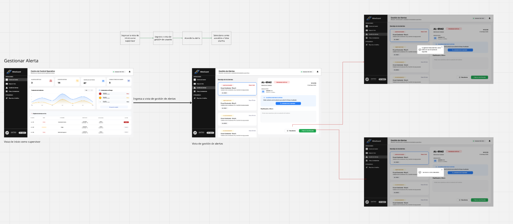
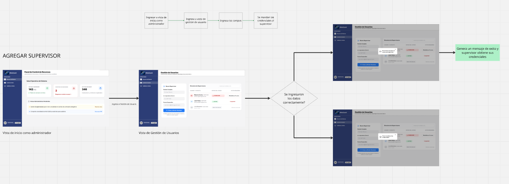

## 5.4. Applications UX/UI Design 
### 5.4.1. Applications Wireframes

La propuesta de wireframes fue desarrollada aplicando los principios de diseño inclusivo, accesibilidad, jerarquía visual y usabilidad. Se busca asegurar una navegación clara y coherente, adaptando la estructura y contenido de la interfaz según el tipo de usuario para optimizar su experiencia.  

La pantalla de inicio de sesión de MineGuard presenta un diseño centrado y minimalista, acorde a las guías de estilo definidas en la sección. 

#### VISTA SUPERVISOR

Centro de Control (dashboard principal del Supervisor): constituye la vista principal de operación en tiempo real. En la parte superior se presentan cuatro tarjetas de KPI: Alertas Críticas, Eventos Fatiga, Vehículos Activos y Conductores en Campo, permitiendo al supervisor obtener un estado operativo de un vistazo. El cuerpo de la pantalla se divide en dos paneles: el panel izquierdo muestra la Tendencia de Incidentes con un gráfico histórico filtrable por fecha, y el panel derecho lista los Conductores en Riesgo con un acceso rápido al reporte completo.

Inventario de Vehículos: presenta la pestaña Inventario de Vehículos de la sección Flota y Conductores. La tabla muestra columnas de Identificador y Tipo, Estado (con badge de color), Asignación Actual y Acciones. Se visualizan dos registros de ejemplo: V-04 (Volquete, Maquinaria Pesada) asignado a Juan Pérez — Turno Mañana, con acción Enviar a Taller; y V-07 (Volquete, Maquinaria Pesada) con estado Bloqueado para uso y acción Marcar Operativo. El botón Nuevo Vehículo en la esquina superior derecha permite registrar activos. Este wireframe corresponde a las User Stories de gestión de flota del bounded context Resource and Asset Management.

 Directorio de Conductores: muestra la pestaña Directorio de Conductores dentro de la misma sección. La tabla incluye columnas de Datos del Personal, Estado de Turno, Último Acceso y Acciones Administrativas. Se muestran dos registros: Carlos Ruiz (OP-8841, Licencia A3-C, Especialidad Livianos) con acceso Hoy 06:15 AM; y Luis Mendoza (OP-1142, Desvinculado) con historial conservado en Analytics. El footer del sidebar muestra al usuario autenticado (Juan Pérez, JP) con su estado de sesión activa.

Mapa Operativo en Vivo: muestra la vista de geolocalización en tiempo real de la operación. El panel principal (columna izquierda) presenta el mapa interactivo con las rutas y posiciones de los vehículos. El panel lateral derecho incluye Estado General de la Flota con métricas de resumen y el Resumen de Alertas con un listado en tiempo real donde se identifica una Incursión en zona restringida (marcada con punto de color de alerta). Este wireframe corresponde a la User Story de visualización del mapa operativo del bounded context Service Execution and Monitoring.

Gestión de Alertas: presenta la vista de bandeja de incidentes con layout de dos paneles. El panel izquierdo muestra la Bandeja de Incidentes como lista scrollable, con cada incidente representado como una tarjeta que incluye identificador, timestamp y estado. El panel derecho muestra el detalle del incidente seleccionado: título Alerta de Colisión, unidad involucrada (Unidad Liviana), descripción del evento, el botón Contactar con el Operador para comunicación inmediata, y la sección Clasificación y Cierre para gestionar la resolución. Los dos botones de acción principal en el footer derecho son Falsa Alarma y Marcar como Resuelta, que actualizan el estado del incidente en el sistema. 

Centro de Control Operativo (Analítica y Reportes): constituye la vista de inteligencia operacional del sistema. Se estructura en tres bloques: en la parte superior, dos paneles lado a lado muestran el Análisis de Fatiga por Conductor (gráfico de barras horizontales por conductor) y la Distribución de Incidentes (gráfico de dona con categorías de incidente). En la parte inferior se ubica el Historial de Eventos Críticos, una tabla filtrable y exportable con columnas de Fecha y Hora, Criticidad, Tipo de Incidente, Involucrados, Ubicación (Ruta A / Ruta B con badge) y Acción/Detalles con el enlace Ver Reporte por fila. La barra de búsqueda y el botón Filtros permiten segmentar por ID, Conductor o Zona. Este wireframe corresponde a las User Stories del bounded context Dashboards and Analytics.

#### VISTA ADMINISTRADOR

Salud Operativa del Sistema: presenta un dashboard de estado con tres tarjetas de métricas en la parte superior: Estado Hardware, Cuentas Bloqueadas y Activos en Base. Debajo se muestra la sección Avisos Administrativos Pendientes, con una lista de notificaciones que requieren acción y un botón de resolución por ítem. La barra lateral izquierda expone el menú de navegación con las opciones Resumen del Sistema, Gestión de Roles y Auditoría y Activos. 

Auditoría y Activos: muestra un layout de dos columnas. En la columna izquierda se ubica el Resumen del Catálogo de activos (recursos, sensores y vehículos registrados) con un listado paginable. En la columna derecha se despliega el Registro de Eventos del sistema con eventos clasificados como Bloqueo Automático de Cuenta, Baja Lógica de Personal y Alta de Nuevo Supervisor, cada uno con su marca de tiempo. Se incluye el botón Exportar como PDF en la esquina superior derecha, habilitando la trazabilidad de auditoría. 

 Gestión de Roles / Directorio de Supervisores: permite registrar nuevos supervisores mediante un formulario con los campos Nombre Completo e ID Corporativo, y visualizar el Directorio de Supervisores existente en formato de tabla con columnas de Usuario y Contacto, Estado del Acceso y Acción Requerida. Este wireframe corresponde a las User Stories del bounded context Identity and Access Management relacionadas con la gestión de usuarios y roles.

### 5.4.2. Applications Wireflow Diagrams

Los diagramas de wireflow ilustran las rutas de navegación y la interacción del usuario a través de las diferentes pantallas de la plataforma. Estos diagramas combinan la estructura visual de los wireframes con la lógica operativa de los diagramas de flujo, permitiendo visualizar claramente cómo los distintos roles completan sus tareas principales dentro del sistema.

#### VISTA SUPERVISOR

El siguiente diagrama detalla el flujo principal de monitoreo del Supervisor. Muestra la ruta desde el inicio de sesión hacia el Centro de Control principal, ramificándose de manera intuitiva hacia módulos críticos como el Mapa en Vivo, la Bandeja de Gestión de Alertas (Incidentes) y el panel de Reportes y Analítica.

Este segundo diagrama se enfoca en el flujo de administración de recursos operativos por parte del Supervisor. Ilustra el recorrido desde el dashboard principal hacia la sección de Flota y Conductores, permitiendo alternar fácilmente entre el Inventario de Vehículos y el Directorio de Conductores.

#### VISTA ADMINISTRADOR

Para el perfil de Administrador, este diagrama describe la ruta de configuración y supervisión del sistema. Inicia con el acceso al panel de Salud Operativa y despliega las rutas hacia la Gestión de Roles (para la creación de nuevos supervisores) y hacia los registros del sistema (Auditoría y Archivo).

### 5.4.3. Applications Mock-ups

A continuación se presentan los mock-ups de alta fidelidad, desarrollados a partir de los wireframes previamente establecidos. En esta etapa se ha integrado la identidad visual del proyecto, aplicando la paleta de colores, tipografías y componentes gráficos definitivos. El objetivo es proporcionar una representación visual realista y detallada de la interfaz final, garantizando una experiencia de usuario (UX) intuitiva y un diseño de interfaz (UI) atractivo y funcional para los diferentes roles del sistema.

#### VISTA SUPERVISOR

#### VISTA ADMINISTRADOR

### 5.4.4. Applications User Flow Diagrams

Los diagramas de flujo de usuario (User Flows) representan visualmente el recorrido paso a paso que realiza un usuario para completar tareas específicas dentro de la plataforma. Estos diagramas destacan los puntos de decisión, las validaciones del sistema y los diferentes caminos (escenarios de éxito o error) que resultan de las interacciones, asegurando que la lógica de negocio esté correctamente mapeada.

El primer flujo fundamental es el proceso de **Autenticación y Enrutamiento**. Al iniciar sesión, el sistema evalúa las credenciales y, mediante una condicional de rol, redirige automáticamente al usuario a su entorno de trabajo correspondiente: el Centro de Control (Supervisor) o el Panel de Recursos (Administrador).

#### VISTA SUPERVISOR

El siguiente diagrama ilustra el proceso operativo para **Agregar un Vehículo**. El supervisor navega desde el panel principal hacia el módulo de "Flota y Conductores", abre el formulario de registro y envía los datos. El flujo muestra la bifurcación del sistema: si los datos son correctos, se muestra un mensaje de éxito; de lo contrario, se solicita la corrección de la información.

De manera homóloga a los vehículos, este diagrama detalla los pasos para **Agregar un Conductor**. El supervisor completa el formulario con los datos del personal y el sistema valida la entrada. Un registro exitoso culmina con la generación de las credenciales de acceso para el nuevo conductor.

Este flujo describe una de las tareas más críticas: **Gestionar una Alerta**. Muestra la ruta del supervisor hacia la bandeja de incidentes, la selección de una alerta específica y la decisión operativa tomada para resolverla (clasificándola como falsa alarma o marcándola como resuelta), desencadenando las notificaciones visuales correspondientes en la interfaz.

#### VISTA ADMINISTRADOR

Para el perfil administrativo, este diagrama explica el proceso para **Agregar un Supervisor**. El administrador accede a la sección de Gestión de Usuarios y completa los datos requeridos. El flujo incluye la validación de la información; si es correcta, el sistema envía las credenciales automáticamente al nuevo supervisor y muestra un mensaje de éxito.

