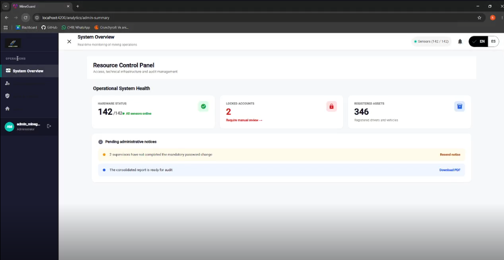

### 5.5. Applications Prototyping

En esta sección se presentan los prototipos interactivos de alta fidelidad, diseñados para visualizar la simulación de interacción y navegación de la plataforma web. Las decisiones de interacción se han fundamentado directamente en la arquitectura de la información del proyecto y en las rutas establecidas en los diagramas de flujo de usuario.

**Criterios de Interacción y Arquitectura de Información:**

* **Sistema de Navegación:** Se implementó un sistema de navegación global mediante una barra lateral izquierda (sidebar) persistente. Esto asegura que los usuarios (tanto Supervisores como Administradores) puedan saltar entre módulos críticos sin perder el contexto operativo, respetando la jerarquía visual de la plataforma.

A continuación, se adjunta una captura representativa del entorno de interacción y el enlace al video demostrativo donde se explican los flujos principales que cubren ambos perfiles de usuario.

#### Video Demostrativo del Prototipo Interactivo

**Enlace de visualización:** [Ver video del recorrido interactivo en Microsoft Stream](https://upcedupe-my.sharepoint.com/:v:/g/personal/u202311558_upc_edu_pe/IQBHgmq8mmaLTIVOJdzcH6V8AU_hHsDqC7EfKRFUE62LxZA?nav=eyJyZWZlcnJhbEluZm8iOnsicmVmZXJyYWxBcHAiOiJTdHJlYW1XZWJBcHAiLCJyZWZlcnJhbFZpZXciOiJTaGFyZURpYWxvZy1MaW5rIiwicmVmZXJyYWxBcHBQbGF0Zm9ybSI6IldlYiIsInJlZmVycmFsTW9kZSI6InZpZXcifX0%3D&e=Ka50P7)

