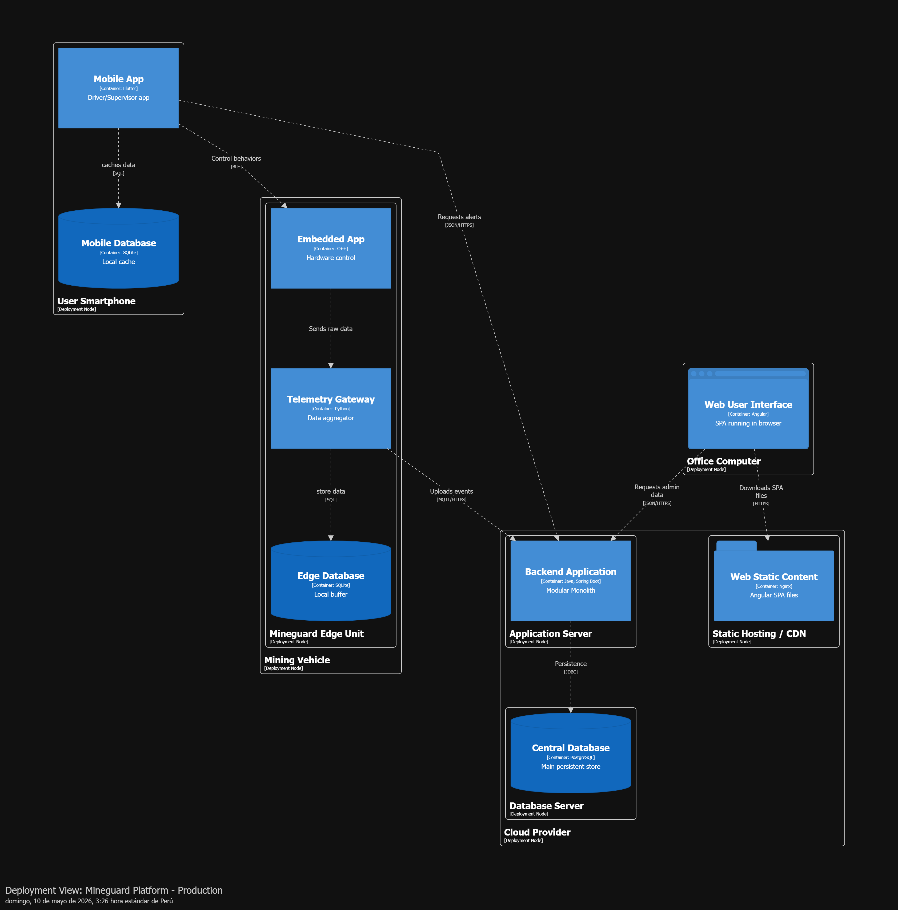

# Capítulo 6: Product Implementation, Validation & Deployment
## 6.1. Software Configuration Management.
### 6.1.1. Software Development Environment Configuration.

En esta sección se describen las herramientas, plataformas y entornos utilizados por el equipo para el desarrollo colaborativo de la solución IoT MineGuard. Estas herramientas permiten gestionar el ciclo de vida completo del producto digital, incluyendo planificación, diseño UX/UI, desarrollo de software, pruebas, documentación y despliegue.

+ **Project Management:**

    + **Jira:** 
    
    Jira Software es una plataforma de gestión de proyectos y seguimiento de tareas orientada a equipos de desarrollo de software. El equipo utiliza Jira Software para planificar y organizar las actividades del proyecto MineGuard durante cada sprint de desarrollo. La herramienta permite asignar tareas, realizar seguimiento del avance del proyecto y coordinar el trabajo colaborativo entre los integrantes del equipo.

    Ruta de referencia: 'https://www.atlassian.com/software/jira'

+ **Requirements Management:**

    + **Trello:**

    Trello es una plataforma de organización y gestión visual de tareas basada en tableros colaborativos. El equipo utiliza Trello para gestionar los requerimientos funcionales y técnicos del proyecto MineGuard, organizando user stories, technical stories y actividades relacionadas con el desarrollo de la solución IoT. La herramienta también permite mantener un seguimiento visual del estado de cada requerimiento durante el avance del proyecto.

    Ruta de referencia: 'https://trello.com/'

+ **Product UX/UI Design:**

    + **Figma:**

    Figma es una plataforma de diseño colaborativo de interfaces y prototipos digitales.. El equipo utiliza Figma para diseñar las interfaces y prototipos visuales del sistema MineGuard, incluyendo dashboards de monitoreo, visualización de alertas y componentes de interacción para los operadores del sistema IoT.

    Ruta de referencia: 'https://www.figma.com/es-la/'

    + **UXPressia:**

    UXPressia es una plataforma orientada al diseño y modelado de experiencia de usuario. El equipo utiliza UXPressia para elaborar empathy maps, user personas y customer journey maps relacionados con los usuarios del sistema MineGuard, permitiendo analizar necesidades, comportamientos y flujos de interacción durante el proceso Lean UX.

    Ruta de referencia: 'https://uxpressia.com/'

+ **Software Development:**

    + **Visual Studio Code:**

    Visual Studio Code es un editor de código fuente ligero y multiplataforma orientado al desarrollo de software. El equipo utiliza Visual Studio Code para la edición y gestión de archivos del informe, documentación técnica y archivos Markdown (.md) relacionados con el proyecto MineGuard. Además, permite trabajar de manera integrada con Git y GitHub durante el desarrollo colaborativo.

    Ruta de referencia: 'https://code.visualstudio.com/'

    + **IntelliJ IDEA:**

    IntelliJ IDEA es un entorno de desarrollo integrado (IDE) orientado al desarrollo de aplicaciones modernas. El equipo utiliza IntelliJ IDEA como entorno principal para el desarrollo del frontend de MineGuard, permitiendo programar, organizar y ejecutar los componentes de la aplicación web de monitoreo IoT.

    Ruta de referencia: 'https://www.jetbrains.com/idea/download/'

    + **Angular:**

    Angular es un framework de desarrollo frontend basado en TypeScript para la construcción de aplicaciones web dinámicas. El equipo utiliza Angular para desarrollar la interfaz web de MineGuard, incluyendo dashboards, visualización de alertas, monitoreo en tiempo real y módulos interactivos relacionados con la solución IoT.

    Ruta de referencia: 'https://angular.dev/'

+ **Database Management:**

    + **MySQL:**

    MySQL es un sistema de gestión de bases de datos relacional utilizado para almacenar y administrar información estructurada. El equipo utiliza MySQL para gestionar el almacenamiento de datos del sistema MineGuard, incluyendo información relacionada con alertas, eventos detectados, vehículos monitoreados y registros históricos generados por la solución IoT.

    Ruta de referencia: 'https://dev.mysql.com/downloads/mysql/'

+ **Software Testing:**

    + **Postman:**

    Postman es una plataforma utilizada para realizar pruebas y validaciones de APIs REST. El equipo utiliza Postman para probar y validar las solicitudes HTTP y respuestas de los servicios backend de MineGuard, verificando el correcto funcionamiento de los endpoints relacionados con el monitoreo y gestión de eventos IoT.

    Ruta de referencia: 'https://www.postman.com/'

    + **Swagger:**

    Swagger OpenAPI es una herramienta de documentación y prueba interactiva de APIs REST. El equipo utiliza Swagger OpenAPI para visualizar, documentar y probar los endpoints del backend de MineGuard, facilitando la validación técnica de los servicios desarrollados. 

    Ruta de referencia: 'https://swagger.io/tools/swagger-ui/'

+ **Software Deployment:**

    + **Netlify:**

    Netlify es una plataforma de despliegue y hosting orientada a aplicaciones web modernas y sitios frontend. El equipo utiliza Netlify para realizar el despliegue y publicación de la Landing Page y del frontend web de MineGuard, permitiendo alojar la aplicación en línea y facilitar el acceso a las interfaces desarrolladas durante las etapas de prueba y presentación del proyecto.

    Ruta de referencia: 'https://www.netlify.com/'

+ **Software Documentation**

    + **GitHub Repository:**

    GitHub Repository es una plataforma de almacenamiento y control de versiones para proyectos de software y documentación técnica. El equipo utiliza GitHub Repository para almacenar y gestionar la documentación técnica y académica del proyecto MineGuard, incluyendo archivos Markdown (.md), diagramas, reportes, evidencias y control de versiones del informe y del código fuente.

    Ruta de referencia: 'https://github.com/'


### 6.1.2. Source Code Management.

En esta sección se describe el esquema de control de versiones que utilizará el equipo para gestionar los cambios realizados en los productos digitales de la solución IoT MineGuard. Para ello, se utilizará GitHub como plataforma principal de alojamiento de repositorios y Git como sistema de control de versiones distribuido.

El equipo aplicará un flujo de trabajo basado en GitFlow, considerando ramas principales, ramas de desarrollo, ramas por funcionalidad, ramas de release y ramas de hotfix. Esta decisión se alinea con la guía de repositorios Docs-as-Code, la cual recomienda el uso de Markdown modular, GitFlow, Semantic Versioning y Conventional Commits para organizar proyectos colaborativos versionados.

+ **Github Repositories:**

    + **Website:**

        + Repositorio: mineguard-website

        + Propósito: Contiene el código fuente de la página informativa de MineGuard, orientada a presentar la propuesta de valor, características principales, beneficios y medios de contacto del producto.

        + URL: 'https://github.com/1ASI0572-2610-6779-Vertex/mineguard-website'

    + **Webapp**

        + Repositorio: mineguard-webapp

        + Propósito: Contiene la aplicación web principal desarrollada en Angular, incluyendo las vistas de monitoreo, dashboard, alertas y funcionalidades de interacción para los usuarios del sistema.

        + URL: 'https://github.com/1ASI0572-2610-6779-Vertex/mineguard-webapp'

    + **Web Service:**

        + Repositorio: mineguard-webservice

        + Propósito: Contiene el backend del sistema, desarrollado bajo una arquitectura de servicios. Este repositorio incluirá el proyecto backend y los archivos correspondientes a pruebas unitarias, pruebas de integración y pruebas de aceptación.

        + URL: 'https://github.com/1ASI0572-2610-6779-Vertex/mineguard-webservice'

+ **GitFlow Workflow:**

    El equipo utilizará GitFlow como workflow de control de versiones. Este modelo permite separar el código estable, el código en desarrollo, las nuevas funcionalidades, las versiones candidatas a entrega y las correcciones urgentes.

    + **Main Branch:**

        + Nombre: `main`

        + Propósito: Contiene únicamente versiones estables y listas para entrega. Cada versión publicada en esta rama estará asociada a un release formal del proyecto.

    + **Develop Branch:**

        + Nombre: `develop`

        + Propósito: Contiene la versión integrada del trabajo en desarrollo. Las ramas de funcionalidades se integrarán primero en `develop` antes de pasar a una versión estable.

    + **Feature Branches:**

        Las ramas de funcionalidad se crearán desde `develop` y se utilizarán para desarrollar nuevas funcionalidades o secciones del proyecto.

        + Convención: `feature/nombre-de-la-funcionalidad`

        + Ejemplo: 
            
            `feature/login-page`
            `feature/dashboard-alerts`
            `feature/12-lean-ux-canvas`

    + **Release Branches:**

        Las ramas de release se utilizarán cuando una versión esté lista para estabilización, revisión y corrección final antes de integrarse a `main`.

        + Convención: `release/vX.Y.Z`

        + Ejemplo: `release/v1.0.0`

    + **Hotfix Branches:**

        Las ramas hotfix se crearán desde `main` cuando sea necesario corregir errores críticos en una versión ya publicada.

        + Convención: `hotfix/descripcion-del-error`

        + Ejemplo: `hotfix/fix-login-error`
  
+ **Semantic Versioning:**

    El equipo aplicará Semantic Versioning 2.0.0 para nombrar las versiones del proyecto. El formato utilizado será: `MAJOR.MINOR.PATCH`

    + MAJOR: cambios grandes o incompatibles.
    + MINOR: nuevas funcionalidades compatibles.
    + PATCH: correcciones de errores.

+ **Conventional Commits:**

    El equipo utilizará Conventional Commits para mantener mensajes de commit claros, trazables y consistentes.

    La estructura será: `type(scope): message`

    Tipos principales de commits:

    + feat: nueva funcionalidad.
    + fix: corrección de errores.
    + docs: cambios en documentación.
    + test: incorporación o modificación de pruebas.
    + refactor: mejora interna del código sin cambiar funcionalidad.
    + style: cambios de formato o estilos.
    + chore: tareas de configuración o mantenimiento.


### 6.1.3. Source Code Style Guide & Conventions.

En esta sección se definen las convenciones de estilo, nomenclatura y programación que seguirá el equipo durante el desarrollo de MineGuard. Todas las variables, clases, funciones, archivos, componentes y demás elementos del código serán nombrados en inglés, con el objetivo de mantener consistencia, legibilidad y alineación con estándares internacionales de desarrollo.

+ **General Naming Conventions:**

    Para todos los lenguajes utilizados en la solución, el equipo aplicará nombres descriptivos en inglés. No se utilizarán nombres ambiguos, abreviaciones innecesarias ni combinaciones de español e inglés dentro del código.

    Las principales convenciones serán:

    + PascalCase: para clases, interfaces, componentes y modelos. Ejemplo: `AlertService`, `VehicleSensor`, `DriverProfile`.
    
    + camelCase: para variables, atributos, métodos y funciones. Ejemplo: `driverName`, `alertStatus`, `getActiveAlerts()`.
    
    + kebab-case: para nombres de archivos, carpetas y rutas del frontend. Ejemplo: `alert-dashboard.component.ts`, `driver-profile.page.ts`.
    
    + UPPER_SNAKE_CASE: para constantes globales. Ejemplo: `MAX_ALERT_DISTANCE`, `DEFAULT_RISK_LEVEL`.

+ **HTML Conventions:**

    Para los archivos HTML del frontend, el equipo seguirá buenas prácticas de estructura y legibilidad. Se utilizarán etiquetas en minúscula, atributos en minúscula y una indentación clara para facilitar el mantenimiento de las vistas. Esta decisión se alinea con recomendaciones comunes de estilo HTML, donde se prioriza el uso de nombres en minúscula para mejorar limpieza y consistencia del código.

    Los elementos HTML deberán tener una estructura semántica cuando sea posible. Por ejemplo, se preferirá el uso de etiquetas como `header`, `main`, `section`, `article` y `footer` en lugar de depender únicamente de `div`.

    Ejemplo:

    ```HTML
    <section class="alert-summary">
        <h2>Active Alerts</h2>
        <p>Real-time monitoring of critical events.</p>
    </section>
    ```

+ **CSS Conventions:**

    Para los estilos CSS, el equipo utilizará nombres de clases descriptivos en inglés y escritos en kebab-case. Las clases deberán reflejar el propósito del elemento y no únicamente su apariencia visual. El Google HTML/CSS Style Guide recomienda usar nombres de clases lo suficientemente breves, pero claros para comunicar su propósito.

    Ejemplo:

    ```CSS
    .alert-card {
    display: flex;
    flex-direction: column;
    }

    .risk-level-high {
    font-weight: bold;
    }
    ```

+ **JavaScript and TypeScript Conventions:**

    Para JavaScript y TypeScript, el equipo utilizará nombres en camelCase para variables, funciones y métodos. Las clases, interfaces, modelos y componentes se nombrarán en PascalCase.

    En TypeScript, se priorizará el uso de tipos explícitos cuando ayuden a mejorar la comprensión del código. Además, se evitará el uso innecesario de any, salvo en casos excepcionales donde el tipo no pueda determinarse inicialmente.


    ```TypeScript
    export interface AlertEvent {
    id: number;
    alertType: string;
    severity: string;
    createdAt: Date;
    }

    const activeAlerts: AlertEvent[] = [];

    function getActiveAlerts(): AlertEvent[] {
    return activeAlerts;
    }
    ```

+ **Angular Conventions:**

    Para el frontend web de MineGuard, el equipo utilizará Angular con arquitectura standalone. Los componentes, páginas y servicios estarán organizados de manera modular para facilitar la escalabilidad y mantenimiento del proyecto.

    La guía oficial de Angular resalta la importancia de convenciones de nombres claras para encontrar código más rápido y comprender mejor la intención de cada archivo o símbolo.

    Las convenciones aplicadas serán:

    + Los componentes se nombrarán en PascalCase. Ejemplo: `AlertDashboardComponent`.
    + Los archivos se nombrarán en kebab-case. Ejemplo: `alert-dashboard.component.ts`.
    + Los servicios terminarán con el sufijo `Service`. Ejemplo: `AlertService`, `VehicleService`.
    + Los modelos terminarán con el sufijo correspondiente al concepto de dominio. Ejemplo: `Driver`, `Vehicle`, `SensorReading`.
    + Las rutas estarán escritas en kebab-case. Ejemplo: `/alert-dashboard`, `/driver-profile`.

    Ejemplo:

    ```TypeScript
    @Component({
    selector: 'app-alert-dashboard',
    standalone: true,
    templateUrl: './alert-dashboard.component.html',
    styleUrl: './alert-dashboard.component.css'
    })
    export class AlertDashboardComponent {
    }
    ```

+ **Java and Spring Boot Conventions:**

    Para el backend, el equipo utilizará Java con Spring Boot. Se adoptarán convenciones basadas en el Google Java Style Guide, aplicando nombres claros, paquetes en minúscula y clases en PascalCase.

    Las clases deberán representar claramente su responsabilidad dentro del sistema. Se utilizarán sufijos estándar según el tipo de componente:

    + `Controller` para controladores REST. Ejemplo: `AlertController`.
    + `Service` para servicios de aplicación o dominio. Ejemplo: `AlertService`.
    + `Repository` para acceso a datos. Ejemplo: `AlertRepository`.
    + `Command` para operaciones que modifican el estado. Ejemplo: `CreateAlertCommand`.
    + `Query` para operaciones de consulta. Ejemplo: `GetActiveAlertsQuery`.

    Ejemplo:

    ```java
    package com.mineguard.monitoring.application.services;

    public class AlertService {
        public void createAlert() {
        }
    }
    ```

+ **Gherkin Conventions:**

    Para los escenarios de aceptación y pruebas BDD, el equipo utilizará Gherkin en archivos .feature. Gherkin permite estructurar especificaciones ejecutables mediante palabras clave como Feature, Scenario, Given, When, Then, And y But. Los escenarios se redactarán en inglés para mantener consistencia con la nomenclatura general del proyecto. Cada escenario deberá describir un comportamiento observable del sistema y no detalles internos de implementación.

    ```gherkin
    Feature: Alert management

    Scenario: Critical alert is generated
        Given a light vehicle enters a restricted route
        When the system detects a collision risk
        Then a critical alert should be generated
        And the supervisor should receive a notification
    ```

+ **File and Folder Naming:**

    Los archivos y carpetas del proyecto se nombrarán en inglés utilizando kebab-case para mantener consistencia y facilitar la navegación dentro del repositorio.

    Ejemplos:

    + alert-dashboard/
    + driver-profile/
    + sensor-reading.service.ts
    + vehicle-monitoring.component.ts
    + create-alert.command.java


### 6.1.4. Software Deployment Configuration.

En esta sección se especifica la configuración de despliegue definida para los productos digitales de la solución IoT MineGuard durante la presente entrega. El despliegue se realizará únicamente para la Landing Page y la Frontend Web Application, mientras que los demás productos serán considerados para futuras iteraciones del proyecto.

+ **Website Deployment:**

    El Website de MineGuard será desplegada mediante GitHub Pages a partir del repositorio `mineguard-website`. Esta plataforma permitirá publicar la página informativa del producto, donde se presentará la propuesta de valor, beneficios, características principales y medios de contacto de la solución IoT desarrollada por el equipo.

    Pasos de despliegue:

    1. Subir el código fuente de la Landing Page al repositorio mineguard-website.
    2. Verificar que la rama principal del repositorio sea main.
    3. Ingresar a la sección Settings del repositorio en GitHub.
    4. Seleccionar la opción Pages.
    5. Configurar el despliegue desde la rama main.
    6. Seleccionar la carpeta raíz o la carpeta correspondiente al build del proyecto.
    7. Guardar la configuración.
    8. Verificar que GitHub Pages genere correctamente la URL pública de la Landing Page.

+ **Webapp Deployment:**

    El Webapp de MineGuard será desplegada mediante Netlify utilizando el repositorio `mineguard-webapp`. La aplicación frontend desarrollada en Angular permitirá publicar la primera versión funcional del sistema web, incluyendo dashboards, monitoreo de alertas y componentes de interacción para los usuarios de la solución IoT.

    1. Subir el código fuente del frontend Angular al repositorio mineguard-webapp.
    2. Ingresar a Netlify y seleccionar la opción Add new site.
    3. Conectar Netlify con la cuenta de GitHub del equipo.
    4. Seleccionar el repositorio mineguard-webapp.
    5. Configurar el comando de construcción:
        ```console
        npm run build
        ```
    6. Configurar el directorio de publicación generado por Angular:
        ```console
        dist/mineguard-webapp
        ```
    7. Ejecutar el despliegue desde Netlify.
    8. Verificar que la aplicación web se publique correctamente y que la URL generada permita acceder al frontend.

+ **Products Not Deployed in This Delivery:**

    Los Web Services aún no serán desplegados en esta entrega. Para futuras iteraciones, se propone evaluar plataformas como Render, Railway o Azure App Service para desplegar el backend desarrollado en Java con Spring Boot. Esta decisión queda sujeta a evaluación según facilidad de integración, costos, compatibilidad con MySQL y requerimientos del curso.

    La Base de Datos tampoco será desplegada en esta entrega. Se utilizará MySQL como sistema de gestión de base de datos y se evaluará posteriormente una opción en la nube, evitando una configuración local para el entorno final del proyecto.

    La Mobile Application y la Embedded Application no serán desplegadas en esta entrega. Estos productos se mantienen como parte de la arquitectura general de MineGuard, pero su publicación será abordada en una etapa posterior del desarrollo.


+ **C4 Deployment Diagram:**

<p align="center">
    
</p>

