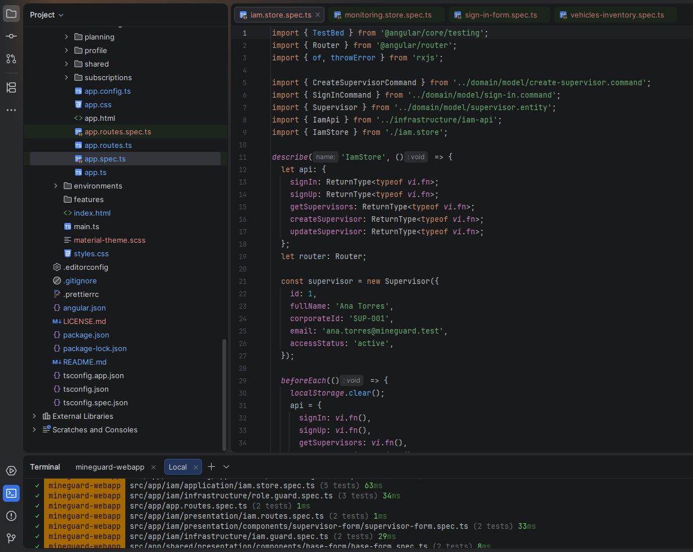
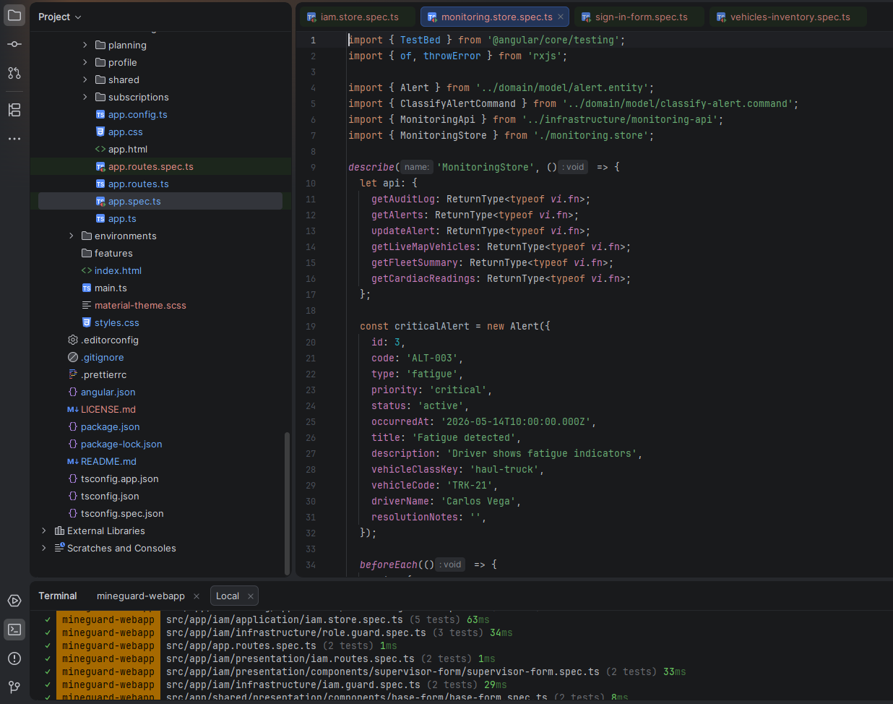
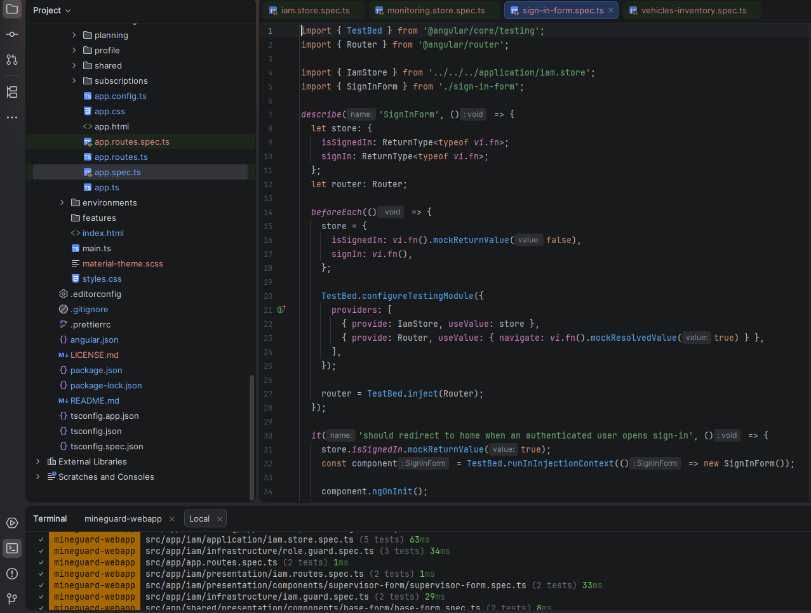
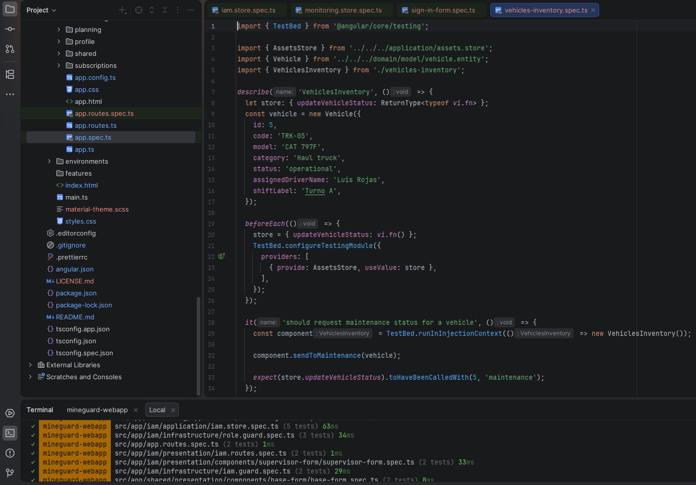
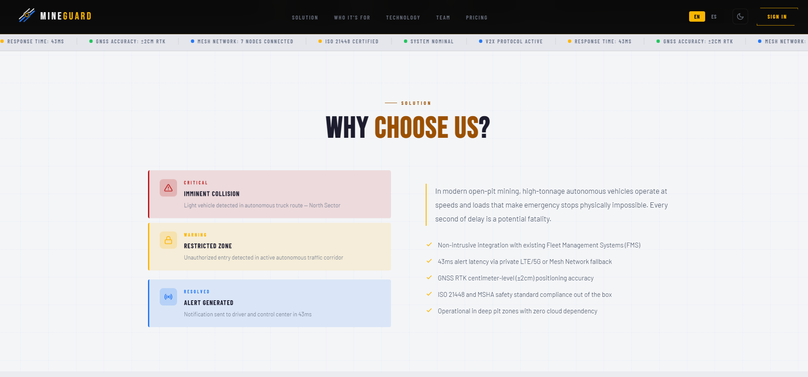
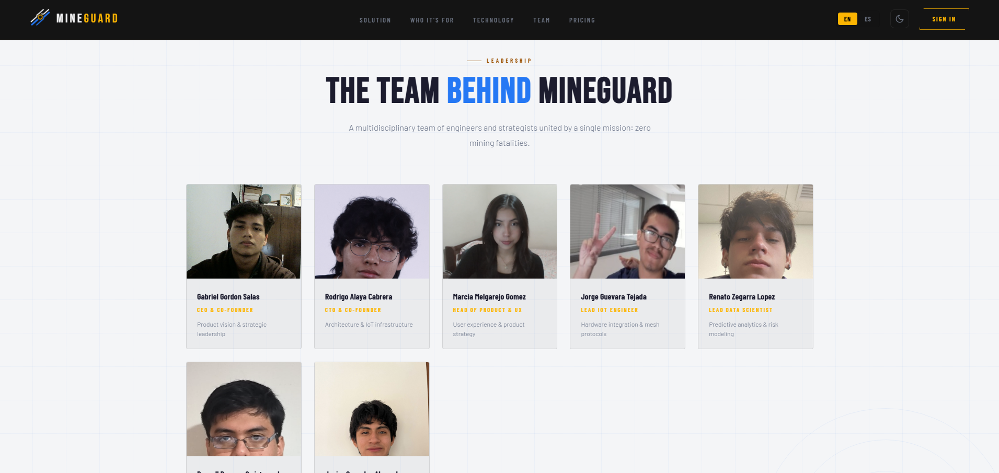
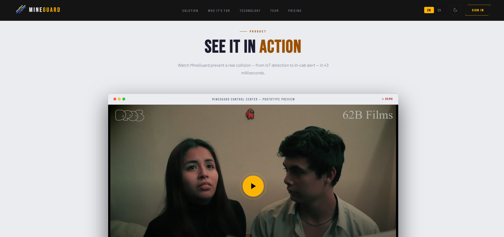

### 6.2.1. Sprint 1

#### 6.2.1.1. Sprint Planning 1

En esta sección se presenta el resumen de la reunión de Sprint Planning correspondiente al Sprint 1 del proyecto MineGuard. Durante esta sesión, el equipo definió el alcance inicial del proyecto, revisó los requerimientos funcionales y no funcionales, identificó las principales necesidades de los usuarios y estableció las actividades necesarias para iniciar el desarrollo de la solución.

El objetivo principal de esta reunión fue priorizar los primeros User Stories y tareas que permitirán construir la base del sistema, enfocándose en la configuración de la arquitectura del proyecto, el desarrollo de las funcionalidades esenciales de las aplicaciones web y la integración inicial con los dispositivos IoT para el monitoreo de condiciones en tiempo real. Asimismo, se estableció el Sprint Goal, alineando al equipo en torno a un objetivo común y definiendo los compromisos que guiarán el desarrollo durante la primera iteración.

| Sprint # | Sprint 1 |
|---|---|
| **Sprint Planning Background** | Primera entrega integrada del producto, enfocada en la presentación pública de la propuesta de valor y en el establecimiento de la base operativa inicial de MineGuard para el monitoreo de riesgos y el acceso a la plataforma. |
| **Date** | 2026-05-14 |
| **Time** | 08:00 PM |
| **Location** | Virtual Meeting (Google Meet / Discord) |
| **Prepared By** | Rodrigo Alaya |
| **Attendees (to planning meeting)** | Rodrigo Alaya / Jorge Guevara / Gabriel Gordon / Russell Romero / Marcia Melgarejo / Renato Zegarra / Javier Gonzales |
| **Sprint n−1 Review Summary** | No aplica, ya que corresponde al primer Sprint del proyecto. |
| **Sprint n−1 Retrospective Summary** | No aplica, ya que corresponde al primer Sprint del proyecto. |
| **Sprint Goal & User Stories** | |
| **Sprint n Goal** | Our focus is on delivering the first public version of MineGuard, including the commercial landing page and the initial operational foundation of the platform. We believe it delivers a clear product presentation to stakeholders and establishes the first monitoring capabilities for supervisors. This will be confirmed when the landing page is available, the authentication flow is operational, and the initial dashboard for zones, sensors, and alerts is ready for demonstration. |
| **Sprint n Velocity** | 39 Story Points |
| **Sum of Story Points** | 39 Story Points |

**User Stories included in Sprint 1**

| Order | User Story Id | Title | Description | Story Points |
|---|---:|---|---|---:|
| 1 | US25 | Explorar soluciones corporativas | Como visitante del segmento de Empresas Mineras quiero conocer las soluciones disponibles para entender cómo optimizar la seguridad de mi flota autónoma. | 3 |
| 2 | US26 | Conocer el funcionamiento técnico | Como visitante del segmento de Empresas Mineras quiero comprender el funcionamiento de la plataforma para validar su integración con mis operaciones actuales. | 3 |
| 3 | US28 | Registro para empresas | Como visitante del segmento de Empresas Mineras quiero registrarme para solicitar una implementación en mi unidad minera. | 5 |
| 4 | US01 | Inicio de sesión del conductor | Como conductor quiero iniciar sesión antes de conducir para acceder a mi información. | 5 |
| 5 | US02 | Selección de vehículo | Como conductor quiero seleccionar el vehículo asignado antes de iniciar operación para asociarme correctamente al sistema. | 5 |
| 6 | US08 | Monitoreo de zonas | Como supervisor quiero visualizar el estado de las zonas para identificar riesgos operativos en tiempo real. | 8 |
| 7 | US10 | Gestión de alertas | Como supervisor quiero gestionar alertas generadas para tomar decisiones operativas oportunas. | 5 |
| 8 | US16 | Monitoreo de sensores | Como supervisor quiero visualizar el estado de los sensores para asegurar su correcto funcionamiento. | 5 |


#### 6.2.1.2. Aspect Leaders and Collaborators

Durante el Sprint 1 del proyecto MineGuard, el equipo definió la distribución inicial de responsabilidades con el propósito de organizar el trabajo colaborativo y establecer una base sólida para el desarrollo del producto. Para ello, se identificaron los principales aspectos funcionales y técnicos que serían abordados durante la primera iteración, incluyendo el desarrollo de la Landing Page, la implementación del módulo de autenticación (IAM/Auth), la estructura inicial del monitoreo y las alertas, los primeros componentes del dashboard analítico y la planificación general del proyecto.

Con el fin de facilitar la coordinación y asegurar una adecuada asignación de responsabilidades, se estableció una Leadership-and-Collaboration Matrix (LACX). Esta matriz designa un **Leader (L)** para cada área de trabajo, responsable de la dirección técnica y la toma de decisiones, mientras que los demás integrantes participan como **Collaborators (C)**, contribuyendo en las actividades de análisis, desarrollo, integración y validación. Esta distribución permitió mejorar la organización del equipo y garantizar un avance coordinado durante la primera iteración del proyecto.


| Team Member (Last Name, First Name) | GitHub Username | Landing Page | IAM / Auth | Monitoring / Alerts | Analytics / Dashboard | Resources / Planning |
|---|---|---|---|---|---|---|
|	Alaya Cabrera Rodrigo  | ALAYA1803 | L |  |  |  | L |
| Jorge Enrique Guevara Tejada | Jorgito170 | C | C |  |  |  |
| Gordon Salas Gabriel Fernando | Silent343 | C |  |  | C |  |
| Melgarejo Gomez Marcia Victoria  | Mevi1217 | C |  | C | C |  |
| Renato Sebastian Rubber Zegarra Lopez | ReiZCode | C |  | C |  |  |
| Russell Stephen Romero Qwistgaard | RussellUPC | C |  |  |  | C |
| Gonzales Alvarado Javier Sebastian | WoodsDos | C |  |  | C |  |


#### 6.2.1.3. Sprint Backlog 1

En este sprint se priorizó la entrega del landing page público y la base operativa de la aplicación web. El backlog se organizó para que el trabajo visible del producto y la lógica mínima de acceso, monitoreo y alertas quedaran listos para revisión.

| Sprint # | User Story Id | User Story Title                  | User Story Description                                                                                                                                         | Story Points | Work-Item / Task Id | Work-Item / Task Title                       | Work-Item / Task Description                                                            | Estimation (Hours) | Assigned To          | Status |
| -------- | ------------- | --------------------------------- | -------------------------------------------------------------------------------------------------------------------------------------------------------------- | -----------: | ------------------- | -------------------------------------------- | --------------------------------------------------------------------------------------- | -----------------: | -------------------- | ------ |
| Sprint 1 | US25          | Explorar soluciones corporativas  | Como visitante del segmento de Empresas Mineras quiero conocer las soluciones disponibles para entender cómo optimizar la seguridad de mi flota autónoma.      |            3 | TK01                | Landing Page: propuesta de valor             | Estructurar la sección principal de soluciones corporativas y sus llamados a la acción. |                  6 | **Rodrigo Alaya**    | Done   |
| Sprint 1 | US26          | Conocer el funcionamiento técnico | Como visitante del segmento de Empresas Mineras quiero comprender el funcionamiento de la plataforma para validar su integración con mis operaciones actuales. |            3 | TK02                | Landing Page: explicación del funcionamiento | Desarrollar la sección “How it works” y el flujo explicativo del producto.              |                  6 | **Gabriel Gordon**   | Done   |
| Sprint 1 | US28          | Registro para empresas            | Como visitante del segmento de Empresas Mineras quiero registrarme para solicitar una implementación en mi unidad minera.                                      |            5 | TK03                | Landing Page: conversión corporativa         | Implementar el bloque de registro/contacto para empresas y su vínculo con la app.       |                 10 | **Russell Romero**   | Done   |
| Sprint 1 | US01          | Inicio de sesión del conductor    | Como conductor quiero iniciar sesión antes de conducir para acceder a mi información.                                                                          |            5 | TK04                | Web App: acceso inicial                      | Preparar la base del flujo de autenticación del conductor.                              |                  8 | **Jorge Guevara**    | Done   |
| Sprint 1 | US02          | Selección de vehículo             | Como conductor quiero seleccionar el vehículo asignado antes de iniciar operación para asociarme correctamente al sistema.                                     |            5 | TK05                | Web App: selección de vehículo               | Implementar el flujo inicial de asociación conductor-vehículo.                          |                  8 | **Marcia Melgarejo** | Done   |
| Sprint 1 | US08          | Monitoreo de zonas                | Como supervisor quiero visualizar el estado de las zonas para identificar riesgos operativos en tiempo real.                                                   |            8 | TK06                | Web App: monitoreo geográfico                | Construir la vista de zonas y su estado operativo.                                      |                 10 | **Renato Zegarra**   | Done   |
| Sprint 1 | US10          | Gestión de alertas                | Como supervisor quiero gestionar alertas generadas para tomar decisiones operativas oportunas.                                                                 |            5 | TK07                | Web App: gestión de alertas                  | Implementar la interfaz y la lógica base para revisión/priorización de alertas.         |                  8 | **Javier Gonzales**  | Done   |
| Sprint 1 | US16          | Monitoreo de sensores             | Como supervisor quiero visualizar el estado de los sensores para asegurar su correcto funcionamiento.                                                          |            5 | TK08                | Web App: monitoreo de sensores               | Mostrar estado de sensores y su disponibilidad operativa.                               |                  8 | **Rodrigo Alaya**    | Done   |


#### 6.2.1.4. Development Evidence for Sprint Review

En este sprint se consolidaron dos frentes de trabajo. En el landing page se avanzó desde la navegación y la propuesta de valor hasta secciones informativas, footer, suscripción y ajustes responsive. En la web application se construyó la base técnica con configuración inicial, IAM, dashboard, monitoring, analytics, resources y planning.

**Landing Page Repository:** https://github.com/1ASI0572-2610-6779-Vertex/mineguard-website

| Repository   | Branch                                    | Commit Id | Commit Message                                                             | Commit Message Body | Committed on (Date) |
| ------------ | ----------------------------------------- | --------- | -------------------------------------------------------------------------- | ------------------- | ------------------- |
| landing-page | origin/feature/nav                        | 6839e9f   | feat: added nav design and i18n logic                                      | —                   | 2026-04-28          |
| landing-page | origin/feature/solution                   | 1381fe0   | feat():Add solition section                                                | —                   | 2026-04-30          |
| landing-page | origin/feature/solution                   | 0a64f9a   | fix():Change css desing                                                    | —                   | 2026-05-02          |
| landing-page | origin/feature/how-it-works               | 61a0223   | Feat: add how it works section                                             | —                   | 2026-05-05          |
| landing-page | origin/feature/about-the-team-and-product | 1e750cc   | feat(): add about the team and about the product sections                  | —                   | 2026-05-07          |
| landing-page | origin/feature/faq                        | b9133de   | feat: add faq section                                                      | —                   | 2026-05-09          |
| landing-page | origin/feature/subscription               | c6b1215   | Add subscription section and styles                                        | —                   | 2026-05-10          |
| landing-page | origin/feature/footer                     | 75dbce6   | feat(feature/footer): add complete footer layout with HTML and CSS styling | —                   | 2026-05-11          |
| landing-page | origin/feature/footer                     | 7c5a856   | feat(feature/footer): add terms page with footer links and project README  | —                   | 2026-05-12          |
| landing-page | origin/feat/responsive                    | eb6443e   | feat(): add responsive web design                                          | —                   | 2026-05-14          |
| landing-page | origin/feat/responsive                    | 68499f0   | feat(): add responsive small mobile responsive                             | —                   | 2026-05-15          |
| landing-page | origin/hotfix/team-section-overflow       | eb448b4   | fix(): resolve about team section overflow                                 | —                   | 2026-05-15          |


**Web Application Repository:** https://github.com/1ASI0572-2610-6779-Vertex/mineguard-webapp

| Repository      | Branch                    | Commit Id | Commit Message                                                                | Commit Message Body | Committed on (Date) |
| --------------- | ------------------------- | --------- | ----------------------------------------------------------------------------- | ------------------- | ------------------- |
| web-application | origin/feature/config     | f29ff1d   | feat: configure angular frontend                                              | —                   | 2026-04-27          |
| web-application | origin/feature/iam        | ae99a48   | feat(iam): scaffold IAM bounded context with shared DDD layers and auth setup | —                   | 2026-04-29          |
| web-application | origin/feature/dashboard  | 38cfd85   | feat():Add dashboard page                                                     | —                   | 2026-05-02          |
| web-application | origin/feature/dashboard  | 7da95f9   | feat():Add dashboard and Analytics                                            | —                   | 2026-05-04          |
| web-application | origin/feature/dashboard  | 5a19409   | feat():Add dashboard and Analytic                                             | —                   | 2026-05-05          |
| web-application | origin/feature/monitoring | 9c7db5a   | Feat: add monitoring bc logic                                                 | —                   | 2026-05-07          |
| web-application | origin/feature/monitoring | 4493c3e   | Feat: add views monitoring BC                                                 | —                   | 2026-05-08          |
| web-application | origin/feature/resources  | c212d8d   | Add assets bounded context (fleet & drivers)                                  | —                   | 2026-05-09          |
| web-application | origin/feature/analytics  | 7dfecfd   | feat():add analytics models notice and summary                                | —                   | 2026-05-10          |
| web-application | origin/feature/analytics  | 6c30f22   | feat(): add analytics infrastructure                                          | —                   | 2026-05-11          |
| web-application | origin/feature/analytics  | 688e1fc   | feat(): add analytics presentation                                            | —                   | 2026-05-12          |
| web-application | origin/feature/analytics  | 12ff519   | fix(): analytics api                                                          | —                   | 2026-05-13          |
| web-application | origin/feature/planing    | aa206dd   | feat: aggregate logic of planing of live mapping                              | —                   | 2026-05-13          |
| web-application | origin/feature/planing    | 8c2c2ab   | feat: logic of the planing                                                    | —                   | 2026-05-14          |
| web-application | origin/feature/analytics  | 0c68762   | feat():add report and analytics                                               | —                   | 2026-05-14          |
| web-application | origin/feature/iam        | 83a3543   | docs(feat/iam): add user stories,diagrams and readme                          | —                   | 2026-05-15          |
| web-application | origin/feature/licence    | a08e936   | Add MIT License to the project                                                | —                   | 2026-05-15          |


### 6.2.1.5. Testing Suite Evidence for Sprint Review

#### Unit Tests

**Unit Test Record 01**

Se implementó el Unit Test IamStore con el objetivo de validar la lógica de autenticación y administración de sesiones de la Web Application. Este test verifica el comportamiento del módulo IAM encargado del inicio de sesión, la persistencia de la sesión del usuario y la gestión de supervisores mediante una API JSON simulada.

Este test se relaciona con la User Story US01, orientada al inicio de sesión de los supervisores en la plataforma.

Los comportamientos validados fueron:

- Inicio de sesión exitoso y almacenamiento de la sesión del usuario.
- Redirección automática hacia la página principal después de autenticarse.
- Eliminación de la sesión cuando las credenciales son inválidas.
- Carga correcta de supervisores desde la API simulada.
- Creación y actualización del estado de acceso de supervisores.

Ruta del test:

 ```src/app/iam/application/iam.store.spec.ts ```



**Unit Test Record 02**

Se implementó el Unit Test MonitoringStore con el objetivo de validar la lógica de gestión de alertas del módulo de monitoreo. Este test verifica el procesamiento de alertas críticas provenientes de la API JSON simulada y la actualización de su estado dentro de la aplicación.

Este test se relaciona con la User Story US10, orientada a la gestión y monitoreo de alertas operacionales.

Los comportamientos validados fueron:

- Carga correcta de alertas activas.
- Identificación automática de alertas críticas.
- Clasificación de alertas como resueltas.
- Actualización del listado de alertas después de una modificación.
- Manejo de errores cuando la carga de alertas falla.

Ruta del test:

 ```src/app/monitoring/application/monitoring.store.spec.ts ```



**Unit Test Record 03**

Se implementó el Unit Test SignInForm con el objetivo de validar el comportamiento del formulario de autenticación de la Web Application. Este test verifica las validaciones del formulario y la correcta comunicación con el módulo de autenticación antes de permitir el acceso al sistema.

Este test se relaciona con la User Story US01, orientada al inicio de sesión del usuario.

Los comportamientos validados fueron:

- Redirección automática cuando el usuario ya posee una sesión activa.
- Validación del formulario antes de enviar credenciales.
- Envío correcto de las credenciales al servicio de autenticación cuando el formulario es válido.

Ruta del test:

 ```src/app/iam/presentation/components/sign-in-form/sign-in-form.spec.ts ```



**Unit Test Record 04**

Se implementó el Unit Test VehiclesInventory con el objetivo de validar las operaciones básicas de administración de vehículos dentro de la Web Application. Este test verifica que las acciones ejecutadas por el usuario actualicen correctamente el estado operativo de los vehículos mediante el módulo correspondiente.

Este test se relaciona con la User Story US02, orientada a la administración del estado operativo de los vehículos.

Los comportamientos validados fueron:

- Cambio del estado de un vehículo a Maintenance.
- Cambio del estado de un vehículo a Operational.
- Comunicación correcta con el módulo encargado de administrar los vehículos.

Ruta del test:

 ```src/app/assets/presentation/components/vehicles-inventory/vehicles-inventory.spec.ts ```




####BDD Tests
**BDD Test Record 01**

Se implementó el Acceptance Test bajo enfoque BDD authentication.feature con el objetivo de validar el flujo de autenticación de los usuarios de la Web Application y el acceso a las funcionalidades protegidas mediante una sesión válida.

Este test se relaciona con la User Story US01, orientada al inicio de sesión de los usuarios en la plataforma.

Los comportamientos validados fueron:

- Inicio de sesión exitoso con credenciales válidas.
- Validación del formulario cuando existen campos incompletos.
- Redirección automática hacia la página principal cuando el usuario ya posee una sesión activa.
- Restricción de acceso a rutas protegidas cuando no existe una sesión autenticada.

Ruta del archivo feature:

```features/authentication.feature```

  ```
  Feature: Autenticacion de usuarios

Scenario: El usuario accede correctamente con credenciales validas
    Given el usuario esta en la ruta "/iam/sign-in"
    When ingresa un usuario y contrasena validos
    And envia el formulario de inicio de sesion
    Then la aplicacion guarda la sesion autenticada
    And navega a la ruta "/home"
  ```

**BDD Test Record 02**

Se implementó el Acceptance Test bajo enfoque BDD alerts-management.feature con el objetivo de validar la gestión de alertas operativas dentro de la Web Application, verificando la visualización, clasificación y actualización de alertas provenientes de la API JSON simulada.

Este test se relaciona con la User Story US10, orientada al monitoreo y gestión de alertas.

Los comportamientos validados fueron:

- Visualización del listado de alertas operativas.
- Clasificación de alertas como resueltas.
- Actualización del listado de alertas críticas activas.
- Manejo de errores cuando la API JSON simulada no se encuentra disponible.

Ruta del archivo feature:

```features/alerts-management.feature```
 ```
Feature: Gestion de alertas operativas

Scenario: El supervisor clasifica una alerta correctamente
    Given existe una alerta activa y critica
    When el supervisor la marca como resuelta con notas
    Then la aplicacion envia la actualizacion a la API JSON simulada
    And reemplaza la alerta en la bandeja local
 ```

**BDD Test Record 03**

Se implementó el Acceptance Test bajo enfoque BDD fleet-and-drivers.feature con el objetivo de validar la administración del inventario de vehículos de la plataforma, verificando la consulta y actualización del estado operativo de la flota mediante la API JSON simulada.

Este test se relaciona con la User Story US02, orientada a la gestión de vehículos operativos.

Los comportamientos validados fueron:

- Visualización del inventario de vehículos.
- Cambio del estado de un vehículo a mantenimiento.
- Cambio del estado de un vehículo a operativo.
- Acceso a la pantalla de flota desde una ruta protegida.
- Manejo de errores cuando la información de vehículos no está disponible.

Ruta del archivo feature:

```features/fleet-and-drivers.feature```
 ```
Feature: Flota y conductores

Scenario: El supervisor envia un vehiculo a mantenimiento
    Given existe un vehiculo operativo con conductor asignado
    When el supervisor lo envia a mantenimiento
    Then la aplicacion actualiza el estado a "maintenance"
    And limpia el conductor y turno asignados localmente
 ```


#### 6.2.1.6. Execution Evidence for Sprint Review

Durante el Sprint 1, el equipo desarrolló las primeras funcionalidades del Landing Page y de la Web Application de MineGuard, estableciendo la base de la solución y validando la correcta implementación de los principales módulos definidos en el Sprint Backlog. A continuación, se presentan las evidencias de ejecución correspondientes a las funcionalidades implementadas durante este sprint.

**Landing Page**

Se implementaron las principales secciones del Landing Page, incluyendo la barra de navegación con soporte de internacionalización (i18n), la presentación de la solución, la sección *How It Works*, las secciones *About the Team* y *About the Product*, preguntas frecuentes (FAQ), formulario de suscripción y el pie de página. Asimismo, se realizaron mejoras de diseño responsive y se corrigieron problemas de visualización en dispositivos móviles para garantizar una experiencia de usuario consistente.

- How It Works:



- About the Team



- About the Product:



**Web Application**

Se desarrolló la configuración inicial de la aplicación web utilizando Angular y se implementaron las funcionalidades base de los primeros bounded contexts, incluyendo Identity and Access Management (IAM), Dashboard, Monitoring, Analytics, Resource and Asset Management y Service Design and Planning. Estas implementaciones permitieron validar la arquitectura de la solución y preparar la plataforma para el desarrollo de funcionalidades más avanzadas en los siguientes sprints.

**Video de ejecución del Sprint:** https://upcedupe-my.sharepoint.com/:v:/g/personal/u202311558_upc_edu_pe/IQBHgmq8mmaLTIVOJdzcH6V8AU_hHsDqC7EfKRFUE62LxZA?nav=eyJyZWZlcnJhbEluZm8iOnsicmVmZXJyYWxBcHAiOiJTdHJlYW1XZWJBcHAiLCJyZWZlcnJhbFZpZXciOiJTaGFyZURpYWxvZy1MaW5rIiwicmVmZXJyYWxBcHBQbGF0Zm9ybSI6IldlYiIsInJlZmVycmFsTW9kZSI6InZpZXcifX0%3D&e=Ka50P7

### 6.2.1.7. Services Documentation Evidence for Sprint Review

La documentación de servicios de este sprint se organizó a partir de los recursos del `db.json`, enfocándose en autenticación, monitoreo, alertas, tablero y datos comerciales. La documentación OpenAPI puede agruparse por módulos de negocio y por tipo de consumo.

**MockAPI repository** https://github.com/1ASI0572-2610-6779-Vertex/mineguard-api

| Module | Documented Resources | Main Actions | Sprint Relevance |
|---|---|---|---|
| Identity & Access | `/userRoles`, `/companies`, `/users`, `/supervisors` | GET, POST, PUT/PATCH, DELETE | Base para login, roles y acceso. |
| Commercial | `/plans`, `/subscriptions` | GET, POST, PUT/PATCH, DELETE | Soporta el landing page y el modelo de suscripción. |
| Fleet & Drivers | `/drivers`, `/vehicles`, `/trips` | GET, POST, PUT/PATCH, DELETE | Base operativa para conductor, vehículo y viaje. |
| Monitoring | `/sensors`, `/sensorReadings`, `/alerts`, `/incidents` | GET, POST, PUT/PATCH, DELETE | Núcleo del monitoreo en tiempo real y gestión de alertas. |
| Geofencing | `/geofenceZones`, `/zoneBoundaries`, `/zonePermissions` | GET, POST, PUT/PATCH, DELETE | Soporta el monitoreo de zonas y las rutas restringidas. |
| Dashboard & Analytics | `/dashboardSummary`, `/dashboardTrend`, `/dashboardRiskDrivers`, `/dashboardRecentAlerts`, `/analyticsFatigueBars`, `/analyticsIncidentDistribution`, `/analyticsHistoryRows`, `/analyticsInsights` | GET | Soporta la visualización ejecutiva y analítica del sprint. |


### 6.2.1.8. Software Deployment Evidence for Sprint Review

En este sprint se dejó preparada la base de despliegue de los productos del alcance: landing page, web application y mock service/documented API. El objetivo de esta sección es mostrar cómo se publican y validan los artefactos construidos a partir de los repositorios.

| Artifact | Deployment Status | URL / Environment |
|---|---|---|
| Landing Page | Preparado para despliegue estático | https://1asi0572-2610-6779-vertex.github.io/mineguard-website/ |
| Web Application | Preparado para ejecución/publicación | https://mineguard-iot.netlify.app/ |
| Services / Mock API | Preparado para documentación y consumo | https://mineguard-api-wmr0.onrender.com |


### 6.2.1.9. Team Collaboration Insights during Sprint

Durante el Sprint 1 el equipo trabajó en dos líneas paralelas. La primera se centró en el landing page, donde se desarrollaron la navegación, la propuesta de valor, la explicación de funcionamiento, las secciones informativas, la suscripción, el footer y los ajustes responsive. La segunda línea se enfocó en la web application, comenzando por la configuración del frontend, la base de IAM, el dashboard, el monitoreo, las analíticas, los recursos de flota y la lógica de planificación.

La evidencia de commits muestra una evolución progresiva del producto, desde la base técnica y la estructura visual hasta la integración de módulos funcionales de negocio. También se observa trabajo de corrección y refinamiento, especialmente en responsive design, overflow handling y soporte de secciones informativas. En conjunto, el sprint dejó una base sólida para continuar con módulos de mayor profundidad operativa en los siguientes ciclos.


<div style="break-after: page;"></div>