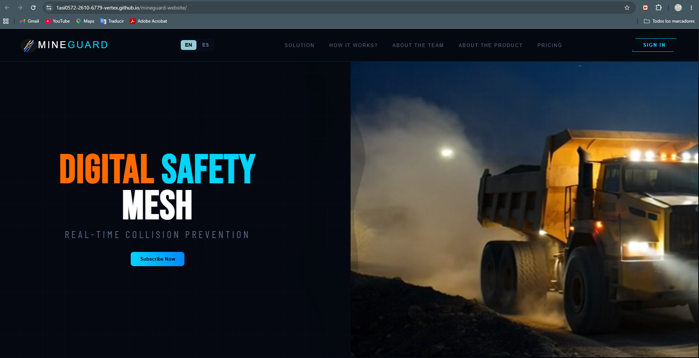
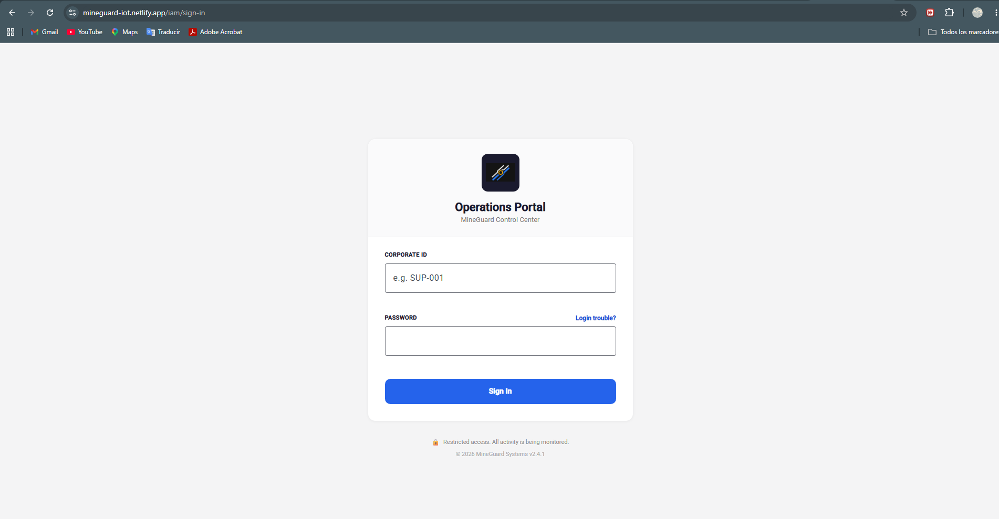
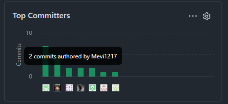
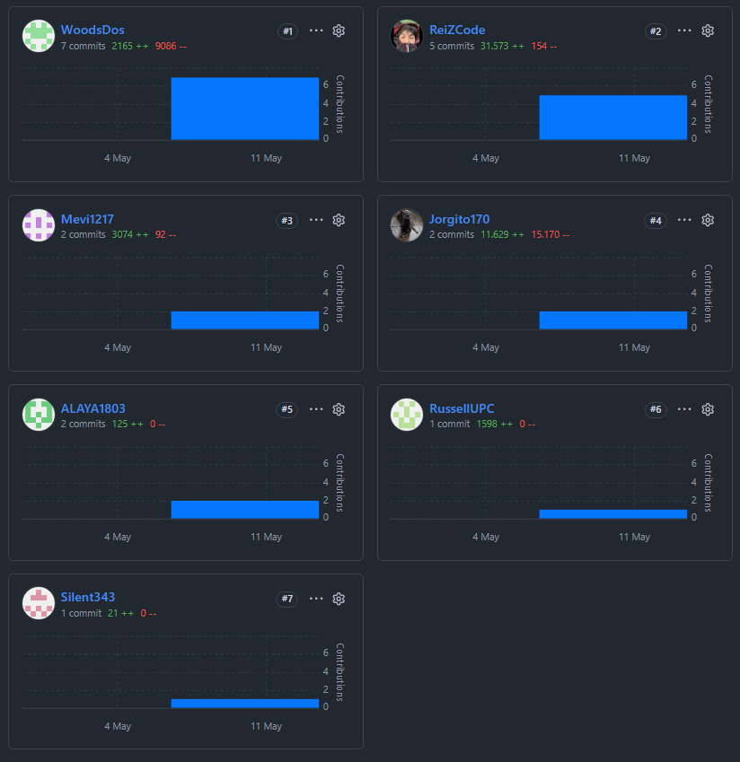

## 6.2.1. Sprint 1

### 6.2.1.1. Sprint Planning 1

| Field | Value |
|---|---|
| Sprint # | Sprint 1 |
| Sprint Planning Background | Primera entrega integrada del producto, enfocada en la presentación pública de la propuesta de valor y en la base operativa inicial de MineGuard para monitoreo y acceso. |
| Date | 2026-05-14 |
| Prepared By | Alaya Cabrera Rodrigo |
| Attendees (to planning meeting) | Alaya Cabrera Rodrigo/Jorge Enrique Guevara Tejada/Gordon Salas Gabriel Fernando/Melgarejo Gomez Marcia Victoria/Renato Sebastian Rubber Zegarra Lopez/Russell Stephen Romero Qwistgaard/Gonzales Alvarado Javier Sebastian |
| Sprint 0 Review Summary | No aplica. |
| Sprint 0 Retrospective Summary | No aplica. |
| Sprint Goal & User Stories | Consolidar la primera versión visible del producto, habilitando el landing page de presentación comercial y la base funcional mínima de la web application para acceso, monitoreo y alertas. |
| Sprint 1 Goal | Our focus is on delivering the first public experience of MineGuard and the initial operational base for monitoring. We believe it delivers clarity to visitors and early operational visibility to supervisors. This will be confirmed when the landing page is available, the core access flow works, and the monitoring views for zones, alerts and sensors are ready for review. |
| Sprint 1 Velocity | 39 |
| Sum of Story Points | 39 |

**User Stories included in Sprint 1**

| Order | User Story Id | Title | Description | Story Points |
|---|---:|---|---|---:|
| 1 | US25 | Explorar soluciones corporativas | Como visitante del segmento de Empresas Mineras quiero conocer las soluciones disponibles para entender cómo optimizar la seguridad de mi flota autónoma. | 3 |
| 2 | US26 | Conocer el funcionamiento técnico | Como visitante del segmento de Empresas Mineras quiero comprender el funcionamiento de la plataforma para validar su integración con mis operaciones actuales. | 3 |
| 3 | US28 | Registro para empresas | Como visitante del segmento de Empresas Mineras quiero registrarme para solicitar una implementación en mi unidad minera. | 5 |
| 4 | US01 | Inicio de sesión del conductor | Como conductor quiero iniciar sesión antes de conducir para acceder a mi información. | 5 |
| 5 | US02 | Selección de vehículo | Como conductor quiero seleccionar el vehículo asignado antes de iniciar operación para asociarme correctamente al sistema. | 5 |
| 6 | US08 | Monitoreo de zonas | Como supervisor quiero visualizar el estado de las zonas para identificar riesgos operativos en tiempo real. | 8 |
| 7 | US10 | Gestión de alertas | Como supervisor quiero gestionar alertas generadas para tomar decisiones operativas oportunas. | 5 |
| 8 | US16 | Monitoreo de sensores | Como supervisor quiero visualizar el estado de los sensores para asegurar su correcto funcionamiento. | 5 |

### 6.2.1.2. Aspect Leaders and Collaborators

| Team Member (Last Name, First Name) | GitHub Username | Landing Page | IAM / Auth | Monitoring / Alerts | Analytics / Dashboard | Resources / Planning |
|---|---|---|---|---|---|---|
|	Alaya Cabrera Rodrigo  | ALAYA1803 | L |  |  |  | L |
| Jorge Enrique Guevara Tejada | Jorgito170 | C | C |  |  |  |
| Gordon Salas Gabriel Fernando | Silent343 | C |  |  | C |  |
| Melgarejo Gomez Marcia Victoria  | Mevi1217 | C |  | C | C |  |
| Renato Sebastian Rubber Zegarra Lopez | ReiZCode | C |  | C |  |  |
| Russell Stephen Romero Qwistgaard | RussellUPC | C |  |  |  | C |
| Gonzales Alvarado Javier Sebastian | WoodsDos | C |  |  | C |  |

### 6.2.1.3. Sprint Backlog 1

En este sprint se priorizó la entrega del landing page público y la base operativa de la aplicación web. El backlog se organizó para que el trabajo visible del producto y la lógica mínima de acceso, monitoreo y alertas quedaran listos para revisión.

| Sprint # | User Story Id | User Story Title | User Story Description | Story Points | Work-Item / Task Id | Work-Item / Task Title | Work-Item / Task Description | Estimation (Hours) | Assigned To | Status |
|---|---|---|---|---:|---|---|---|---:|---|---|
| Sprint 1 | US25 | Explorar soluciones corporativas | Como visitante del segmento de Empresas Mineras quiero conocer las soluciones disponibles para entender cómo optimizar la seguridad de mi flota autónoma. | 3 | TK01 | Landing Page: propuesta de valor | Estructurar la sección principal de soluciones corporativas y sus llamados a la acción. | 6 |  | Done |
| Sprint 1 | US26 | Conocer el funcionamiento técnico | Como visitante del segmento de Empresas Mineras quiero comprender el funcionamiento de la plataforma para validar su integración con mis operaciones actuales. | 3 | TK02 | Landing Page: explicación del funcionamiento | Desarrollar la sección “How it works” y el flujo explicativo del producto. | 6 |  | Done |
| Sprint 1 | US28 | Registro para empresas | Como visitante del segmento de Empresas Mineras quiero registrarme para solicitar una implementación en mi unidad minera. | 5 | TK03 | Landing Page: conversión corporativa | Implementar el bloque de registro/contacto para empresas y su vínculo con la app. | 10 |  | Done |
| Sprint 1 | US01 | Inicio de sesión del conductor | Como conductor quiero iniciar sesión antes de conducir para acceder a mi información. | 5 | TK04 | Web App: acceso inicial | Preparar la base del flujo de autenticación del conductor. | 8 |  | Done |
| Sprint 1 | US02 | Selección de vehículo | Como conductor quiero seleccionar el vehículo asignado antes de iniciar operación para asociarme correctamente al sistema. | 5 | TK05 | Web App: selección de vehículo | Implementar el flujo inicial de asociación conductor-vehículo. | 8 |  | Done |
| Sprint 1 | US08 | Monitoreo de zonas | Como supervisor quiero visualizar el estado de las zonas para identificar riesgos operativos en tiempo real. | 8 | TK06 | Web App: monitoreo geográfico | Construir la vista de zonas y su estado operativo. | 10 |  | Done |
| Sprint 1 | US10 | Gestión de alertas | Como supervisor quiero gestionar alertas generadas para tomar decisiones operativas oportunas. | 5 | TK07 | Web App: gestión de alertas | Implementar la interfaz y la lógica base para revisión/priorización de alertas. | 8 |  | Done |
| Sprint 1 | US16 | Monitoreo de sensores | Como supervisor quiero visualizar el estado de los sensores para asegurar su correcto funcionamiento. | 5 | TK08 | Web App: monitoreo de sensores | Mostrar estado de sensores y su disponibilidad operativa. | 8 |  | Done |

### 6.2.1.4. Development Evidence for Sprint Review

En este sprint se consolidaron dos frentes de trabajo. En el landing page se avanzó desde la navegación y la propuesta de valor hasta secciones informativas, footer, suscripción y ajustes responsive. En la web application se construyó la base técnica con configuración inicial, IAM, dashboard, monitoring, analytics, resources y planning.

**Landing Page Repository:** https://github.com/1ASI0572-2610-6779-Vertex/mineguard-website

| Repository | Branch | Commit Id | Commit Message | Commit Message Body | Commited on (Date) |
|---|---|---|---|---|---|
| landing-page | origin/feature/nav | 6839e9f | feat: added nav design and i18n logic | — | — |
| landing-page | origin/feature/solution | 1381fe0 | feat():Add solition section | — | — |
| landing-page | origin/feature/solution | 0a64f9a | fix():Change css desing | — | — |
| landing-page | origin/feature/how-it-works | 61a0223 | Feat: add how it works section | — | — |
| landing-page | origin/feature/about-the-team-and-product | 1e750cc | feat(): add about the team and about the product sections | — | — |
| landing-page | origin/feature/faq | b9133de | feat: add faq section | — | — |
| landing-page | origin/feature/subscription | c6b1215 | Add subscription section and styles | — | — |
| landing-page | origin/feature/footer | 75dbce6 | feat(feature/footer): add complete footer layout with HTML and CSS styling | — | — |
| landing-page | origin/feature/footer | 7c5a856 | feat(feature/footer): add terms page with footer links and project README | — | — |
| landing-page | origin/feat/responsive | eb6443e | feat(): add responsive web design | — | — |
| landing-page | origin/feat/responsive | 68499f0 | feat(): add responsive small mobile responsive | — | — |
| landing-page | origin/hotfix/team-section-overflow | eb448b4 | fix(): resolve about team section overflow | — | — |

**Web Application Repository:** https://github.com/1ASI0572-2610-6779-Vertex/mineguard-webapp

| Repository | Branch | Commit Id | Commit Message | Commit Message Body | Commited on (Date) |
|---|---|---|---|---|---|
| web-application | origin/feature/config | f29ff1d | feat: configure angular frontend | — | — |
| web-application | origin/feature/iam | ae99a48 | feat(iam): scaffold IAM bounded context with shared DDD layers and auth setup | — | — |
| web-application | origin/feature/dashboard | 38cfd85 | feat():Add dashboard page | — | — |
| web-application | origin/feature/dashboard | 7da95f9 | feat():Add dashboard and Analytics | — | — |
| web-application | origin/feature/dashboard | 5a19409 | feat():Add dashboard and Analytic | — | — |
| web-application | origin/feature/monitoring | 9c7db5a | Feat: add monitoring bc logic | — | — |
| web-application | origin/feature/monitoring | 4493c3e | Feat: add views monitoring BC | — | — |
| web-application | origin/feature/resources | c212d8d | Add assets bounded context (fleet & drivers) | — | — |
| web-application | origin/feature/analytics | 7dfecfd | feat():add analytics models notice and summary | — | — |
| web-application | origin/feature/analytics | 6c30f22 | feat(): add analytics infrastructure | — | — |
| web-application | origin/feature/analytics | 688e1fc | feat(): add analytics presentation | — | — |
| web-application | origin/feature/analytics | 12ff519 | fix(): analytics api | — | — |
| web-application | origin/feature/planing | aa206dd | feat: aggregate logic of planing of live mapping | — | — |
| web-application | origin/feature/planing | 8c2c2ab | feat: logic of the planing | — | — |
| web-application | origin/feature/analytics | 0c68762 | feat():add report and analytics | — | — |
| web-application | origin/feature/iam | 83a3543 | docs(feat/iam): add user stories,diagrams and readme | — | — |
| web-application | origin/feature/licence | a08e936 | Add MIT License to the project | — | — |

### 6.2.1.5. Execution Evidence for Sprint Review

En esta sección deben insertarse las capturas de las vistas principales implementadas durante el Sprint 1. Para este sprint, las evidencias visuales mínimas sugeridas son:

| Evidence | Suggested Screenshots / Views |
|---|---|
| Landing Page | Nav con i18n, sección de solución, sección “how it works”, about the team, about the product, FAQ, subscription, footer y corrección del overflow en mobile. |
| Web Application | Configuración inicial, base de IAM, dashboard, monitoring, analytics, resources y planning. |
| Responsive Validation | Vista desktop y mobile de las secciones principales del landing page. |

**Video de ejecución del Sprint:**  
https://upcedupe-my.sharepoint.com/:v:/g/personal/u202311558_upc_edu_pe/IQBHgmq8mmaLTIVOJdzcH6V8AU_hHsDqC7EfKRFUE62LxZA?nav=eyJyZWZlcnJhbEluZm8iOnsicmVmZXJyYWxBcHAiOiJTdHJlYW1XZWJBcHAiLCJyZWZlcnJhbFZpZXciOiJTaGFyZURpYWxvZy1MaW5rIiwicmVmZXJyYWxBcHBQbGF0Zm9ybSI6IldlYiIsInJlZmVycmFsTW9kZSI6InZpZXcifX0%3D&e=Ka50P7

### 6.2.1.6. Services Documentation Evidence for Sprint Review

La documentación de servicios de este sprint se organizó a partir de los recursos del `db.json`, enfocándose en autenticación, monitoreo, alertas, tablero y datos comerciales. La documentación OpenAPI puede agruparse por módulos de negocio y por tipo de consumo.

**MockAPI repository** https://github.com/1ASI0572-2610-6779-Vertex/mineguard-api

| Module | Documented Resources | Main Actions | Sprint Relevance |
|---|---|---|---|
| Identity & Access | `/userRoles`, `/companies`, `/users`, `/supervisors` | GET, POST, PUT/PATCH, DELETE | Base para login, roles y acceso. |
| Commercial | `/plans`, `/subscriptions` | GET, POST, PUT/PATCH, DELETE | Soporta el landing page y el modelo de suscripción. |
| Fleet & Drivers | `/drivers`, `/vehicles`, `/trips` | GET, POST, PUT/PATCH, DELETE | Base operativa para conductor, vehículo y viaje. |
| Monitoring | `/sensors`, `/sensorReadings`, `/alerts`, `/incidents` | GET, POST, PUT/PATCH, DELETE | Núcleo del monitoreo en tiempo real y gestión de alertas. |
| Geofencing | `/geofenceZones`, `/zoneBoundaries`, `/zonePermissions` | GET, POST, PUT/PATCH, DELETE | Soporta el monitoreo de zonas y las rutas restringidas. |
| Dashboard & Analytics | `/dashboardSummary`, `/dashboardTrend`, `/dashboardRiskDrivers`, `/dashboardRecentAlerts`, `/analyticsFatigueBars`, `/analyticsIncidentDistribution`, `/analyticsHistoryRows`, `/analyticsInsights` | GET | Soporta la visualización ejecutiva y analítica del sprint. |

### 6.2.1.7. Software Deployment Evidence for Sprint Review

En este sprint se dejó preparada la base de despliegue de los productos del alcance: landing page, web application y mock service/documented API. El objetivo de esta sección es mostrar cómo se publican y validan los artefactos construidos a partir de los repositorios.

| Artifact | Deployment Status | URL / Environment |
|---|---|---|
| Landing Page | Preparado para despliegue estático | https://1asi0572-2610-6779-vertex.github.io/mineguard-website/ |
| Web Application | Preparado para ejecución/publicación | https://mineguard-iot.netlify.app/ |
| Services / Mock API | Preparado para documentación y consumo | https://mineguard-api-wmr0.onrender.com |

### 6.2.1.8. Team Collaboration Insights during Sprint

Durante el Sprint 1 el equipo trabajó en dos líneas paralelas. La primera se centró en el landing page, donde se desarrollaron la navegación, la propuesta de valor, la explicación de funcionamiento, las secciones informativas, la suscripción, el footer y los ajustes responsive. La segunda línea se enfocó en la web application, comenzando por la configuración del frontend, la base de IAM, el dashboard, el monitoreo, las analíticas, los recursos de flota y la lógica de planificación.

La evidencia de commits muestra una evolución progresiva del producto, desde la base técnica y la estructura visual hasta la integración de módulos funcionales de negocio. También se observa trabajo de corrección y refinamiento, especialmente en responsive design, overflow handling y soporte de secciones informativas. En conjunto, el sprint dejó una base sólida para continuar con módulos de mayor profundidad operativa en los siguientes ciclos.

