### 6.2.2. Sprint 2

#### 6.2.2.1. Sprint Planning 2

En esta sección se presenta el resumen de la reunión de Sprint Planning correspondiente al Sprint 2 del proyecto MineGuard. Durante esta sesión, el equipo revisó los resultados obtenidos en el Sprint anterior, analizó oportunidades de mejora identificadas en la retrospectiva y definió el alcance funcional y técnico para la nueva iteración.

El objetivo principal de esta reunión fue priorizar los User Stories y tareas que aportan mayor valor a la solución, enfocándose en consolidar la integración entre dispositivos IoT, servicios backend, aplicaciones web y móviles, así como la generación y visualización de alertas críticas en tiempo real. Asimismo, se estableció el Sprint Goal, alineando al equipo en torno a un objetivo común y asegurando coherencia en la ejecución del trabajo comprometido.

| Sprint # | Sprint 2 |
|---|---|
| **Sprint Planning Background** |  |
| **Date** | 2026-05-28 |
| **Time** | 08:00 PM |
| **Location** | Virtual Meeting (Google Meet / Discord) |
| **Prepared By** | Rodrigo Alaya |
| **Attendees (to planning meeting)** | Rodrigo Alaya / Jorge Guevara / Gabriel Gordon / Russell Romero / Marcia Melgarejo / Renato Zegarra / Javier Gonzales |
| **Sprint n−1 Review Summary** | Durante el Sprint 1 se definió la arquitectura base de MineGuard y se establecieron los primeros componentes funcionales de la solución, incluyendo la Landing Page inicial, la estructura del sistema frontend y la definición de los flujos de monitoreo y alertas. |
| **Sprint n−1 Retrospective Summary** | El equipo identificó la necesidad de mejorar la descomposición de User Stories en tareas más claras, fortalecer la distribución de responsabilidades y optimizar la trazabilidad del trabajo en Trello para mejorar la coordinación interna. |
| **Sprint Goal & User Stories** |  |
| **Sprint n Goal** | Our focus is on delivering the first fully integrated functional flow of MineGuard, connecting embedded IoT devices, edge processing, backend services, web dashboard, and mobile application. We believe it delivers real-time operational risk detection and monitoring capabilities to drivers and supervisors in mining environments, improving safety response and decision-making. This will be confirmed when the system successfully captures telemetry, processes risk events, generates critical alerts, and displays operational information through the dashboard and mobile interfaces during prototype validation. |
| **Sprint n Velocity** | 278 Story Points |
| **Sum of Story Points** | 278 Story Points |

#### 6.2.2.2. Aspect Leaders and Collaborators

Durante el Sprint 2 del proyecto MineGuard, el equipo identificó un conjunto de aspectos clave con el objetivo de organizar responsabilidades y mejorar la eficiencia de la colaboración durante el desarrollo. Estos aspectos representan los principales dominios funcionales y técnicos abordados en el Sprint, incluyendo la integración de telemetría y sensores, el procesamiento de eventos, la gestión de alertas, los servicios backend, la visualización de dashboards y los controles de seguridad.

Con el fin de optimizar la coordinación y brindar mayor claridad en la distribución de responsabilidades, se definió una **Leadership-and-Collaboration Matrix (LACX)**. Esta matriz asigna un **Leader (L)** encargado de la toma de decisiones y dirección técnica en cada aspecto, mientras que los demás integrantes participan como **Collaborators (C)**, apoyando en las actividades de implementación y validación.

| Team Member (Last Name, First Name) | GitHub Username | Telemetry & Sensor Integration | Risk Detection & Alert Engine | Backend Services & APIs | Dashboard & Reporting | Real-time Notifications | Security & Session Management | Resource & Vehicle Management |
| ----------------------------------- | --------------- | ------------------------------ | ----------------------------- | ----------------------- | --------------------- | ----------------------- | ----------------------------- | ----------------------------- |
| Alaya, Rodrigo                    | ALAYA1803  | C                              | C                             | **L**                   | C                     | C                       | C                             | C                             |
| Gordon, Gabriel                      | Silent343    | **L**                          | C                             | C                       | C                     | C                       | C                             | C                             |
| Guevara, Jorge                      | Jorgito170    | C                              | **L**                         | C                       | C                     | C                       | C                             | C                             |
| Melgarejo, Marcia                     | Mevi1217   | C                              | C                             | C                       | **L**                 | C                       | C                             | C                             |
| Zegarra, Renato                     | ReiZCode   | C                              | C                             | C                       | C                     | **L**                   | C                             | C                             |
| Gonzales, Javier                   | WoodsDos | C                              | C                             | C                       | C                     | C                       | **L**                         | C                             |
| Romero, Russell                     | RussellUPC   | C                              | C                             | C                       | C                     | C                       | C                             | **L**                         |


#### 6.2.2.3. Sprint Backlog 2

Durante el desarrollo del Sprint 2 del proyecto MineGuard, se definió y gestionó el Sprint Backlog con el objetivo de implementar funcionalidades clave orientadas al monitoreo inteligente de seguridad minera mediante dispositivos IoT, servicios backend y aplicaciones web y móviles. Este Sprint se enfocó principalmente en la integración de sensores para detección de fatiga, proximidad y ubicación, así como en la generación de alertas críticas, gestión de recursos y visualización de información operativa en tiempo real.

Para la gestión y seguimiento de las actividades, se utilizó Trello como herramienta de control ágil, permitiendo organizar los User Stories priorizados y su respectiva descomposición en Work-items/Tasks, asegurando trazabilidad, asignación de responsabilidades y control del progreso del Sprint.

A continuación, se presenta el tablero correspondiente al Sprint en Trello, junto con el enlace público del Board y la tabla de descomposición de User Stories en tareas específicas.

<br>

Link Trello: 'https://trello.com/invite/b/6a18738fdcc14f1067d4613c/ATTIdca68ff300327e7aca6d43d40a519f32239633B4/sprint-2-mineguard'

<br>

| Sprint # | User Story Id | Título de User Story | Work-Item / Task Id | Título del Work-Item / Task | Descripción | Estimación (Horas) | Asignado a | Estado |
|---|---|---|---|---|---|---:|---|---|
| Sprint 2 | US05 | Alerta de proximidad | US05-001 | Definir umbrales configurables de distancia y velocidad para activar alertas de proximidad. | Definir umbrales configurables de distancia y velocidad para activar alertas de proximidad. | 4 | Rodrigo Alaya | Done |
| Sprint 2 | US05 | Alerta de proximidad | US05-002 | Implementar lógica para evaluar la telemetría del HC-SR04 y generar eventos de advertencia al superar el umbral. | Implementar lógica para evaluar la telemetría del HC-SR04 y generar eventos de advertencia al superar el umbral. | 4 | Jorge Guevara | Done |
| Sprint 2 | US05 | Alerta de proximidad | US05-003 | Crear componentes preventivos de alerta visual y sonora en el dispositivo de cabina. | Crear componentes preventivos de alerta visual y sonora en el dispositivo de cabina. | 4 | Gabriel Gordon | Done |
| Sprint 2 | US05 | Alerta de proximidad | US05-004 | Escalar la prioridad de la alerta cuando la distancia siga disminuyendo a un nivel crítico y registrar el evento. | Escalar la prioridad de la alerta cuando la distancia siga disminuyendo a un nivel crítico y registrar el evento. | 4 | Russell Romero | Done |
| Sprint 2 | US06 | Alerta de colisión | US06-001 | Definir el umbral de distancia crítica que diferencia una alerta de colisión inminente de una advertencia de proximidad. | Definir el umbral de distancia crítica que diferencia una alerta de colisión inminente de una advertencia de proximidad. | 4 | Marcia Melgarejo | Done |
| Sprint 2 | US06 | Alerta de colisión | US06-002 | Implementar lógica de escalamiento desde alerta de proximidad hacia nivel crítico de colisión. | Implementar lógica de escalamiento desde alerta de proximidad hacia nivel crítico de colisión. | 3 | Renato Zegarra | Done |
| Sprint 2 | US06 | Alerta de colisión | US06-003 | Activar buzzer de alta frecuencia y LED rojo fijo ante una alerta crítica de colisión en cabina. | Activar buzzer de alta frecuencia y LED rojo fijo ante una alerta crítica de colisión en cabina. | 3 | Javier Gonzales | Done |
| Sprint 2 | US06 | Alerta de colisión | US06-004 | Publicar el evento crítico de colisión mediante MQTT hacia el backend con identificador del vehículo y marca de tiempo. | Publicar el evento crítico de colisión mediante MQTT hacia el backend con identificador del vehículo y marca de tiempo. | 3 | Rodrigo Alaya | Done |
| Sprint 2 | US06 | Alerta de colisión | US06-005 | Desactivar automáticamente las alertas visuales y sonoras cuando los vehículos ya no estén en proximidad conflictiva. | Desactivar automáticamente las alertas visuales y sonoras cuando los vehículos ya no estén en proximidad conflictiva. | 3 | Jorge Guevara | Done |
| Sprint 2 | US07 | Alerta de fatiga por sensor de pulso | US07-001 | Definir rangos de BPM considerados indicadores de fatiga según un umbral configurable. | Definir rangos de BPM considerados indicadores de fatiga según un umbral configurable. | 4 | Gabriel Gordon | Done |
| Sprint 2 | US07 | Alerta de fatiga por sensor de pulso | US07-002 | Implementar lectura continua del sensor SP-203 con filtro de promedio móvil en el ESP32. | Implementar lectura continua del sensor SP-203 con filtro de promedio móvil en el ESP32. | 3 | Russell Romero | Done |
| Sprint 2 | US07 | Alerta de fatiga por sensor de pulso | US07-003 | Activar mensaje LCD, LED rojo intermitente y alarma de buzzer cuando se supere el umbral de fatiga. | Activar mensaje LCD, LED rojo intermitente y alarma de buzzer cuando se supere el umbral de fatiga. | 3 | Marcia Melgarejo | Done |
| Sprint 2 | US07 | Alerta de fatiga por sensor de pulso | US07-004 | Publicar evento de fatiga con valor BPM y marca de tiempo hacia el broker MQTT. | Publicar evento de fatiga con valor BPM y marca de tiempo hacia el broker MQTT. | 3 | Renato Zegarra | Done |
| Sprint 2 | US07 | Alerta de fatiga por sensor de pulso | US07-005 | Escalar la severidad de la alerta y registrar el incidente cuando los valores anómalos persistan durante un periodo continuo. | Escalar la severidad de la alerta y registrar el incidente cuando los valores anómalos persistan durante un periodo continuo. | 3 | Javier Gonzales | Done |
| Sprint 2 | US13 | Recepción de alertas en dispositivo móvil del supervisor | US13-001 | Configurar el servicio de notificaciones push para dispositivos móviles del supervisor. | Configurar el servicio de notificaciones push para dispositivos móviles del supervisor. | 3 | Rodrigo Alaya | Done |
| Sprint 2 | US13 | Recepción de alertas en dispositivo móvil del supervisor | US13-002 | Vincular eventos críticos del backend, como fatiga, colisión y pánico, con el servicio de envío de notificaciones. | Vincular eventos críticos del backend, como fatiga, colisión y pánico, con el servicio de envío de notificaciones. | 3 | Jorge Guevara | Done |
| Sprint 2 | US13 | Recepción de alertas en dispositivo móvil del supervisor | US13-003 | Diseñar plantilla de notificación con tipo de alerta, zona, vehículos involucrados y marca de tiempo. | Diseñar plantilla de notificación con tipo de alerta, zona, vehículos involucrados y marca de tiempo. | 2 | Gabriel Gordon | Done |
| Sprint 2 | US13 | Recepción de alertas en dispositivo móvil del supervisor | US13-004 | Validar la tasa de entrega y latencia de notificaciones bajo condiciones variables de red. | Validar la tasa de entrega y latencia de notificaciones bajo condiciones variables de red. | 2 | Russell Romero | Done |
| Sprint 2 | US24 | Priorización de alertas | US24-001 | Definir niveles de prioridad de alerta: crítica, alta, media y baja, con criterios de clasificación por tipo. | Definir niveles de prioridad de alerta: crítica, alta, media y baja, con criterios de clasificación por tipo. | 3 | Marcia Melgarejo | Done |
| Sprint 2 | US24 | Priorización de alertas | US24-002 | Implementar lógica de ordenamiento y agrupación de alertas entrantes por nivel de prioridad. | Implementar lógica de ordenamiento y agrupación de alertas entrantes por nivel de prioridad. | 3 | Renato Zegarra | Done |
| Sprint 2 | US24 | Priorización de alertas | US24-003 | Mostrar una cola de alertas priorizada en el dashboard del supervisor con indicadores visuales de severidad. | Mostrar una cola de alertas priorizada en el dashboard del supervisor con indicadores visuales de severidad. | 2 | Javier Gonzales | Done |
| Sprint 2 | US24 | Priorización de alertas | US24-004 | Asegurar que las alertas críticas se envíen y visualicen antes que las de menor prioridad. | Asegurar que las alertas críticas se envíen y visualicen antes que las de menor prioridad. | 2 | Rodrigo Alaya | Done |
| Sprint 2 | US09 | Visualización de vehículos por zona | US09-001 | Integrar datos GPS en vivo de cada vehículo activo en el mapa del dashboard del supervisor. | Integrar datos GPS en vivo de cada vehículo activo en el mapa del dashboard del supervisor. | 3 | Jorge Guevara | Done |
| Sprint 2 | US09 | Visualización de vehículos por zona | US09-002 | Mostrar marcadores diferenciados de vehículos por estado: normal, alerta y mantenimiento. | Mostrar marcadores diferenciados de vehículos por estado: normal, alerta y mantenimiento. | 3 | Gabriel Gordon | Done |
| Sprint 2 | US09 | Visualización de vehículos por zona | US09-003 | Registrar la hora de ingreso a zona de cada unidad vehicular detectada por los sensores. | Registrar la hora de ingreso a zona de cada unidad vehicular detectada por los sensores. | 2 | Russell Romero | Done |
| Sprint 2 | US09 | Visualización de vehículos por zona | US09-004 | Actualizar automáticamente la zona asociada al vehículo con cada nueva lectura de ubicación. | Actualizar automáticamente la zona asociada al vehículo con cada nueva lectura de ubicación. | 2 | Marcia Melgarejo | Done |
| Sprint 2 | US12 | Configuración de rutas de vehículos pesados | US12-001 | Diseñar interfaz de trazado de rutas en el mapa para que los supervisores definan rutas por tramos para vehículos pesados. | Diseñar interfaz de trazado de rutas en el mapa para que los supervisores definan rutas por tramos para vehículos pesados. | 2 | Renato Zegarra | Done |
| Sprint 2 | US12 | Configuración de rutas de vehículos pesados | US12-002 | Guardar la configuración de rutas en la base de datos con asociación al tipo de vehículo mediante POST /routes. | Guardar la configuración de rutas en la base de datos con asociación al tipo de vehículo mediante POST /routes. | 2 | Javier Gonzales | Done |
| Sprint 2 | US12 | Configuración de rutas de vehículos pesados | US12-003 | Implementar lógica de detección de desvíos cuando un vehículo pesado abandone su ruta asignada. | Implementar lógica de detección de desvíos cuando un vehículo pesado abandone su ruta asignada. | 2 | Rodrigo Alaya | Done |
| Sprint 2 | US12 | Configuración de rutas de vehículos pesados | US12-004 | Generar alerta al supervisor cuando se detecte un conflicto de ruta entre tipos de vehículos. | Generar alerta al supervisor cuando se detecte un conflicto de ruta entre tipos de vehículos. | 2 | Jorge Guevara | Done |
| Sprint 2 | US12 | Configuración de rutas de vehículos pesados | US12-005 | Rechazar la configuración de ruta y notificar al supervisor cuando se envíen tramos inválidos o inconsistentes. | Rechazar la configuración de ruta y notificar al supervisor cuando se envíen tramos inválidos o inconsistentes. | 2 | Gabriel Gordon | Done |
| Sprint 2 | US02 | Selección de vehículo | US02-001 | Crear pantalla de selección de vehículo mostrando solo unidades disponibles no asignadas. | Crear pantalla de selección de vehículo mostrando solo unidades disponibles no asignadas. | 3 | Russell Romero | Done |
| Sprint 2 | US02 | Selección de vehículo | US02-002 | Filtrar la lista de vehículos por estado: disponible, en uso y mantenimiento. | Filtrar la lista de vehículos por estado: disponible, en uso y mantenimiento. | 3 | Marcia Melgarejo | Done |
| Sprint 2 | US02 | Selección de vehículo | US02-003 | Registrar la asociación conductor-vehículo al confirmar la selección mediante POST /operations/start. | Registrar la asociación conductor-vehículo al confirmar la selección mediante POST /operations/start. | 2 | Renato Zegarra | Done |
| Sprint 2 | US02 | Selección de vehículo | US02-004 | Bloquear la selección y mostrar advertencia si el vehículo ya está asignado a otro conductor. | Bloquear la selección y mostrar advertencia si el vehículo ya está asignado a otro conductor. | 2 | Javier Gonzales | Done |
| Sprint 2 | US14 | Registro de conductores | US14-001 | Crear formulario de registro de conductor con campos de ID, nombre, licencia, turno y estado. | Crear formulario de registro de conductor con campos de ID, nombre, licencia, turno y estado. | 2 | Rodrigo Alaya | Done |
| Sprint 2 | US14 | Registro de conductores | US14-002 | Implementar endpoint POST /drivers para guardar un nuevo registro de conductor en la base de datos. | Implementar endpoint POST /drivers para guardar un nuevo registro de conductor en la base de datos. | 2 | Jorge Guevara | Done |
| Sprint 2 | US14 | Registro de conductores | US14-003 | Validar la unicidad del ID del conductor antes de permitir el registro. | Validar la unicidad del ID del conductor antes de permitir el registro. | 1 | Gabriel Gordon | Done |
| Sprint 2 | US14 | Registro de conductores | US14-004 | Mostrar lista de conductores registrados con opciones de edición y desactivación. | Mostrar lista de conductores registrados con opciones de edición y desactivación. | 1 | Russell Romero | Done |
| Sprint 2 | US15 | Registro de vehículos | US15-001 | Crear formulario de registro de vehículo con campos de placa, tipo, capacidad y estado. | Crear formulario de registro de vehículo con campos de placa, tipo, capacidad y estado. | 2 | Marcia Melgarejo | Done |
| Sprint 2 | US15 | Registro de vehículos | US15-002 | Implementar endpoint POST /vehicles para guardar un nuevo registro de vehículo en la base de datos. | Implementar endpoint POST /vehicles para guardar un nuevo registro de vehículo en la base de datos. | 2 | Renato Zegarra | Done |
| Sprint 2 | US15 | Registro de vehículos | US15-003 | Validar la unicidad de la placa antes de confirmar el registro. | Validar la unicidad de la placa antes de confirmar el registro. | 1 | Javier Gonzales | Done |
| Sprint 2 | US15 | Registro de vehículos | US15-004 | Mostrar lista de vehículos con filtro por estado: activo, en uso y mantenimiento. | Mostrar lista de vehículos con filtro por estado: activo, en uso y mantenimiento. | 1 | Rodrigo Alaya | Done |
| Sprint 2 | US40 | Registro de conductores por supervisor | US40-001 | Implementar formulario rápido de alta de conductor accesible desde el panel de operaciones diarias. | Implementar formulario rápido de alta de conductor accesible desde el panel de operaciones diarias. | 3 | Jorge Guevara | Done |
| Sprint 2 | US40 | Registro de conductores por supervisor | US40-002 | Generar automáticamente credenciales temporales de acceso para el conductor recién registrado. | Generar automáticamente credenciales temporales de acceso para el conductor recién registrado. | 3 | Gabriel Gordon | Done |
| Sprint 2 | US40 | Registro de conductores por supervisor | US40-003 | Notificar al conductor registrado sus credenciales iniciales mediante la app o correo electrónico. | Notificar al conductor registrado sus credenciales iniciales mediante la app o correo electrónico. | 2 | Russell Romero | Done |
| Sprint 2 | US40 | Registro de conductores por supervisor | US40-004 | Reflejar inmediatamente al nuevo conductor en la lista operativa activa del día. | Reflejar inmediatamente al nuevo conductor en la lista operativa activa del día. | 2 | Marcia Melgarejo | Done |
| Sprint 2 | US45 | Gestión de estado de mantenimiento de vehículos | US45-001 | Implementar la acción “Marcar como Mantenimiento” en el panel de gestión de vehículos. | Implementar la acción “Marcar como Mantenimiento” en el panel de gestión de vehículos. | 2 | Renato Zegarra | Done |
| Sprint 2 | US45 | Gestión de estado de mantenimiento de vehículos | US45-002 | Actualizar el estado del vehículo a “Mantenimiento” en la base de datos y excluirlo de la lista de selección de conductores. | Actualizar el estado del vehículo a “Mantenimiento” en la base de datos y excluirlo de la lista de selección de conductores. | 2 | Javier Gonzales | Done |
| Sprint 2 | US45 | Gestión de estado de mantenimiento de vehículos | US45-003 | Mostrar un indicador de mantenimiento en el mapa y en la lista de vehículos para las unidades afectadas. | Mostrar un indicador de mantenimiento en el mapa y en la lista de vehículos para las unidades afectadas. | 2 | Rodrigo Alaya | Done |
| Sprint 2 | US45 | Gestión de estado de mantenimiento de vehículos | US45-004 | Registrar la fecha y motivo de mantenimiento en el historial de eventos del vehículo. | Registrar la fecha y motivo de mantenimiento en el historial de eventos del vehículo. | 2 | Jorge Guevara | Done |
| Sprint 2 | US45 | Gestión de estado de mantenimiento de vehículos | US45-005 | Restaurar el vehículo al estado “Activo” y habilitar su selección cuando el supervisor confirme la reparación. | Restaurar el vehículo al estado “Activo” y habilitar su selección cuando el supervisor confirme la reparación. | 2 | Gabriel Gordon | Done |
| Sprint 2 | US18 | Consulta de historial | US18-001 | Implementar endpoint GET /events/history con filtros por rango de fechas, conductor y tipo de evento. | Implementar endpoint GET /events/history con filtros por rango de fechas, conductor y tipo de evento. | 3 | Russell Romero | Done |
| Sprint 2 | US18 | Consulta de historial | US18-002 | Mostrar lista paginada de eventos con tipo de alerta, zona y hora del incidente por fila. | Mostrar lista paginada de eventos con tipo de alerta, zona y hora del incidente por fila. | 3 | Marcia Melgarejo | Done |
| Sprint 2 | US18 | Consulta de historial | US18-003 | Mostrar vista de detalle del incidente con conductor, vehículo, coordenadas GPS y marca de tiempo al seleccionar una fila. | Mostrar vista de detalle del incidente con conductor, vehículo, coordenadas GPS y marca de tiempo al seleccionar una fila. | 2 | Renato Zegarra | Done |
| Sprint 2 | US18 | Consulta de historial | US18-004 | Permitir exportar el historial filtrado a CSV o PDF. | Permitir exportar el historial filtrado a CSV o PDF. | 2 | Javier Gonzales | Done |
| Sprint 2 | US19 | Reporte de alertas | US19-001 | Crear panel de configuración de reportes con parámetros de rango de fechas, tipo de alerta y área. | Crear panel de configuración de reportes con parámetros de rango de fechas, tipo de alerta y área. | 3 | Rodrigo Alaya | Done |
| Sprint 2 | US19 | Reporte de alertas | US19-002 | Implementar endpoint GET /alerts/report con métricas agregadas por periodo. | Implementar endpoint GET /alerts/report con métricas agregadas por periodo. | 3 | Jorge Guevara | Done |
| Sprint 2 | US19 | Reporte de alertas | US19-003 | Generar reporte descargable en PDF o Excel con métricas de frecuencia y severidad. | Generar reporte descargable en PDF o Excel con métricas de frecuencia y severidad. | 2 | Gabriel Gordon | Done |
| Sprint 2 | US19 | Reporte de alertas | US19-004 | Incluir gráficos de distribución de alertas por tipo y conductor en el reporte generado. | Incluir gráficos de distribución de alertas por tipo y conductor en el reporte generado. | 2 | Russell Romero | Done |
| Sprint 2 | US27 | Revisar testimonios corporativos | US27-001 | Diseñar la sección de testimonios en la Landing Page para empresas mineras. | Diseñar la sección de testimonios en la Landing Page para empresas mineras. | 1 | Marcia Melgarejo | Done |
| Sprint 2 | US27 | Revisar testimonios corporativos | US27-002 | Agregar al menos tres testimonios representativos con nombre de empresa y rol. | Agregar al menos tres testimonios representativos con nombre de empresa y rol. | 1 | Renato Zegarra | Done |
| Sprint 2 | US27 | Revisar testimonios corporativos | US27-003 | Implementar diseño responsive tipo carrusel o grilla para la sección de testimonios. | Implementar diseño responsive tipo carrusel o grilla para la sección de testimonios. | 1 | Javier Gonzales | Done |
| Sprint 2 | US27 | Revisar testimonios corporativos | US27-004 | Mostrar mensaje de ausencia de datos cuando no existan testimonios disponibles en el idioma solicitado. | Mostrar mensaje de ausencia de datos cuando no existan testimonios disponibles en el idioma solicitado. | 1 | Rodrigo Alaya | Done |
| Sprint 2 | US30 | Contactar para soporte o dudas | US30-001 | Diseñar formulario de contacto en la sección de operadores y conductores con campos de nombre, correo y mensaje. | Diseñar formulario de contacto en la sección de operadores y conductores con campos de nombre, correo y mensaje. | 2 | Jorge Guevara | Done |
| Sprint 2 | US30 | Contactar para soporte o dudas | US30-002 | Implementar validación del formulario y endpoint POST /inquiries para registrar la consulta. | Implementar validación del formulario y endpoint POST /inquiries para registrar la consulta. | 2 | Gabriel Gordon | Done |
| Sprint 2 | US30 | Contactar para soporte o dudas | US30-003 | Mostrar mensaje de confirmación cuando la consulta sea enviada correctamente. | Mostrar mensaje de confirmación cuando la consulta sea enviada correctamente. | 1 | Russell Romero | Done |
| Sprint 2 | US30 | Contactar para soporte o dudas | US30-004 | Rechazar el envío y resaltar campos faltantes cuando la información obligatoria esté incompleta. | Rechazar el envío y resaltar campos faltantes cuando la información obligatoria esté incompleta. | 1 | Marcia Melgarejo | Done |
| Sprint 2 | US28 | Registro para empresas | US28-001 | Diseñar formulario de registro con campos de nombre de empresa, rol, unidad minera e información de contacto. | Diseñar formulario de registro con campos de nombre de empresa, rol, unidad minera e información de contacto. | 3 | Renato Zegarra | Done |
| Sprint 2 | US28 | Registro para empresas | US28-002 | Implementar validación del formulario y endpoint POST /leads/register para guardar la solicitud. | Implementar validación del formulario y endpoint POST /leads/register para guardar la solicitud. | 3 | Javier Gonzales | Done |
| Sprint 2 | US28 | Registro para empresas | US28-003 | Mostrar pantalla de éxito con mensaje de próximos pasos después de enviar correctamente el formulario. | Mostrar pantalla de éxito con mensaje de próximos pasos después de enviar correctamente el formulario. | 2 | Rodrigo Alaya | Done |
| Sprint 2 | US28 | Registro para empresas | US28-004 | Mostrar aviso de servicio no disponible cuando el servicio de autenticación o registro esté inactivo. | Mostrar aviso de servicio no disponible cuando el servicio de autenticación o registro esté inactivo. | 2 | Jorge Guevara | Done |
| Sprint 2 | US20 | Análisis de fatiga | US20-001 | Crear vista de análisis de fatiga con lista de eventos ordenada por frecuencia y conductor. | Crear vista de análisis de fatiga con lista de eventos ordenada por frecuencia y conductor. | 3 | Gabriel Gordon | Done |
| Sprint 2 | US20 | Análisis de fatiga | US20-002 | Mostrar gráfico de línea de tiempo BPM por conductor durante el turno activo. | Mostrar gráfico de línea de tiempo BPM por conductor durante el turno activo. | 3 | Russell Romero | Done |
| Sprint 2 | US20 | Análisis de fatiga | US20-003 | Resaltar conductores que superen N eventos de fatiga dentro del turno actual. | Resaltar conductores que superen N eventos de fatiga dentro del turno actual. | 2 | Marcia Melgarejo | Done |
| Sprint 2 | US20 | Análisis de fatiga | US20-004 | Habilitar navegación al detalle individual de cada evento de fatiga detectado. | Habilitar navegación al detalle individual de cada evento de fatiga detectado. | 2 | Renato Zegarra | Done |
| Sprint 2 | US32 | Visualización de tendencias | US32-001 | Implementar gráfico de línea o área que muestre la evolución de alertas por día, semana y mes. | Implementar gráfico de línea o área que muestre la evolución de alertas por día, semana y mes. | 3 | Javier Gonzales | Done |
| Sprint 2 | US32 | Visualización de tendencias | US32-002 | Permitir filtrar los datos de tendencia por tipo de alerta y área operativa. | Permitir filtrar los datos de tendencia por tipo de alerta y área operativa. | 3 | Rodrigo Alaya | Done |
| Sprint 2 | US32 | Visualización de tendencias | US32-003 | Agregar anotaciones de umbral al gráfico cuando el volumen de alertas supere niveles críticos. | Agregar anotaciones de umbral al gráfico cuando el volumen de alertas supere niveles críticos. | 2 | Jorge Guevara | Done |
| Sprint 2 | US32 | Visualización de tendencias | US32-004 | Mostrar mensaje de datos insuficientes cuando los registros históricos sean menores al mínimo requerido para generar tendencias. | Mostrar mensaje de datos insuficientes cuando los registros históricos sean menores al mínimo requerido para generar tendencias. | 2 | Gabriel Gordon | Done |
| Sprint 2 | US33 | Ranking de conductores por riesgo | US33-001 | Definir algoritmo de puntaje de riesgo por conductor según frecuencia, tipo y severidad de alertas. | Definir algoritmo de puntaje de riesgo por conductor según frecuencia, tipo y severidad de alertas. | 3 | Russell Romero | Done |
| Sprint 2 | US33 | Ranking de conductores por riesgo | US33-002 | Implementar tabla de ranking con columnas de conductor, total de alertas, puntaje de riesgo y turno. | Implementar tabla de ranking con columnas de conductor, total de alertas, puntaje de riesgo y turno. | 3 | Marcia Melgarejo | Done |
| Sprint 2 | US33 | Ranking de conductores por riesgo | US33-003 | Resaltar conductores de alto riesgo con un indicador visual rojo en la vista de ranking. | Resaltar conductores de alto riesgo con un indicador visual rojo en la vista de ranking. | 2 | Renato Zegarra | Done |
| Sprint 2 | US33 | Ranking de conductores por riesgo | US33-004 | Mostrar lista vacía o mensaje informativo cuando no existan registros de comportamiento. | Mostrar lista vacía o mensaje informativo cuando no existan registros de comportamiento. | 2 | Javier Gonzales | Done |
| Sprint 2 | US34 | Identificación de zonas críticas | US34-001 | Superponer un mapa de calor de incidentes sobre el mapa de operaciones usando datos históricos. | Superponer un mapa de calor de incidentes sobre el mapa de operaciones usando datos históricos. | 3 | Rodrigo Alaya | Done |
| Sprint 2 | US34 | Identificación de zonas críticas | US34-002 | Mostrar lista ordenada de áreas por volumen de incidentes para el periodo seleccionado. | Mostrar lista ordenada de áreas por volumen de incidentes para el periodo seleccionado. | 3 | Jorge Guevara | Done |
| Sprint 2 | US34 | Identificación de zonas críticas | US34-003 | Habilitar selección de un área del mapa para visualizar el desglose de sus incidentes. | Habilitar selección de un área del mapa para visualizar el desglose de sus incidentes. | 2 | Gabriel Gordon | Done |
| Sprint 2 | US34 | Identificación de zonas críticas | US34-004 | Mostrar mensaje de ausencia de incidentes cuando no existan eventos para los filtros seleccionados. | Mostrar mensaje de ausencia de incidentes cuando no existan eventos para los filtros seleccionados. | 2 | Russell Romero | Done |
| Sprint 2 | US35 | Dashboard en tiempo real | US35-001 | Implementar conexión WebSocket o polling para actualización automática de datos del dashboard. | Implementar conexión WebSocket o polling para actualización automática de datos del dashboard. | 6 | Marcia Melgarejo | Done |
| Sprint 2 | US35 | Dashboard en tiempo real | US35-002 | Actualizar métricas, marcadores del mapa y lista de alertas sin requerir recarga de página. | Actualizar métricas, marcadores del mapa y lista de alertas sin requerir recarga de página. | 5 | Renato Zegarra | Done |
| Sprint 2 | US35 | Dashboard en tiempo real | US35-003 | Mostrar indicador “en vivo” con la marca de tiempo de la última actualización recibida. | Mostrar indicador “en vivo” con la marca de tiempo de la última actualización recibida. | 5 | Javier Gonzales | Done |
| Sprint 2 | US36 | Exportación de datos | US36-001 | Implementar opción de exportación en el dashboard para que el supervisor seleccione y genere archivos Excel o CSV. | Implementar opción de exportación en el dashboard para que el supervisor seleccione y genere archivos Excel o CSV. | 2 | Rodrigo Alaya | Done |
| Sprint 2 | US36 | Exportación de datos | US36-002 | Desarrollar lógica backend para recuperar datos del dashboard y generar archivos exportables en Excel y CSV. | Desarrollar lógica backend para recuperar datos del dashboard y generar archivos exportables en Excel y CSV. | 2 | Jorge Guevara | Done |
| Sprint 2 | US36 | Exportación de datos | US36-003 | Implementar manejo de errores y retroalimentación al usuario cuando falle el proceso de exportación. | Implementar manejo de errores y retroalimentación al usuario cuando falle el proceso de exportación. | 2 | Gabriel Gordon | Done |
| Sprint 2 | TS04 | Motor de procesamiento de alertas | TS04-001 | Implementar módulo de ingesta de telemetría para recibir y normalizar eventos de proximidad y fatiga desde dispositivos IoT. | Implementar módulo de ingesta de telemetría para recibir y normalizar eventos de proximidad y fatiga desde dispositivos IoT. | 6 | Russell Romero | Done |
| Sprint 2 | TS04 | Motor de procesamiento de alertas | TS04-002 | Desarrollar lógica de análisis de eventos para evaluar condiciones de telemetría e identificar patrones de riesgo operativo. | Desarrollar lógica de análisis de eventos para evaluar condiciones de telemetría e identificar patrones de riesgo operativo. | 5 | Marcia Melgarejo | Done |
| Sprint 2 | TS04 | Motor de procesamiento de alertas | TS04-003 | Implementar motor de generación de alertas para clasificar riesgos detectados y activar alertas críticas automáticamente. | Implementar motor de generación de alertas para clasificar riesgos detectados y activar alertas críticas automáticamente. | 5 | Renato Zegarra | Done |
| Sprint 2 | TS05 | Servicio de notificaciones push | TS05-001 | Implementar servicio de notificaciones para procesar alertas críticas activas y preparar mensajes de envío en tiempo real. | Implementar servicio de notificaciones para procesar alertas críticas activas y preparar mensajes de envío en tiempo real. | 4 | Javier Gonzales | Done |
| Sprint 2 | TS05 | Servicio de notificaciones push | TS05-002 | Integrar entrega de notificaciones push para enviar mensajes de alerta crítica al dispositivo correspondiente. | Integrar entrega de notificaciones push para enviar mensajes de alerta crítica al dispositivo correspondiente. | 3 | Rodrigo Alaya | Done |
| Sprint 2 | TS05 | Servicio de notificaciones push | TS05-003 | Implementar manejo de fallos de entrega para registrar errores cuando el dispositivo destino no tenga conexión. | Implementar manejo de fallos de entrega para registrar errores cuando el dispositivo destino no tenga conexión. | 3 | Jorge Guevara | Done |
| Sprint 2 | TS06 | API de gestión de recursos | TS06-001 | Implementar endpoints CRUD para crear, consultar, actualizar y eliminar registros de conductores con validación de datos obligatorios. | Implementar endpoints CRUD para crear, consultar, actualizar y eliminar registros de conductores con validación de datos obligatorios. | 3 | Gabriel Gordon | Done |
| Sprint 2 | TS06 | API de gestión de recursos | TS06-002 | Implementar endpoints CRUD para crear, consultar, actualizar y eliminar registros de vehículos con validación de identificadores únicos. | Implementar endpoints CRUD para crear, consultar, actualizar y eliminar registros de vehículos con validación de identificadores únicos. | 3 | Russell Romero | Done |
| Sprint 2 | TS06 | API de gestión de recursos | TS06-003 | Implementar endpoints CRUD para crear, consultar, actualizar y eliminar registros de sensores asociados a vehículos o unidades operativas. | Implementar endpoints CRUD para crear, consultar, actualizar y eliminar registros de sensores asociados a vehículos o unidades operativas. | 2 | Marcia Melgarejo | Done |
| Sprint 2 | TS06 | API de gestión de recursos | TS06-004 | Implementar validación de recursos duplicados para rechazar registros cuando el identificador ya exista. | Implementar validación de recursos duplicados para rechazar registros cuando el identificador ya exista. | 2 | Renato Zegarra | Done |
| Sprint 2 | TS08 | API de historial y reportes | TS08-001 | Implementar endpoint para consultar registros de historial de eventos almacenados en el sistema. | Implementar endpoint para consultar registros de historial de eventos almacenados en el sistema. | 3 | Javier Gonzales | Done |
| Sprint 2 | TS08 | API de historial y reportes | TS08-002 | Implementar endpoint para consultar registros de alertas con información relacionada del evento. | Implementar endpoint para consultar registros de alertas con información relacionada del evento. | 3 | Rodrigo Alaya | Done |
| Sprint 2 | TS08 | API de historial y reportes | TS08-003 | Agregar manejo de respuesta para devolver datos de reporte cuando existan registros coincidentes. | Agregar manejo de respuesta para devolver datos de reporte cuando existan registros coincidentes. | 2 | Jorge Guevara | Done |
| Sprint 2 | TS08 | API de historial y reportes | TS08-004 | Agregar manejo de resultados vacíos para devolver una lista vacía cuando no existan registros asociados. | Agregar manejo de resultados vacíos para devolver una lista vacía cuando no existan registros asociados. | 2 | Gabriel Gordon | Done |
| Sprint 2 | US03 | Consulta de zonas restringidas | US03-001 | Implementar endpoint para obtener datos de zonas restringidas disponibles en el sistema. | Implementar endpoint para obtener datos de zonas restringidas disponibles en el sistema. | 2 | Russell Romero | Done |
| Sprint 2 | US03 | Consulta de zonas restringidas | US03-002 | Desarrollar interfaz móvil para mostrar zonas restringidas antes de que el conductor inicie la ruta. | Desarrollar interfaz móvil para mostrar zonas restringidas antes de que el conductor inicie la ruta. | 2 | Marcia Melgarejo | Done |
| Sprint 2 | US03 | Consulta de zonas restringidas | US03-003 | Integrar lógica de visualización de zonas para resaltar áreas de alto riesgo o no circulables en el mapa. | Integrar lógica de visualización de zonas para resaltar áreas de alto riesgo o no circulables en el mapa. | 2 | Renato Zegarra | Done |
| Sprint 2 | US43 | Botón de pánico para emergencias críticas | US43-001 | Implementar lógica de activación del botón de pánico en el dispositivo de cabina para emergencias inmediatas. | Implementar lógica de activación del botón de pánico en el dispositivo de cabina para emergencias inmediatas. | 4 | Javier Gonzales | Done |
| Sprint 2 | US43 | Botón de pánico para emergencias críticas | US43-002 | Desarrollar proceso de generación de alerta para enviar eventos críticos de pánico al centro de control con prioridad sonora y visual. | Desarrollar proceso de generación de alerta para enviar eventos críticos de pánico al centro de control con prioridad sonora y visual. | 3 | Rodrigo Alaya | Done |
| Sprint 2 | US43 | Botón de pánico para emergencias críticas | US43-003 | Integrar servicio de notificación móvil para enviar alertas prioritarias al supervisor con la ubicación exacta del conductor. | Integrar servicio de notificación móvil para enviar alertas prioritarias al supervisor con la ubicación exacta del conductor. | 3 | Jorge Guevara | Done |
| Sprint 2 | TS02 | Servicio de asociación conductor-vehículo | TS02-001 | Implementar endpoint para asociar conductores con vehículos disponibles al inicio de las operaciones. | Implementar endpoint para asociar conductores con vehículos disponibles al inicio de las operaciones. | 4 | Gabriel Gordon | Done |
| Sprint 2 | TS02 | Servicio de asociación conductor-vehículo | TS02-002 | Desarrollar lógica de validación para verificar la disponibilidad del vehículo antes de registrar la asociación. | Desarrollar lógica de validación para verificar la disponibilidad del vehículo antes de registrar la asociación. | 3 | Russell Romero | Done |
| Sprint 2 | TS02 | Servicio de asociación conductor-vehículo | TS02-003 | Implementar manejo de conflicto para rechazar la solicitud cuando el vehículo ya esté asignado. | Implementar manejo de conflicto para rechazar la solicitud cuando el vehículo ya esté asignado. | 3 | Marcia Melgarejo | Done |
| Sprint 2 | TS03 | API de telemetría de sensores | TS03-001 | Implementar endpoint API para recibir telemetría IoT desde sensores, incluyendo métricas de proximidad, ubicación y fatiga. | Implementar endpoint API para recibir telemetría IoT desde sensores, incluyendo métricas de proximidad, ubicación y fatiga. | 4 | Renato Zegarra | Done |
| Sprint 2 | TS03 | API de telemetría de sensores | TS03-002 | Desarrollar lógica de validación de datos para verificar campos obligatorios de telemetría antes de procesar. | Desarrollar lógica de validación de datos para verificar campos obligatorios de telemetría antes de procesar. | 4 | Javier Gonzales | Done |
| Sprint 2 | TS03 | API de telemetría de sensores | TS03-003 | Implementar servicio de almacenamiento de telemetría para persistir datos válidos de sensores para análisis posterior. | Implementar servicio de almacenamiento de telemetría para persistir datos válidos de sensores para análisis posterior. | 4 | Rodrigo Alaya | Done |
| Sprint 2 | TS03 | API de telemetría de sensores | TS03-004 | Implementar manejo de respuesta de error para rechazar envíos de telemetría incompletos o inválidos. | Implementar manejo de respuesta de error para rechazar envíos de telemetría incompletos o inválidos. | 4 | Jorge Guevara | Done |
| Sprint 2 | US44 | Bloqueo de seguridad por intentos fallidos | US44-001 | Implementar contador de intentos fallidos para registrar credenciales inválidas consecutivas. | Implementar contador de intentos fallidos para registrar credenciales inválidas consecutivas. | 4 | Gabriel Gordon | Done |
| Sprint 2 | US44 | Bloqueo de seguridad por intentos fallidos | US44-002 | Desarrollar mecanismo de bloqueo automático para cambiar el estado de la cuenta a “Bloqueada” después de tres intentos fallidos. | Desarrollar mecanismo de bloqueo automático para cambiar el estado de la cuenta a “Bloqueada” después de tres intentos fallidos. | 3 | Russell Romero | Done |
| Sprint 2 | US44 | Bloqueo de seguridad por intentos fallidos | US44-003 | Implementar proceso manual de desbloqueo que permita a supervisores o administradores validar la identidad y reactivar el acceso. | Implementar proceso manual de desbloqueo que permita a supervisores o administradores validar la identidad y reactivar el acceso. | 3 | Marcia Melgarejo | Done |
| Sprint 2 | US46 | Alerta por pérdida de conexión de sensores (Watchdog) | US46-001 | Implementar monitoreo del último envío de datos de los sensores de fatiga y proximidad. | Implementar monitoreo del último envío de datos de los sensores de fatiga y proximidad. | 4 | Renato Zegarra | Done |
| Sprint 2 | US46 | Alerta por pérdida de conexión de sensores (Watchdog) | US46-002 | Detectar ausencia de señal por más de 10 segundos y generar una alerta de falla técnica en el dashboard. | Detectar ausencia de señal por más de 10 segundos y generar una alerta de falla técnica en el dashboard. | 3 | Javier Gonzales | Done |
| Sprint 2 | US46 | Alerta por pérdida de conexión de sensores (Watchdog) | US46-003 | Cerrar automáticamente la alerta de desconexión cuando el sensor vuelva a transmitir telemetría. | Cerrar automáticamente la alerta de desconexión cuando el sensor vuelva a transmitir telemetría. | 3 | Rodrigo Alaya | Done |
| Sprint 2 | US47 | Baja lógica de personal y activos | US47-001 | Implementar opción de baja lógica para usuarios y recursos del sistema. | Implementar opción de baja lógica para usuarios y recursos del sistema. | 4 | Jorge Guevara | Done |
| Sprint 2 | US47 | Baja lógica de personal y activos | US47-002 | Marcar perfiles o activos como “Inactivo” e impedir su inicio de sesión o uso operativo. | Marcar perfiles o activos como “Inactivo” e impedir su inicio de sesión o uso operativo. | 3 | Gabriel Gordon | Done |
| Sprint 2 | US47 | Baja lógica de personal y activos | US47-003 | Mantener los datos históricos de recursos inactivos visibles en reportes para auditoría. | Mantener los datos históricos de recursos inactivos visibles en reportes para auditoría. | 3 | Russell Romero | Done |


#### 6.2.2.4. Development Evidence for Sprint Review

Durante el desarrollo del Sprint 2 del proyecto MineGuard, se realizaron avances iniciales en la implementación de los principales componentes de la solución, alineados con el alcance funcional definido para este Sprint. Estos avances incluyen la estructuración y configuración de repositorios para los servicios backend, la integración inicial de dispositivos IoT para captura de telemetría, así como la preparación de componentes de visualización y gestión de alertas.

A continuación, se presenta la evidencia de desarrollo registrada en los repositorios relacionados con la solución.

+ **Web Service:**

| Repository | Branch | Commit Id | Commit Message | Commit Message Body | Committed on (Date) |
|---|---|---|---|---|---|
| mineguard-web-service | feature/iam | 289a8df | feat | initial commit of webservice | 2026-05-29 |
| mineguard-web-service | feature/iam | f6ed4bf | feat(iam) | added domain layer | 2026-05-29 |
| mineguard-web-service | feature/iam | 17302e6 | feat(iam) | added infrastructure layer | 2026-06-02 |
| mineguard-web-service | feature/iam | 754aee8 | feat(iam) | added application layer | 2026-06-02 |
| mineguard-web-service | feature/iam | 19ec571 | feat(iam) | added interfaces layer | 2026-06-03 |
| mineguard-web-service | feature/planning | b3a2a43 | feat(planning) | add planning domain | 2026-06-09 |
| mineguard-web-service | feature/planning | a865822 | feat(planning) | add planning infrastructure | 2026-06-11 |
| mineguard-web-service | feature/planning | 48dc454 | feat(planning) | add planning application | 2026-06-11 |
| mineguard-web-service | feature/planning | cf70fd1 | feat(planning) | add planning interfaces | 2026-06-12 |
| mineguard-web-service | feature/monitoring | 3ee88f3 | feat(monitoring) | add monitoring application | 2026-06-14 |
| mineguard-web-service | feature/monitoring | 121f7aa | feat(monitoring) | add monitoring domain | 2026-06-14 |
| mineguard-web-service | feature/monitoring | 61994ee | feat(monitoring) | add monitoring infrastructure | 2026-06-14 |
| mineguard-web-service | feature/monitoring | aa92836 | feat(monitoring) | add monitoring interfaces | 2026-06-14 |
| mineguard-web-service | develop | d7e3f43 | feat(assets) | add asset bounded context with vehicle inventory, driver management, trips, and catalog summary services | 2026-06-14 |
| mineguard-web-service | develop | 6e9fbea | fix(iam) | add administrator role | 2026-06-15 |
| mineguard-web-service | develop | aebfcd5 | feat() | add profile and preference management endpoints | 2026-06-15 |
| mineguard-web-service | develop | 3e37dde | merge() | Merge pull request #5 from feature/monitoring | 2026-06-16 |
| mineguard-web-service | develop | 9d45550 | feat() | Add bc Analytics | 2026-06-17 |
| mineguard-web-service | develop | eb1c101 | fix | fix structure files | 2026-06-18 |
| mineguard-web-service | develop | 82c148d | fix() | change directory | 2026-06-18 |
| mineguard-web-service | develop | 804b896 | feat(assets) | add driver create/update command side with REST endpoint | 2026-06-19 |
| mineguard-web-service | develop | 030205f | merge() | pull request #7 from feature/assets | 2026-06-19 |
| mineguard-web-service | develop | 7094217 | fix | fix endpoints monitoring BC | 2026-06-19 |
| mineguard-web-service | develop | 6072537 | merge | Merge branch 'feature/monitoring' into develop | 2026-06-19 |


+ **Web App (v2):**

| Repository | Branch | Commit Id | Commit Message | Commit Message Body | Committed on (Date) |
|---|---|---|---|---|---|
| mineguard-web-app | chore/update-layout | 83be73c | chore | update layout design | 2026-05-29 |
| mineguard-web-app | feature/sdp | dbb29fc | feat | added service and design bd | 2026-05-29 |
| mineguard-web-app | feature/sdp | ca9990e | chore | updated route form | 2026-06-02 |
| mineguard-web-app | feature/sdp | 58c4ce0 | updated | updated routes design | 2026-06-02 |
| mineguard-web-app | develop | 841d77f | feat | initial style improvements | 2026-06-07 |
| mineguard-web-app | develop | 5d7dca8 | fix | correct layout functions | 2026-06-07 |
| mineguard-web-app | develop | 9482c31 | feat | fix the design of the bounded assets and sidebar behavior | 2026-06-12 |
| mineguard-web-app | develop | c994c23 | feat | improve reports tab, main presentation and dashboard in both views | 2026-06-12 |
| mineguard-web-app | develop | 078999b | feat | improves components and animations of the alerts manager tab | 2026-06-16 |
| mineguard-web-app | develop | 2105b15 | feat | improved appearance and style of interactive and live maps | 2026-06-16 |
| mineguard-web-app | develop | b9c0ccd | feat | improve admin view for System Overview and User Management tabs | 2026-06-16 |
| mineguard-web-app | develop | 9eaddfb | feat | improve admin view for Audit & Assets tab | 2026-06-16 |
| mineguard-web-app | develop | d7a2e0d | feat | correcting routes and environment for backend connection fixes | 2026-06-17 |
| mineguard-web-app | develop | 2cc39de | feat | implementation of forgot password and sending emails with credentials | 2026-06-17 |
| mineguard-web-app | develop | 2434085 | feat | improvement of ID creation function in bounded IAM context | 2026-06-17 |

+ **Landing Page:**

| Repository | Branch | Commit Id | Commit Message | Commit Message Body | Committed on (Date) |
|---|---|---|---|---|---|
| mineguard-website | feat/sections-overhaul | af813a5 | feat | include company registration form | 2026-06-17 |
| mineguard-website | feat/sections-overhaul | b7f4a89 | feat | implements testimonial carousel US-SW-027 | 2026-06-19 |

+ **Mobile App:**

| Repository         | Branch                 | Commit Id | Commit Message                                                   | Commit Message Body                                                     | Commited on (Date) |
|--------------------|------------------------|-----------|------------------------------------------------------------------|-------------------------------------------------------------------------|--------------------|
| MineGuard-MobileApp | develop               | 4695bd4   | chore: initialize repository                                     | Initial setup of the mobile application repository                      | 19/06/2026         |
| MineGuard-MobileApp | develop               | caa587b   | feat(mobile-app): scaffold Flutter IoT safety app with DDD bounded-context architecture | Created Flutter base project following DDD architecture       | 19/06/2026         |
| MineGuard-MobileApp | develop               | 45cefe0   | feat(mobile): Base architecture configuration, interceptors and DDD repositories | Added core architecture, HTTP interceptors and repositories   | 19/06/2026         |
| MineGuard-MobileApp | develop               | d6c27aa   | fix: fixed endpoints                                             | Corrected API endpoints for backend communication                       | 20/06/2026         |
| MineGuard-MobileApp | feature/iam_endpoints | 5a4e2e5   | feat(): Add fix auth sign in                                     | Added authentication fixes for sign-in workflow                         | 20/06/2026         |
| MineGuard-MobileApp | feature/iam_endpoints | a3f607b   | Merge pull request #1 from feature/iam_endpoints                | Integrated IAM endpoints and authentication fixes into develop          | 20/06/2026         |
| MineGuard-MobileApp | feature/iam_endpoints | 82aaf16   | fix(): Fix repository auth                                       | Fixed authentication repository logic and token handling                | 20/06/2026         |
| MineGuard-MobileApp | feature/iam_endpoints | b4b3a65   | Merge pull request #2 from feature/iam_endpoints                | Final integration of IAM endpoint fixes into develop                    | 20/06/2026         |


+ **Edge Service:**

| Repository        | Branch              | Commit Id | Commit Message                                                   | Commit Message Body                                           | Commited on (Date) |
|-------------------|---------------------|-----------|------------------------------------------------------------------|---------------------------------------------------------------|--------------------|
| MineGuard-EdgeService | feature/iam        | dc5ded2   | Initial commit                                                   | Initial repository setup for Edge Service foundation          | 16/06/2026         |
| MineGuard-EdgeService | feature/iam        | 2fa389f   | feat: added domain layer                                         | Added domain entities and business rules for IAM module       | 16/06/2026         |
| MineGuard-EdgeService | feature/iam        | e90ca50   | feat: added infrastructure layer                                 | Added persistence and external service integration            | 16/06/2026         |
| MineGuard-EdgeService | feature/iam        | a7745c9   | feat: added application layer                                    | Added use cases and application services                      | 16/06/2026         |
| MineGuard-EdgeService | feature/iam        | ab83efd   | feat: added interface layer                                      | Added REST controllers and API contracts                      | 16/06/2026         |
| MineGuard-EdgeService | feature/iam        | e011f1e   | Merge pull request #1 from feature/iam                           | Integrated IAM base architecture into develop branch          | 16/06/2026         |
| MineGuard-EdgeService | feature/iam        | d80b83d   | feat: add application layer                                      | Refined application layer for device authentication workflow  | 19/06/2026         |
| MineGuard-EdgeService | feature/iam        | 534077e   | feat: add domain layer                                           | Added IAM entities for authentication and authorization       | 19/06/2026         |
| MineGuard-EdgeService | feature/iam        | c586035   | feat: add infrastructure layer                                   | Added repositories and adapters for IAM persistence           | 19/06/2026         |
| MineGuard-EdgeService | feature/iam        | 4a77c73   | feat: add interfaces layer                                       | Added API endpoints and DTOs                                  | 19/06/2026         |
| MineGuard-EdgeService | feature/iam        | 9a3ac50   | fix: Add iam services                                            | Implemented IAM services and fixed integration issues         | 19/06/2026         |
| MineGuard-EdgeService | feature/iam        | 68d270e   | feat: Add iam entities                                           | Added new IAM entities for device and user authentication     | 19/06/2026         |
| MineGuard-EdgeService | feature/iam        | 601d0cd   | Merge pull request #2 from feature/iam                           | Integrated IAM entities and services into develop             | 19/06/2026         |
| MineGuard-EdgeService | feature/iam        | f7d5418   | feat(iam): add infrastructure and interfaces layers for device authentication | Added infrastructure and interface layers for auth module | 19/06/2026         |
| MineGuard-EdgeService | feature/iam        | 89d5328   | Merge branch 'develop' into feature/iam                          | Synced latest changes from develop branch                     | 19/06/2026         |
| MineGuard-EdgeService | feature/iam        | d1b7745   | merge(): pull request #3 from feature/iam                        | Merged device authentication implementation into develop      | 19/06/2026         |
| MineGuard-EdgeService | feature/monitoring | 2cb7c5d   | feat(): add monitoring features to edge                          | Added monitoring module for sensor and edge status tracking   | 20/06/2026         |
| MineGuard-EdgeService | feature/monitoring | ffacab4   | Merge pull request #4 from feature/monitoring                    | Integrated monitoring features into develop                   | 20/06/2026         |
| MineGuard-EdgeService | feature/monitoring | a854a87   | Feature: Update monitoring                                       | Updated monitoring logic and telemetry reporting              | 20/06/2026         |
| MineGuard-EdgeService | feature/monitoring | 6b37066   | Merge pull request #5 from feature/monitoring                    | Final integration of monitoring module into main branch       | 20/06/2026         |

+ **Embbeded App:**

| Repository          | Branch                   | Commit Id | Commit Message                                               | Commit Message Body                                               | Commited on (Date) |
|---------------------|--------------------------|-----------|--------------------------------------------------------------|-------------------------------------------------------------------|--------------------|
| MineGuard-EmbeddedApp | main                   | ed0d22f   | Initial commit                                               | Initial setup for embedded application repository                 | 20/06/2026         |
| MineGuard-EmbeddedApp | feature/buzzer-actuator | 94c2fae   | Feat(): Add buzzer and actuator                              | Added buzzer module and actuator logic for emergency alerts       | 20/06/2026         |
| MineGuard-EmbeddedApp | feature/buzzer-actuator | 4d378e1   | Merge pull request #1 from feature/buzzer-actuator           | Integrated buzzer and actuator module into main                   | 20/06/2026         |
| MineGuard-EmbeddedApp | feature/collision-sensor| 44d3b8d   | feat(collision-sensor): add collision sensor logic and command handler | Added collision detection and event handling logic      | 20/06/2026         |
| MineGuard-EmbeddedApp | feature/collision-sensor| 58d4b56   | merge(): pull request #2 from feature/collision-sensor       | Integrated collision sensor functionality into main               | 20/06/2026         |
| MineGuard-EmbeddedApp | feature/lcd-display     | 5896e8c   | feat: LCD display and LED modules                            | Added LCD display visualization and LED status indicators         | 20/06/2026         |
| MineGuard-EmbeddedApp | feature/lcd-display     | 0cd3446   | Merge pull request #3 from feature/lcd-display               | Integrated LCD and LED modules into main                          | 20/06/2026         |
| MineGuard-EmbeddedApp | feature/mineguard-device| b6927bb   | feat: add mineguard device                                   | Added base MineGuard device structure and initialization          | 20/06/2026         |
| MineGuard-EmbeddedApp | feature/mineguard-device| 8d44b68   | Merge pull request #4 from feature/mineguard-device          | Integrated MineGuard device core into main                        | 20/06/2026         |
| MineGuard-EmbeddedApp | feature/pulse-sensor    | 7ee3336   | feat: added pulse sensor                                     | Added pulse sensor for miner health monitoring                    | 20/06/2026         |
| MineGuard-EmbeddedApp | feature/pulse-sensor    | 05322af   | doc: updated readme file                                     | Updated documentation for pulse sensor integration                | 20/06/2026         |
| MineGuard-EmbeddedApp | feature/pulse-sensor    | 7903019   | doc: update README                                           | Improved setup and usage instructions                             | 20/06/2026         |
| MineGuard-EmbeddedApp | feature/pulse-sensor    | 56e290e   | Merge pull request #5 from feature/pulse-sensor              | Integrated pulse sensor module into main                          | 20/06/2026         |
| MineGuard-EmbeddedApp | feature/emergency-button| 333a116   | Feature: Created EmergencyButton and EventHandler            | Added emergency button functionality and event-driven handler     | 20/06/2026         |
| MineGuard-EmbeddedApp | feature/gps-sensor      | ce675e1   | Feature: Created GPSSensor                                   | Added GPS sensor for location tracking                            | 20/06/2026         |
| MineGuard-EmbeddedApp | feature/gps-sensor      | 7d6518f   | Merge pull request #6 from feature/gps-sensor                | Integrated GPS sensor module into main                            | 20/06/2026         |
| MineGuard-EmbeddedApp | feature/emergency-button| 83e838c   | Merge pull request #7 from feature/emergency-button          | Final integration of emergency button module into main            | 20/06/2026         |

+ **Prototype:**

| Repository       | Branch                  | Commit Id | Commit Message                                              | Commit Message Body                                                | Commited on (Date) |
|------------------|-------------------------|-----------|-------------------------------------------------------------|--------------------------------------------------------------------|--------------------|
| MineGuard-Prototype | main                 | 53a97ca   | Initial commit                                              | Initial setup for MineGuard prototype repository                   | 20/06/2026         |
| MineGuard-Prototype | feature/mineguard-device | ea22f93 | feat: add mineguard device and pulse sensor                 | Added initial MineGuard hardware structure with pulse sensor       | 20/06/2026         |
| MineGuard-Prototype | feature/mineguard-device | beb5b6b | Merge pull request #1 from feature/mineguard-device         | Integrated base MineGuard device and pulse sensor into main        | 20/06/2026         |
| MineGuard-Prototype | feature/buzzer-actuator | a272762 | feat(): add buzzer and actuator                             | Added buzzer and actuator modules for emergency alerts             | 20/06/2026         |
| MineGuard-Prototype | feature/buzzer-actuator | fae814c | Merge pull request #2 from feature/buzzer-actuator          | Integrated buzzer and actuator module into main                    | 20/06/2026         |
| MineGuard-Prototype | feature/collision-sensor | e489365 | feat(collision-sensor): add collision sensor logic and command handler | Added collision sensor and event handling logic         | 20/06/2026         |
| MineGuard-Prototype | feature/collision-sensor | 29deb60 | merge(): pull request #3 from feature/collision-sensor      | Integrated collision sensor module into main                       | 20/06/2026         |
| MineGuard-Prototype | feature/gps-sensor    | a2cc297   | Feature: Created GPSSensor and gps-neo6m.chip              | Added GPS tracking module with Neo-6M integration                  | 20/06/2026         |
| MineGuard-Prototype | feature/gps-sensor    | 6745116   | Merge pull request #4 from feature/gps-sensor              | Integrated GPS module into main                                    | 20/06/2026         |
| MineGuard-Prototype | feature/led-lcd-&-heart-rate | a8a3a3c | feat: added led and lcd                              | Added LED and LCD modules for device visualization                 | 20/06/2026         |
| MineGuard-Prototype | feature/led-lcd-&-heart-rate | 2172bb5 | feat: added heart-rate sensor                        | Added heart-rate sensor for miner health monitoring                | 20/06/2026         |
| MineGuard-Prototype | feature/led-lcd-&-heart-rate | 0f1071c | doc: update README                                   | Updated documentation for prototype modules                        | 20/06/2026         |
| MineGuard-Prototype | feature/led-lcd-&-heart-rate | b394cae | Merge pull request #5 from feature/led-lcd-&-heart-rate | Integrated LED, LCD and heart-rate sensor modules into main    | 20/06/2026         |
| MineGuard-Prototype | feature/emergency     | a25e4c9   | doc: added link of wokwi                                   | Added Wokwi simulation link into repository documentation          | 20/06/2026         |
| MineGuard-Prototype | feature/emergency     | 539a56d   | feat(): add emergency button prototype flow                | Added emergency button logic and prototype interaction flow        | 20/06/2026         |
| MineGuard-Prototype | feature/emergency     | c4fbe1e   | Merge pull request #6 from feature/emergency               | Final integration of emergency prototype features into main        | 20/06/2026         |

#### 6.2.2.5. Testing Suite Evidence for Sprint Review.

+ **Unit Tests:**

    + **Unit Test Record 01**

    Se implementó el Unit Test **HeartRateReadingTest** con el objetivo de validar la lógica de negocio de la clase **HeartRateReading**, encargada de analizar las lecturas de frecuencia cardíaca provenientes de dispositivos IoT (smart-band) para detectar posibles riesgos de fatiga en operarios mineros.Este test se relaciona con la **User Story US007**, orientada al monitoreo en tiempo real del estado físico de los trabajadores.

    Los comportamientos validados fueron:

    - Clasificación de una frecuencia cardíaca normal.
    - Identificación de una frecuencia cardíaca baja como posible riesgo de fatiga.
    - Identificación de una frecuencia cardíaca alta como posible riesgo de fatiga.

    Ruta del test:

    ```plaintext
    src/test/java/com/mineguard/platform/monitoring/domain/model/aggregates/HeartRateReadingTest.java
    ```

    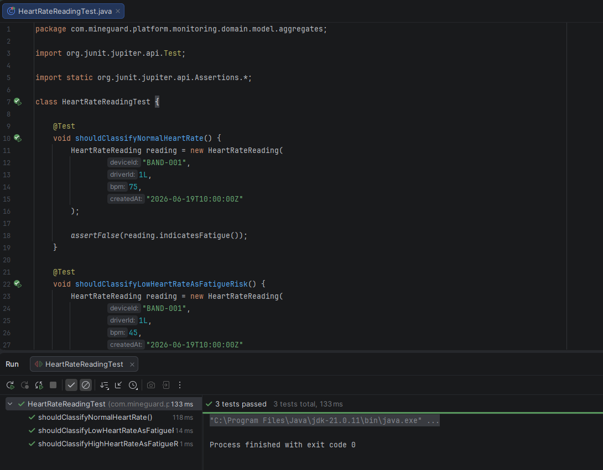

    + **Unit Test Record 02**

    Se implementó el Unit Test **HeartRateIngestionServiceImplTest** con el objetivo de validar la lógica de aplicación de la clase **HeartRateIngestionServiceImpl**, encargada de procesar las lecturas de frecuencia cardíaca enviadas por dispositivos IoT, autenticar el dispositivo y generar alertas automáticas en caso de detectar anomalías.

    Este test se relaciona con la **User Story US007**, orientada al monitoreo en tiempo real del estado físico de los trabajadores.

    Los comportamientos validados fueron:

    - Registro correcto de lecturas cardíacas normales.
    - Generación de alertas automáticas cuando se detecta una frecuencia cardíaca anormal.
    - Validación del flujo de autenticación del dispositivo mediante API Key.

    Ruta del test:

    ```plaintext
    src/test/java/com/mineguard/platform/monitoring/application/internal/commandservices/HeartRateIngestionServiceImplTest.java
    ```

    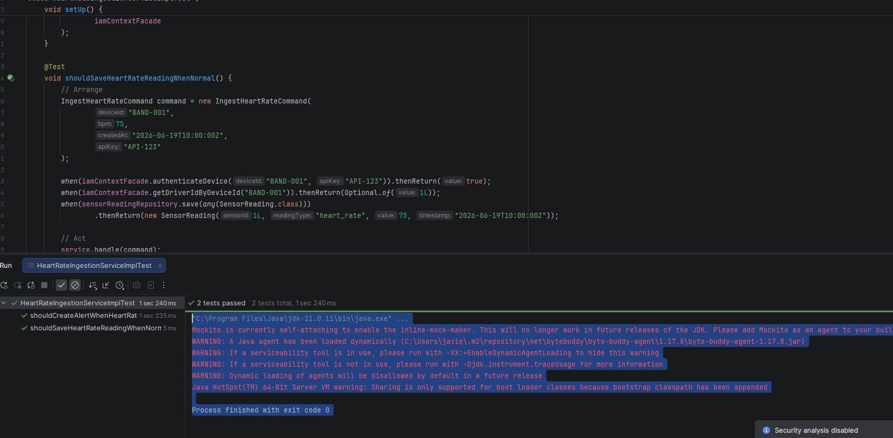

    + **Unit Test Record 03**

    Se implementó el Unit Test **VehicleCommandServiceImplTest** con el objetivo de validar la lógica de aplicación de la clase **VehicleCommandServiceImpl**, encargada de gestionar la creación y actualización de vehículos dentro del sistema de monitoreo y control de activos mineros.

    Este test se relaciona con la **User Story US15**, orientada a la administración y actualización de vehículos operativos dentro de la mina.

    Los comportamientos validados fueron:

    - Registro correcto de nuevos vehículos en el sistema.
    - Actualización correcta de información de vehículos existentes.
    - Persistencia de cambios realizados sobre vehículos registrados.

    Ruta del test:

    ```plaintext
    src/test/java/com/mineguard/platform/assets/application/internal/commandservices/VehicleCommandServiceImplTest.java
    ```

    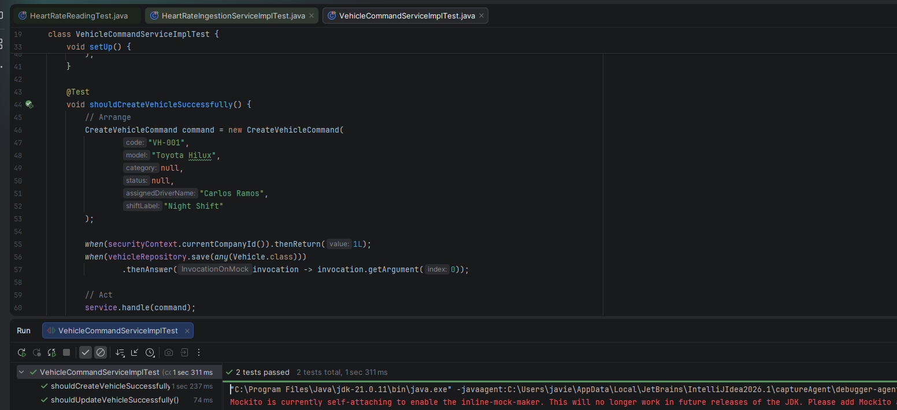

    + **Unit Test Record 04**

    Se implementó el Unit Test **AlertCommandServiceImplTest** con el objetivo de validar la lógica de aplicación de la clase **AlertCommandServiceImpl**, encargada de gestionar acciones sobre alertas críticas generadas por el sistema de monitoreo, como resolver alertas o clasificarlas como falsas alarmas.

    Este test se relaciona con la **User Story US008**, orientada a la gestión y resolución de alertas operacionales dentro de la mina.

    Los comportamientos validados fueron:

    - Resolución correcta de alertas activas.
    - Clasificación de alertas como falsas alarmas.
    - Registro de auditoría de las acciones ejecutadas sobre alertas.

    Ruta del test:

    ```plaintext
    src/test/java/com/mineguard/platform/monitoring/application/internal/commandservices/AlertCommandServiceImplTest.java
    ```

    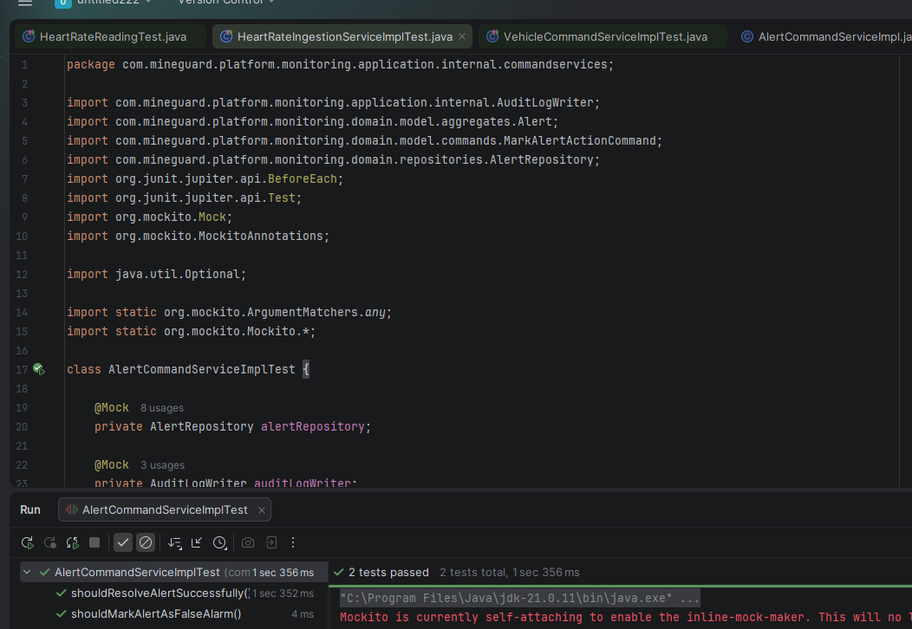

+ **Integration Tests**

    + **Integration Test Record 01**

    Se ejecutó una prueba de integración sobre el endpoint **GET /api/v1/vehicles**, perteneciente al módulo de gestión de vehículos. El objetivo fue validar que el Web Service protegido por JWT rechace solicitudes sin credenciales de autenticación.

    Este test se relaciona con la **User Story US004**, orientada a la administración de vehículos dentro de la plataforma.

    Comportamiento validado:

    - El endpoint protegido no permite listar vehículos cuando la solicitud no incluye un token JWT válido.
    - El backend responde correctamente con estado **401 Unauthorized**.
    - Se valida la integración entre el endpoint REST, la configuración de seguridad y el mecanismo de autenticación.

    Endpoint probado:

    ```http
    GET /api/v1/vehicles
    ```

    + **Integration Test Record 02**

    Se ejecutó una prueba de integración sobre el endpoint **POST /api/v1/health-monitoring/data-records**, perteneciente al módulo de monitoreo de salud mediante dispositivos IoT. El objetivo fue validar que el Web Service rechace solicitudes de dispositivos sin una API Key válida.

    Este test se relaciona con la **User Story US007**, orientada al monitoreo en tiempo real de la frecuencia cardíaca de los operarios mediante smart-band.

    Comportamiento validado:

    - El endpoint de ingesta IoT no permite registrar lecturas cardíacas sin autenticación del dispositivo.
    - El backend valida el mecanismo de seguridad basado en el header **X-API-Key**.
    - Se valida la integración entre el endpoint REST, la capa de seguridad del dispositivo y el servicio de monitoreo.

    Endpoint probado:

    ```http
    POST /api/v1/health-monitoring/data-records
    ```

+ **BDD Tests**

    + **BDD Test Record 01**

    Se implementó el Acceptance Test bajo enfoque BDD **vehicles_security.feature** con el objetivo de validar el comportamiento de seguridad del endpoint protegido **GET /api/v1/vehicles**, verificando que solo usuarios autenticados puedan acceder a la información de vehículos.

    Este test se relaciona con la **User Story US004**, orientada a la gestión de vehículos dentro de la plataforma.

    Los comportamientos validados fueron:

    - Restricción de acceso al endpoint sin token JWT.
    - Respuesta correcta del sistema con estado **401 Unauthorized**.
    - Validación de la integración entre el endpoint y la configuración de seguridad.

    Ruta del archivo feature:

    ```plaintext
    src/test/resources/features/vehicles_security.feature
    ```

    ```
    Feature: Vehicle API security

    As a MineGuard platform user
    I want protected vehicle endpoints to require authentication
    So that company vehicle data cannot be accessed without authorization

    Scenario: List vehicles without JWT token
        Given the MineGuard backend is running
        When I send a GET request to "/api/v1/vehicles" without authorization token
        Then the response status should be 401
        And the response body should contain "Authentication required"
    ```
    

    + **BDD Test Record 02**

    Se implementó el Acceptance Test bajo enfoque BDD **health_monitoring_security.feature** con el objetivo de validar el comportamiento de seguridad del endpoint **POST /api/v1/health-monitoring/data-records**, verificando que solo dispositivos autorizados mediante API Key puedan registrar lecturas cardíacas.

    Este test se relaciona con la **User Story US007**, orientada al monitoreo de frecuencia cardíaca en tiempo real mediante dispositivos IoT.

    Los comportamientos validados fueron:

    - Restricción de acceso al endpoint sin API Key.
    - Respuesta correcta del sistema con estado **401 Unauthorized**.
    - Validación de la integración entre el endpoint, la autenticación del dispositivo y el servicio de monitoreo.

    Ruta del archivo feature:

    ```plaintext
    src/test/resources/features/health_monitoring_security.feature
    ```

    ```
    Feature: Health monitoring API security

    As a smart-band IoT device
    I want the health monitoring endpoint to require a valid API Key
    So that only authorized devices can send heart-rate telemetry

    Scenario: Ingest heart-rate record without API Key
        Given the MineGuard backend is running
        When I send a POST request to "/api/v1/health-monitoring/data-records" without API Key using this body
        """
        {
            "device_id": "smart-band-001",
            "bpm": 75,
            "created_at": "2026-06-20T01:50:00Z"
        }
        """
        Then the response status should be 401
        And the response body should contain "Authentication required"
    ```

+ **Testing commits:**

| Repository | Branch | Commit Id | Commit Message | Commit Message Body | Commited on (Date) |
|---|---|---|---|---|---|
| mineguard-platform | feature/test-suite | a3f91d2 | test: add HeartRateReading unit tests | Added unit tests for HeartRateReading aggregate to validate normal and abnormal heart-rate classification logic. | 20/06/2026 |
| mineguard-platform | feature/test-suite | b7c42e8 | test: add HeartRateIngestionService unit tests | Added unit tests for heart-rate ingestion service including telemetry persistence and alert generation flow. | 20/06/2026 |
| mineguard-platform | feature/test-suite | c91ab54 | test: add VehicleCommandService unit tests | Added unit tests for vehicle creation and update operations in assets module. | 20/06/2026 |
| mineguard-platform | feature/test-suite | d58fe19 | test: add AlertCommandService unit tests | Added unit tests for alert action handling, resolution flow and false alarm classification. | 20/06/2026 |
| mineguard-platform | feature/test-suite | e72bc63 | test: add vehicles integration security test | Added integration test for protected vehicle endpoint validating unauthorized access handling. | 20/06/2026 |
| mineguard-platform | feature/test-suite | f34da81 | test: add health monitoring integration security test | Added integration test for IoT heart-rate endpoint validating API Key authentication flow. | 20/06/2026 |
| mineguard-platform | feature/test-suite | g19ce47 | test: add BDD vehicles security scenarios | Added Gherkin feature and step definitions for vehicle endpoint security acceptance tests. | 20/06/2026 |
| mineguard-platform | feature/test-suite | h86fd25 | test: add BDD health monitoring security scenarios | Added Gherkin feature and step definitions for IoT health monitoring endpoint security acceptance tests. | 20/06/2026 |

#### 6.2.2.6. Execution Evidence for Sprint Review

Durante el Sprint 2 del proyecto MineGuard se consolidaron avances clave en la evolución de la **Web Application (v2)** y la **Landing Page (v2)**, mejorando la visualización operativa, navegación y presentación comercial de la solución. Además, se implementaron las primeras versiones funcionales del **Web Service (v1)**, **Mobile App (v1)**, **Edge Service (v1)** y **Embedded App (v1)**, permitiendo integrar la captura de datos, procesamiento de eventos y generación de alertas en un prototipo funcional. A continuación, se presentan capturas de las principales vistas implementadas y el enlace al video demostrativo correspondiente.

+ **Web Site:**

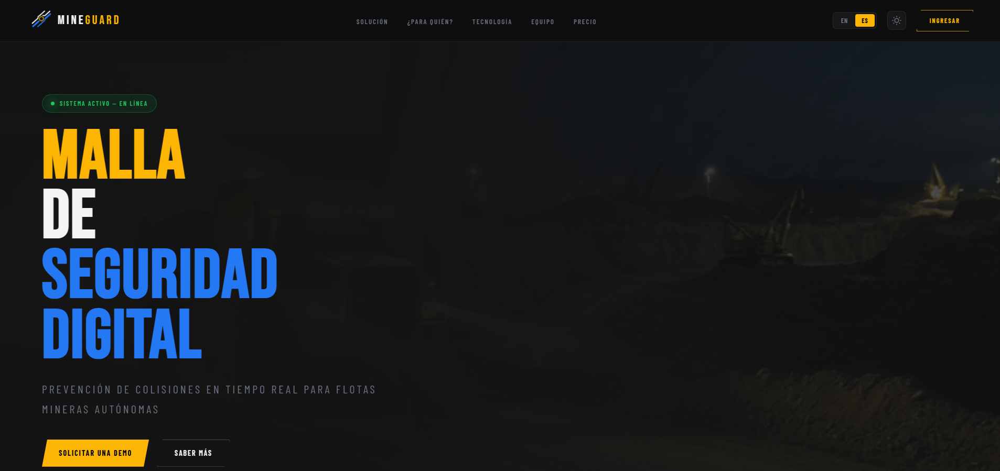

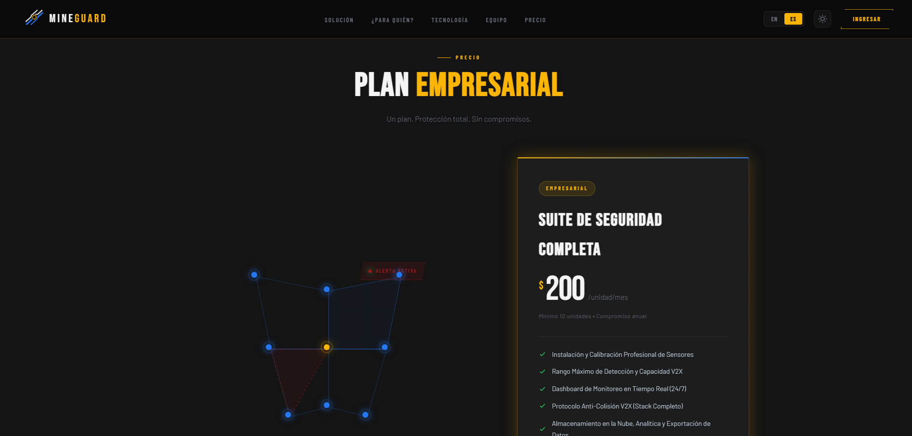

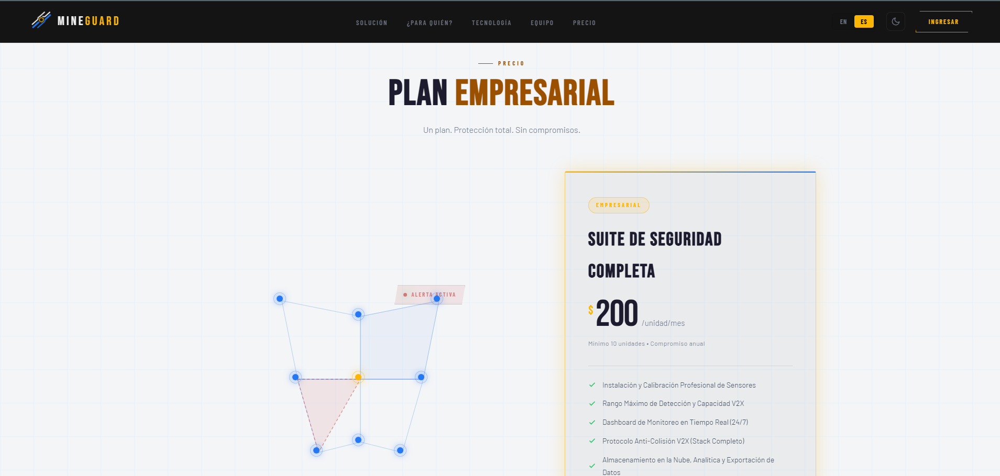


+ **Web Service:**

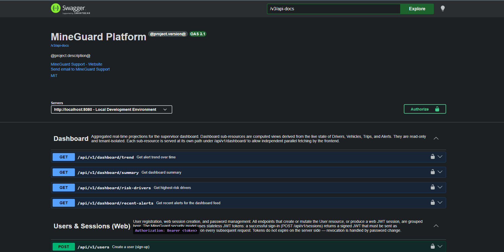

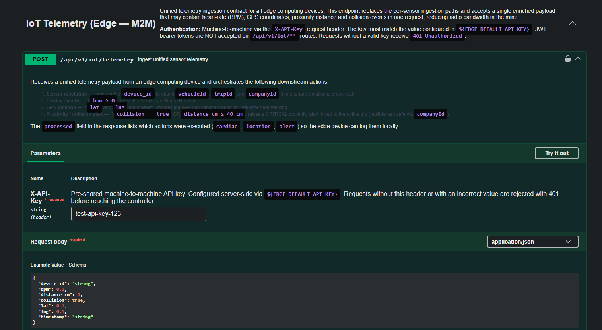

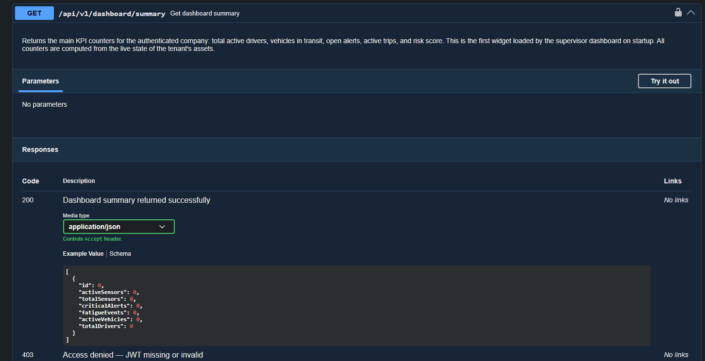

+ **Mobile App:**

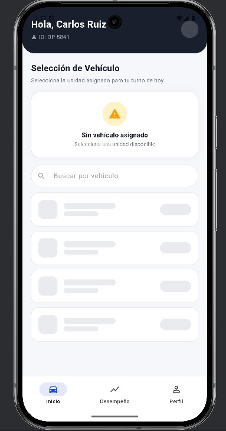

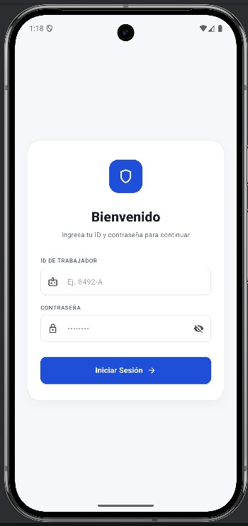


#### 6.2.2.7. Services Documentation Evidence for Sprint Review

Durante el Sprint 2 del proyecto MineGuard se consolidó la documentación de los Web Services mediante OpenAPI (Swagger), permitiendo visualizar y validar los endpoints implementados para la Web App, Mobile App y Edge Service. Esta documentación facilita la integración entre componentes y mejora la trazabilidad técnica del sistema.

**Web Service repository** 'https://github.com/1ASI0572-2610-6779-Vertex/mineguard-webservice'

| Endpoint | HTTP Verb | Action Implemented | Call Syntax | Parameters | Sample Response | Documentation URL |
|---|---|---|---|---|---|---|
| Dashboard Trend | GET | Obtiene la tendencia de alertas en el tiempo. | `/api/v1/dashboard/trend` | Query params opcionales de rango temporal | `200 OK` retorna lista de tendencias agregadas. | `/swagger-ui/index.html#/Dashboard` |
| Dashboard Summary | GET | Obtiene resumen general del dashboard. | `/api/v1/dashboard/summary` | No requiere parámetros | `200 OK` retorna KPIs principales. | `/swagger-ui/index.html#/Dashboard` |
| Dashboard Risk Drivers | GET | Lista conductores con mayor nivel de riesgo. | `/api/v1/dashboard/risk-drivers` | No requiere parámetros | `200 OK` retorna ranking de riesgo. | `/swagger-ui/index.html#/Dashboard` |
| Recent Alerts | GET | Obtiene alertas recientes para el dashboard. | `/api/v1/dashboard/recent-alerts` | No requiere parámetros | `200 OK` retorna últimas alertas. | `/swagger-ui/index.html#/Dashboard` |
| User Registration | POST | Registra nuevos usuarios en el sistema. | `/api/v1/users` | Body: user data | `201 Created` retorna usuario creado. | `/swagger-ui/index.html#/Users-&-Sessions-(Web)` |
| Password Reset Request | POST | Solicita reinicio de contraseña. | `/api/v1/users/password-resets` | Body: email | `200 OK` confirma solicitud. | `/swagger-ui/index.html#/Users-&-Sessions-(Web)` |
| Web Session Login | POST | Inicia sesión web. | `/api/v1/sessions` | Body: email, password | `200 OK` retorna JWT token. | `/swagger-ui/index.html#/Users-&-Sessions-(Web)` |
| Change Password | PATCH | Actualiza contraseña del usuario autenticado. | `/api/v1/users/me/password` | Body: currentPassword, newPassword | `200 OK` confirma cambio. | `/swagger-ui/index.html#/Users-&-Sessions-(Web)` |
| List Vehicles | GET | Lista vehículos registrados. | `/api/v1/vehicles` | Query param opcional `view` | `200 OK` retorna vehículos. | `/swagger-ui/index.html#/Vehicles` |
| Create Vehicle | POST | Registra un nuevo vehículo. | `/api/v1/vehicles` | Body: vehicle data | `201 Created` retorna vehículo creado. | `/swagger-ui/index.html#/Vehicles` |
| Update Vehicle | PUT | Actualiza información de vehículo. | `/api/v1/vehicles/{vehicleId}` | Path: vehicleId + Body | `200 OK` retorna vehículo actualizado. | `/swagger-ui/index.html#/Vehicles` |
| Analytics Insights | GET | Obtiene métricas analíticas generales. | `/api/v1/analytics/insights` | No requiere parámetros | `200 OK` retorna insights. | `/swagger-ui/index.html#/Analytics` |
| Incident Distribution | GET | Distribución de incidentes por tipo. | `/api/v1/analytics/incident-distribution` | No requiere parámetros | `200 OK` retorna estadísticas. | `/swagger-ui/index.html#/Analytics` |
| Analytics History | GET | Historial de eventos analíticos. | `/api/v1/analytics/history` | No requiere parámetros | `200 OK` retorna historial. | `/swagger-ui/index.html#/Analytics` |
| Fatigue Levels | GET | Distribución de niveles de fatiga. | `/api/v1/analytics/fatigue-levels` | No requiere parámetros | `200 OK` retorna clasificación de fatiga. | `/swagger-ui/index.html#/Analytics` |
| Fleet Summary | GET | Obtiene resumen de flota operativa. | `/api/v1/fleet/summary` | No requiere parámetros | `200 OK` retorna estado de flota. | `/swagger-ui/index.html#/Fleet` |
| Mobile Session Login | POST | Inicia sesión desde app móvil. | `/api/v1/sessions/mobile` | Body: credentials | `200 OK` retorna JWT + driverId. | `/swagger-ui/index.html#/Sessions-(Mobile)` |
| List Reports | GET | Lista reportes generados. | `/api/v1/reports` | No requiere parámetros | `200 OK` retorna reportes. | `/swagger-ui/index.html#/Reports` |
| Get Report | GET | Obtiene detalle de un reporte o PDF. | `/api/v1/reports/{reportId}` | Path: reportId | `200 OK` retorna JSON o PDF. | `/swagger-ui/index.html#/Reports` |
| List Alerts | GET | Lista alertas operativas. | `/api/v1/alerts` | Query param opcional `view` | `200 OK` retorna alertas. | `/swagger-ui/index.html#/Alerts` |
| Get Alert by Id | GET | Obtiene detalle de una alerta. | `/api/v1/alerts/{alertId}` | Path: alertId | `200 OK` retorna alerta. | `/swagger-ui/index.html#/Alerts` |
| Update Alert | PUT | Actualiza estado de alerta. | `/api/v1/alerts/{alertId}` | Path: alertId + Body | `200 OK` retorna alerta actualizada. | `/swagger-ui/index.html#/Alerts` |
| Alert Actions | POST | Registra acción tomada sobre alerta. | `/api/v1/alerts/{alertId}/actions` | Path: alertId + Body | `201 Created` registra acción. | `/swagger-ui/index.html#/Alerts` |
| Alert History | GET | Obtiene historial de acciones sobre alerta. | `/api/v1/alerts/{alertId}/history` | Path: alertId | `200 OK` retorna historial. | `/swagger-ui/index.html#/Alerts` |
| IoT Telemetry | POST | Recibe telemetría unificada desde dispositivos edge. | `/api/v1/iot/telemetry` | Header: `X-API-Key`, Body: telemetry payload | `201 Created` registra telemetría. | `/swagger-ui/index.html#/IoT-Telemetry` |
| List Drivers | GET | Lista conductores registrados. | `/api/v1/drivers` | No requiere parámetros | `200 OK` retorna conductores. | `/swagger-ui/index.html#/Drivers` |
| Create Driver | POST | Registra nuevo conductor. | `/api/v1/drivers` | Body: driver data | `201 Created` retorna conductor. | `/swagger-ui/index.html#/Drivers` |
| Get Driver by Id | GET | Obtiene conductor por ID. | `/api/v1/drivers/{driverId}` | Path: driverId | `200 OK` retorna conductor. | `/swagger-ui/index.html#/Drivers` |
| Update Driver | PUT | Actualiza datos del conductor. | `/api/v1/drivers/{driverId}` | Path: driverId + Body | `200 OK` retorna conductor actualizado. | `/swagger-ui/index.html#/Drivers` |
| Create Subscription | POST | Registra nueva empresa minera (suscripción). | `/api/v1/subscriptions` | Body: company data | `201 Created` crea tenant y admin. | `/swagger-ui/index.html#/Subscriptions` |

#### 6.2.2.8. Software Deployment Evidence for Sprint Review

En este sprint se dejó preparada la base de despliegue de los productos del alcance: landing page, web application y mock service/documented API. El objetivo de esta sección es mostrar cómo se publican y validan los artefactos construidos a partir de los repositorios.

| Artifact | Deployment Status | URL / Environment |
|---|---|---|
| Landing Page | Desplegado | https://1asi0572-2610-6779-vertex.github.io/mineguard-website/ |
| Web Application | Desplegado | https://mineguard-iot.netlify.app/ |
| Web Service | Preparado para ejecución/publicación | https://mineguard-webservice.onrender.com/swagger-ui/index.html# |

#### 6.2.2.9. Team Collaboration Insights during Sprint

+ **Web Site:**

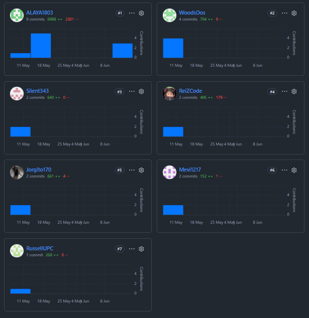

+ **Web App:**

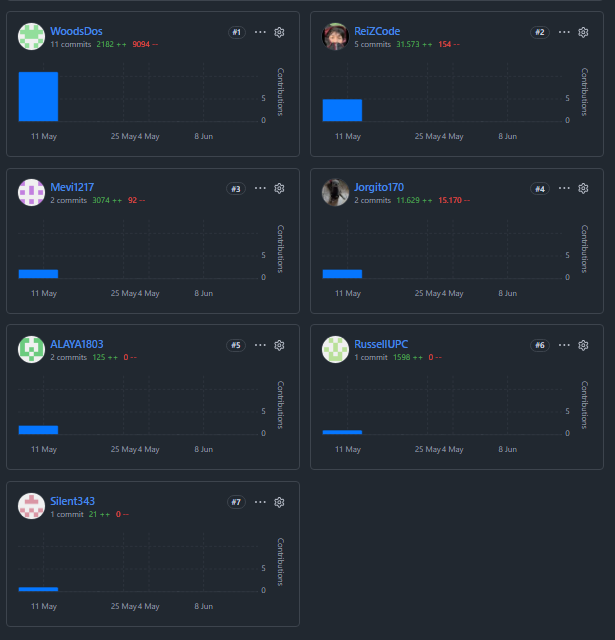

+ **Web Service:**

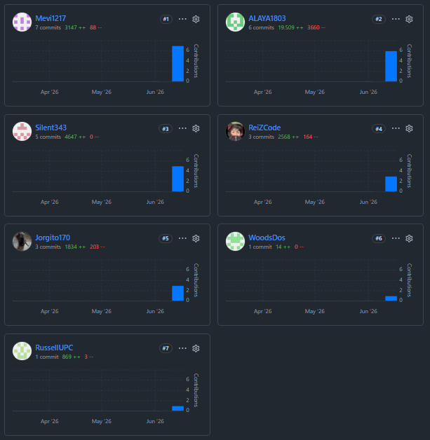

+ **Mobile App:**

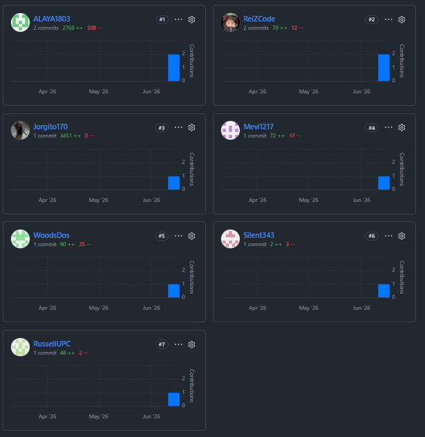

+ **Edge Service:**

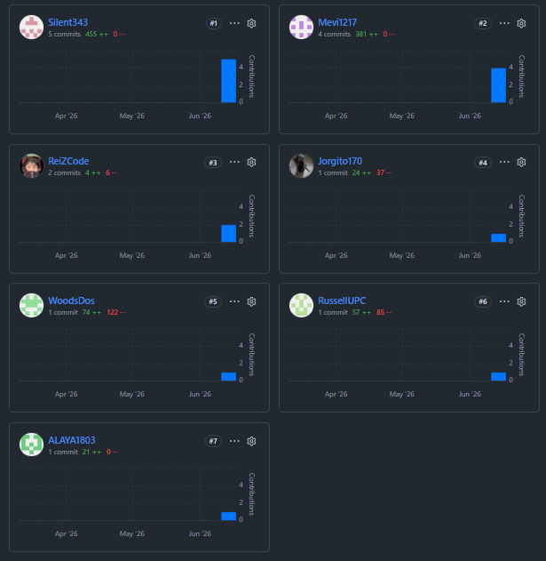

+ **Embedded App:**

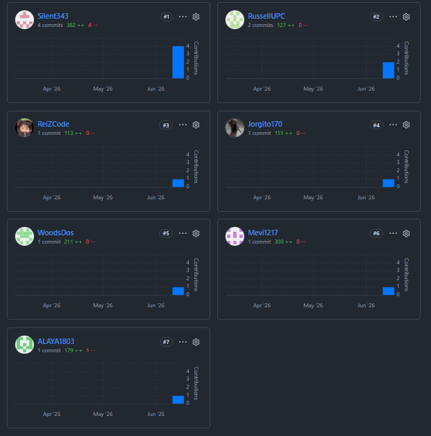

<div style="break-after: page;"></div>