### 6.2.3. Sprint 3

#### 6.2.3.1. Sprint Planning 3

En esta sección se presenta el resumen de la reunión de Sprint Planning correspondiente al Sprint 3 del proyecto MineGuard. Durante esta sesión, el equipo revisó el avance acumulado de los Sprints anteriores, identificó las funcionalidades pendientes del Product Backlog y definió el alcance final de la iteración para consolidar una versión más completa de la solución.

El objetivo principal de esta reunión fue priorizar las User Stories orientadas al cierre funcional del producto, enfocándose en seguridad de acceso, gestión de sesiones, comunicación entre supervisor y conductor, actualización de información operativa, análisis del desempeño del conductor, seguimiento de comportamiento y recomendaciones inteligentes ante alertas. Asimismo, se incluyó la mejora de la experiencia informativa para operadores y conductores dentro de la Landing Page.

| Sprint #                             | Sprint 3                                                                                                                                                                                                                                                                                                                                                                                                                                                                                                                                                                                                                                                                                                                           |
| ------------------------------------ | ---------------------------------------------------------------------------------------------------------------------------------------------------------------------------------------------------------------------------------------------------------------------------------------------------------------------------------------------------------------------------------------------------------------------------------------------------------------------------------------------------------------------------------------------------------------------------------------------------------------------------------------------------------------------------------------------------------------------------------- |
| **Sprint Planning Background**       | Tercera iteración del proyecto, enfocada en completar las funcionalidades pendientes del Product Backlog y consolidar los flujos finales de seguridad, operación, comunicación y análisis del comportamiento del conductor dentro de MineGuard.                                                                                                                                                                                                                                                                                                                                                                                                                                                                                    |
| **Date**                             | 2026-06-20                                                                                                                                                                                                                                                                                                                                                                                                                                                                                                                                                                                                                                                                                                                         |
| **Time**                             | 08:00 PM                                                                                                                                                                                                                                                                                                                                                                                                                                                                                                                                                                                                                                                                                                                           |
| **Location**                         | Virtual Meeting (Google Meet / Discord)                                                                                                                                                                                                                                                                                                                                                                                                                                                                                                                                                                                                                                                                                            |
| **Prepared By**                      | Rodrigo Alaya                                                                                                                                                                                                                                                                                                                                                                                                                                                                                                                                                                                                                                                                                                                      |
| **Attendees (to planning meeting)**  | Rodrigo Alaya / Jorge Guevara / Gabriel Gordon / Russell Romero / Marcia Melgarejo / Renato Zegarra / Javier Gonzales                                                                                                                                                                                                                                                                                                                                                                                                                                                                                                                                                                                                              |
| **Sprint n−1 Review Summary**        | Durante el Sprint 2 se consolidó la integración funcional entre dispositivos IoT, servicios backend, Edge Service, Web Application, Mobile App y Landing Page. Se implementaron funcionalidades clave relacionadas con telemetría, alertas de proximidad, colisión, fatiga, botón de pánico, monitoreo en tiempo real, reportes, analíticas y gestión de recursos.                                                                                                                                                                                                                                                                                                                                                                 |
| **Sprint n−1 Retrospective Summary** | El equipo identificó la necesidad de cerrar las funcionalidades pendientes del Product Backlog, mejorar la trazabilidad entre tareas y User Stories, reforzar los flujos de seguridad y sesión, y completar funcionalidades orientadas a la experiencia final del conductor y del supervisor.                                                                                                                                                                                                                                                                                                                                                                                                                                      |
| **Sprint Goal & User Stories**       |                                                                                                                                                                                                                                                                                                                                                                                                                                                                                                                                                                                                                                                                                                                                    |
| **Sprint n Goal**                    | Our focus is on completing the final operational and safety experience of MineGuard by strengthening user access, vehicle session closure, supervisor-driver communication, driver behavior analysis, and safety recommendations. We believe it delivers a safer and more controlled mining operation to drivers and supervisors by enabling secure access, clearer responses to alerts, better operational traceability, and improved preventive decision-making. This will be confirmed when supervisors can authenticate and manage operational information, drivers can close their sessions and receive actionable recommendations, and the system can track driver behavior and action compliance based on generated alerts. |
| **Sprint n Velocity**                | 54 Story Points                                                                                                                                                                                                                                                                                                                                                                                                                                                                                                                                                                                                                                                                                                                    |
| **Sum of Story Points**              | 54 Story Points                                                                                                                                                                                                                                                                                                                                                                                                                                                                                                                                                                                                                                                                                                                    | 

+ User Stories included in Sprint 3:

| Order | User Story Id | Title                                         | Description                                                                                                                                                     | Story Points |
| ----- | ------------: | --------------------------------------------- | --------------------------------------------------------------------------------------------------------------------------------------------------------------- | -----------: |
| 1     |          US04 | Consulta de desempeño del conductor           | Como conductor quiero visualizar mi desempeño histórico para conocer mi comportamiento en la operación.                                                         |            5 |
| 2     |          US11 | Comunicación con conductor                    | Como supervisor quiero comunicarme con el conductor tras una alerta para coordinar acciones inmediatas.                                                         |            5 |
| 3     |          US17 | Actualización de información                  | Como supervisor quiero actualizar datos de conductores y vehículos para mantener la información correcta.                                                       |            5 |
| 4     |          US21 | Recomendación de acción para el conductor     | Como conductor quiero recibir indicaciones claras ante alertas para reaccionar correctamente durante la conducción.                                             |            5 |
| 5     |          US22 | Confirmación de acción del conductor          | Como supervisor quiero verificar si el conductor responde a las alertas para validar el cumplimiento de seguridad.                                              |            8 |
| 6     |          US23 | Seguimiento de comportamiento del conductor   | Como supervisor quiero evaluar el comportamiento del conductor para identificar conductas de riesgo.                                                            |            8 |
| 7     |          US29 | Explorar herramientas de seguridad personal   | Como visitante del segmento de Operadores y Conductores quiero conocer las herramientas de seguridad disponibles para entender cómo se protegerá mi integridad. |            3 |
| 8     |          US31 | Inicio de sesión del supervisor               | Como supervisor quiero iniciar sesión en el sistema para acceder al centro de control y gestionar la operación en tiempo real.                                  |            5 |
| 9     |          US41 | Cambio de contraseña obligatorio              | Como usuario quiero actualizar mi clave temporal en el primer ingreso para asegurar la privacidad de mi cuenta.                                                 |            5 |
| 10    |          US42 | Cierre de sesión y desvinculación de vehículo | Como conductor quiero cerrar mi sesión al terminar mi jornada para desvincularme legalmente del vehículo asignado.                                              |            5 |

#### 6.2.3.2. Aspect Leaders and Collaborators

Durante el Sprint 3 del proyecto MineGuard, el equipo definió una nueva distribución de responsabilidades con el objetivo de organizar el trabajo correspondiente a las funcionalidades finales del producto. A diferencia de los sprints anteriores, esta iteración se enfocó principalmente en completar flujos pendientes relacionados con seguridad de acceso, cierre de sesión, comunicación entre supervisor y conductor, actualización de información operativa, análisis del desempeño del conductor, recomendaciones de seguridad y mejoras en la experiencia informativa para operadores.

Con el fin de mantener claridad en la comunicación interna y asegurar una adecuada asignación de responsabilidades, se elaboró una Leadership-and-Collaboration Matrix (LACX). En esta matriz, el rol Leader (L) representa al integrante responsable de dirigir el aspecto asignado, tomar decisiones funcionales o técnicas y coordinar las tareas relacionadas. El rol Collaborator (C) representa a los integrantes que participaron en el análisis, implementación, integración o validación de dicho aspecto.

| Team Member (Last Name, First Name) | GitHub Username | Security & Session Management | Driver Operations & Vehicle Session | Driver Performance & Behavior Analytics | Supervisor-Driver Communication | Safety Recommendations & Action Compliance | Resource Information Management | Landing Page / Operator Experience |
|-------------------------------------|-----------------|-------------------------------|-------------------------------------|-----------------------------------------|---------------------------------|---------------------------------------------|---------------------------------|------------------------------------|
| Alaya, Rodrigo                      | ALAYA1803       | C                             | C                                   | **L**                                   | C                               | C                                           | C                               | C                                  |
| Gordon, Gabriel                     | Silent343       | **L**                             | C                                   | C                                       | C                               | C                                           | C                               | C                             |
| Guevara, Jorge                      | Jorgito170      | C                             | **L**                                   | C                                       | C                               | C                                           | C                           | C                                  |
| Melgarejo, Marcia                   | Mevi1217        | C                             | C                                   | C                                       | **L**                           | C                                           | C                               | C                                  |
| Zegarra, Renato                     | ReiZCode        | C                             | C                                   | C                                       | C                               | **L**                                       | C                               | C                                  |
| Gonzales, Javier                    | WoodsDos        | C                         | C                                   | C                                       | C                               | C                                           | **L**                               | C                                  |
| Romero, Russell                     | RussellUPC      | C                             | C                               | C                                       | C                               | C                                           | C                               | **L**                                  |

#### 6.2.3.3. Sprint Backlog 3

Durante el desarrollo del Sprint 3 del proyecto MineGuard, se definió y gestionó el Sprint Backlog con el objetivo de completar las funcionalidades pendientes del Product Backlog general. Este Sprint se enfocó principalmente en fortalecer los flujos de seguridad, autenticación, cierre de sesión, comunicación entre supervisores y conductores, actualización de información operativa, análisis del comportamiento del conductor y recomendaciones inteligentes ante situaciones de riesgo.

Asimismo, se consideró la culminación de funcionalidades orientadas a la experiencia del usuario en la Landing Page, especialmente aquellas dirigidas al segmento de operadores y conductores. De esta manera, el Sprint 3 permitió cerrar brechas funcionales identificadas en los Sprints anteriores y consolidar una versión más completa de la solución MineGuard.

Para la gestión y seguimiento de las actividades, se utilizó Trello como herramienta de control ágil, permitiendo organizar las User Stories priorizadas y su respectiva descomposición en Work-items/Tasks, asegurando trazabilidad, asignación de responsabilidades y control del progreso del Sprint.

 

Link Trello: `Agregar enlace del tablero Sprint 3`

 

| Sprint # | User Story Id | Título de User Story                          | Work-Item / Task Id | Título del Work-Item / Task                            | Descripción                                                                                                                      | Estimación (Horas) | Asignado a       | Estado |
| -------- | ------------- | --------------------------------------------- | ------------------- | ------------------------------------------------------ | -------------------------------------------------------------------------------------------------------------------------------- | -----------------: | ---------------- | ------ |
| Sprint 3 | US04          | Consulta de desempeño del conductor           | US04-001            | Diseñar vista de desempeño del conductor               | Crear una pantalla donde el conductor pueda consultar métricas históricas de alertas, incidencias y cumplimiento de acciones.    |                  3 | Rodrigo Alaya    | Done   |
| Sprint 3 | US04          | Consulta de desempeño del conductor           | US04-002            | Implementar consulta de historial operativo            | Integrar la vista con los registros históricos asociados al conductor autenticado.                                               |                  3 | Jorge Guevara    | Done   |
| Sprint 3 | US04          | Consulta de desempeño del conductor           | US04-003            | Actualizar métricas tras nuevos eventos                | Registrar automáticamente nuevos eventos de conducción para mantener actualizado el desempeño del conductor.                     |                  2 | Gabriel Gordon   | Done   |
| Sprint 3 | US11          | Comunicación con conductor                    | US11-001            | Diseñar flujo de comunicación desde alerta             | Agregar una acción en el panel de alertas que permita al supervisor iniciar comunicación con el conductor asociado.              |                  3 | Marcia Melgarejo | Done   |
| Sprint 3 | US11          | Comunicación con conductor                    | US11-002            | Implementar envío de notificación al conductor         | Desarrollar la lógica para enviar una notificación o mensaje operativo al dispositivo del conductor.                             |                  3 | Renato Zegarra   | Done   |
| Sprint 3 | US11          | Comunicación con conductor                    | US11-003            | Registrar intento de contacto                          | Guardar fecha, hora, conductor, alerta asociada y resultado del intento de comunicación.                                         |                  2 | Javier Gonzales  | Done   |
| Sprint 3 | US11          | Comunicación con conductor                    | US11-004            | Manejar fallos de comunicación                         | Mostrar mensaje de error y permitir reintentar el envío cuando exista un problema de conectividad.                               |                  2 | Russell Romero   | Done   |
| Sprint 3 | US17          | Actualización de información                  | US17-001            | Habilitar edición de conductores                       | Permitir que el supervisor actualice datos de conductores registrados, validando campos obligatorios y formatos.                 |                  3 | Rodrigo Alaya    | Done   |
| Sprint 3 | US17          | Actualización de información                  | US17-002            | Habilitar edición de vehículos                         | Permitir que el supervisor actualice información de vehículos, incluyendo estado, placa, tipo y datos operativos.                |                  3 | Jorge Guevara    | Done   |
| Sprint 3 | US17          | Actualización de información                  | US17-003            | Registrar fecha de modificación                        | Guardar la fecha de modificación y el usuario responsable de cada actualización realizada.                                       |                  2 | Gabriel Gordon   | Done   |
| Sprint 3 | US17          | Actualización de información                  | US17-004            | Validar errores de actualización                       | Rechazar cambios con datos inválidos y mostrar mensajes de corrección al supervisor.                                             |                  2 | Marcia Melgarejo | Done   |
| Sprint 3 | US21          | Recomendación de acción para el conductor     | US21-001            | Definir reglas de recomendación por tipo de alerta     | Establecer recomendaciones específicas para proximidad, colisión, fatiga y pánico.                                               |                  3 | Renato Zegarra   | Done   |
| Sprint 3 | US21          | Recomendación de acción para el conductor     | US21-002            | Mostrar recomendación preventiva en cabina             | Presentar mensajes como reducir velocidad, mantener distancia o estar alerta ante riesgos preventivos.                           |                  3 | Javier Gonzales  | Done   |
| Sprint 3 | US21          | Recomendación de acción para el conductor     | US21-003            | Mostrar recomendación crítica en cabina                | Presentar mensajes de acción inmediata, como detenerse, ante alertas críticas de colisión o fatiga severa.                       |                  3 | Russell Romero   | Done   |
| Sprint 3 | US21          | Recomendación de acción para el conductor     | US21-004            | Asociar recomendación al evento generado               | Guardar la recomendación aplicada junto con la alerta correspondiente para análisis posterior.                                   |                  2 | Rodrigo Alaya    | Done   |
| Sprint 3 | US22          | Confirmación de acción del conductor          | US22-001            | Definir criterios de cumplimiento ante alertas         | Establecer condiciones para determinar si el conductor respondió correctamente, como reducir velocidad o detenerse.              |                  3 | Jorge Guevara    | Done   |
| Sprint 3 | US22          | Confirmación de acción del conductor          | US22-002            | Implementar validación de respuesta del conductor      | Comparar la telemetría posterior a la alerta con la acción esperada para determinar cumplimiento.                                |                  4 | Gabriel Gordon   | Done   |
| Sprint 3 | US22          | Confirmación de acción del conductor          | US22-003            | Registrar cumplimiento o incumplimiento                | Guardar el resultado de la respuesta del conductor asociado al evento de alerta.                                                 |                  2 | Marcia Melgarejo | Done   |
| Sprint 3 | US22          | Confirmación de acción del conductor          | US22-004            | Mantener alerta activa ante incumplimiento             | Mantener visible la alerta crítica cuando el conductor no ejecute la acción esperada.                                            |                  2 | Renato Zegarra   | Done   |
| Sprint 3 | US23          | Seguimiento de comportamiento del conductor   | US23-001            | Definir modelo de clasificación de comportamiento      | Crear criterios para clasificar al conductor como seguro, preventivo o riesgoso según su historial operativo.                    |                  3 | Javier Gonzales  | Done   |
| Sprint 3 | US23          | Seguimiento de comportamiento del conductor   | US23-002            | Calcular indicadores de comportamiento                 | Procesar alertas, incidencias, confirmaciones de acción y eventos frecuentes para generar indicadores.                           |                  4 | Russell Romero   | Done   |
| Sprint 3 | US23          | Seguimiento de comportamiento del conductor   | US23-003            | Visualizar comportamiento en dashboard                 | Mostrar la clasificación del conductor dentro del panel del supervisor para facilitar seguimiento preventivo.                    |                  3 | Rodrigo Alaya    | Done   |
| Sprint 3 | US23          | Seguimiento de comportamiento del conductor   | US23-004            | Resaltar conductores de riesgo                         | Identificar visualmente a los conductores con comportamientos críticos o reincidentes.                                           |                  2 | Jorge Guevara    | Done   |
| Sprint 3 | US29          | Explorar herramientas de seguridad personal   | US29-001            | Diseñar sección de herramientas para operadores        | Crear una sección en la Landing Page orientada a operadores y conductores, explicando las herramientas de seguridad disponibles. |                  2 | Gabriel Gordon   | Done   |
| Sprint 3 | US29          | Explorar herramientas de seguridad personal   | US29-002            | Presentar beneficios operativos de seguridad           | Mostrar beneficios como alertas en cabina, monitoreo de fatiga, botón de pánico y retroalimentación inmediata.                   |                  2 | Marcia Melgarejo | Done   |
| Sprint 3 | US29          | Explorar herramientas de seguridad personal   | US29-003            | Adaptar contenido a versión responsive                 | Asegurar que la sección pueda visualizarse correctamente en dispositivos móviles y pantallas pequeñas.                           |                  2 | Renato Zegarra   | Done   |
| Sprint 3 | US31          | Inicio de sesión del supervisor               | US31-001            | Diseñar formulario de inicio de sesión del supervisor  | Crear la interfaz de login para supervisores con campos de usuario y contraseña.                                                 |                  3 | Javier Gonzales  | Done   |
| Sprint 3 | US31          | Inicio de sesión del supervisor               | US31-002            | Integrar autenticación del supervisor                  | Conectar el formulario con el servicio de autenticación para validar credenciales registradas.                                   |                  3 | Russell Romero   | Done   |
| Sprint 3 | US31          | Inicio de sesión del supervisor               | US31-003            | Redirigir al centro de control                         | Permitir el acceso al dashboard operativo cuando el supervisor se autentique correctamente.                                      |                  2 | Rodrigo Alaya    | Done   |
| Sprint 3 | US31          | Inicio de sesión del supervisor               | US31-004            | Mostrar error por credenciales inválidas               | Rechazar el acceso cuando las credenciales sean incorrectas y mostrar un mensaje de error de autenticación.                      |                  2 | Jorge Guevara    | Done   |
| Sprint 3 | US41          | Cambio de contraseña obligatorio              | US41-001            | Detectar uso de contraseña temporal                    | Identificar cuando un usuario inicia sesión por primera vez con credenciales temporales.                                         |                  3 | Gabriel Gordon   | Done   |
| Sprint 3 | US41          | Cambio de contraseña obligatorio              | US41-002            | Mostrar formulario obligatorio de cambio de contraseña | Bloquear el acceso a funciones operativas hasta que el usuario actualice su contraseña inicial.                                  |                  3 | Marcia Melgarejo | Done   |
| Sprint 3 | US41          | Cambio de contraseña obligatorio              | US41-003            | Validar requisitos de nueva contraseña                 | Verificar longitud mínima, confirmación, complejidad y diferencia respecto a la clave temporal.                                  |                  3 | Renato Zegarra   | Done   |
| Sprint 3 | US41          | Cambio de contraseña obligatorio              | US41-004            | Permitir acceso tras actualización exitosa             | Actualizar el estado del usuario y permitir el ingreso al sistema después de cambiar la contraseña.                              |                  2 | Javier Gonzales  | Done   |
| Sprint 3 | US42          | Cierre de sesión y desvinculación de vehículo | US42-001            | Implementar cierre de sesión del conductor             | Agregar opción para que el conductor cierre sesión al finalizar su jornada operativa.                                            |                  3 | Russell Romero   | Done   |
| Sprint 3 | US42          | Cierre de sesión y desvinculación de vehículo | US42-002            | Validar estado del vehículo antes del cierre           | Verificar que el vehículo se encuentre detenido antes de permitir el cierre de sesión.                                           |                  3 | Rodrigo Alaya    | Done   |
| Sprint 3 | US42          | Cierre de sesión y desvinculación de vehículo | US42-003            | Liberar vehículo asignado                              | Desvincular al conductor del vehículo y cambiar la unidad a estado disponible para futuras operaciones.                          |                  3 | Jorge Guevara    | Done   |
| Sprint 3 | US42          | Cierre de sesión y desvinculación de vehículo | US42-004            | Registrar hora de fin de operación                     | Guardar la fecha y hora de cierre de sesión para mantener trazabilidad de la jornada.                                            |                  2 | Gabriel Gordon   | Done   |

#### 6.2.3.4. Development Evidence for Sprint Review

Durante el Sprint 3 del proyecto MineGuard, el equipo completó la implementación de las funcionalidades planificadas para esta iteración, fortaleciendo los diferentes componentes de la solución, incluyendo la Landing Page, Web Application, Web Services, Mobile Application, Edge Service, Embedded Application y Prototype. Los avances estuvieron enfocados en completar los flujos de autenticación, gestión de sesiones, comunicación entre supervisor y conductor, análisis del comportamiento del conductor, recomendaciones de seguridad y mejoras en la experiencia de usuario. A continuación, se presentan los repositorios y los commits que evidencian las implementaciones realizadas durante este Sprint.

+ **Web Service:**

| **Repository** | **Branch**                  | **Commit Message**                                                         | **Commit Message Body**                                                                                                                    | **Committed on (Date)** |
| -------------- | --------------------------- | -------------------------------------------------------------------------- | ------------------------------------------------------------------------------------------------------------------------------------------ | ----------------------- |
| Web Service    | `feature/restful-endpoints` | **fix: fix a send email on brevo**                                         | Se corrigió el servicio de envío de correos electrónicos mediante Brevo para asegurar el funcionamiento de las notificaciones del sistema. | Jul 2, 2026             |
| Web Service    | `feature/restful-endpoints` | **fix: correction email autorization**                                     | Se ajustó la autorización utilizada para el envío de correos electrónicos, mejorando la autenticación del servicio.                        | Jul 2, 2026             |
| Web Service    | `feature/restful-endpoints` | **fix: addres personal change**                                            | Se actualizaron datos relacionados con la información personal utilizada por el sistema.                                                   | Jul 2, 2026             |
| Web Service    | `feature/restful-endpoints` | **fix: dataseeder commit**                                                 | Se corrigió la carga inicial de datos para garantizar una correcta inicialización de la base de datos.                                     | Jul 2, 2026             |
| Web Service    | `feature/restful-endpoints` | **fix: vehicle operational string**                                        | Se corrigió el manejo del estado operativo de los vehículos para evitar inconsistencias en la información mostrada.                        | Jul 2, 2026             |
| Web Service    | `feature/restful-endpoints` | **fix: Implementation of RESTful endpoints and service refactoring**       | Se implementaron nuevos endpoints RESTful y se refactorizó la capa de servicios para mejorar la estructura y mantenibilidad del backend.   | Jul 4, 2026             |
| Web Service    | `feature/restful-endpoints` | **Fix: Cleaning up duplicate controllers and resolving ambiguous mapping** | Se eliminaron controladores duplicados y se resolvieron conflictos de mapeo entre endpoints REST.                                          | Jul 4, 2026             |
| Web Service    | `feature/restful-endpoints` | **fix: address correct port**                                              | Se corrigió la configuración del puerto de ejecución del servicio para asegurar el despliegue correcto.                                    | Jul 4, 2026             |
| Web Service    | `feature/restful-endpoints` | **fix: change values of tables**                                           | Se ajustaron valores y configuraciones de las tablas de la base de datos para mantener la consistencia de la información.                  | Jul 4, 2026             |
| Web Service    | `feature/restful-endpoints` | **fix: application properties**                                            | Se actualizaron las propiedades de configuración de la aplicación para mejorar su funcionamiento en distintos entornos.                    | Jul 4, 2026             |
| Web Service    | `feature/restful-endpoints` | **feature: add new parameter of subscription**                             | Se incorporó un nuevo parámetro para la gestión de suscripciones dentro del sistema.                                                       | Jul 5, 2026             |
| Web Service    | `feature/restful-endpoints` | **fix: id of generate reports**                                            | Se corrigió la generación del identificador utilizado en los reportes emitidos por la plataforma.                                          | Jul 5, 2026             |
| Web Service    | `feature/restful-endpoints` | **fix: add new parameters of device sensors**                              | Se añadieron nuevos parámetros para registrar información adicional proveniente de los sensores de los dispositivos IoT.                   | Jul 5, 2026             |
| Web Service    | `feature/restful-endpoints` | **feature: add new endpoint patch device with vehicle**                    | Se implementó un nuevo endpoint REST que permite asociar un dispositivo con un vehículo mediante una operación PATCH.                      | Jul 7, 2026             |

+ **Web App:**

| Repository       | Branch                   | Commit Id | Commit Message                                                | Commit Message Body                                                                       | Committed on (Date) |
| ---------------- | ------------------------ | --------- | ------------------------------------------------------------- | ----------------------------------------------------------------------------------------- | ------------------- |
| MineGuard-WebApp | hotfix/deploy-webapp     | `8c37de0` | fix: update angular build budgets                             | Updated Angular build budgets to optimize the application build process.                  | Jun 25, 2026        |
| MineGuard-WebApp | feature/register-company | `1f2a523` | fix: refactor all end points and add register companie screen | Refactored frontend service endpoints and implemented the company registration interface. | Jul 5, 2026         |
| MineGuard-WebApp | feature/register-company | `0ce169b` | fix: change kpis tokens for iam                               | Updated KPI authentication tokens to integrate with the new IAM module.                   | Jul 5, 2026         |
| MineGuard-WebApp | feature/register-company | `42fead1` | feat: integrate a new tab of create a device                  | Added a new interface for registering and managing IoT devices.                           | Jul 5, 2026         |
| MineGuard-WebApp | feature/register-company | `1421660` | fix: style and hardcode                                       | Adjusted UI styles and corrected hardcoded values in the application.                     | Jul 6, 2026         |

+ **Landing Page:**

| **Repository** | **Branch**      | **Commit Id** | **Commit Message**                                                               | **Commit Message Body**                                                                                                         | **Committed on (Date)** |
| -------------- | --------------- | ------------- | -------------------------------------------------------------------------------- | ------------------------------------------------------------------------------------------------------------------------------- | ----------------------- |
| Landing Page   | `release/2.1.0` | `996024f`     | Merge pull request #24 from 1ASI0572-2610-6779-Vertex/release/2.1.0              | Integración de la versión **2.1.0** del Landing Page en la rama principal del proyecto.                                         | Jul 3, 2026             |
| Landing Page   | `develop`       | `7d49f10`     | Add GitHub Actions workflow for GitHub Pages deployment                          | Se implementó un flujo de GitHub Actions para automatizar el despliegue continuo del Landing Page en GitHub Pages.              | Jul 3, 2026             |
| Landing Page   | `release/2.1.0` | `cf32a1f`     | Merge pull request #23 from 1ASI0572-2610-6779-Vertex/release/2.1.0              | Integración de los cambios preparados para la versión **2.1.0** antes de su publicación.                                        | Jul 3, 2026             |
| Landing Page   | `develop`       | `49f2805`     | fix: change link of video about the product and light theme and default language | Se corrigió el enlace del video **About the Product** y se configuró el tema claro y el idioma predeterminado de la aplicación. | Jul 3, 2026             |
| Landing Page   | `develop`       | `8824ad3`     | Merge main into develop                                                          | Sincronización de la rama `develop` con los cambios incorporados en la rama `main`.                                             | Jul 3, 2026             |
| Landing Page   | `develop`       | `f84f44d`     | Merge branch 'main' into develop                                                 | Integración de la rama `main` en `develop` para mantener ambas ramas actualizadas.                                              | Jul 3, 2026             |
| Landing Page   | `release/2.0.0` | `25ceb1d`     | Merge pull request #22 from 1ASI0572-2610-6779-Vertex/release/2.0.0              | Integración de la versión **2.0.0** como base para la preparación de la siguiente versión del Landing Page.                     | Jul 3, 2026             |

+ **Mobile App:**

| **Repository** | **Branch**              | **Commit Message**                                                           | **Commit Message Body**                                                                                                                                                 | **Committed on (Date)** |
| -------------- | ----------------------- | ---------------------------------------------------------------------------- | ----------------------------------------------------------------------------------------------------------------------------------------------------------------------- | ----------------------- |
| Mobile App     | `feature/iam_endpoints` | **feat(mobile-app): connect app to deployed webservice API**                 | Se integró la aplicación móvil con la API REST desplegada, permitiendo consumir los servicios backend desde la aplicación.                                              | Jul 6, 2026             |
| Mobile App     | `feature/iam_endpoints` | **feat(mobile-app): migrate state management from Riverpod to flutter_bloc** | Se migró la gestión del estado de Riverpod a Flutter BLoC para mejorar la organización del código, la escalabilidad y el mantenimiento de la aplicación.                | Jul 6, 2026             |
| Mobile App     | `feature/iam_endpoints` | **feat(mobile-app): add English/Spanish i18n with flutter_localizations**    | Se implementó la internacionalización de la aplicación utilizando `flutter_localizations`, incorporando soporte para los idiomas español e inglés.                      | Jul 6, 2026             |
| Mobile App     | `feature/iam_endpoints` | **Merge Pull Requests (#8–#9)**                                              | Integración de las funcionalidades desarrolladas en la rama `feature/iam_endpoints`, consolidando las mejoras implementadas en la aplicación móvil durante el Sprint 3. | Jul 6, 2026             |

+ **Embbeded App:**

| Repository            | Branch                                | Commit Id | Commit Message                                      | Commit Message Body                                                                                              | Committed on (Date) |
| --------------------- | ------------------------------------- | --------- | --------------------------------------------------- | ---------------------------------------------------------------------------------------------------------------- | ------------------- |
| MineGuard-EmbeddedApp | fix/sensors-actuators-errors          | `9180b57` | fix: fixed some features about sensor and actuators | Fixed issues related to sensor readings and actuator behavior to improve device stability.                       | Jul 1, 2026         |
| MineGuard-EmbeddedApp | feature/Integrate-framework-modestiot | `06e6085` | feat: integrate the library modestiot               | Integrated the ModestIoT framework into the embedded application to improve device communication and management. | Jul 4, 2026         |
| MineGuard-EmbeddedApp | fix/fixed-edge-connection             | `de4c000` | feat: added edge connection                         | Implemented the communication layer between the embedded device and the Edge Service.                            | Jul 5, 2026         |

+ **Edge Service:**

| Repository            | Branch             | Commit Id | Commit Message                                                                | Commit Message Body                                                              | Committed on (Date) |
| --------------------- | ------------------ | --------- | ----------------------------------------------------------------------------- | -------------------------------------------------------------------------------- | ------------------- |
| MineGuard-EmbeddedApp | feature/iam        | `d80b83d` | feat: add application layer                                                   | Added application layer for device authentication.                               | Jun 19, 2026        |
| MineGuard-EmbeddedApp | feature/iam        | `534077e` | feat: add domain layer                                                        | Added domain layer for device authentication.                                    | Jun 19, 2026        |
| MineGuard-EmbeddedApp | feature/iam        | `c586035` | feat: add infrastructure layer                                                | Added infrastructure layer for device authentication.                            | Jun 19, 2026        |
| MineGuard-EmbeddedApp | feature/iam        | `4a77c73` | feat: add interfaces layer                                                    | Added interfaces layer for device authentication.                                | Jun 19, 2026        |
| MineGuard-EmbeddedApp | feature/iam        | `9a3ac50` | fix(): Add IAM services                                                       | Implemented IAM services and related fixes.                                      | Jun 19, 2026        |
| MineGuard-EmbeddedApp | feature/iam        | `68d270e` | feat(): Add IAM entities                                                      | Added IAM entities for device authentication.                                    | Jun 19, 2026        |
| MineGuard-EmbeddedApp | feature/iam        | `f7d5418` | feat(iam): add infrastructure and interfaces layers for device authentication | Completed infrastructure and interface implementation for device authentication. | Jun 19, 2026        |
| MineGuard-EmbeddedApp | feature/monitoring | `2cb7c5d` | feat(): add monitoring features to edge                                       | Implemented monitoring features for the embedded edge device.                    | Jun 20, 2026        |
| MineGuard-EmbeddedApp | feature/monitoring | `a854a87` | Feature: Update monitoring                                                    | Updated monitoring functionalities and operational logic.                        | Jun 20, 2026        |
| MineGuard-EmbeddedApp | feature/planning   | `d54d20d` | feat: add bounded planning and subscriptions                                  | Added planning module and subscription management components.                    | Jun 20, 2026        |
| MineGuard-EmbeddedApp | develop            | `d7880e6` | feat: fix backend connection                                                  | Updated backend connection and integration settings.                             | Jul 5, 2026         |
| MineGuard-EmbeddedApp | develop            | `ec087ec` | feat: Add Swagger and Render configuration                                    | Added API documentation and Render deployment configuration.                     | Jul 5, 2026         |
| MineGuard-EmbeddedApp | release/2.0.0      | `8eeb650` | fix: restore Render configuration from release/2.0.0                          | Restored the Render deployment configuration for the final release.              | Jul 5, 2026         |

#### 6.2.3.5. Testing Suite Evidence for Sprint Review.

Durante el Sprint 3 del proyecto MineGuard se diseñó una suite de pruebas orientada a validar las funcionalidades finales comprometidas en la iteración. Estas pruebas se enfocaron en los flujos de autenticación del supervisor, cambio obligatorio de contraseña, cierre de sesión del conductor, desvinculación de vehículo, comunicación entre supervisor y conductor, actualización de información operativa, consulta de desempeño, seguimiento del comportamiento del conductor, recomendaciones de seguridad y confirmación de acciones ante alertas.

La suite de testing incluye **Unit Tests**, **Integration Tests** y **Acceptance Tests bajo enfoque BDD**, con el objetivo de asegurar que las reglas de negocio, servicios de aplicación, endpoints REST y flujos funcionales del sistema respondan correctamente a los escenarios definidos en las User Stories del Sprint 3.

**Testing repository:** `https://github.com/1ASI0572-2610-6779-Vertex/mineguard-webservice`

##### Unit Testing

Durante el Sprint 3 se implementó una suite de pruebas unitarias para validar el correcto funcionamiento de los componentes fundamentales del backend de MineGuard. Estas pruebas se enfocaron en verificar la lógica de negocio de clases utilitarias y objetos de valor (Value Objects), garantizando que las conversiones, validaciones y reglas implementadas produzcan los resultados esperados de manera independiente, sin necesidad de interactuar con la base de datos o con otros componentes del sistema. La ejecución de las pruebas permitió confirmar el comportamiento correcto de estas funcionalidades, contribuyendo a mejorar la confiabilidad y mantenibilidad del software.

+ Tabla de pruebas unitarias:

| Clase evaluada    | Funcionalidad validada                                       | Cantidad de pruebas |
| ----------------- | ------------------------------------------------------------ | :-----------------: |
| PasswordGenerator | Generación de contraseñas seguras y validación de formato    |          2          |
| UsernameGenerator | Generación automática de nombres de usuario según el rol     |          3          |
| VehicleStatus     | Conversión entre valores serializados y estados del vehículo |          3          |
| AlertStatus       | Conversión entre valores serializados y estados de alertas   |          2          |
| AlertType         | Conversión entre valores serializados y tipos de alertas     |          3          |
| CardiacStatus     | Clasificación del estado cardíaco según frecuencia cardíaca  |          3          |
| **Total**         | **Pruebas unitarias implementadas**                          |        **16**       |

Evidencias:

+ Implementación de las pruebas unitarias para las clases utilitarias y objetos de valor del dominio.

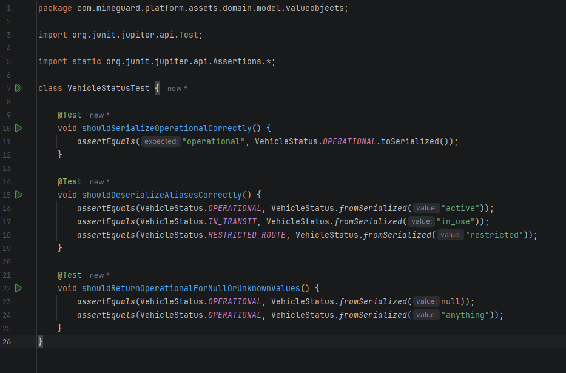

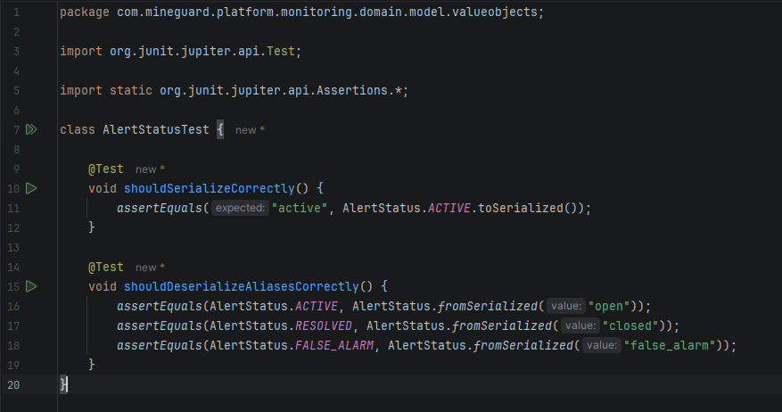

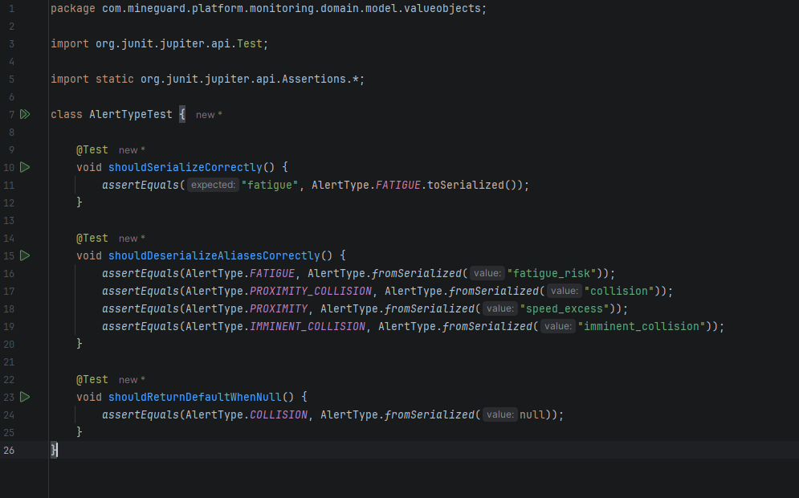

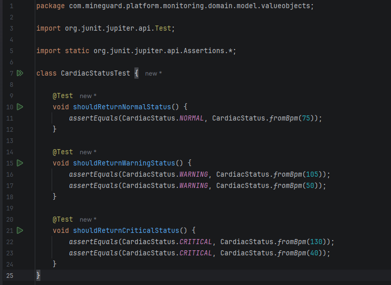

+ Ejecución satisfactoria de la suite de pruebas unitarias mediante Maven.

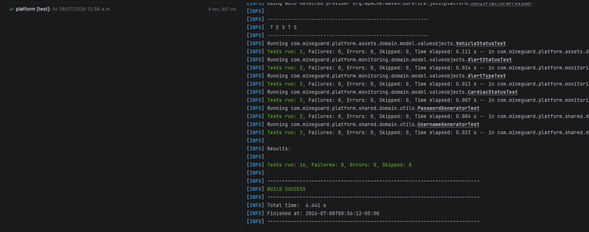

##### Integration Testing

Durante el Sprint 3 se implementó una suite de pruebas de integración con el objetivo de validar la correcta interacción entre la capa de persistencia, el framework Spring Boot y la base de datos de pruebas H2. Estas pruebas permitieron comprobar el funcionamiento conjunto de los repositorios JPA, verificando operaciones de creación, consulta y conteo de registros, así como los métodos personalizados implementados para cada contexto de negocio. La ejecución satisfactoria de estas pruebas garantiza que los componentes del sistema interactúan correctamente en un entorno cercano al de producción.

+ Tabla de pruebas de integración:

| Componente evaluado          | Funcionalidad validada                           | Cantidad de pruebas |
| ---------------------------- | ------------------------------------------------ | :-----------------: |
| Contexto de la aplicación    | Inicialización correcta del contexto Spring Boot |          1          |
| CompanyPersistenceRepository | Registro, búsqueda y consulta de empresas        |          3          |
| VehiclePersistenceRepository | Persistencia, búsqueda y conteo de vehículos     |          3          |
| DriverPersistenceRepository  | Persistencia, búsqueda y conteo de conductores   |          3          |
| AlertPersistenceRepository   | Persistencia y consulta de alertas               |          2          |
| **Total**                    | **Pruebas de integración implementadas**         |        **12**       |

Evidencias:

+ Implementación de las pruebas de integración desarrolladas para los repositorios de persistencia del sistema.

+ Contexto de la aplicación:

  Se verificó que la aplicación Spring Boot iniciara correctamente utilizando el perfil de pruebas, asegurando que todos los componentes y configuraciones del sistema se carguen sin errores.

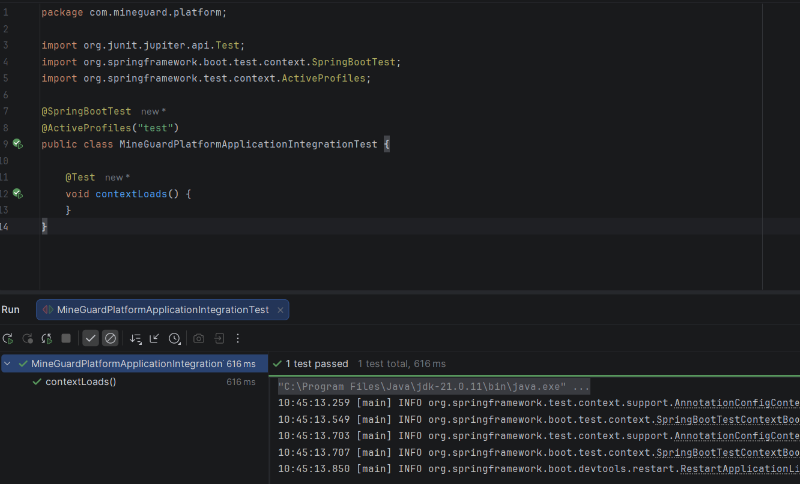

+ CompanyPersistenceRepository:

  Se validaron las operaciones de persistencia relacionadas con las empresas, incluyendo el registro, la búsqueda por identificador y la consulta mediante la API Key utilizada por los dispositivos IoT.

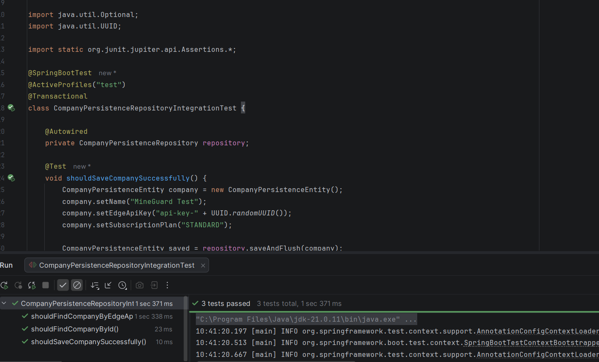

+ VehiclePersistenceRepository:

  Se comprobó el correcto almacenamiento y recuperación de vehículos, así como la consulta por empresa y el conteo de registros según el estado operativo de la flota.

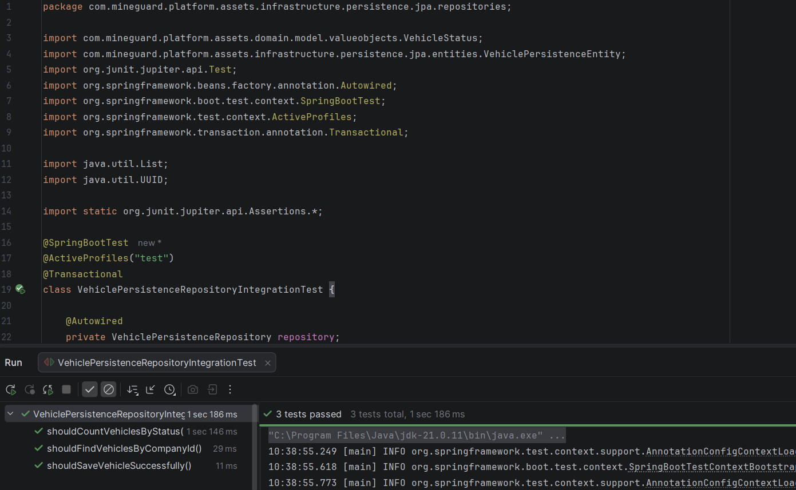

+ DriverPersistenceRepository:

  Se verificó la persistencia de los conductores y la correcta ejecución de consultas por empresa, usuario y estado de turno, garantizando la integridad de la información registrada.

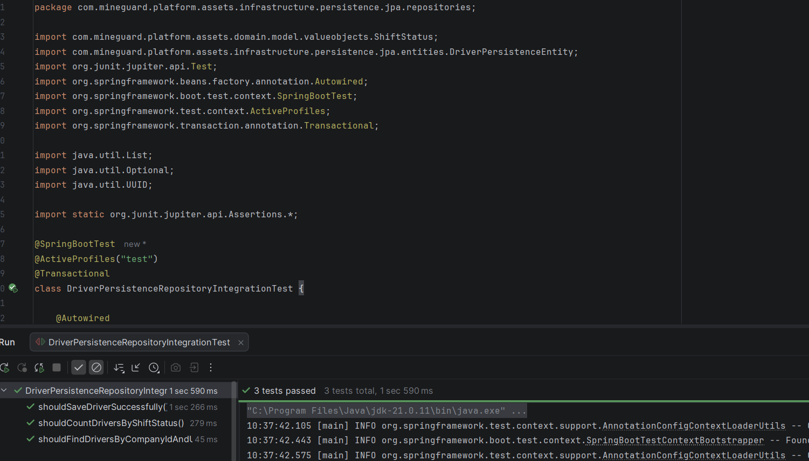

+ AlertPersistenceRepository:

  Se validó el registro y la recuperación de alertas operacionales, comprobando la correcta persistencia de su información y su asociación con la empresa correspondiente.

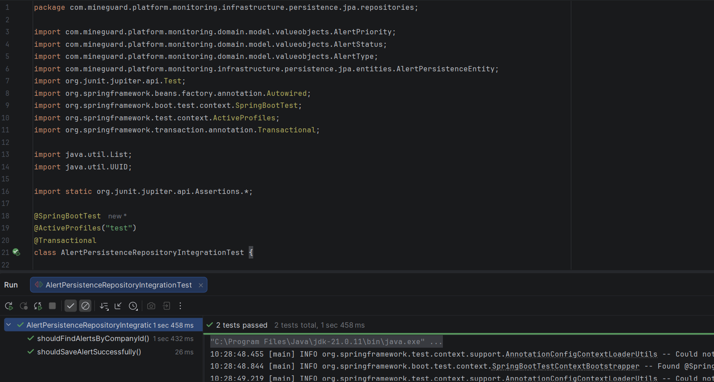

##### Integration Testing

Durante el Sprint 3 se elaboraron escenarios de pruebas utilizando la metodología Behavior-Driven Development (BDD) con el lenguaje Gherkin. Estos escenarios describen el comportamiento esperado del sistema desde la perspectiva del usuario, permitiendo validar los principales flujos de negocio de MineGuard mediante una especificación clara y comprensible para desarrolladores y stakeholders. De esta manera, se garantiza que los requisitos funcionales implementados respondan al comportamiento esperado de la plataforma.

+ Tabla de escenarios BDD:

| Escenario                         | Objetivo                                                                                                 |
| --------------------------------- | -------------------------------------------------------------------------------------------------------- |
| Registro de empresa minera        | Validar el proceso de registro de una empresa y la generación de credenciales administrativas y API Key. |
| Registro de conductor             | Verificar la creación de un conductor y su asociación con la empresa correspondiente.                    |
| Inicio de sesión de conducción    | Validar la creación de una sesión activa de conducción para un vehículo operativo.                       |
| Prevención de sesiones duplicadas | Comprobar que el sistema impida múltiples sesiones activas para un mismo conductor.                      |
| Procesamiento de telemetría IoT   | Verificar que la recepción de telemetría crítica genere las alertas operacionales correspondientes.      |
| Resolución de alertas             | Validar la actualización del estado de una alerta cuando es atendida por un supervisor.                  |
| **Total**                         | **6 escenarios BDD implementados**                                                                       |

+ Evidencias:

Escenarios BDD desarrollados en Gherkin

Se implementaron los escenarios funcionales utilizando el lenguaje Gherkin, definiendo las condiciones iniciales (Given), las acciones ejecutadas (When) y los resultados esperados (Then) para los principales procesos del sistema.

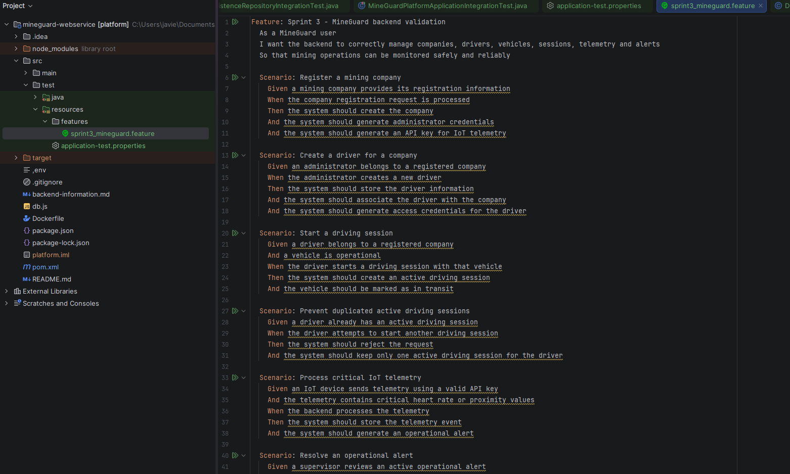

#### 6.2.3.6. Execution Evidence for Sprint Review

Durante el Sprint 3 del proyecto MineGuard, el equipo completó las funcionalidades pendientes del Product Backlog, consolidando una versión funcional de la solución orientada a la prevención de accidentes en operaciones mineras. Las actividades de desarrollo estuvieron enfocadas en fortalecer los mecanismos de autenticación y seguridad, implementar el cierre de sesión y desvinculación del vehículo, habilitar la comunicación entre supervisor y conductor, incorporar recomendaciones inteligentes frente a eventos de riesgo, validar el cumplimiento de las acciones realizadas por el conductor y desarrollar funcionalidades para el análisis de desempeño y comportamiento durante la operación. Asimismo, se completaron las mejoras de la Landing Page dirigidas al segmento de operadores y conductores, fortaleciendo la presentación de las herramientas de seguridad personal ofrecidas por la plataforma.

A continuación, se presentan las principales evidencias de ejecución correspondientes a las funcionalidades implementadas durante este Sprint. Cada captura refleja una de las características desarrolladas y demuestra el comportamiento esperado de la solución en los diferentes componentes del ecosistema MineGuard.

+ Pantalla Login del Supervisor:

  La figura muestra la interfaz de autenticación del supervisor, permitiendo el acceso seguro al centro de monitoreo mediante credenciales registradas. Esta funcionalidad corresponde a la implementación de la US31 – Inicio de sesión del supervisor.

+ Pantalla donde obliga a cambiar la contraseña:

  La figura presenta el flujo de actualización obligatoria de contraseña durante el primer acceso al sistema. Esta funcionalidad garantiza que las credenciales temporales sean reemplazadas por una contraseña segura antes de habilitar el acceso a las funcionalidades operativas (US41)

+ Cierre de sesión y desvinculación del vehículo:

  La figura muestra el proceso mediante el cual el conductor finaliza su jornada de trabajo, cerrando su sesión y desvinculándose del vehículo asignado. Esta funcionalidad asegura la correcta trazabilidad de las operaciones realizadas (US42).

+ Comunicación entre supervisor y conductor:

  La figura evidencia la funcionalidad de comunicación entre supervisor y conductor después de generarse una alerta operacional, permitiendo coordinar acciones inmediatas para reducir riesgos (US11).

#### 6.2.3.7. Services Documentation Evidence for Sprint Review

Durante el Sprint 3 se completó y actualizó la documentación técnica de los Web Services de MineGuard mediante OpenAPI/Swagger. Esta documentación permite visualizar, probar y validar los endpoints implementados para la gestión de usuarios, sesiones, empresas, vehículos, conductores, sensores, telemetría IoT, alertas, métricas, reportes y auditoría. Además, se organizó la API por módulos funcionales, facilitando que el equipo y futuros desarrolladores comprendan la sintaxis de llamada, los métodos HTTP soportados, los parámetros requeridos y las respuestas esperadas. La documentación también permite ejecutar pruebas con datos de muestra directamente desde Swagger UI.

| Módulo             | Método | Endpoint                                        | Acción implementada                  | Parámetros principales       | Response esperado         |
| ------------------ | ------ | ----------------------------------------------- | ------------------------------------ | ---------------------------- | ------------------------- |
| Users & Sessions   | POST   | `/api/v1/users`                                 | Crear usuario                        | body con datos del usuario   | Usuario registrado        |
| Users & Sessions   | POST   | `/api/v1/sessions`                              | Iniciar sesión web                   | email, password              | JWT de autenticación      |
| Users & Sessions   | POST   | `/api/v1/password-resets`                       | Solicitar recuperación de contraseña | email                        | Confirmación de solicitud |
| Users & Sessions   | PATCH  | `/api/v1/users/me/password`                     | Cambiar contraseña                   | contraseña actual y nueva    | Contraseña actualizada    |
| Companies          | POST   | `/api/v1/companies`                             | Registrar empresa tenant             | datos de empresa             | Empresa creada            |
| Companies          | GET    | `/api/v1/companies/{companyId}/kpis`            | Obtener KPIs de empresa              | companyId                    | Métricas consolidadas     |
| Companies          | GET    | `/api/v1/companies/{companyId}/insights`        | Obtener insights analíticos          | companyId                    | Lista de insights         |
| Vehicles           | GET    | `/api/v1/vehicles`                              | Listar vehículos                     | opcional `view`              | Vehículos registrados     |
| Vehicles           | POST   | `/api/v1/vehicles`                              | Crear vehículo                       | datos del vehículo           | Vehículo creado           |
| Vehicles           | PATCH  | `/api/v1/vehicles/{vehicleId}`                  | Actualizar vehículo                  | vehicleId + body             | Vehículo actualizado      |
| Vehicles           | DELETE | `/api/v1/vehicles/{vehicleId}`                  | Archivar vehículo                    | vehicleId                    | Vehículo desactivado      |
| Drivers            | GET    | `/api/v1/drivers`                               | Listar conductores                   | filtros opcionales           | Conductores registrados   |
| Drivers            | POST   | `/api/v1/drivers`                               | Crear conductor                      | datos del conductor          | Conductor creado          |
| Drivers            | GET    | `/api/v1/drivers/{driverId}`                    | Consultar conductor                  | driverId                     | Detalle del conductor     |
| Drivers            | PATCH  | `/api/v1/drivers/{driverId}`                    | Actualizar conductor                 | driverId + body              | Conductor actualizado     |
| Drivers            | DELETE | `/api/v1/drivers/{driverId}`                    | Desactivar conductor                 | driverId                     | Conductor desactivado     |
| Supervisors        | GET    | `/api/v1/supervisors`                           | Listar supervisores                  | JWT válido                   | Supervisores registrados  |
| Supervisors        | POST   | `/api/v1/supervisors`                           | Crear supervisor                     | datos del supervisor         | Supervisor creado         |
| Supervisors        | PATCH  | `/api/v1/supervisors/{supervisorId}`            | Actualizar supervisor                | supervisorId + body          | Supervisor actualizado    |
| Sensors            | GET    | `/api/v1/sensors`                               | Listar sensores                      | JWT válido                   | Sensores registrados      |
| Sensors            | POST   | `/api/v1/sensors`                               | Registrar sensor                     | datos del sensor             | Sensor creado             |
| Sensors            | PATCH  | `/api/v1/sensors/{id}`                          | Actualizar sensor                    | id + body                    | Sensor actualizado        |
| Vehicle Device     | GET    | `/api/v1/vehicles/{vehicleId}/sensor`           | Consultar sensor de vehículo         | vehicleId                    | Sensor vinculado          |
| Vehicle Device     | POST   | `/api/v1/vehicles/{vehicleId}/sensor`           | Vincular sensor a vehículo           | vehicleId + sensorId         | Vinculación creada        |
| IoT Telemetry      | POST   | `/api/v1/telemetry`                             | Ingestar telemetría IoT              | header `X-API-Key` + payload | Lectura registrada        |
| Driving Sessions   | POST   | `/api/v1/vehicles/{vehicleId}/driving-sessions` | Iniciar sesión de conducción         | vehicleId + conductor        | Sesión iniciada           |
| Driving Sessions   | PATCH  | `/api/v1/driving-sessions/{sessionId}`          | Cerrar/cancelar sesión               | sessionId                    | Sesión finalizada         |
| Mobile Sessions    | POST   | `/api/v1/mobile-sessions`                       | Iniciar sesión móvil                 | credenciales operador        | Sesión móvil creada       |
| Alerts             | GET    | `/api/v1/alerts`                                | Listar alertas                       | filtros opcionales           | Alertas registradas       |
| Alerts             | GET    | `/api/v1/alerts/{alertId}`                      | Consultar alerta                     | alertId                      | Detalle de alerta         |
| Alerts             | PATCH  | `/api/v1/alerts/{alertId}`                      | Actualizar alerta                    | alertId + estado             | Alerta actualizada        |
| Alerts             | GET    | `/api/v1/alerts/{alertId}/history`              | Ver historial de alerta              | alertId                      | Historial de cambios      |
| Driver Performance | GET    | `/api/v1/drivers/{driverId}/scores`             | Obtener score del conductor          | driverId                     | Puntaje de desempeño      |
| Driver Performance | GET    | `/api/v1/drivers/{driverId}/metrics`            | Listar métricas del conductor        | driverId                     | Métricas históricas       |
| Vehicle Positions  | GET    | `/api/v1/vehicles/positions`                    | Listar posiciones GPS                | JWT válido                   | Ubicación de flota        |
| Reports            | GET    | `/api/v1/reports`                               | Listar reportes                      | JWT válido                   | Reportes disponibles      |
| Driver Reports     | GET    | `/api/v1/drivers/{driverId}/reports/{reportId}` | Obtener reporte de conductor         | driverId, reportId, formato  | Reporte JSON/PDF/Excel    |
| Audit Logs         | GET    | `/api/v1/audit-logs`                            | Obtener logs de auditoría            | formato opcional             | Auditoría JSON/PDF/Excel  |
| Platform           | GET    | `/api/v1/platform/metrics`                      | Obtener métricas globales            | rol ADMIN/GLOBAL_ADMIN       | Métricas de plataforma    |

Como evidencia de interacción con la documentación, se utilizó Swagger UI para consultar y probar endpoints con datos de muestra. Por ejemplo, el endpoint POST /api/v1/telemetry permite registrar telemetría enviada por dispositivos IoT mediante el header X-API-Key, incluyendo datos como frecuencia cardíaca, coordenadas GPS, distancia de proximidad y eventos de colisión. Como respuesta, el servicio confirma el registro de la información y permite que esta sea utilizada posteriormente para generar alertas, métricas de desempeño y reportes operativos.

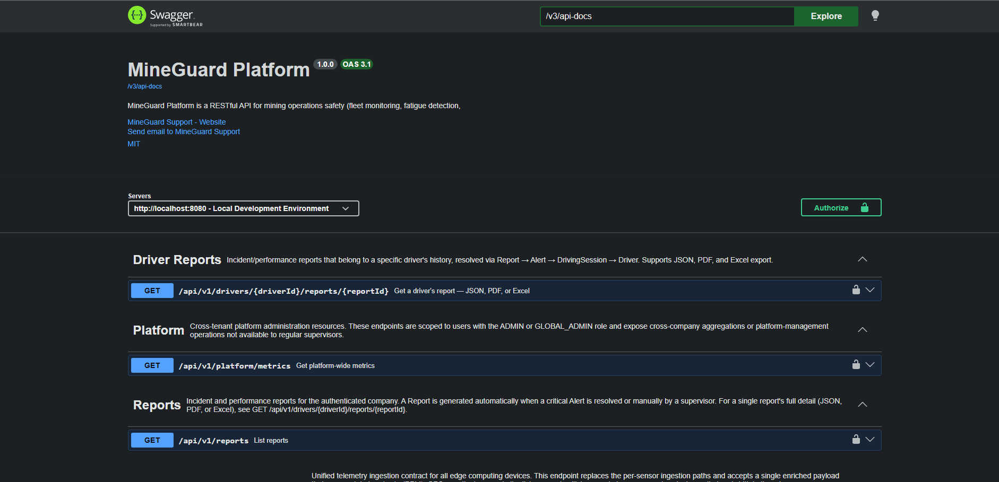

#### 6.2.3.8. Software Deployment Evidence for Sprint Review

Durante el Sprint 3 del proyecto MineGuard, se consolidó la evidencia de despliegue de los principales artefactos de software desarrollados durante la iteración. El objetivo de esta sección es mostrar que los componentes del producto se encuentran disponibles en entornos de ejecución o publicación, permitiendo validar las funcionalidades finales relacionadas con seguridad de acceso, gestión de sesiones, comunicación operativa, análisis del comportamiento del conductor, recomendaciones de seguridad y experiencia informativa para operadores.

A diferencia de los sprints anteriores, este Sprint se enfocó en verificar la disponibilidad de los artefactos finales del ecosistema MineGuard, incluyendo la Landing Page, la Web Application, el Web Service, la Mobile Application, el Edge Service y los componentes asociados al prototipo IoT. Estos despliegues permiten demostrar la integración de los módulos funcionales y técnicos desarrollados durante el proyecto.

| Artifact | Deployment Status | URL / Environment |
|---|---|---|
| Landing Page | Desplegado | https://1asi0572-2610-6779-vertex.github.io/mineguard-website/ |
| Web Application | Desplegado | https://mineguard-iot.netlify.app/ |
| Web Service | Desplegado | https://mineguard-webservice.onrender.com/swagger-ui/index.html# |
| Mobile Application | Preparado para ejecución local / build móvil | -|
| Edge Service | Desplegado | https://mineguard-edgeservice.onrender.com/apidocs/#/ |
| Embedded Application | Desplegado | - |
| Prototype | Desplegado | - |

#### 6.2.3.9. Team Collaboration Insights during Sprint

+ **Web Site:**
Durante este Sprint se mejoró la Landing Page incorporando contenido orientado a operadores y conductores, además de optimizar la experiencia de navegación y automatizar el proceso de despliegue mediante GitHub Actions.

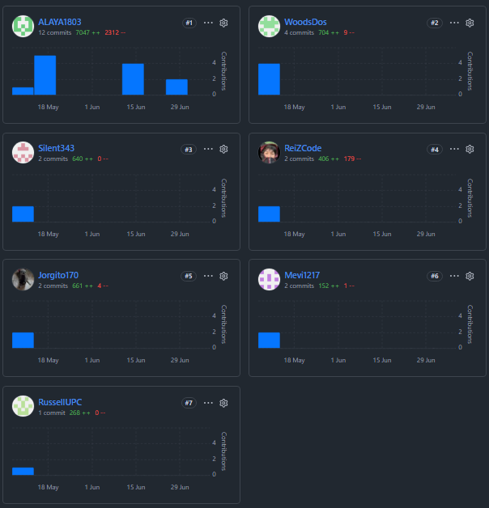

+ **Web App:**
La colaboración en la Web Application permitió integrar nuevos módulos para la gestión de empresas y dispositivos IoT, además de actualizar la comunicación con los nuevos servicios del backend y mejorar la interfaz de usuario.

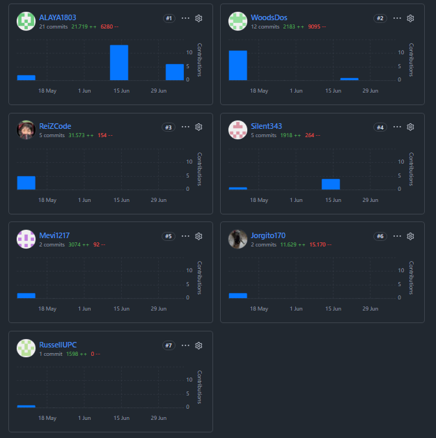

+ **Web Service:**
El equipo trabajó en la ampliación y refactorización de los servicios REST, incorporando nuevos endpoints, mejoras en la gestión de sensores, autenticación y generación de reportes para fortalecer la plataforma.

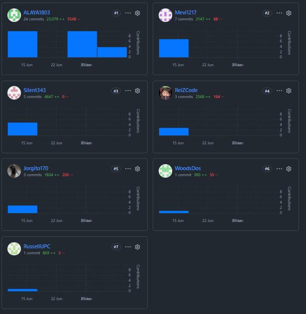

+ **Mobile App:**
Durante el Sprint se integró la aplicación móvil con el Web Service desplegado, se modernizó la arquitectura mediante Flutter BLoC y se añadió soporte para internacionalización en español e inglés.

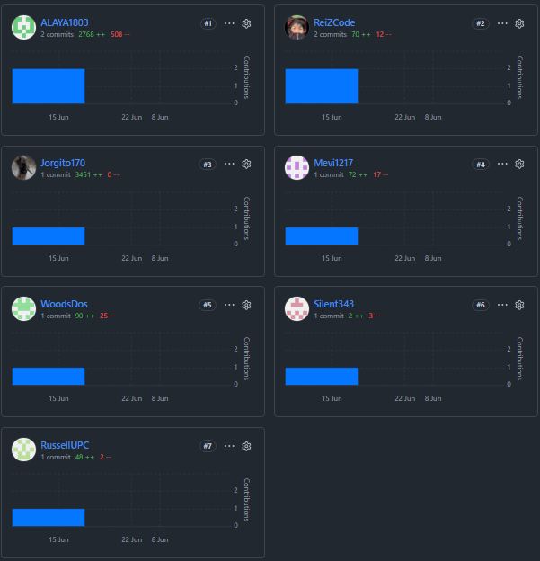

+ **Edge Service:**
La colaboración permitió fortalecer el Edge Service mediante la incorporación de módulos de autenticación, monitoreo y planificación, además de completar su configuración para documentación y despliegue en Render.

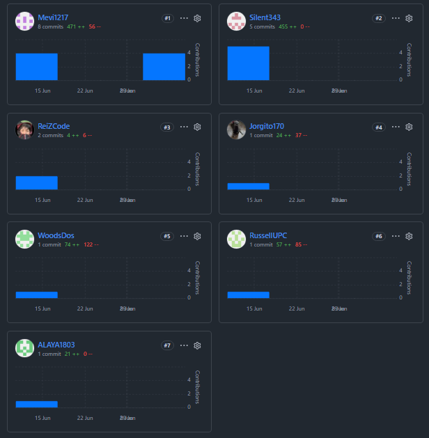

+ **Embedded App:**
Se realizaron mejoras en la estabilidad de la aplicación embebida, corrigiendo el funcionamiento de sensores y actuadores e integrando la comunicación con el Edge Service para una operación más confiable.

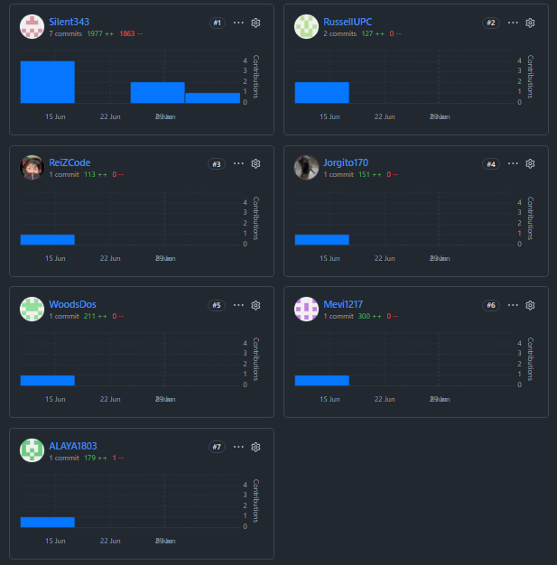

+ **Prototype:**
El prototipo IoT fue actualizado para validar la integración entre los dispositivos físicos y el ecosistema MineGuard, comprobando el flujo completo de captura de datos, transmisión y monitoreo en tiempo real.

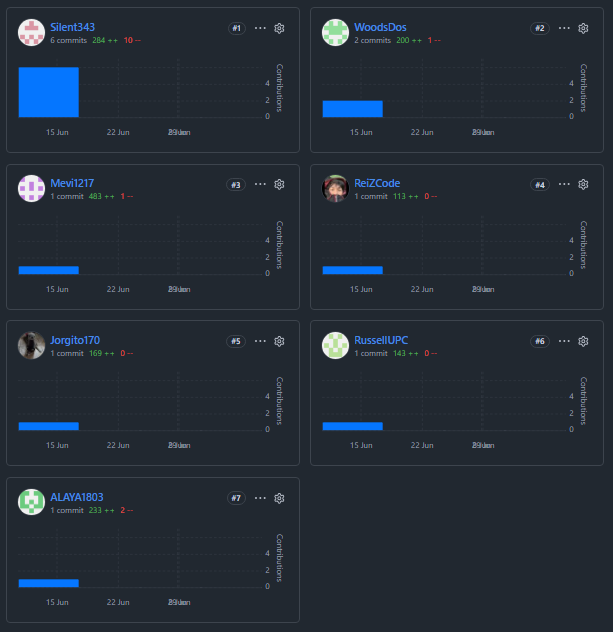

