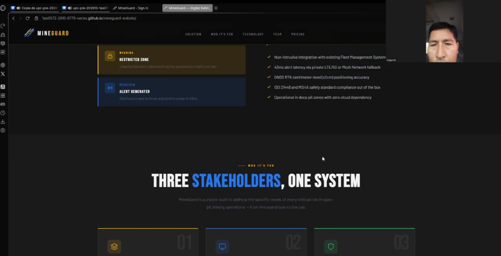
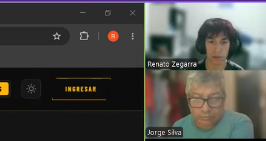

## 6.3. Validation Interviews.
### 6.3.1. Diseño de Entrevistas.

Para esta etapa del proyecto se diseñaron entrevistas de validación orientadas a comprobar si los usuarios de los segmentos objetivo comprenden la propuesta de valor de MineGuard, identifican correctamente los beneficios del sistema y pueden interactuar de manera clara con los artefactos digitales desarrollados: Landing Page y Web Application. A diferencia de las entrevistas exploratorias realizadas al inicio del proyecto, estas tienen como propósito validar la experiencia del usuario frente a una solución ya implementada. Por ello, los participantes no solo responderán preguntas, sino que también interactuarán con el Landing Page y la aplicación web.

+ Segmento 1: Supervisión Corporativa en Minería de Tajo Abierto

    Este segmento está conformado por supervisores de centro de control, operadores de despacho, jefes de operaciones y responsables de seguridad minera. Para este grupo, la validación se enfoca en comprobar si MineGuard permite comprender rápidamente el estado de la operación, interpretar alertas críticas y apoyar la toma de decisiones frente a riesgos de colisión.

    | Elemento a validar    | Descripción                                                                                                                                                                                       |
    | --------------------- | ------------------------------------------------------------------------------------------------------------------------------------------------------------------------------------------------- |
    | Landing Page          | Se validará si el usuario comprende qué problema resuelve MineGuard, qué beneficios ofrece a la empresa minera y si la información presentada genera confianza para solicitar una implementación. |
    | Web Application       | Se validará si el usuario puede interpretar el dashboard, revisar alertas, identificar vehículos/conductores involucrados y reconocer acciones disponibles para atender eventos críticos.         |
    | Información operativa | Se observará si el usuario entiende datos como alertas críticas, eventos de fatiga, vehículos activos, conductores en campo y estados de atención.                                                |
    | Toma de decisiones    | Se evaluará si la información mostrada permite actuar rápidamente ante una situación de riesgo.                                                                                                   |

    **User Flows seleccionados para la validación del Segmento 1**

    | Código  | User Flow                       | Descripción del flujo                                                                                                                                                                                                |
    | ------- | ------------------------------- | -------------------------------------------------------------------------------------------------------------------------------------------------------------------------------------------------------------------- |
    | S1-UF01 | Exploración del Landing Page    | El usuario ingresa al Landing Page, revisa la sección inicial, explora la propuesta de solución, el funcionamiento del sistema y finalmente identifica la acción principal para acceder o solicitar más información. |
    | S1-UF02 | Acceso al Centro de Control     | El usuario ingresa a la Web Application y reconoce la pantalla principal del sistema, identificando indicadores, cards y secciones relacionadas con el monitoreo operativo.                                          |
    | S1-UF03 | Revisión de alertas críticas    | El usuario accede a la sección de alertas o identifica alertas visibles en el dashboard, revisa su nivel de criticidad, categoría, vehículos involucrados y estado actual.                                           |
    | S1-UF04 | Atención de una alerta          | El usuario selecciona una alerta crítica, interpreta la información presentada y determina qué acción debería ejecutar para mitigar el riesgo.                                                                       |
    | S1-UF05 | Consulta de flota y conductores | El usuario revisa información de vehículos, conductores o sensores para validar si puede identificar rápidamente el estado operativo de los recursos.                                                                |

 

+ Segmento 2: Operadores y Conductores de Vehículos Livianos

    Este segmento está conformado por conductores de camionetas de supervisión, mantenimiento, logística u otros vehículos menores que circulan dentro de operaciones mineras. Para este grupo, la validación se enfoca en comprobar si la solución comunica adecuadamente su aporte a la seguridad del conductor y si las alertas o mensajes del sistema son claros, oportunos y no generan distracción.

    | Elemento a validar   | Descripción                                                                                                                                                      |
    | -------------------- | ---------------------------------------------------------------------------------------------------------------------------------------------------------------- |
    | Landing Page         | Se validará si el conductor comprende cómo MineGuard ayuda a prevenir accidentes y proteger su integridad durante la conducción en zonas de riesgo.              |
    | Web Application / Mobile App     | Se validará la comprensión de información relacionada con alertas, vehículos, conductores y eventos operativos desde una perspectiva de seguridad del conductor. |
    | Alertas de seguridad | Se evaluará si los mensajes, niveles de riesgo y acciones sugeridas son fáciles de entender.                                                                     |
    | Utilidad percibida   | Se observará si el usuario considera que la solución puede ayudarlo a reaccionar mejor ante riesgos de colisión, fatiga o proximidad con maquinaria pesada.      |

    **User Flows seleccionados para la validación del Segmento 2**

    | Código  | User Flow                                         | Descripción del flujo                                                                                                                                                          |
    | ------- | ------------------------------------------------- | ------------------------------------------------------------------------------------------------------------------------------------------------------------------------------ |
    | S2-UF01 | Comprensión de la propuesta desde el Landing Page | El usuario ingresa al Landing Page, revisa la propuesta de valor y explica con sus palabras cómo MineGuard podría proteger a los conductores dentro de una operación minera.   |
    | S2-UF02 | Identificación de beneficios de seguridad         | El usuario explora las secciones informativas del Landing Page y reconoce beneficios relacionados con alertas en tiempo real, prevención de colisiones y reducción de riesgos. |
    | S2-UF03 | Interpretación de una alerta operativa            | El usuario observa una alerta dentro de la Web Application e interpreta su nivel de riesgo, el tipo de evento y la acción que debería tomar un conductor ante esa situación.   |
    | S2-UF04 | Revisión de estado de vehículo o conductor        | El usuario revisa información relacionada con vehículos o conductores para validar si el estado presentado es comprensible y útil para la operación.                           |

+ Estructura general de la sesión de validación:

    Cada entrevista seguirá una estructura común para ambos segmentos, con ligeras variaciones según el perfil del participante.

    + Introducción: Explicar brevemente el objetivo de la sesión y el contexto de MineGuard. Además de prepara al usuario para la validación.
    + Exploración del Landing Page: El usuario debe navega por el Landing Page y comentar qué entiende de la solución. Con esto validamos la claridad de la propuesta de valor.
    + Interacción con la Web Application / Mobile App: El usuario realiza los user flows definidos para su segmento. Con el objetivo de validar navegación, comprensión de información y utilidad.
    + Comentarios finales: El usuario responde preguntas breves sobre claridad, confianza, utilidad y mejoras. De esta manera nosotros poder recoger insights para mejorar la solución.

+ **Preguntas guía para el segmento 1: Supervisión Corporativa en Minería de Tajo Abierto**

    Durante la revisión del Landing Page:

    1. ¿La página comunica claramente qué problema busca resolver MineGuard?
    2. ¿La propuesta de valor te parece relevante para una empresa minera?
    3. ¿Qué sección te resultó más clara o útil?
    4. ¿Qué información agregarías antes de solicitar una demo o implementación?

    Durante la revisión de la Web Application:

    1. ¿La pantalla principal permite entender rápidamente el estado de la operación?
    2. ¿Las alertas son visibles y fáciles de interpretar?
    3. ¿La clasificación de criticidad ayuda a priorizar decisiones?
    4. ¿Consideras que el sistema facilitaría una respuesta más rápida ante una posible colisión?
    5. ¿Qué información falta para que el supervisor pueda tomar una decisión con mayor seguridad?

    Preguntas finales:

    1. ¿Usarías una solución como MineGuard dentro de un centro de control?
    2. ¿Qué tan confiable te parece la información presentada?
    3. ¿Qué mejorarías en la navegación, diseño o contenido?
    4. En una escala del 1 al 5, ¿qué tan útil consideras la solución para reducir riesgos operativos?

+ **Preguntas guía para el segmento 2: Operadores y Conductores de Vehículos Livianos**

    Durante la revisión del Landing Page:

    1. ¿Te queda claro cómo este sistema podría ayudarte a evitar accidentes?
    2. ¿Qué beneficio consideras más importante como conductor?
    3. Por lo que leíste ¿La solución te parece útil para evitar accidentes con vehículos pesados o autónomos?
    4. ¿Qué información te gustaría ver antes de confiar en este sistema?

    Durante la revisión de la aplicación:

    1. Al observar una alerta en pantalla, ¿entiendes inmediatamente qué significa?
    2. ¿La información mostrada sería fácil de entender durante una jornada de trabajo?
    3. ¿Es fácil seguir el flujo para registrarte con un carro?
    4. ¿Qué cambiarías para que el sistema sea más práctico en campo?

    Preguntas finales:

    1. ¿Te sentirías más seguro utilizando una solución como MineGuard?
    2. ¿Qué tipo de alerta sería más efectiva para ti: visual, sonora, vibración u otra?
    3. En una escala del 1 al 5, ¿qué tan fácil te parecería usar MineGuard durante una operación real?

### 6.3.2. Registro de Entrevistas.

Se puede ver el video consolidado con todas las entrevistas realizadas en el siguiente enlace: [Ver video en Microsoft Stream](https://upcedupe-my.sharepoint.com/personal/u202311558_upc_edu_pe/_layouts/15/stream.aspx?id=%2Fpersonal%2Fu202311558_upc_edu_pe%Documents%2Fupc-pre-202610-1asi0572-vertex-interviews%2Emp4%20%281%29%2Emp4&nav=eyJyZWZlcnJhbEluZm8iOnsicmVmZXJyYWxBcHAiOiJTdHJlYW1XZWJBcHAiLCJyZWsZlcnJhbFZpZXciOiJTaGFyZURpYWxvZy1MaW5rIiwicmVmZXJyYWxBcHBQbGF0Zm9ybSI6IldlYiIsInJlZmVycmFsTW9kZSI6InZpZXcifX0&ga=1&referrer=StreamWebApp%2EWeb&referrerScenario=AddressBarCopied%2Eview%2E609e50e3-9359-4539-83e4-fd3ee68eb1fc).

<table>
  <thead>
    <tr>
      <th width="5%">Nº Entrevista</th>
      <th width="20%">Datos del entrevistado</th>
      <th width="45%">Resumen de la entrevista</th>
      <th width="30%">Evidencia de entrevista</th>
    </tr>
  </thead>
  <tbody>

<tr>
      <td>1</td>
      <td>
        <strong>Nombre:</strong> Felipe Pastorreaño  
        <strong>Edad:</strong> 35 años  
        <strong>Distrito:</strong> San Marcos, Áncash  
        <strong>Cargo:</strong> Supervisor de Despacho  
        <strong>Momento que inicia:</strong> [00:10]  
        <strong>Duración:</strong> [08:12]  
      </td>
      <td>
        Felipe Pastorreaño participó en la validación de la plataforma web MineGuard orientada a supervisores y administradores de operaciones mineras. Durante la sesión realizó tareas relacionadas con la consulta de información operativa, revisión de alertas de riesgo, seguimiento de unidades en campo y análisis de eventos registrados por el sistema.  

Con más de diez años de experiencia supervisando operaciones de tajo abierto, destacó que uno de los principales beneficios de la plataforma es la centralización de información crítica en un solo entorno de trabajo. Comentó que actualmente gran parte del monitoreo depende de radios y sistemas independientes, por lo que disponer de una solución que consolide información operativa facilita considerablemente la toma de decisiones.  

También valoró la capacidad de identificar rápidamente situaciones potencialmente peligrosas mediante indicadores visuales y registros organizados de eventos recientes. Considera que esta funcionalidad podría reducir los tiempos de reacción frente a incidentes y mejorar la coordinación entre supervisores y conductores.  

Como sugerencia, recomendó incorporar filtros por turno, zona operativa y nivel de criticidad para facilitar el seguimiento de eventos. En términos generales, manifestó que MineGuard responde a necesidades reales de supervisión y prevención de riesgos dentro de la minería moderna.
      </td>
      <td align="center">
        
      </td>
    </tr>

<tr>
      <td>2</td>
      <td>
        <strong>Nombre:</strong> Landivar Flores  
        <strong>Edad:</strong> 34 años  
        <strong>Distrito:</strong> Huari, Áncash  
        <strong>Cargo:</strong> Supervisor de Operaciones Mineras  
        <strong>Momento que inicia:</strong> [00:25]  
        <strong>Duración:</strong> [09:41]  
      </td>
      <td>
        Landivar Flores participó en la evaluación del prototipo MineGuard enfocándose principalmente en las capacidades de monitoreo y análisis de riesgos. Durante la sesión realizó tareas relacionadas con la visualización de eventos críticos, consulta de registros históricos y revisión de indicadores de seguridad operativa.  

 Debido a su experiencia trabajando con tecnologías de monitoreo avanzadas, mostró especial interés por la forma en que la plataforma presenta información relacionada con incidentes y situaciones de riesgo. Destacó que la organización visual de los datos facilita la comprensión rápida del estado operativo de la mina y permite identificar patrones relevantes sin necesidad de revisar múltiples fuentes de información.  

También valoró positivamente la disponibilidad de métricas e históricos que podrían utilizarse para auditorías, investigaciones de incidentes y procesos de mejora continua. Considera que estas funcionalidades aportan valor para la toma de decisiones basada en evidencia y para la prevención proactiva de riesgos.  

Como observación, indicó que la precisión de la información será un factor determinante para la adopción de la solución en escenarios reales. En general, percibió MineGuard como una herramienta innovadora con potencial para fortalecer los procesos de seguridad minera.
      </td>
      <td align="center">
        
      </td>
    </tr>

<tr>
      <td>3</td>
      <td>
        <strong>Nombre:</strong> Roy Ccosi  
        <strong>Edad:</strong> 41 años  
        <strong>Distrito:</strong> Huaraz, Áncash  
        <strong>Cargo:</strong> Supervisor Mina  
        <strong>Momento que inicia:</strong> [00:14]  
        <strong>Duración:</strong> [08:55]  
      </td>
      <td>
        Roy Ccosi participó en la validación de las funcionalidades de supervisión y control operacional de MineGuard. Durante la evaluación realizó tareas asociadas a la consulta de alertas, revisión de eventos recientes, seguimiento de información operativa y análisis de registros históricos relacionados con seguridad minera.  

Destacó que la plataforma facilita la identificación de eventos que requieren atención inmediata gracias a una presentación clara de la información y a la organización de los registros disponibles. Considera que esta capacidad puede ayudar a los supervisores a actuar de manera más rápida y eficiente frente a posibles situaciones de riesgo dentro de la operación.  

Asimismo, valoró positivamente la posibilidad de acceder a información histórica organizada, ya que actualmente gran parte de estos registros suele encontrarse dispersa en reportes y documentos independientes. Según indicó, disponer de información consolidada puede facilitar investigaciones posteriores, auditorías y reuniones de seguridad.  

Como sugerencia de mejora, propuso incorporar herramientas que permitan identificar visualmente las áreas con mayor recurrencia de incidentes para priorizar acciones preventivas. En términos generales, manifestó una percepción positiva del sistema y considera que MineGuard podría contribuir significativamente al fortalecimiento de la cultura de seguridad en operaciones mineras.
      </td>
      <td align="center">
        
      </td>
    </tr>

  </tbody>
</table>

**Segmento #2: Conductores de Vehículos Livianos**

<table>
  <thead>
    <tr>
      <th width="5%">Nº Entrevista</th>
      <th width="20%">Datos del entrevistado</th>
      <th width="45%">Resumen de la entrevista</th>
      <th width="30%">Evidencia de entrevista</th>
    </tr>
  </thead>
  <tbody>

<tr>
  <td>1</td>
  <td>
    <strong>Nombre:</strong> Edgardo Chávez  
    <strong>Edad:</strong> 54 años  
    <strong>Distrito:</strong> Huarmey, Áncash  
    <strong>Cargo:</strong> Conductor de Vehículos Livianos  
    <strong>Momento que inicia:</strong> [00:18]  
    <strong>Duración:</strong> [10:24]
  </td>
  <td>
    Edgardo Chávez participó en la validación de la primera versión de la aplicación móvil MineGuard destinada a conductores que operan dentro de entornos mineros. Durante la sesión realizó tareas relacionadas con el acceso a la aplicación, consulta de información operativa, recepción de alertas de riesgo y revisión de eventos registrados durante la jornada laboral.  

Gracias a su amplia experiencia en operaciones mineras, destacó que una de las características más valiosas de la aplicación es la capacidad de comunicar situaciones potencialmente peligrosas de manera rápida y sencilla. Comentó que la información presentada resulta fácil de comprender y que las alertas permiten reconocer oportunamente situaciones que requieren mayor atención durante el desplazamiento por zonas operativas.  

También valoró la simplicidad de la interfaz y la organización de la información, indicando que la aplicación evita mostrar datos innecesarios y se concentra en elementos importantes para la seguridad del conductor. Considera que esta característica reduce distracciones y facilita el uso de la herramienta incluso para trabajadores con poca experiencia utilizando aplicaciones móviles.  

Como recomendación, sugirió incorporar mensajes más descriptivos que indiquen el tipo específico de riesgo detectado y las acciones recomendadas para responder adecuadamente ante cada situación. En términos generales, manifestó una percepción positiva de MineGuard y considera que puede convertirse en una herramienta importante para fortalecer la seguridad de los trabajadores en campo.
  </td>
  <td align="center">
    
  </td>
</tr>

<tr>
  <td>2</td>
  <td>
    <strong>Nombre:</strong> Jorge Silva  
    <strong>Edad:</strong> 48 años  
    <strong>Distrito:</strong> Carhuaz, Áncash  
    <strong>Cargo:</strong> Operador de Maquinaria  
    <strong>Momento que inicia:</strong> [00:02]  
    <strong>Duración:</strong> [09:57]
  </td>
  <td>
    Jorge Silva participó en la validación de la aplicación móvil MineGuard desde la perspectiva de un operador con amplia experiencia en minería. Durante la sesión realizó tareas relacionadas con la recepción de alertas, consulta de eventos recientes y revisión de información vinculada a situaciones de riesgo registradas por el sistema.  

Durante la evaluación destacó que la aplicación presenta la información de manera clara y directa, permitiendo comprender rápidamente el contexto de una alerta sin necesidad de navegar por múltiples opciones. Considera que esta característica es importante debido a que los conductores suelen disponer de poco tiempo para revisar información adicional durante sus actividades operativas.  

Asimismo, valoró la posibilidad de consultar eventos recientes asociados a su actividad, ya que considera que esta funcionalidad puede ayudar a generar una mayor conciencia situacional y reforzar las buenas prácticas de conducción dentro de la mina. Según indicó, conocer los eventos registrados permite identificar comportamientos que podrían corregirse para reducir riesgos futuros.  

Como observación, señaló que la aplicación debe mantener un equilibrio adecuado entre cantidad de alertas y relevancia de las mismas, ya que un exceso de notificaciones podría ocasionar que los usuarios pierdan interés en ellas. En términos generales, manifestó que MineGuard constituye una propuesta útil y alineada con las necesidades reales de los conductores mineros.
  </td>
  <td align="center">
    
  </td>
</tr>

<tr>
  <td>3</td>
  <td>
    <strong>Nombre:</strong> Fernando Velásquez  
    <strong>Edad:</strong> 52 años  
    <strong>Distrito:</strong> Huaraz, Áncash  
    <strong>Cargo:</strong> Operador de Maquinaria Pesada  
    <strong>Momento que inicia:</strong> [00:15]  
    <strong>Duración:</strong> [10:38]
  </td>
  <td>
    Fernando Velásquez participó en la validación de la aplicación móvil MineGuard enfocándose principalmente en el comportamiento y utilidad de las alertas presentadas al conductor. Durante la sesión realizó tareas relacionadas con la visualización de advertencias de riesgo, consulta de eventos recientes y revisión de información asociada a incidentes potenciales dentro de la operación minera.  

Debido a su experiencia trabajando con diferentes sistemas de asistencia al conductor, mostró especial interés por la forma en que la aplicación comunica situaciones críticas. Destacó que las advertencias son fáciles de identificar y que la información relevante puede visualizarse rápidamente sin generar una carga excesiva para el usuario. Considera que este enfoque puede contribuir a mejorar la capacidad de reacción ante eventos inesperados en campo.  

También valoró la posibilidad de consultar registros históricos de eventos asociados a su actividad operativa. Según indicó, esta funcionalidad permite comprender mejor los riesgos presentes en determinadas zonas de trabajo y facilita el aprendizaje basado en experiencias previas registradas por el sistema.  

Como sugerencia, recomendó incorporar diferentes niveles visuales de criticidad que permitan distinguir fácilmente entre advertencias preventivas y situaciones que requieren una respuesta inmediata. En términos generales, manifestó que MineGuard representa una mejora respecto a los mecanismos tradicionales de comunicación de riesgos y considera que puede aportar beneficios importantes para la seguridad operacional.
  </td>
  <td align="center">
    
  </td>
</tr>

  </tbody>
</table>

### 6.3.3. Evaluaciones según heurísticas

UX Heuristics & Principles Evaluation
Usability – Inclusive Design – Information Architecture

CARRERA: Ingeniería de Software

CURSO: Desarrollo de Soluciones IoT

SECCIÓN: 2610-6779

PROFESORES: Angel Augusto Velasquez Nuñez

AUDITOR: Grupo MineGuard

CLIENTE(S):

Felipe Pastorreaño
Landivar Flores
Roy Ccosi
Edgardo Chávez
Jorge Astolingón Díaz
Fernando Velásquez

APP A EVALUAR:
MineGuard

Plataforma web para supervisores y administradores de operaciones mineras y aplicación móvil para conductores de vehículos livianos orientada a la prevención de colisiones y gestión de alertas de seguridad.

TAREAS A EVALUAR

El alcance de esta evaluación incluye la revisión de la usabilidad de las siguientes tareas:

Inicio de sesión en la plataforma web.
Consulta de información operativa en tiempo real.
Revisión de alertas de riesgo generadas por el sistema.
Visualización de unidades operativas dentro de la operación minera.
Consulta del historial de eventos e incidentes registrados.
Revisión de indicadores y métricas de seguridad.
Recepción y visualización de alertas desde la aplicación móvil.
Consulta de eventos recientes por parte de los conductores.
No están incluidas en esta versión de la evaluación las siguientes tareas:
Administración avanzada de usuarios.
Configuración de dispositivos IoT.
Integración con sistemas externos de monitoreo.
Gestión de infraestructura tecnológica.
Funcionalidades futuras relacionadas con análisis predictivo.

#### Escala de severidad

Los errores serán puntuados tomando en cuenta la siguiente escala de severidad:

| Nivel | Descripción |
|--------|-------------|
| 1 | Problema superficial: puede ser fácilmente superado por el usuario o ocurre con muy poca frecuencia. No necesita ser corregido a menos que exista disponibilidad de tiempo. |
| 2 | Problema menor: puede ocurrir con cierta frecuencia o requiere un esfuerzo adicional para ser superado. Se recomienda corregirlo en futuras versiones. |
| 3 | Problema mayor: ocurre frecuentemente o afecta significativamente la experiencia del usuario. Debe corregirse con alta prioridad. |
| 4 | Problema muy grave: impide al usuario continuar utilizando el sistema. Debe corregirse antes del lanzamiento. |

#### Tabla resumen

| # | Problema                                                                                       | Escala de Severidad | Heurística / Principio Violada(o)                            |
| - | ---------------------------------------------------------------------------------------------- | ------------------- | ------------------------------------------------------------ |
| 1 | No existe una diferenciación visual suficientemente clara entre alertas de distinta criticidad | 3                   | Usabilidad: Visibilidad del estado del sistema               |
| 2 | La plataforma no permite filtrar eventos por turno o área operativa                            | 2                   | Information Architecture: Is it findable?                    |
| 3 | Algunas alertas presentan descripciones demasiado generales para los conductores               | 3                   | Usabilidad: Correspondencia entre el sistema y el mundo real |
| 4 | No se muestra información contextual suficiente sobre el origen de ciertos eventos de riesgo   | 2                   | Information Architecture: Is it understandable?              |
| 5 | No existe una vista rápida que permita identificar zonas con alta recurrencia de incidentes    | 2                   | Information Architecture: Is it usable?                      |

## Descripción de problemas

### PROBLEMA #1: No existe una diferenciación visual suficientemente clara entre alertas de distinta criticidad

**Severidad:** 3

**Heurística violada:** Usabilidad - Visibilidad del estado del sistema

**Problema:**

Durante las sesiones de validación realizadas con supervisores y conductores, se identificó que las alertas mostradas por la plataforma presentan una apariencia visual muy similar independientemente de su nivel de criticidad. Esto dificulta distinguir rápidamente cuáles representan una situación crítica y cuáles corresponden únicamente a advertencias preventivas. En un entorno minero donde los tiempos de reacción son determinantes para la seguridad operativa, esta situación puede retrasar la toma de decisiones y generar confusión entre los usuarios.

**Recomendación:**

Incorporar diferentes niveles visuales mediante iconos, etiquetas, indicadores gráficos y jerarquías visuales que permitan identificar de forma inmediata la gravedad de cada alerta.

### PROBLEMA #2: La plataforma no permite filtrar eventos por turno o área operativa

**Severidad:** 2

**Heurística violada:** Information Architecture - Is it findable?

**Problema:**

Durante la validación, los supervisores manifestaron la necesidad de localizar eventos específicos de manera más eficiente. Aunque la plataforma permite consultar información histórica y eventos registrados, actualmente no dispone de filtros avanzados que permitan segmentar los registros por turno, área operativa o nivel de riesgo. Como consecuencia, los usuarios deben revisar manualmente grandes cantidades de información para encontrar eventos relevantes.

**Recomendación:**

Agregar filtros avanzados y opciones de búsqueda que permitan localizar eventos específicos según diferentes criterios operativos y necesidades de supervisión.

### PROBLEMA #3: Algunas alertas presentan descripciones demasiado generales para los conductores

**Severidad:** 3

**Heurística violada:** Usabilidad - Correspondencia entre el sistema y el mundo real

**Problema:**

Durante la validación de la aplicación móvil, algunos conductores indicaron que determinadas alertas notifican la existencia de un riesgo, pero no proporcionan información suficiente sobre la naturaleza del mismo. Esto genera incertidumbre respecto a las acciones que deben tomar para responder adecuadamente ante la situación detectada. La falta de contexto puede afectar la capacidad de reacción del conductor y disminuir la efectividad de la alerta.

**Recomendación:**

Mostrar mensajes más descriptivos que indiquen claramente el tipo de riesgo detectado, la posible causa del evento y las acciones recomendadas para reducir el peligro.

### PROBLEMA #4: No se muestra información contextual suficiente sobre el origen de ciertos eventos de riesgo

**Severidad:** 2

**Heurística violada:** Information Architecture - Is it understandable?

**Problema:**

Al revisar algunos eventos registrados por el sistema, los usuarios pueden identificar que ocurrió una alerta, pero no siempre disponen de suficiente contexto para comprender completamente las condiciones que originaron dicho evento. Esta limitación dificulta el análisis posterior de incidentes y la comprensión de las circunstancias que generaron la situación de riesgo.

**Recomendación:**

Incorporar información contextual complementaria, como ubicación específica, fecha, hora, unidades involucradas y detalles relevantes que faciliten la interpretación de cada evento registrado.

### PROBLEMA #5: No existe una vista rápida que permita identificar zonas con alta recurrencia de incidentes

**Severidad:** 2

**Heurística violada:** Information Architecture - Is it usable?

**Problema:**

Los supervisores expresaron interés en identificar rápidamente las zonas donde se concentran eventos recurrentes de riesgo. Actualmente esta información puede obtenerse revisando registros históricos, pero el proceso requiere múltiples consultas y análisis manual. Esto incrementa el tiempo necesario para detectar patrones de riesgo y priorizar acciones preventivas.

**Recomendación:**

Incorporar una vista resumida o panel de análisis que destaque visualmente las áreas con mayor concentración de incidentes, facilitando la identificación de patrones y la toma de decisiones preventivas.

## 6.4. About the Product

- Link: 'https://www.youtube.com/watch?v=YuU5bkx0RCE'
